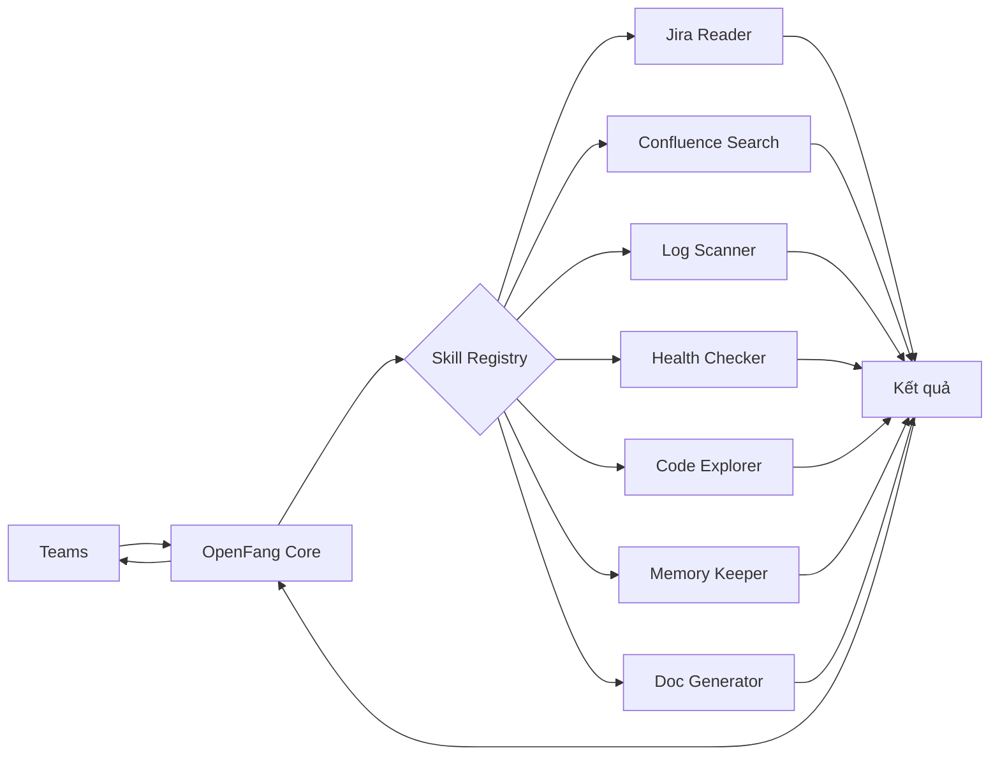
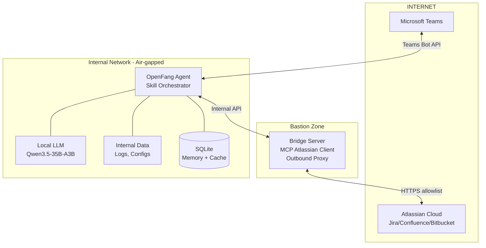

# NHSV Agents

## Mục lục

1. [Tổng quan dự án](#1-tổng-quan-dự-án)
2. [Bối cảnh và vấn đề](#2-bối-cảnh-và-vấn-đề)
   - 2.1. Thực trạng hiện tại
   - 2.2. Ràng buộc kỹ thuật
   - 2.3. Giải pháp được đề xuất
3. [Mục tiêu và phạm vi](#3-mục-tiêu-và-phạm-vi)
   - 3.1. Mục tiêu chính MVP
   - 3.2. Mục tiêu dài hạn (Post-MVP)
   - 3.3. Ngoài phạm vi MVP
4. [Use Cases MVP](#4-use-cases-mvp)
   - 4.1. Kiến trúc Skill‑based
   - 4.2. UC‑01: Jira Intelligence
   - 4.3. UC‑02: Confluence Search
   - 4.4. UC‑03: Error Monitoring & Alert
   - 4.5. UC‑04: Codebase Understanding
   - 4.6. UC‑05: Agent Memory
   - 4.7. UC‑06: Onboarding Guideline
5. [Kiến trúc kỹ thuật](#5-kiến-trúc-kỹ-thuật)
   - 5.1. Tổng thể MVP
   - 5.2. Bridge Server (kết nối Atlassian Cloud)
   - 5.3. Teams Integration
   - 5.4. Skill‑based Architecture
   - 5.5. Local LLM – Qwen3.5-35B-A3B
6. [Kế hoạch triển khai MVP (6 tuần)](#6-kế-hoạch-triển-khai-mvp-6-tuần)
7. [Tiêu chí thành công MVP](#7-tiêu-chí-thành-công-mvp)
8. [Lộ trình post‑MVP](#8-lộ-trình-post-mvp)

---

## 1. Tổng quan dự án

**Tên dự án:** NHSV Agents

**Thời gian dự kiến:** 24 tuần (6 tháng)

**Ngân sách:** 2 kỹ sư (BE + DevOps) + chi phí hạ tầng nội bộ

**Đối tượng sử dụng:**
- Developer (Backend, Frontend)
- Quản lý dự án, Tech Lead
- Ban quản lý cấp cao (Sếp)

**Mục tiêu tổng quát:** Xây dựng một hệ thống đa tác nhân thông minh, hoạt động trong môi trường nội bộ (air‑gapped), phục vụ đồng thời ba nhóm nhu cầu:

1. **Tự động hóa vận hành** – giảm tải công việc thủ công cho developer
2. **Quản trị tri thức** – tập trung hóa tài liệu, hỗ trợ onboarding
3. **Executive dashboard** – cung cấp thông tin tổng hợp, real‑time cho quản lý

---

## 2. Bối cảnh và vấn đề

### 2.1. Thực trạng hiện tại

Backend Developer team đang phải thực hiện các công việc vận hành server theo cách thủ công, bao gồm:

- SSH vào từng server để đọc log và tìm lỗi
- Theo dõi trạng thái các service (up/down/crash)
- Kiểm tra tình trạng tài nguyên server (CPU, RAM, disk)
- Tổng hợp báo cáo hàng ngày về tình trạng hệ thống
- Tra cứu thông tin từ Jira/Confluence/Bitbucket
- Onboarding nhân viên mới với tài liệu hệ thống

Các tác vụ này chiếm phần đáng kể thời gian của Dev team và không tạo ra giá trị trực tiếp cho sản phẩm.

**Stack công cụ hiện có:**

| Tool | Trạng thái | Vai trò |
|------|-----------|---------|
| Jira Cloud | ✅ Đang vận hành | Quản lý dự án, issue tracking |
| Confluence Cloud | ✅ Đang vận hành | Tài liệu kỹ thuật, wiki |
| Bitbucket Cloud | ✅ Đang vận hành | Source code management, PR |
| Kibana / Elasticsearch | ✅ Đang vận hành | Tra cứu và lưu trữ log |
| Grafana | 🚧 Đang xây dựng | Monitor hệ thống |
| Jenkins | ✅ Đang vận hành | CI/CD build & deployment |
| Microsoft Teams | ✅ Đang vận hành | Giao tiếp nội bộ, channel chat |

### 2.2. Ràng buộc kỹ thuật

> ⚠️ **Toàn bộ server chạy trong môi trường air-gapped — không có kết nối internet ra ngoài.** Đây là yêu cầu bảo mật bắt buộc và không thể thay đổi.

Tuy nhiên, có một ngoại lệ quan trọng:

- **Microsoft Teams được phép kết nối internet** để phục vụ giao tiếp
- **Jira/Confluence/Bitbucket Cloud** cần kết nối internet để truy cập

Do đó, chúng ta cần kiến trúc hybrid cho phép:
- Agent trong internal network giao tiếp với user qua Teams (internet)
- Agent truy cập Atlassian Cloud qua bridge server có kiểm soát
- Toàn bộ dữ liệu nhạy cảm không được rời khỏi internal network

### 2.3. Giải pháp được đề xuất

Triển khai **OpenFang** (open-source AI Agent Operating System, viết bằng Rust) với **kiến trúc Skill-based**, kết hợp với **Local LLM (Qwen3.5)** để tạo thành một **AI Intelligence Layer** nằm trên toàn bộ stack hiện có, tự động hóa việc thu thập thông tin và chủ động thông báo kết quả cho Dev team qua Microsoft Teams.

- **MVP trước, hoàn thiện sau** – ưu tiên ra sản phẩm nhanh để chứng minh giá trị
- **Skill-based architecture** – dễ mở rộng, phát triển song song
- **Security practical** – đủ an toàn cho MVP, cải thiện dần sau

---

## 3. Mục tiêu và phạm vi

### 3.1. Mục tiêu chính MVP

| Mục tiêu | Giá trị mang lại |
|---------|----------------|
| Jira/Confluence lookup | Sếp và team tra cứu thông tin dự án qua chat, không cần mở browser |
| Error monitoring & alert | Phát hiện lỗi log, gửi cảnh báo qua Teams trong < 2 phút |
| Codebase understanding | Dev hỏi về cấu trúc code, tìm class/function |
| Agent memory | Nhớ ngữ cảnh trong cùng phiên trò chuyện |
| Onboarding guideline | Tự động tạo tài liệu hướng dẫn cho FE/BE mới |

### 3.2. Mục tiêu dài hạn (Post-MVP)

- Giảm ≥70% thời gian thủ công cho log checking & monitoring
- Phân tích nguyên nhân gốc rễ của build failure
- Pre‑deploy risk gate (có phê duyệt của người)
- Audit trail đầy đủ cho compliance
- Nâng cao bảo mật (NemoClaw, PII masking, RBAC)

### 3.3. Ngoài phạm vi MVP

- Xác thực người dùng phức tạp
- Che dấu dữ liệu nhạy cảm (PII masking)
- Audit trail chi tiết
- Tích hợp NemoClaw
- Học liên tục (continual learning)
- Thay thế các monitoring tool hiện có

---

## 4. Use Cases MVP

### 4.1. Kiến trúc Skill‑based

OpenFang hoạt động như một **trình điều phối skills**. Mỗi skill là một module độc lập, có thể phát triển song song.



### 4.2. UC‑01: Jira Intelligence

**Mô tả:** Tra cứu Jira issue, project, sprint qua Teams.

**Skills:**
- `jira_get_issue` – xem chi tiết issue
- `jira_search` – tìm kiếm theo JQL đơn giản
- `jira_project_info` – thông tin project

**Ví dụ:**
```
User:  "Jira PROJ-456 đang thế nào?"
Agent: "PROJ-456: Fix payment timeout
        Status: In Progress
        Assignee: John Smith
        Priority: High"
```

### 4.3. UC‑02: Confluence Search

**Mô tả:** Tìm kiếm và trả về nội dung tài liệu.

**Skills:**
- `confluence_search` – tìm theo từ khóa
- `confluence_get_page` – lấy nội dung trang

### 4.4. UC‑03: Error Monitoring & Alert

**Mô tả:** Scan log files định kỳ, gửi cảnh báo qua Teams khi phát hiện lỗi.

**Cơ chế:**
- Cron job mỗi 5 phút đọc 50 dòng cuối của các file `error.log`
- Nếu có dòng chứa `"ERROR"` hoặc `"Exception"` → gửi raw message vào Teams channel

### 4.5. UC‑04: Codebase Understanding

**Mô tả:** Dev hỏi về cấu trúc code, tìm class/function.

**Công nghệ:** Sử dụng **Code Context MCP Server** (chạy local, index các repository).

**Ví dụ:**
```
Dev:   "Trong payment-service, class nào xử lý webhook Stripe?"
Agent: "Tìm thấy PaymentWebhookHandler.java:
        - Xử lý stripe webhook events
        - Methods: handlePaymentSuccess(), handlePaymentFailed()"
```

### 4.6. UC‑05: Agent Memory

**Mô tả:** Ghi nhớ các câu hỏi trước đó trong cùng phiên để trả lời có ngữ cảnh.

**Công nghệ:** Nemori (thư viện Python đơn giản, lưu theo user và session).

**Ví dụ:**
```
User:  "Check log payment-service"
Agent: [trả về log]
User:  "Có lỗi gì nổi bật không?"
Agent: "Trong log vừa check, có 3 lỗi timeout và 1 lỗi DB connection..."
```

### 4.7. UC‑06: Onboarding Guideline

**Mô tả:** Tự động tổng hợp thông tin từ codebase, Jira, Confluence để tạo hướng dẫn cho FE/BE mới.

**Output:** Markdown hoặc văn bản gửi qua Teams, có thể xuất file.

---

## 5. Kiến trúc kỹ thuật

### 5.1. Tổng thể MVP



### 5.2. Bridge Server (kết nối Atlassian Cloud)

- **Vị trí:** DMZ, chỉ có một nhiệm vụ đồng bộ dữ liệu.
- **Outbound proxy:** Allowlist chỉ cho phép kết nối đến `mcp.atlassian.com`, `*.atlassian.net`, `auth.atlassian.com`.
- **MCP Atlassian Client:** Dùng container `sooperset/mcp-atlassian` để gọi Jira/Confluence API.
- **Cache tạm:** Giảm số lượng request, tăng tốc.
- **Bảo mật MVP:** Dùng API token của Atlassian, chưa có PII masking hay audit chi tiết.

### 5.3. Teams Integration

- **Bot:** Tạo qua Microsoft Bot Framework, endpoint public trên Bridge Server.
- **Xác thực MVP:** Không yêu cầu xác thực người dùng.

### 5.4. Skill‑based Architecture

**Cấu trúc thư mục skills:**

```
skills/
├── __init__.py
├── jira/
│   ├── get_issue.py
│   └── search.py
├── confluence/
│   ├── search.py
│   └── get_page.py
├── logs/
│   ├── scanner.py
│   └── analyzer.py
├── code/
│   ├── search.py
│   └── explain.py
├── memory/
│   └── nemori_bridge.py
└── onboarding/
    └── generator.py
```

### 5.5. Local LLM – Qwen3.5-35B-A3B

**Lý do chọn:**
- 35B total, chỉ 3B active → tiết kiệm RAM (~24GB)
- Context 262K tokens → đủ cho log dài
- Native tool calling → phù hợp với skill
- Apache 2.0 license

**Hardware tối thiểu:**
- RAM: 24 GB (khuyến nghị 32 GB)
- CPU: 8 cores
- Disk: 50 GB SSD

**Inference:** Dùng `llama.cpp` chạy model GGUF, expose OpenAI‑compatible API.

---

## 6. Kế hoạch triển khai MVP (6 tuần)

**Effort:** ~2 developers × 6 tuần = 12 man‑weeks.

### Tuần 1–2: Nền tảng
- Setup Ops Server (Ubuntu, Docker)
- Cài OpenFang, test cơ bản
- Tạo Teams Bot, cấu hình webhook
- Setup Bridge Server (proxy, allowlist)
- Deploy MCP Atlassian container

### Tuần 3–4: Phát triển skills
- Jira Reader & Confluence Search (2 skills)
- Log Scanner & Health Checker (2 skills)
- Code Explorer (1 skill)
- Memory Keeper (1 skill)

### Tuần 5–6: Tích hợp & hoàn thiện
- Kết nối intent parser với skills
- Phát triển Onboarding Guide skill
- Testing với 5–10 users trong team
- Sửa lỗi, viết user guide

---

## 7. Tiêu chí thành công MVP

| KPI | Mục tiêu |
|-----|---------|
| **Jira lookup** | < 10 giây mỗi request |
| **Error alert** | Phát hiện & gửi alert < 2 phút |
| **Code search** | Tìm class/function trong < 5 giây |
| **Memory** | Nhớ context trong cùng conversation |
| **Onboarding guide** | Tạo được guideline cho ít nhất 1 service |
| **Uptime** | Agent online 24/7, không crash |
| **User satisfaction** | ≥80% users thấy hữu ích |

---

## 8. Lộ trình post‑MVP

### Phase 2 (Tháng 1–2 sau MVP) – Bảo mật & ổn định
- NemoClaw: sandbox, guardrails cơ bản
- User allowlist (Teams tenant + user ID)
- Rate limiting
- Basic audit trail (log requests/responses)
- PII detection (email, IP, credentials)

### Phase 3 (Tháng 3–4) – Thông minh hơn
- Continual learning từ lịch sử incidents
- Root cause analysis tự động
- Auto‑fix với human approval
- Knowledge graph từ Jira + code + docs

### Phase 4 (Dài hạn) – Enterprise ready
- Full audit trail cho compliance
- RBAC (role‑based access control)
- Data minimization cho mọi response
- Multi‑agent collaboration
- Tích hợp Grafana, Jenkins, Kibana
