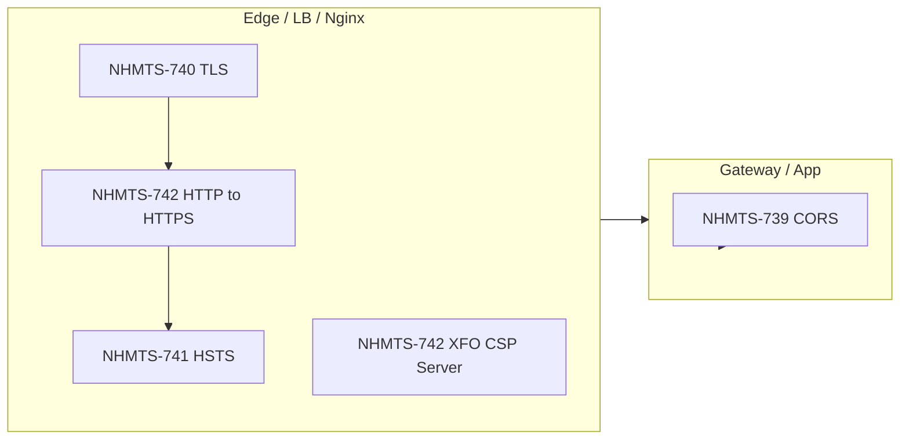

# Phân tích hardening bảo mật TradeX — NHMTS-739 đến NHMTS-742

Tài liệu giải thích **bối cảnh kỹ thuật**, **rủi ro**, **tiêu chí chấp nhận (AC)** từ Jira và **cách áp dụng** trong hệ thống TradeX (API gateway, reverse proxy, các service xử lý HTTP).

**Tham chiếu Jira**

- [NHMTS-739](https://nhsv-vn.atlassian.net/browse/NHMTS-739) — CORS whitelist
- [NHMTS-740](https://nhsv-vn.atlassian.net/browse/NHMTS-740) — TLS 1.2+, cipher
- [NHMTS-741](https://nhsv-vn.atlassian.net/browse/NHMTS-741) — HSTS
- [NHMTS-742](https://nhsv-vn.atlassian.net/browse/NHMTS-742) — Security headers, ẩn thông tin server, HTTP→HTTPS

---

## 1. Tổng quan nhóm issue

Bốn story thuộc nhóm **“transport & response hardening”**: giảm bề mặt tấn công trên **kênh HTTPS** và **header HTTP** của API công khai. Không thay thế xác thực (JWT, OAuth) hay kiểm soát quyền ở tầng ứng dụng, nhưng:

- Giảm nguy cơ **lạm dụng cross-origin** (CORS),
- Giảm nguy cơ **nghe lén / downgrade** ở tầng mã hóa (TLS, HSTS),
- Giảm **clickjacking**, **chèn tài nguyên độc hại** (một phần nhờ CSP),
- Giảm **fingerprint** stack (Server, X-Powered-By).

Trên kiến trúc TradeX thường có **một cổng ra ngoài** (ví dụ `rest-proxy` / load balancer / Nginx / Ingress). Phần lớn header và TLS nên **cấu hình tập trung ở tầng edge** để nhất quán và dễ kiểm tra. Chỉ khi một số service **lộ trực tiếp ra Internet** (không qua cùng reverse proxy) mới cần lặp lại cấu hình.

---

## 2. NHMTS-739 — Restrict CORS: chỉ origin được phép

### Vấn đề

Khi server trả `Access-Control-Allow-Origin: *`, **bất kỳ trang web nào** (trình duyệt của nạn nhân) có thể gọi API từ JavaScript nếu người dùng đã đăng nhập và cookie/token bị dùng theo chính sách hiện tại. Điều này làm tăng rủi ro kết hợp với các lỗ hổng khác (XSS, mis-config cookie). Thực tế CORS **không thay thế** CSRV token hay SameSite cookie, nhưng **wildcard** là tín hiệu cấu hình yếu và thường **không chấp nhận được** trong audit bảo mật cấp độ cao.

### AC (theo Jira) — ý nghĩa

| AC | Giải thích ngắn |
|----|------------------|
| Chỉ whitelisted origins | Server chỉ phản hồi CORS cho danh sách cố định (theo môi trường: prod/UAT/dev). |
| Không bao giờ trả `*` | Loại bỏ wildcard để đáp ứng tiêu chí scan/audit. |
| Null / empty origin bị từ chối | Một số client hoặc kịch bản đặc biệt gửi `Origin: null` hoặc thiếu origin; cần policy rõ (thường là không cho phép trừ khi có lý do và whitelist riêng). |

### Gợi ý triển khai TradeX

- Xác định **đầy đủ** nguồn hợp lệ: web chính thức, portal nội bộ, Swagger nếu bật trên domain riêng, v.v.
- Cấu hình tại **API gateway** hoặc framework (Spring `CorsConfiguration`, Express `cors`, Nginx nếu xử lý CORS tại edge — tùy stack).
- **Lưu ý ứng dụng di động (React Native)**: trình duyệt trong WebView vẫn chịu CORS; app native gọi HTTP trực tiếp thường **không gửi Origin** như browser — cần test **không làm gãy** luồng mobile đã có.

### Tham khảo

- [PortSwigger — Access-Control-Allow-Origin](https://portswigger.net/web-security/cors/access-control-allow-origin)

---

## 3. NHMTS-740 — TLS 1.2+ và loại bỏ cipher yếu

### Vấn đề

TLS 1.0/1.1 và nhiều cipher **CBC / RC4 / DES** đã có lịch sử lỗ hổng hoặc suy yếu (BEAST, vấn đề padding, v.v.). Scanner và chuẩn bảo mật (PCI, khuyến nghị industry) yêu cầu **TLS 1.2 tối thiểu**, ưu tiên **TLS 1.3** và cipher có **perfect forward secrecy** (ví dụ ECDHE + AES-GCM, ChaCha20-Poly1305).

### AC (theo Jira) — ý nghĩa

| AC | Giải thích ngắn |
|----|------------------|
| Tắt TLS 1.0 / 1.1 | Chỉ cho phép handshake hiện đại. |
| Chỉ cipher hỗ trợ PFS | Giảm rủi ro khi private key lộ sau này (tóm lược: session cũ khó giải mã hơn). |
| Bỏ CBC, RC4, DES | Tránh nhóm thuật toán bị khuyến cáo loại bỏ. |

### Gợi ý triển khai TradeX

- Đây chủ yếu là **cấu hình infrastructure**: **load balancer, Nginx, Ingress, certificate termination**.
- Sau khi đổi: chạy **sslscan / testssl / Qualys SSL Labs** (đối với endpoint công khai được phép) hoặc script nội bộ; kiểm tra **client cũ** (nếu có) vẫn kết nối được.
- Ít khi cần sửa code Java/Node trừ khi service tự mở HTTPS trực tiếp.

### Tham khảo

- [SSL.com — disable TLS 1.0 and 1.1](https://www.ssl.com/guide/disable-tls-1-0-and-1-1-apache-nginx/)
- [Invicti — BEAST](https://www.invicti.com/blog/web-security/how-the-beast-attack-works/)

---

## 4. NHMTS-741 — HSTS (Strict-Transport-Security)

### Vấn đề

Nếu người dùng (hoặc attacker) có thể buộc truy cập **HTTP** lần đầu, có kịch bản **downgrade** hoặc **SSL stripping**. Header **HSTS** báo cho trình duyệt: trong một khoảng thời gian, **chỉ được** dùng HTTPS với host (và có thể cả subdomain).

### AC (theo Jira) — ý nghĩa

| AC | Giải thích ngắn |
|----|------------------|
| Header có trên mọi response API (theo phạm vi đề ra) | Thực tế HSTS hiệu lực mạnh nhất khi user **truy cập qua trình duyệt** tới **cùng hostname**; API JSON-only vẫn nên gắn cho đồng nhất policy. |
| `max-age` ≥ 31536000 | Tối thiểu một năm, theo AC. |
| `includeSubDomains` | HSTS áp dụng cho mọi subdomain — **bắt buộc mọi subdomain phải HTTPS ổn định**, nếu không sẽ “khóa” lỗi. |

### Rủi ro vận hành

Trước khi bật `includeSubDomains`, cần rà **toàn bộ subdomain** (staging, tool, monitoring UI) đều không phụ thuộc HTTP thuần trên cùng zone DNS.

### Gợi ý triển khai TradeX

- Thêm tại **reverse proxy / edge** để một lần áp dụng cho mọi path.

### Tham khảo

- [OWASP — HSTS Cheat Sheet](https://cheatsheetseries.owasp.org/cheatsheets/HTTP_Strict_Transport_Security_Cheat_Sheet.html)

---

## 5. NHMTS-742 — Security headers, ẩn server info, buộc HTTPS

### Vấn đề

Thiếu một số header làm **tăng impact** của XSS, clickjacking (nhúng site trong iframe), và một phần vector **supply chain trên trình duyệt** (nếu có HTML). Header **`Server: nginx/1.x`** hoặc **`X-Powered-By: Express`** lộ phiên bản, giúp attacker chọn exploit phù hợp.

### AC (theo Jira) — ý nghĩa

| Hạng mục | Giải thích |
|----------|------------|
| `X-Frame-Options` | Giới hạn nhúng trong iframe (`DENY` hoặc `SAMEORIGIN` — chọn theo có cần embed hay không). |
| `Content-Security-Policy` | Chính sách chi tiết trình duyệt chỉ tải script/style từ nguồn nào. Với **API JSON thuần**, CSP tác động **hạn chế** trừ khi có HTML/error page; vẫn có thể set **default deny** tối giản để thỏa audit, hoặc policy phù hợp nếu có Swagger/UI. |
| Gỡ / ẩn `Server`, `X-Powered-By` | Nginx: thường dùng `server_tokens off`. Express: `app.disable('x-powered-by')`. |
| Mọi HTTP redirect sang HTTPS | Thường cấu hình **301/308** tại edge; đồng bộ với HSTS. |

### Gợi ý triển khai TradeX

- **CSP** là hạng mục dễ **làm gãy** front nếu sau này phục vụ HTML từ cùng host — nên cân nhắc giai đoạn **report-only** rồi mới enforce.
- Kiểm tra **trang lỗi HTML** (404 gateway) có script inline hay không.

### Tham khảo

- [OWASP — HTTP Headers Cheat Sheet](https://cheatsheetseries.owasp.org/cheatsheets/HTTP_Headers_Cheat_Sheet.html)
- [OWASP — CSP Cheat Sheet](https://cheatsheetseries.owasp.org/cheatsheets/Content_Security_Policy_Cheat_Sheet.html)

---

## 6. Mối liên hệ giữa các story

- **740 + redirect HTTPS (742)** là nền: không nên cam kết HSTS dài hạn nếu vẫn có endpoint HTTP “lọt” ngoài ý muốn.
- **741 (HSTS)** củng cố hành vi “luôn HTTPS” trên browser.
- **742** bổ sung policy header và giảm lộ thông tin; **739** là policy riêng cho **cross-origin từ browser**.

---

## 7. Thứ tự triển khai gợi ý

1. **Inventory**: hostname nào public, TLS terminate ở đâu, service nào lộ ra ngoài không qua gateway.
2. **NHMTS-740** (staging trước) + verify cipher bằng công cụ.
3. **HTTP→HTTPS** (742) trên cùng edge.
4. **HSTS** (741) sau khi chắc chắn HTTPS ổn định toàn subdomain (nếu dùng `includeSubDomains`).
5. **X-Frame-Options**, tắt **`Server` / `X-Powered-By`** (742).
6. **CSP** (742): draft → report-only (nếu có traffic HTML) → enforce.
7. **CORS whitelist** (739): thu thập origin, deploy, regression mobile + web + dev tools.

---

## 8. Kiểm thử nhanh sau triển khai

| Story | Kiểm tra gợi ý |
|-------|----------------|
| 739 | Preflight OPTIONS + request từ origin không trong list phải fail; không thấy `*` trong ACAO. |
| 740 | Scanner TLS hoặc `openssl s_client` chỉ thấy TLS ≥ 1.2 và cipher được phép. |
| 741 | Response có `Strict-Transport-Security` đúng `max-age` và `includeSubDomains`. |
| 742 | Có `X-Frame-Options`; CSP (nếu bật); không còn `Server`/`X-Powered-By` lộ phiên bản; HTTP trần redirect 301/308 sang HTTPS. |

---

**Trạng thái tài liệu:** Đã đối chiếu mô tả Jira (2026-03-31).  
**Đối tượng:** PM, DevOps, BE TradeX.  
**Bước tiếp:** Ánh xạ sang manifest triển khai từng môi trường (UAT/Prod) và runbook rollback.
