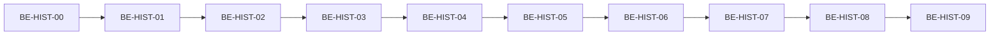

# BE Implementation — Backfill lịch sử giá ngày phái sinh (Lotte DRMKT-004 → Symbol Daily)

**Issue Type:** Feature / Data onboarding (pre–go-live)  
**Priority:** High (blocker hiển thị lịch sử giá ngày trước golive)  
**Component:** Market Data — Historical daily  
**Related services:** `lotte-bridge` hoặc `market-collector-lotte`, MongoDB (symbol daily), có thể `realtime-v2` (cache reload tùy pipeline)  
**Consumers:** `market-query-v2` — `GET /rest/api/v2/market/symbol/{symbol}/period/DAILY` (và chart nếu dùng chung nguồn daily)  
**Tham chiếu spec Lotte:** `Tai_lieu_dac_ta_API2.0_Tsolution-Detail-NHSV_Derivaties` — mục **DRMKT-004** (phiên bản 2026.05.11)  
**Created:** 2026-05-12  
**Status:** Ready for BE

---

## Executive Summary (PM / BA)

Tại thời điểm **go-live phái sinh**, TradeX chỉ bắt đầu lưu dữ liệu thị trường từ ngày đó trở đi, nên API **`/market/symbol/{symbol}/period/DAILY`** không có nến/ngày trong quá khứ. Lotte đã cung cấp **DRMKT-004** để lấy **OHLCV + thay đổi giá theo ngày**. Backend cần **job tải và ghi** dữ liệu này vào **MongoDB symbol daily** (cùng schema với equity) để API period hiện tại trả về lịch sử **không cần đổi contract API**.

---

## Vấn đề kỹ thuật

| Hiện trạng | Hệ quả |
|-------------|--------|
| `market-query-v2` đọc daily từ Mongo (`ISymbolDaily` / collection theo env, ví dụ `c_symbol_daily`) + merge ngày hiện tại từ Redis khi cần | Không có bản ghi trước golive → response rỗng hoặc quá ngắn |
| Dòng realtime (WS/Kafka) chỉ tích lũy từ ngày hệ thống chạy | Không bù được năm lịch sử |

**Mục tiêu:** Sau backfill, `GET /rest/api/v2/market/symbol/{symbol}/period/DAILY?baseDate=...&fetchCount=...` trả đúng dữ liệu quá khứ cho mã phái sinh (theo cùng format abbreviated như hiện tại: `o`, `h`, `l`, `c`, `ch`, `ra`, `vo`, `va`, `d`).

---

## Lotte DRMKT-004 — tóm tắt contract (theo đặc tả)

| Mục | Giá trị |
|-----|----------|
| URL | `[RootURL]/tsol/apikey/tuxsvc/market/dr/daily-derivatives` |
| Method | POST, GET |
| Auth | `apiKey` + `Authorization: Bearer <access_token>` (theo mục OAuth trong tài liệu Lotte) |
| Body (function fields) | `code` (string, bắt buộc), `date` (YYYYMMDD), `max_result` (string, optional, **default 20**), `next_key` (string, optional, default `"0"`) |

**Response (rút gọn):** `error_code`, `success`, `data_list[]` với:

- `has_next` (boolean)
- `next_key` (string) — dùng cho lần gọi tiếp
- `list_items[]`: `date`, `last`, `change`, `volume`, `value`, `open`, `high`, `low`, `change_rate`

**Sample request (team có thể dùng khi test):**

```json
{
  "code": "41I1G5000",
  "date": "20260512",
  "max_result": "2000"
}
```

**Lưu ý phân trang:** Luôn xử lý vòng lặp `has_next` / `next_key` cho đến khi hết dữ liệu. Tăng `max_result` (ví dụ 2000) giúp giảm số round-trip nhưng **phải xác nhận với Lotte** giới trên cho phép (timeout, payload, rate limit). Nếu Lotte giới hạn thấp, vẫn backfill đầy đủ bằng phân trang.

---

## Mapping Lotte → Mongo `ISymbolDaily` (TradeX)

| Lotte `list_items` | `ISymbolDaily` | API period (sau `toSymbolDailyResponse`) |
|--------------------|----------------|-------------------------------------------|
| `date` (YYYYMMDD) | `date` | `d` |
| `open` | `open` | `o` |
| `high` | `high` | `h` |
| `low` | `low` | `l` |
| `last` | `last` | `c` |
| `change` | `change` | `ch` |
| `change_rate` | `rate` | `ra` |
| `volume` | `tradingVolume` | `vo` |
| `value` | `tradingValue` | `va` |
| Mã hợp đồng request | `code` | — |

**Futures / `refCode`:** Thống nhất với logic `market-query-v2` (`CommonService.actualQuerySymbolPeriod`): với FUTURES và truy vấn theo `refCode` khi `code === refCode`, query Mongo dùng `refCode`. Backfill phải ghi document **đúng `code` / `refCode`** như dữ liệu daily phái sinh đang dùng trong hệ thống (tránh lệch series vs front-month).

---

## Phạm vi & không thuộc phạm vi

| In scope | Out of scope (tách issue nếu cần) |
|----------|-------------------------------------|
| Job/tool backfill một lần (hoặc batch có idempotency) trước / sau golive theo kế hoạch vận hành | Thay đổi URL hoặc DTO public của `period/DAILY` |
| Ghi Mongo symbol daily + xử lý trùng (upsert theo key ngày + mã) | DRMKT-001/002/003 — chỉ tham chiếu nếu cần danh sách mã |
| Xác nhận end-to-end API period sau backfill | Sửa FE — API giữ nguyên |
| Runbook: thứ tự chạy, env UAT/Prod, rollback (xóa theo batch) | Chi tiết bảo mật credential (chỉ ghi checklist: vault, không log body) |

**Ghi chú chart:** Issue [Chart_API_Implementation](./Chart_API_Implementation.md) xử lý `/tradingview/history`. Nếu resolution daily của chart **không** đọc cùng `SymbolDaily`, BE cần liên kết nội bộ hoặc tạo follow-up; trong AC bên dưới có mục kiểm tra tùy chọn.

---

## Sub-tasks (BE backlog)

Gợi ý **thứ tự** (song song khi không có mũi tên):



### BE-HIST-00 — Alignment với Lotte & nội bộ

| Trường | Nội dung |
|--------|----------|
| **Output** | Tài liệu ngắn / comment ticket: giới hạn `max_result`, semantics `date` + `next_key`, rate limit, mẫu response thật UAT |
| **Owner** | BE lead + đầu mối Lotte |
| **Estimate** | 0.5d |
| **Done when** | Có xác nhận bằng mail/slack hoặc bảng trong wiki; team biết cách phân trang đủ lịch sử |

### BE-HIST-01 — Chốt service, config, secrets

| Trường | Nội dung |
|--------|----------|
| **Output** | Repo/module chứa job (vd `lotte-bridge` / `market-collector-lotte`); profile `application-*.yml`: base URL DRMKT-004, timeout, `max_result` mặc định; secret qua vault/env |
| **Depends on** | BE-HIST-00 |
| **Estimate** | 0.5d |
| **Done when** | Config merge được; không hardcode credential |

### BE-HIST-02 — HTTP client + model parse DRMKT-004

| Trường | Nội dung |
|--------|----------|
| **Output** | Client gọi `POST/GET` endpoint; DTO/record parse `error_code`, `data_list[].has_next`, `next_key`, `list_items[]`; xử lý `1005` / body lỗi |
| **Depends on** | BE-HIST-01 |
| **Estimate** | 0.5–1d |
| **Done when** | Unit test parse từ JSON mẫu (fixture) pass |

### BE-HIST-03 — Vòng phân trang + retry an toàn

| Trường | Nội dung |
|--------|----------|
| **Output** | Hàm `fetchAllPages(code, anchorDate, maxResult)`: lặp đến khi `!has_next`; retry exponential backoff cho 5xx/timeout; optional delay giữa các mã |
| **Depends on** | BE-HIST-02 |
| **Estimate** | 0.5d |
| **Done when** | Integration test với mock server (nhiều page) pass |

### BE-HIST-04 — Mapper Lotte → `SymbolDaily` (Mongo schema)

| Trường | Nội dung |
|--------|----------|
| **Output** | Mapper: `date` → `Date`, số học, null/zero; set `code`; quy tắc **`refCode`** khớp `SymbolInfo` / cách `market-query-v2` query (FUTURES + ref series) |
| **Depends on** | BE-HIST-00 (ref semantics), code hiện có `SymbolDaily` Java/TS |
| **Estimate** | 0.5–1d |
| **Done when** | Unit test: 1 `list_item` → document Mongo đúng field name collection hiện tại |

### BE-HIST-05 — Ghi Mongo: bulk upsert + idempotency

| Trường | Nội dung |
|--------|----------|
| **Output** | Bulk write (batch size cấu hình được); filter upsert theo key duy nhất `(code hoặc refCode theo convention, date)`; không duplicate |
| **Depends on** | BE-HIST-04 |
| **Estimate** | 0.5–1d |
| **Done when** | Chạy 2 lần cùng input → cùng số bản ghi; index/filter documented |

### BE-HIST-06 — Job runner: input danh sách mã + điều khiển

| Trường | Nội dung |
|--------|----------|
| **Output** | Entry: Spring `@CommandLineRunner` / scheduled once / REST admin có auth — theo chuẩn team; input: file CSV, hoặc query DRMKT-001 / filter `SYMBOL_INFO` type FUTURES; flags: `--dry-run`, `--symbols`, `--max-symbols` |
| **Depends on** | BE-HIST-03, BE-HIST-05 |
| **Estimate** | 0.5–1d |
| **Done when** | Dry-run chỉ log count không ghi DB; full run ghi DB |

### BE-HIST-07 — Observability & hành vi lỗi theo mã

| Trường | Nội dung |
|--------|----------|
| **Output** | Structured log: `symbol`, `pages`, `rowsUpserted`, `durationMs`, `errorCode`; metric counter success/fail per symbol; một mã fail không dừng cả job (configurable) |
| **Depends on** | BE-HIST-06 |
| **Estimate** | 0.5d |
| **Done when** | Demo log trên UAT với 2 mã (1 OK, 1 lỗi Lotte) |

### BE-HIST-08 — Verify API + cache (nếu cần)

| Trường | Nội dung |
|--------|----------|
| **Output** | Checklist gọi `GET .../period/DAILY`; so spot-check với Lotte; nếu cần: trigger reload Redis/map symbol daily theo pattern recover equity |
| **Depends on** | BE-HIST-06 |
| **Estimate** | 0.5d |
| **Done when** | AC mục “> 20 ngày” pass trên UAT cho mã đã backfill |

### BE-HIST-09 — Runbook + handover DevOps

| Trường | Nội dung |
|--------|----------|
| **Output** | Runbook: thứ tự UAT → Prod, ước lượng thời gian, rollback (xóa theo `code` + khoảng `date` nếu cần), ai approve chạy Prod |
| **Depends on** | BE-HIST-08 |
| **Estimate** | 0.5d |
| **Done when** | PM/DevOps sign-off dry-run |

**Tổng hợp estimate theo sub-task:** ~4.5–7.5 person-days (trùng một phần khi làm song song 02+03).

---

## Đề xuất triển khai (tổng quan)

Tổng thể khớp luồng: **client DRMKT-004 → phân trang → map → bulk upsert Mongo → verify period API → runbook**. Chi tiết từng bước nằm ở **Sub-tasks** phía trên.

---

## Acceptance Criteria

- [ ] Với ít nhất một mã phái sinh UAT đã backfill, `GET /rest/api/v2/market/symbol/{symbol}/period/DAILY` trả **> 20** ngày lịch sử (hoặc đủ theo `fetchCount`) khi `baseDate` sau ngày cuối trong Lotte.
- [ ] Dữ liệu các field `o`,`h`,`l`,`c`,`ch`,`ra`,`vo`,`va`,`d` **khớp** nguồn Lotte trên mẫu chéo (spot-check ≥ 5 ngày ngẫu nhiên).
- [ ] Chạy lại job **idempotent**: không duplicate row hoặc duplicate được merge đúng (upsert).
- [ ] Mã không có trên Lotte / lỗi API: job **không** crash toàn batch; lỗi ghi log + metric theo mã.
- [ ] Xác nhận bằng văn bản **giới hạn `max_result`** từ Lotte; triển khai phân trang đầy đủ nếu cần.
- [ ] (Tùy chọn) Tab chart daily: nếu product yêu cầu, xác nhận `/tradingview/history` resolution `1D` hiển thị sau backfill hoặc ghi rõ dependency issue Chart.

---

## Test gợi ý

| # | Case |
|---|------|
| 1 | So sánh 1 ngày: response period vs raw Lotte `list_items` |
| 2 | `baseDate` = ngày liên tiếp sau golive — không gap |
| 3 | Hợp đồng có `refCode` — query bằng mã front-month / mã series theo convention app |
| 4 | Rate limit: sleep / pool concurrency theo khuyến nghị Lotte |

---

## Rủi ro & phụ thuộc

- **Credential & môi trường:** UAT vs Prod URL Lotte; token hết hạn trong job dài.
- **Timezone ngày giao dịch:** align `date` với calendar sở / nghỉ lễ (bản ghi chỉ ngày có phiên).
- **Khối lượng:** số mã × số năm lịch sử — ước lượng thời gian chạy và window bảo trì.

---

## Estimate

| Hạng mục | Rough |
|----------|--------|
| BE-HIST-00 … BE-HIST-05 (core code) | ~3–4.5d |
| BE-HIST-06 … BE-HIST-09 (runner, obs, verify, runbook) | ~1.5–3d |
| **Tổng epic** | **~4.5–7.5d** (1 dev tuần tương đương); rút xuống **~3–5d** nếu 2 dev chia HIST-02–05 và HIST-06–07 song song sau HIST-01 |

---

**Document Status:** Ready for implementation  
**For:** BE Dev, BE Lead, DevOps  
**Next Steps:** Tạo ticket con theo **BE-HIST-00** → **09**; bắt đầu **BE-HIST-00** (Lotte) và **BE-HIST-01** (chốt repo) trong cùng sprint planning.
