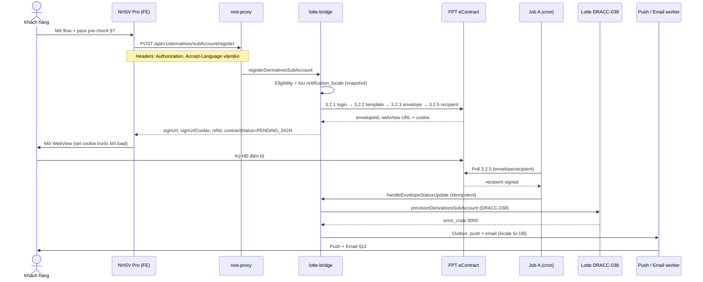
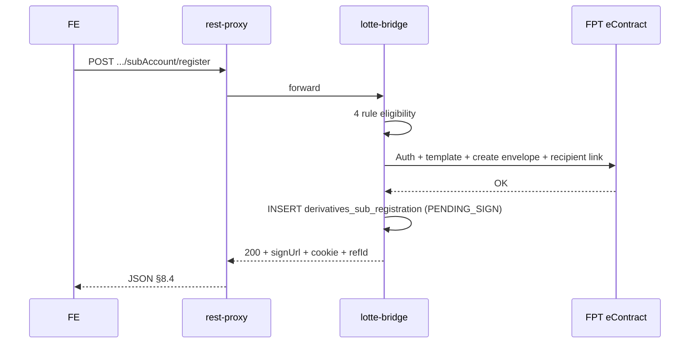
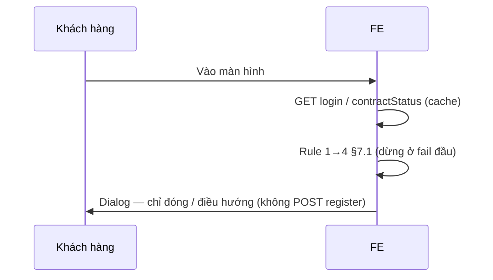

# PRD v2.0 — Mở tiểu khoản phái sinh (sub 80) online trên NHSV Pro

**Product:** NHSV Pro / TradeX Derivatives
**Feature:** Đăng ký mở tiểu khoản phái sinh trực tuyến (end-to-end)
**Version:** 2.2 (phân rã FE/BE, sequence diagrams, UX writing push/email, locale async từ `Accept-Language`; trước đó v2.1 = FPT PDF revalidation + TradeX naming)
**Last Updated:** April 23, 2026
**Audience:** PM, BA, Tech Lead FE/BE, Compliance, Ops, CSKH
**Lotte reference:** [DRACC-038 — `dr-create-sub-account`](../../../Documentation/%5BAPI%20specs%5DLotte_DR.md) §2.1.9
**FPT eContract reference:** `FPT.eContract_API_POC_102023_v3.0` — APIs 3.2.1 login, 3.2.2 template structure, 3.2.3 create envelope, 3.2.5 get recipient link (webview + cookie), 3.2.6 cancel contract
**TradeX convention reference:**
- Naming: [`.cursor/skills/tradex-api-naming/SKILL.md`](../../../../.cursor/skills/tradex-api-naming/SKILL.md)
- Error / response format: [`TradeX Knowledge/API Standards/tradex-api-conventions.md`](../../../../TradeX%20Knowledge/API%20Standards/tradex-api-conventions.md)
- Production FPT integration pattern: [`TradeX Knowledge/System/ekyc-flow-upload-lotte-fpt-econtract.md`](../../../../TradeX%20Knowledge/System/ekyc-flow-upload-lotte-fpt-econtract.md) (polling-based, không webhook)

---

## 1. Tóm tắt điều hành

Khách hàng cá nhân đã có **tài khoản chứng khoán cơ sở (TKCK) tại NHSV** có thể **tự phục vụ mở tiểu khoản phái sinh (sub `80`)** ngay trên app NHSV Pro. Hệ thống chặn các trường hợp không đủ điều kiện từ cả **FE (pre-flight)** lẫn **BE (authoritative)**; với khách đủ điều kiện, BE **khởi tạo hợp đồng điện tử** qua **FPT eContract** theo template `DERIVATIVES` (ký ảnh, TTL 90 ngày), **poll trạng thái FPT** cho tới khi KH ký xong, rồi gọi **Lotte DRACC-038** để tạo sub `80`. Sau khi Lotte trả `error_code = 0000`, hệ thống **push OneSignal** + **gửi email** thông báo thành công.

**Nguyên tắc kiến trúc:**
- FE chỉ là **lớp UX pre-check**, BE là **nguồn sự thật** (SSOT) về eligibility, trạng thái hợp đồng, và provisioning sub.
- **Mọi trigger gọi Lotte** đều đi qua **một handler duy nhất** (idempotent) — dù event đến từ polling, webhook (nếu FPT bật trong tương lai), hay retry job — không gọi Lotte ngay sau khi tạo envelope.
- **FPT PDF v3.0 không đặc tả webhook** → mặc định dùng **polling pattern** qua API 3.2.5 (`services/envelope/api/external/v1/envelopes/recipient`) — khớp với luồng production `ekyc-admin` hiện hữu.
- Endpoint & DTO tuân theo [TradeX API Naming Conventions](../../../../.cursor/skills/tradex-api-naming/SKILL.md): URL camelCase, không dùng hyphen/snake_case; DTO `{Resource}{Action}Request|Response`; service method `{action}{Resource}`.

---

## 2. Mục tiêu & chỉ số

| Mục tiêu | KPI gợi ý |
|---------|-----------|
| Tăng tỷ lệ khách đủ điều kiện hoàn tất mở sub 80 online | `completed_sub_80 / started_flow` ≥ mục tiêu (cần baseline) |
| Rút ngắn thời gian từ “Bắt đầu” → “Sub sẵn sàng giao dịch” | p50 ≤ 10 phút, p95 ≤ 24 giờ (chờ KH ký) |
| Giảm tải CSKH cho luồng mở sub | Số ticket trạng thái “Chờ ký / Lỗi” giảm QoQ |
| Không sai sót eligibility | Không có case lọt rule → 0 case mở sub sai điều kiện |

---

## 3. Định nghĩa

| Thuật ngữ | Ý nghĩa |
|-----------|---------|
| Sub 80 | Tiểu khoản phái sinh (`subNumber = "80"`) |
| TKCK | Số tài khoản chứng khoán, format `039CXXXXXX` (6 chữ số cuối) |
| `/api/v1/login` | API login trả `accountSubs[]`, `username`, `bankCode` |
| `/api/v1/equity/account/contractStatus` | API trạng thái HĐ mở TKCK (`contractStatus`: `COMPLETED` / `PROCESSING` / …) |
| envelope | Hợp đồng điện tử phía FPT (có `envelopeId`) |
| DRACC-038 | API Lotte tạo sub phái sinh — `dr-create-sub-account` |
| OneSignal | Push notification provider |

---

## 4. Phạm vi

| In scope | Out of scope |
|----------|--------------|
| FE pre-check eligibility (4 rule) và error dialog | Flow mở TKCK cơ sở (redirect tới luồng sẵn có) |
| BE eligibility check với 4 error code | Thay đổi giao diện login / account switcher |
| Khởi tạo envelope FPT bằng template `DERIVATIVES` | Thay đổi nội dung template FPT (thuộc Pháp chế / BA) |
| Lưu envelopeId + refId vào DB TradeX | Quản lý long-term chứng từ (đã có hệ thống lưu trữ) |
| **Polling trạng thái FPT envelope** (Signed / Rejected / Voided / Overdue) qua API 3.2.5 | Luồng ký hộ / đại diện pháp lý (không nằm trong MVP) |
| Gọi Lotte DRACC-038 **sau khi KH ký thành công** | Cấu hình nhóm `fee_group`, `margin_ratio_group`, `warning_group` (dùng default `""`) |
| Gửi push OneSignal + email khi tạo sub thành công | Thông báo SMS |
| **Batch job poll FPT status (Job A)** và **retry Lotte (Job B)** chạy 24/7 mỗi 5 phút | Hệ thống scheduler chung (dùng cơ chế cron sẵn có của TradeX) |
| **Ops action huỷ HĐ đang chờ ký** qua FPT API 3.2.6 | Flow migrate dữ liệu cũ từ hệ thống legacy |
| **Lưu file HĐ trên Minio** và expose qua presigned URL cho admin | Triển khai Minio cluster (đã có infra) |
| **Trang admin** `https://tnhsvpro.nhsv.vn/nhsv-admin/admin`: list + filter + detail + view PDF | Phân quyền chi tiết role admin (workshop IAM riêng) |

---

## 5. Personas & stakeholders

| Vai trò | Nhu cầu chính |
|---------|---------------|
| KH retail | Nhanh, rõ ràng lý do nếu bị chặn, ký trên mobile dễ |
| CSKH | Biết trạng thái từng bước: Chờ ký / Đã ký / Provision fail |
| Ops / Compliance | Audit trail đầy đủ từ init envelope → Lotte response |
| BE / FE engineers | Contract API + error code rõ ràng, idempotent retry |

---

## 6. Luồng nghiệp vụ tổng thể

```
FE pre-check (4 rules)
        │
        ▼
POST /api/v1/derivatives/subAccount/register   (TradeX convention)
        │   BE eligibility (4 error codes, HTTP 409/422)
        ▼
FPT auth (3.2.1 /v1/client-auth/login)  →  Bearer access_token (cache TTL < expTime)
        │
        ▼
FPT GET template structure (3.2.2, alias=DERIVATIVES) → templateId + field ids
        │
        ▼
FPT POST excall (3.2.3, selector=flow_start_nhsv_create_econtract_from_template_integrate)
        │  → envelopeId
        ▼
FPT POST recipient link (3.2.5, checkAuthenticate=true) → webView URL + cookie (expire 600s)
        │   DB: PENDING_SIGN + envelopeId + ref_id
        ▼
    KH ký HĐ trên FPT webview
        │
        ├─(optional webhook, nếu bật)──▶ DB: SIGNED ─▶ Job C: download PDF → Minio
        │                                     │
Job A (mỗi N phút, 24/7) poll FPT 3.2.5 ─────▶ (bù/thay callback)
                                                 │
                                                 ▼
                                        Lotte DRACC-038 (qua single handler, CAS lotte_status)
                                                 │
                      ┌──────────────────────────┤
                      ▼                          ▼
                 SUCCESS (0000)           FAILED (1005 / 5xx)
                      │                          │
                      ▼                          ▼
              OneSignal + Email         Job B (mỗi N phút, 24/7) retry (cap 48)
                      │                          │
                      ▼                          ▼
                 NOTIFIED                NEEDS_VERIFICATION (Ops)

Ops / Admin actions:
  • Cancel PENDING_SIGN (tuỳ chọn) → FPT 3.2.6 excall selector=flow_processing_nhsv_cancel_contract
  • View PDF → BE gen presigned Minio URL (TTL 5 phút)

Admin portal https://tnhsvpro.nhsv.vn/nhsv-admin/admin
  ├── list + filter (date range / account_no / status)
  ├── detail: metadata + timeline
  └── View contract PDF (presigned Minio URL, TTL 5 phút)
```

---

## 6A. Phân rã backlog & trách nhiệm FE vs BE

Mục tiêu: team **tách backlog Jira / sprint** rõ **Front-end (RN app)** vs **Back-end (rest-proxy + lotte-bridge + notification + jobs + admin API)** — tránh story “full-stack chung” không assign được.

### 6A.1 Nguyên tắc

| Nguyên tắc | FE | BE |
|------------|----|----|
| Eligibility | Pre-check UX (4 rule) để giảm round-trip | **SSOT** — lặp lại 4 rule + mã lỗi `SUB_ACCOUNT_REGISTER_*` |
| Hợp đồng FPT | WebView + cookie + refresh `signUrl` khi cookie hết hạn | Auth FPT, template, tạo envelope, recipient 3.2.5, lưu DB |
| Sau khi KH ký | (Tuỳ chọn) poll `registrationStatus` hoặc chờ push | Job A poll FPT, handler idempotent, gọi Lotte, Job B/C |
| Thông báo | Hiển thị khi mở app từ deep link | OneSignal + email (outbox), **locale theo snapshot §8.0 / cột DB** |
| Admin | Không scope RN | List/filter/detail, presigned PDF, Ops cancel 3.2.6, retry |

### 6A.2 Ma trận hạng mục → owner

| Hạng mục (epic-level) | Chủ yếu FE | Chủ yếu BE |
|------------------------|------------|------------|
| Màn “Mở TK phái sinh”, copy dialog §7.1 | ✅ UI + map lỗi `code` → i18n | ✅ API + mã lỗi đúng spec |
| `POST /api/v1/derivatives/subAccount/register` | ✅ Gọi API, header `Accept-Language`, body `accountNumber`, `deviceUniqueId` | ✅ Endpoint, JWT, eligibility, chuỗi FPT, response §8.4 |
| WebView FPT ký | ✅ RN WebView, inject cookie `signUrlCookie`, handle expire 600s → gọi BE refresh | ✅ Endpoint/tác vụ refresh `signUrl` (không tạo envelope mới) |
| Lưu trạng thái chờ ký | ✅ UX “Đang chờ ký” / quay lại sau | ✅ DB `PENDING_SIGN`, Job A |
| Provision sub 80 | ✅ (Optional) badge “Đang xử lý” nếu có API status | ✅ Lotte DRACC-038, CAS, Job B |
| Push + email thành công | ✅ Deep link mở đúng màn | ✅ Outbox, OneSignal, SMTP, template theo locale |
| Email/luồng REJECTED/OVERDUE | ✅ Thông báo trong app nếu có spec | ✅ Template email §12, BE trigger §10.1 |
| Trang admin §15 | — | ✅ Full stack admin + API |

### 6A.3 Gợi ý nhãn backlog (để filter Jira)

- Prefix **`[DR-SUB80-FE]`**: pre-check, WebView+cookie, error mapping, deep link.
- Prefix **`[DR-SUB80-BE]`**: register API, FPT chain, schema DB, Job A/B/C, Lotte, notification worker, admin APIs.
- Story **tích hợp E2E**: gắn cả hai nhãn hoặc epic riêng “E2E / QA”.

---

## 6B. Sequence diagrams

Dưới đây là **UML sequence** (Mermaid) để workshop / dev align; chi tiết lỗi và retry xem §8–§13.

### 6B.1 Luồng chính — từ đăng ký đến thông báo thành công



### 6B.2 Luồng đồng bộ — chỉ bước `register` (happy path)



### 6B.3 FE bị chặn ở pre-check (không gọi BE)



---

## 7. Bước 1 — FE pre-check (khi KH mở màn hình “Mở TK phái sinh”)

**Mục tiêu:** Chặn sớm để KH không phải chờ round-trip BE/FPT/Lotte nếu chắc chắn không đủ điều kiện.

### 7.1 Ma trận rule (thứ tự kiểm tra)

| # | Điều kiện chặn | Nguồn dữ liệu | Thông điệp hiển thị | Hành động dialog |
|---|----------------|---------------|----------------------|------------------|
| 1 | Tài khoản liên kết bank ngoài NHSV | `/api/v1/login.accountSubs[].bankCode` — **nếu mọi sub có `bankCode ≠ "9999"`** | “Tài khoản liên kết bank không được phép mở tiểu khoản phái sinh.” | `Close` |
| 2 | KH đã có sub 80 | `/api/v1/login.accountSubs[].subNumber` — **tồn tại `"80"`** | “Tài khoản đã có tiểu khoản phái sinh.” | `Close` |
| 3 | TKCK không lưu ký tại NHSV | `/api/v1/login.username` — **3 ký tự đầu ≠ `"039C"`** | “Tài khoản không lưu ký tại NHSV, không được phép mở tiểu khoản phái sinh.” | `Close` |
| 4 | Chưa ký HĐ mở TKCK | `/api/v1/equity/account/contractStatus.contractStatus ≠ "COMPLETED"` | “Tài khoản chưa ký HĐ mở tài khoản. Vui lòng hoàn thiện HĐ mở tài khoản trước khi mở tiểu khoản phái sinh.” | `Close` hoặc `Ký HĐ` (điều hướng tới màn ký HĐ cơ sở) |

**Quy ước:**
- Kiểm tra tuần tự, **dừng ở rule đầu tiên fail**, hiển thị đúng một dialog.
- Copy text và button label phải **chính xác như bảng trên** (Pháp chế / PM duyệt trước release).
- Sau khi **cả 4 rule pass** → FE gọi BE `POST /api/v1/derivatives/subAccount/register` để vào bước 2 (endpoint này theo chuẩn [TradeX API Naming](../../../../.cursor/skills/tradex-api-naming/SKILL.md) — resource camelCase `subAccount`, action `register`).
- Header **`Accept-Language`** trên request register phải **khớp ngôn ngữ UI** đang hiển thị (ảnh hưởng message lỗi BE **và** snapshot `notification_locale` cho push/email sau — §8.0, §12).

### 7.2 UX state khi API login / contractStatus lỗi

| Tình huống | Xử lý |
|------------|-------|
| `/api/v1/login` lỗi / timeout | Dialog chuẩn network error + `Retry`; không vào rule check |
| `/api/v1/equity/account/contractStatus` lỗi | Không bypass rule — hiển thị “Không xác định được trạng thái HĐ mở TKCK, vui lòng thử lại” |

---

## 8. Bước 2 — BE authoritative eligibility check

### 8.0 Endpoint & DTO (TradeX convention)

| Thuộc tính | Giá trị |
|------------|---------|
| HTTP method | `POST` |
| URL (client-facing) | `/api/v1/derivatives/subAccount/register` |
| Service method (lotte-bridge) | `registerDerivativesSubAccount(request)` |
| Request DTO (Java) | `SubAccountRegisterRequest` |
| Response DTO (Java) | `SubAccountRegisterResponse` |
| Request DTO (TS) | `ISubAccountRegisterRequest` |
| Response DTO (TS) | `ISubAccountRegisterResponse` |
| Accept-Language | `vi` (default) / `en` / `ko` — map sang Lotte `lang_code` `V/E/K`; đồng thời BE **ghi snapshot** vào DB (`notification_locale`) để dùng cho **push + email bất đồng bộ** sau Lotte SUCCESS (§12) |
| Auth | Bearer JWT (user token) |

**Ngôn ngữ thông báo (push / email) không suy diễn sau:** Locale gửi tới KH khi provisioning xong được xác định **một lần** tại **`POST .../register`** qua header `Accept-Language` (chuẩn TradeX đã có tại §8.0). BE lưu `notification_locale ∈ { vi, en, ko }` trên record `derivatives_sub_registration`; worker notification đọc cột này — **không** đọc lại preference user/profile tại thời điểm gửi (tránh race đổi ngôn ngữ app giữa lúc ký và lúc Lotte trả). **Admin “Resend notification”** (§15.4) dùng cùng snapshot đã lưu.

| Accept-Language (request) | `notification_locale` lưu DB |
|---------------------------|------------------------------|
| `vi`, `vi-VN`, `vi,*` | `vi` |
| `en`, `en-US`, `en,*` | `en` |
| `ko`, … | `ko` |
| Không gửi / không parse được | **`vi`** (fallback mặc định) |

**Lý do đổi tên so với spec gốc (`sub-account/initiate`):**

| ❌ Spec cũ | ✅ TradeX chuẩn | Căn cứ |
|-----------|-----------------|--------|
| `sub-account` (hyphen) | `subAccount` (camelCase) | [tradex-api-naming](../../../../.cursor/skills/tradex-api-naming/SKILL.md) §URL Patterns; resource phải camelCase |
| action `initiate` | action `register` | `register` phản ánh **toàn bộ nghiệp vụ đăng ký** (eligibility + tạo envelope), đúng với action keyword được TradeX convention khuyến nghị cho "creating resources" |

### 8.1 Request body (FE gửi)

```json
{
  "accountNumber": "039C003131",
  "deviceUniqueId": "550e8400-e29b-41d4-a716-446655440000"
}
```

| Field | Type | Required | Ghi chú |
|-------|------|----------|---------|
| `accountNumber` | String | **Y** | Số TKCK 10 ký tự, FE lấy từ `accountSubs[].accountNumber` |
| `deviceUniqueId` | String | **Y** | Device ID / MAC; audit trail — FE bắt buộc gửi (per [tradex-api-conventions §Auto-Populated](../../../../TradeX%20Knowledge/API%20Standards/tradex-api-conventions.md)) |

**Auto-populated fields (FE KHÔNG cần gửi):** `sourceIp` (rest-proxy điền từ request IP), `userId` / `name` / `identifierNumber` (lotte-bridge lấy từ JWT `userData`), `mdm_tp` (derive từ platform). Xem [tradex-api-conventions §1.1](../../../../TradeX%20Knowledge/API%20Standards/tradex-api-conventions.md).

### 8.2 Nguyên tắc xử lý BE

BE phải **lặp lại toàn bộ 4 rule của FE** bằng nguồn dữ liệu nội bộ / Core, **không tin FE** (chuẩn "Light Validation ở TradeX, Core validates business rules" — nhưng với 4 rule eligibility này, **TradeX vẫn phải chặn** vì đây là rule nghiệp vụ của luồng NHSV, không phải business rule của Lotte).

### 8.3 Bộ mã lỗi (theo chuẩn TradeX error response)

**Response format thống nhất:**
- HTTP status phản ánh kết quả — **NO** `success: true/false`, **NO** `code: "0000"` trong body (per [tradex-api-conventions §Response Format Standards](../../../../TradeX%20Knowledge/API%20Standards/tradex-api-conventions.md)).
- Business error body: `{ "code": "<ERROR_CODE>", "message": "<tiếng Việt/EN/KO theo Accept-Language>" }`.

| Error code | HTTP | Rule tương ứng | Ghi chú |
|------------|------|----------------|---------|
| `INVALID_PARAMETER` + `FIELD_IS_REQUIRED` / `INVALID_FORMAT` | 400 | Missing `accountNumber` / `deviceUniqueId` / format sai | Format chuẩn `params[]` array với `param` + `messageParams` |
| `SUB_ACCOUNT_REGISTER_BANK_ACCOUNT_INVALID` | 422 | Rule 1 — bank ≠ 9999 cho toàn bộ sub | Copy rule 1 §7.1 |
| `SUB_ACCOUNT_REGISTER_ALREADY_EXISTED` | 409 | Rule 2 — đã có sub 80 | Copy rule 2 §7.1 |
| `SUB_ACCOUNT_REGISTER_ACCOUNT_NOT_AT_NHSV` | 422 | Rule 3 — `username` không prefix `039C` | Copy rule 3 §7.1 |
| `SUB_ACCOUNT_REGISTER_CONTRACT_NOT_COMPLETED` | 422 | Rule 4 — `contractStatus ≠ COMPLETED` | Copy rule 4 §7.1 |
| `SUB_ACCOUNT_REGISTER_ALREADY_PENDING_SIGN` | 409 | Có record `PENDING_SIGN` chưa hết hạn | Trả lại `signUrl` hiện hữu — xem §9.5 |
| `SUB_ACCOUNT_REGISTER_FPT_<FPT_CODE>` | 502 | FPT 3.2.1 / 3.2.3 / 3.2.5 lỗi | Pass-through FPT error theo pattern `{OPERATION}_{EXTERNAL_CODE}` |
| `TOKEN_EXPIRED` | 401 | JWT hết hạn | Chuẩn TradeX |
| `INTERNAL_SERVER_ERROR` | 500 | Lỗi không mong đợi | Chuẩn TradeX |

**Lý do đổi prefix `SUB_ACCOUNT_REGISTER_*`:** per TradeX convention `{OPERATION}_{CODE}` (ví dụ `ORDER_PLACE_1005`, `TRANSFER_CASH_1234`) — dễ tra log, tránh trùng code giữa nghiệp vụ.

**Ví dụ 400 validation error:**

```json
{
  "code": "INVALID_PARAMETER",
  "params": [
    {
      "code": "FIELD_IS_REQUIRED",
      "param": "accountNumber",
      "messageParams": ["accountNumber"]
    }
  ]
}
```

**Ví dụ 422 business rule error:**

```json
{
  "code": "SUB_ACCOUNT_REGISTER_BANK_ACCOUNT_INVALID",
  "message": "Tài khoản liên kết bank không được phép mở tiểu khoản phái sinh."
}
```

### 8.4 Success response (vào bước khởi tạo HĐ)

Khi cả 4 rule pass, BE tiếp tục §9 (gọi FPT 3.2.1 → 3.2.2 → 3.2.3 → 3.2.5) và trả cho FE:

```json
{
  "refId": "req-uuid-a1b2c3d4",
  "envelopeId": "000011JlIB6PI4Ogw3mOKFQb",
  "contractStatus": "PENDING_SIGN",
  "signUrl": "https://econtract.fpt.com.vn/app/fi-wv/000011JlIB6PI4Ogw3mOKFQb/p_002_r_001/act",
  "signUrlCookie": {
    "name": "jwttoken_000011JlIB6PI4Ogw3mOKFQb_p_002_r_001",
    "value": "eyJhbGci...",
    "expireIn": 600
  },
  "expiredAt": "2026-07-21T10:00:00+07:00"
}
```

| Field | Nguồn |
|-------|-------|
| `refId` | BE sinh (UUID v4), cũng là giá trị gửi FPT |
| `envelopeId` | `response.envelopeId` từ FPT 3.2.3 |
| `contractStatus` | Initial = `PENDING_SIGN` |
| `signUrl` | `webView.url` từ FPT 3.2.5 response |
| `signUrlCookie` | `webView.cookieName / cookieValue / expireTime` từ FPT 3.2.5 — FE **phải** set cookie này trước khi mở webview (per FPT spec) |
| `expiredAt` | `created_at + 90 ngày` |

> **Quan trọng cho FE:** `signUrlCookie.expireIn = 600s` (FPT cố định). Sau 10 phút cookie hết hạn, FE phải **gọi lại BE** để request `signUrl` mới (BE cache envelope, chỉ re-call FPT 3.2.5 — không tạo envelope mới).

---

## 9. Bước 3 — Khởi tạo hợp đồng điện tử FPT

**Tham chiếu đặc tả:** FPT.eContract_API_POC_102023_v3.0, mục 3.1 (môi trường) và 3.2.1–3.2.6.

### 9.0 Môi trường & credentials FPT (từ PDF §3.1)

| Thuộc tính | UAT / Demo | Production (PDF) | Production (TradeX prod config hiện tại) |
|------------|------------|------------------|-------------------------------------------|
| `ROOT_URL` | `https://demo.econtract.fpt.com.vn/app` | `https://econtract.fpt.com.vn/app` | `https://econtract.fpt.com/app` *(theo `ekyc-admin-prod.sh`, không có `.vn`)* |
| `username` / `password` | FPT cấp | FPT cấp | Stored trong `feignClient.fpt.eContract.loginInfo` |
| `clientid` / `clientsecret` | FPT cấp | FPT cấp | Stored trong config vault |
| Template alias | `DERIVATIVES` (cần FPT confirm khai báo) | Same | — |
| Selector khởi tạo | `flow_start_nhsv_create_econtract_from_template_integrate` | Same | Khớp production eKYC (Knowledge xác nhận) |
| Selector huỷ | `flow_processing_nhsv_cancel_contract` | Same | — |

> ⚠️ **Open Q (đã tồn tại — nâng mức độ):** Production URL giữa PDF (`.com.vn/app`) và `ekyc-admin-prod.sh` (`.com/app`) **khác nhau**. Cần SRE xác nhận URL chính xác — có thể FPT đã migrate domain sau khi PDF được phát hành.

### 9.1 FPT Auth (PDF §3.2.1) — mới bổ sung

| Thuộc tính | Giá trị |
|------------|---------|
| URL | `{ROOT_URL}/v1/client-auth/login` |
| Method | `POST` |
| Content-Type | `application/json` |
| Request body | `{ "username": "...", "password": "...", "clientid": "...", "clientsecret": "..." }` |
| Response | `{ "access_token": "...", "refresh_token": "...", "expTime": "2049-07-12T17:08:46.043+0000" }` |
| Exceptions | 401 `Không xác thực thành công` + các HTTP exception chuẩn |

**BE pattern:**
- Cache `access_token` trong memory/Redis với TTL = `expTime − now − 60s safety margin`.
- Trước mỗi gọi FPT (3.2.2 / 3.2.3 / 3.2.5 / 3.2.6), BE đính kèm `Authorization: Bearer {access_token}`.
- Nếu FPT trả `401` → refresh token (dùng `refresh_token`, hoặc đơn giản là re-login) và retry 1 lần.

### 9.2 Lấy cấu trúc template (PDF §3.2.2)

| Thuộc tính | Giá trị |
|------------|---------|
| URL | `{ROOT_URL}/services/envelope/api/external/v1/template/structue` *(lưu ý: "structue" là chính tả gốc của FPT PDF — không sửa)* |
| Method | **`GET`** |
| Query param | `alias=DERIVATIVES` |
| Auth | `Authorization: Bearer <access_token từ 3.2.1>` |
| Response | JSON chứa `templateId`, `alias`, `syncType`, `datas[]` với các field `id/name/type/value/owner/dataType/required` — xem PDF §3.2.2.3.2 |

**Mục đích:** Lấy `templateId` mới nhất (ví dụ `000010oJivAQgioQ4rXAxEioJw`) và các `id` field nội bộ template để ghép payload ở §9.3.

**Caching:** BE cache `(alias, templateId, field schema)` TTL 1 giờ; invalidate bằng cơ chế manual refresh (tạm thời — FPT chưa có webhook template change).

### 9.3 Khởi tạo envelope (PDF §3.2.3)

| Thuộc tính | Giá trị |
|------------|---------|
| URL | `{ROOT_URL}/services/excall/api/excall` |
| Method | `POST` |
| Auth | `Authorization: Bearer <access_token>` |
| Content-Type | `application/json` |

**Top-level body (khớp PDF §3.2.3.3.1):**

| Field | Giá trị | Ghi chú |
|-------|---------|---------|
| `id` | `""` | Mặc định rỗng |
| `refId` | UUID nội bộ (ví dụ `req-uuid-a1b2c3d4`) | Dùng idempotency & truy soát |
| `selector` | `"flow_start_nhsv_create_econtract_from_template_integrate"` | Hardcode theo FPT spec |
| `lookup` | **Bằng** `refId` | Truy soát nghiệp vụ |
| `attrs` | `null` | Mặc định |
| `payload` | `"PLHD"` | Hardcode |
| `body[]` | Danh sách object chi tiết — xem §9.4 | 1 phần tử cho mỗi envelope |

### 9.4 Payload `body[0]` — các field chính

**Envelope header:**

| `id` | `name` | `value` | Nguồn dữ liệu |
|------|--------|---------|----------------|
| `envName` | Tên tài liệu | `HĐGDPS <TKCK>-<HỌ TÊN KH>` (ví dụ `HĐGDPS 039C200327-NGUYEN MINH DUC`) | Ghép từ TKCK + họ tên — chuẩn hoá unicode, upper, bỏ ký tự đặc biệt |
| `envNo` | Số tài liệu | `""` | FPT tự sinh |
| `envDate` | Ngày ký | `""` | FPT cập nhật khi ký |
| `envSubmittedFrom` | Được gửi từ | `/1899/5511` | Hardcode |

**Party 1 — NHSV:**

| Field | Value |
|-------|-------|
| `p_001.name_party` | `CÔNG TY TRÁCH NHIỆM HỮU HẠN CHỨNG KHOÁN NH VIỆT NAM` |
| `p_001_r_001.name_recipient` | `NHSV` |
| `p_001_r_001.mail_recipient` | UAT: `mietftu@gmail.com` / Prod: `support@nhsv.vn` |
| `p_001_r_001.phone_recipient` | `""` |
| `p_001_r_001.contact_recipient` | `null` |

**Party 2 — Khách hàng:**

| Field | Value | Nguồn |
|-------|-------|-------|
| `p_002.name_party` | `individual` | Hardcode |
| `p_002_r_001.name_recipient` | Họ tên KH | Core — KYC |
| `p_002_r_001.mail_recipient` | Email KH | Core — KYC |
| `p_002_r_001.phone_recipient` | SĐT KH | Core — KYC |
| `p_002_r_001.contact_recipient` | `null` | Mặc định |

**Requester fields (giá trị hiển thị trên HĐ):**

| Field `name` | Nguồn |
|--------------|-------|
| `full_name` | Tên KH |
| `id_no` | Số CCCD |
| `issue_date` | Ngày cấp CCCD — format `dd/MM/yyyy` |
| `issue_place` | Nơi cấp CCCD |
| `no_1` … `no_6` | **6 chữ số cuối** của TKCK, mỗi ô một số (chú thích Untitled-1 dòng 254 có typo “thứ 2” cho `no_1` — BE chốt ký hiệu `no_n = chữ số thứ n tính từ đâu`) |
| `dr_register_date` | Thời điểm BE khởi tạo HĐ — format chốt với FPT |
| `dr_yn` | Luôn là `"x"` |

**Envelope control:**

| Field | Value |
|-------|-------|
| `dueDays` | `90` |
| `refId` (envelope-level) | Giá trị `reference_id` nội bộ (có thể trùng top-level `refId` hoặc có convention riêng — BE chốt) |

### 9.5 Response thành công từ FPT 3.2.3 (PDF §3.2.3.3.2)

```json
{
  "id": "62e94917-ba0e-48f3-8bbc-66202ed654af",
  "refId": "req-uuid-a1b2c3d4",
  "code": "0",
  "message": "Gửi thông tin sang econtract thành công xem chi tiết tại response",
  "result": null,
  "response": {
    "envelopeId": "000011JlIB6PI4Ogw3mOKFQb"
  }
}
```

**Quy tắc lưu DB:** Khi **cả hai** điều kiện đúng:
- `code == "0"`, **và**
- `response.envelopeId != null`

→ Lưu record vào bảng `derivatives_sub_registration` với state `PENDING_SIGN`. Các field tối thiểu:

| Column | Kiểu | Ghi chú |
|--------|------|---------|
| `id` (PK) | UUID | |
| `customer_id` | FK Core | |
| `account_no` | String | Ví dụ `039C003131` |
| `hts_user_id` | String | Dùng khi gọi Lotte |
| `ref_id` | String | `refId` top-level gửi FPT |
| `fpt_transaction_id` | String | Field `id` từ FPT response |
| `envelope_id` | String | `response.envelopeId` |
| `template_id` | String | `000010oJivAQgioQ4rXAxEioJw` hoặc mới nhất |
| `customer_full_name` | String | **Denormalized** từ Core KYC — phục vụ admin list query (tránh N+1) |
| `contract_status` | Enum | `PENDING_SIGN` / `SIGNED` / `REJECTED` / `VOIDED` / `OVERDUE` |
| `lotte_status` | Enum | `NOT_YET` / `CALLING` / `SUCCESS` / `FAILED` / `NEEDS_VERIFICATION` |
| `lotte_error_code` | String | VD `0000` hoặc `1005` |
| `lotte_error_desc` | String | |
| `lotte_retry_count` | Int | Số lần Job B đã retry (xem §12A); cap ví dụ 48 lần = 4h |
| `lotte_last_attempt_at` | Timestamp | Thời điểm lần gọi Lotte gần nhất — hỗ trợ backoff |
| `minio_bucket` | String | Ví dụ `derivatives-contracts` |
| `minio_object_key` | String | Ví dụ `derivatives-sub-registration/2026/04/{id}.pdf` |
| `contract_file_status` | Enum | `NOT_AVAILABLE` / `DOWNLOADING` / `STORED_IN_MINIO` / `DOWNLOAD_FAILED` |
| `created_at`, `updated_at`, `expired_at` | Timestamp | `expired_at = created_at + 90 ngày` |
| `notification_locale` | Enum / String | Snapshot `vi` \| `en` \| `ko` từ `Accept-Language` của request **`POST .../register`** §8.0 — dùng cho OneSignal + email §12 và resend §15.4 |

### 9.6 Lấy signUrl cho FE (PDF §3.2.5 — mới bổ sung)

| Thuộc tính | Giá trị |
|------------|---------|
| URL | `{ROOT_URL}/services/envelope/api/external/v1/envelopes/recipient` |
| Method | `POST` |
| Auth | `Authorization: Bearer <access_token>` |
| Query params | `page=0`, `size=100`, **`checkAuthenticate=true`** *(bắt buộc — mới trả về webview + cookie)* |
| Request body | `{ "contactId": "<contactId KH>" }` — chính là `contactId` đã gửi ở `body[0]` API 3.2.3 (thường lấy từ CCCD hoặc mã KH) |

**Response (rút gọn — các field TradeX quan tâm):**

```json
[
  {
    "envId": "000011JlIB6PI4Ogw3mOKFQb",
    "envStatus": "processing",
    "recipientStatus": "processing",
    "recipientContactInfo": {
      "id": "p_002_r_001",
      "partyId": "p_002",
      "contact": { "id": "151998062", "name": "...", "email": "...", "phone": "..." },
      "role": "signer",
      "status": "processing",
      "signDate": null,
      "reason": null
    },
    "webView": {
      "url": "https://econtract.fpt.com.vn/app/fi-wv/000011JlIB6PI4Ogw3mOKFQb/p_002_r_001/act",
      "cookieName": "jwttoken_000011JlIB6PI4Ogw3mOKFQb_p_002_r_001",
      "cookieValue": "eyJhbGciOiJIUzUxMiJ9...",
      "expireTime": 600
    }
  }
]
```

**BE dùng API này cho 2 mục đích:**
1. **Trả `signUrl` + cookie** cho FE ngay sau khi tạo envelope (§8.4) và mỗi khi FE yêu cầu refresh (sau 10 phút cookie expire).
2. **Polling status** trong Job A (§13.1) — đọc `envStatus`, `recipientStatus`, `signDate`, `reason` để xác định KH đã ký / từ chối / voided / overdue.

### 9.7 Huỷ hợp đồng đang xử lý (PDF §3.2.6 — mới bổ sung)

**Dùng khi:** Ops huỷ envelope thay mặt KH (ví dụ: KH yêu cầu, envelope sai dữ liệu) — tham chiếu Open Q #7 §20. **Không** dùng trong luồng nghiệp vụ tự động.

| Thuộc tính | Giá trị |
|------------|---------|
| URL | `{ROOT_URL}/services/excall/api/excall` |
| Method | `POST` |
| Selector | `flow_processing_nhsv_cancel_contract` |
| Request body | Theo PDF §3.2.6.3.1 — `{ attrs: {}, id: "", lookup: "<refId>", payload: "", body: { type: "sync", actList: [{ refId: "", envelopeId: "<envId>", reason: "<lý do Ops>" }]}, refId: "<refId>", selector: "flow_processing_nhsv_cancel_contract" }` |
| Response | `{ "code": "0", "response": { "detail": [{ "envelopeId": "...", "status": "ok", "mess": null }] } }` |

**DB update:** `contract_status = VOIDED`, lưu `reason` + `actor = admin_user_id` vào audit log.

### 9.8 Response BE trả FE (summary)

Sau khi chuỗi 3.2.1 → 3.2.2 → 3.2.3 → 3.2.5 thành công, BE trả body ở §8.4.

### 9.9 Idempotency

- **Double-tap bảo vệ:** BE dùng `refId` (UUID do BE sinh) làm khoá duy nhất cho 1 phiên `register`. Nếu client retry với cùng `deviceUniqueId + accountNumber` trong TTL ngắn (ví dụ 60s), BE trả lại envelope đã tạo (re-fetch signUrl qua 3.2.5) thay vì tạo envelope mới.
- **Không tạo envelope thứ 2** nếu đã có record `PENDING_SIGN` chưa hết hạn cho cùng `customer_id` + `account_no`. Trả `409 SUB_ACCOUNT_REGISTER_ALREADY_PENDING_SIGN` với `signUrl` của envelope hiện hữu (đi qua FPT 3.2.5 để lấy cookie mới nếu cookie cũ expire).

---

## 10. Bước 4 — Theo dõi trạng thái ký hợp đồng

### 10.0 Polling-first vs webhook

- **PDF FPT v3.0 KHÔNG đặc tả webhook/callback API.** Cơ chế chuẩn (PDF §3.2.5) là client poll `envStatus` / `recipientStatus` qua API recipient.
- **Production `ekyc-admin` hiện tại** dùng **polling 15–30 phút** (xem [TradeX Knowledge — ekyc-flow-upload-lotte-fpt-econtract](../../../../TradeX%20Knowledge/System/ekyc-flow-upload-lotte-fpt-econtract.md)). Webhook "có thể có" nhưng chưa được xác minh trong code.
- **PRD chọn polling-first** (Job A §13.1) — webhook (nếu FPT bật về sau) được coi là **optimization** để giảm latency, không phải source of truth.

### 10.1 Các trạng thái FPT cần xử lý

Đọc từ FPT 3.2.5 response mỗi lần Job A chạy (hoặc webhook nếu bật):

| FPT `recipientStatus` / `envStatus` | `contract_status` (DB) | Next action |
|-------------------------------------|-------------------------|-------------|
| `recipientStatus = signed` (với `recipientContactInfo.id = p_002_r_001` — KH) | `SIGNED` | **Trigger** gọi Lotte DRACC-038 (§11) + Job C download PDF |
| `envStatus = rejected` | `REJECTED` | Gửi email KH "HĐ bị từ chối" (template riêng), không gọi Lotte |
| `envStatus = voided` (bao gồm Ops huỷ qua §9.7) | `VOIDED` | Đóng record, KH phải tạo lại từ đầu |
| `envStatus = overdue` (hoặc `created_at + 90d < now`) | `OVERDUE` | Đóng record, KH có thể tạo lại |
| `envStatus = processing` | Giữ `PENDING_SIGN` | Cập nhật `last_polled_at`, không trigger thêm |
| `envStatus = completed` | Đồng bộ bổ sung nếu chưa `SIGNED` — theo thứ tự recipient signed | Gọi Lotte nếu chưa |

### 10.2 Ràng buộc bắt buộc

- **Chỉ gọi Lotte khi `contract_status` chuyển sang `SIGNED`** (KH đã ký thành công). Đây là **điều kiện kiên quyết** — không được rút ngắn.
- **Single handler idempotent:** Polling, webhook (nếu bật), và Job A **đều gọi chung một method** `handleEnvelopeStatusUpdate(envelopeId, newStatus, source)`. Method này:
  - Lock row bằng `SELECT … FOR UPDATE` theo `envelope_id`.
  - CAS (compare-and-set) `lotte_status` từ `NOT_YET/FAILED` → `CALLING` trước khi gọi Lotte.
  - Lưu `event_id` hoặc `(envelope_id, recipientStatus, signDate)` vào bảng audit để dedupe.
- **Race condition:** nếu polling + webhook trả cùng `signed` gần như đồng thời → chỉ gọi Lotte 1 lần (guard bằng `lotte_status IN ('CALLING', 'SUCCESS')`).
- **Bảo mật webhook (nếu FPT bật):** verify signature / HMAC; reject nếu invalid; rate-limit theo IP.

---

## 11. Bước 5 — Gọi Lotte DRACC-038

### 11.1 Service method nội bộ (không expose public REST)

Theo TradeX architecture, Lotte call **KHÔNG** là một public API — nó được gọi bởi `handleEnvelopeStatusUpdate` (§10.2) hoặc Job B (§13.2) **trong cùng service `lotte-bridge`**.

| Thuộc tính | Giá trị |
|------------|---------|
| Service | `lotte-bridge` |
| Class | `DerivativesSubAccountService` |
| Method | `provisionDerivativesSubAccount(registration: DerivativesSubRegistration): LotteResponse` |
| Lotte URL (DRACC-038 §2.1.9) | `{LOTTE_API}/tsol/apikey/tuxsvc/der/account/dr-create-sub-account` |
| Method | `POST` |
| Auth | OAuth2 Bearer + `apiKey` header (theo chuẩn lotte-bridge hiện hữu) |
| Lotte body | `{ "hts_user_id": "<username lowercase>", "account_no": "<039CXXXXXX>" }` + 3 group optional để `""` |

**Mapping TradeX → Lotte (per [tradex-api-conventions §Auto-Populated](../../../../TradeX%20Knowledge/API%20Standards/tradex-api-conventions.md)):**

| TradeX field | Lotte field | Source | Note |
|--------------|-------------|--------|------|
| `accountNumber` → uppercase | `account_no` | DB `derivatives_sub_registration.account_no` | |
| `userId` | `hts_user_id` | JWT Token `userData.username` (lowercase) | **Auto-populated** — FE / DB không gửi |
| — | `fee_group` | Default `""` | Không tuỳ biến (xem §4 out-of-scope) |
| — | `margin_ratio_group` | Default `""` | |
| — | `warning_group` | Default `""` | |

> Nếu về sau cần tuỳ biến 3 group → cập nhật PRD v2.2 và bổ sung column `fee_group` / `margin_ratio_group` / `warning_group` vào `derivatives_sub_registration`.

### 11.2 Xử lý response

**Success (theo sample Lotte):**

```json
{
  "error_code": "0000",
  "error_desc": "[V0010]Đã xử lí xong một cách bình thường",
  "success": true,
  "total_record": "",
  "data_list": []
}
```

Khi `error_code == "0000"` **và** `success == true`:
- Set `lotte_status = SUCCESS`, `lotte_error_code = "0000"`.
- Trigger **§12 thông báo** (OneSignal + Email) — trong cùng transaction hoặc qua outbox pattern.
- Refresh cache `accountSubs` cho KH (để lần login tiếp theo thấy sub 80).

**Failure:**

| Tình huống | `lotte_status` | Retry policy |
|------------|----------------|--------------|
| `error_code = "1005"` / business error | `FAILED` | **Không auto-retry**; tạo ticket Ops kiểm tra thủ công |
| HTTP 5xx / timeout | `FAILED` (tạm) | Retry tối đa 3 lần với backoff 30s/2m/10m; sau đó `FAILED` + alert |
| Lotte trả response lạ / parse lỗi | `FAILED` | Log raw payload, alert ngay |

**Quan trọng — khoảng trống đặc tả (xem §2.1.9 DRACC-038 trong [Lotte_DR.md](../../../Documentation/%5BAPI%20specs%5DLotte_DR.md)):** `data_list` **rỗng** trong sample Lotte. **Không** giả định `sub_no` mới trả trong payload. Thay vào đó:
- Sau khi Lotte báo thành công, BE **gọi lại DRACC-018 / đồng bộ danh sách sub từ Core** để lấy số sub mới (hoặc poll mỗi 5s tối đa 30s).
- Nếu sau timeout vẫn không thấy sub 80 → đánh `lotte_status = NEEDS_VERIFICATION` để Ops xác minh.

**Error pass-through (theo [tradex-api-conventions §Pass-Through Core Errors](../../../../TradeX%20Knowledge/API%20Standards/tradex-api-conventions.md)):** Nếu luồng register trả lỗi Lotte về FE (trường hợp sync-call hiếm gặp), dùng format `SUB_ACCOUNT_REGISTER_LOTTE_{error_code}` — ví dụ `SUB_ACCOUNT_REGISTER_LOTTE_1005` với `message = error_desc` pass-through. Thông thường, Lotte call là async (qua Job B), nên FE không nhìn thấy lỗi này trực tiếp.

---

## 12. Bước 6 — Thông báo thành công

Trigger khi `lotte_status` chuyển sang `SUCCESS`.

**Chọn ngôn ngữ:** Worker đọc `notification_locale` trên record (snapshot từ `Accept-Language` lúc `POST .../register` — §8.0, cột §9.5).

### 12.0 Chuẩn UX writing — Push (Title & Content)

Áp dụng cho OneSignal (và mọi channel in-app tương đương). **Title** = định danh ngắn gọn (ưu tiên kết quả); **Content** = bổ sung ngữ cảnh hoặc hành động tiếp theo — **không** lặp nguyên văn Title.

| Nguyên tắc | Mô tả |
|------------|--------|
| Title | ≤ ~50–65 ký tự (tuỳ OS); một ý; tránh ALL CAPS |
| Content | Câu đầy đủ; có thể kèm CTA mềm (“Mở app để…”) |
| Giọng | Trung lập, lịch sự; không dùng thuật ngữ nội bộ (`DRACC`, `envelope`) với KH |
| Cặp Title/Content | Title không nói dở; Content không trùng Title |

### 12.1 Push OneSignal — bảng copy theo `notification_locale`

**Template ID (config):** `derivatives_sub_created_success`

| `notification_locale` | Title | Content |
|----------------------|-------|---------|
| `vi` | Tiểu khoản phái sinh đã mở thành công | Bạn có thể giao dịch phái sinh trên NHSV Pro. Mở app để bắt đầu. |
| `en` | Your derivatives account is ready | You can trade derivatives on NHSV Pro. Open the app to get started. |
| `ko` | 파생 소계좌 개설이 완료되었습니다 | NHSV Pro에서 파생상품 거래를 시작할 수 있습니다. 앱을 열어 확인해 주세요. |

| Field kỹ thuật | Giá trị |
|----------------|---------|
| Deep link | `nhsvpro://derivatives/dashboard` |
| Target | `customer_id` (hoặc external_id đã mapping OneSignal) |

### 12.2 Email — template gửi Khách hàng (song ngữ)

**Địa chỉ:** Email KH từ Core KYC (giống §9.4 `mail_recipient`). **Template ID:** `derivatives_sub_created_success_email`.

Với mỗi locale, email gồm **Subject** + **Body**. Body dưới đây là **plaintext / HTML-ready**; Marketing có thể bọc HTML branding NHSV nhưng **không đổi wording** đã duyệt Pháp chế.

**Placeholder chung:**

| Placeholder | Nguồn |
|-------------|--------|
| `{{customerName}}` | Tên KH |
| `{{accountNumber}}` | TKCK `039Cxxxxxx` |
| `{{completedAt}}` | Thời điểm provision thành công (GMT+7, format `dd/MM/yyyy HH:mm`) |
| `{{supportEmail}}` | `support@nhsv.vn` (confirm §20 #9) |

#### 12.2.1 Tiếng Việt (`notification_locale = vi`)

**Subject:** `[NHSV Pro] Mở tiểu khoản phái sinh thành công`

**Body (template):**

```
Kính gửi {{customerName}},

Tiểu khoản phái sinh (sub 80) đã được mở thành công cho tài khoản {{accountNumber}} lúc {{completedAt}}.

Bạn có thể đăng nhập NHSV Pro và bắt đầu giao dịch phái sinh.

Nếu bạn không thực hiện yêu cầu này, vui lòng liên hệ {{supportEmail}}.

Trân trọng,
NHSV Pro
```

#### 12.2.2 English (`notification_locale = en`)

**Subject:** `[NHSV Pro] Your derivatives sub-account is now active`

**Body (template):**

```
Dear {{customerName}},

Your derivatives sub-account (sub 80) for {{accountNumber}} has been activated at {{completedAt}}.

You can sign in to NHSV Pro and start trading derivatives.

If you did not request this, please contact {{supportEmail}}.

Kind regards,
NHSV Pro
```

#### 12.2.3 Korean (`notification_locale = ko`)

**Subject:** `[NHSV Pro] 파생 소계좌 개설이 완료되었습니다`

**Body (template):** *(Pháp chế / Localization — cần review bản tiếng Hàn chính thức trước release.)*

```
{{customerName}} 고객님,

귀하의 계좌 {{accountNumber}}에 파생 소계좌(sub 80)가 {{completedAt}}에 개설되었습니다.

NHSV Pro에 로그인하여 파생상품 거래를 시작할 수 있습니다.

본인이 신청한 내용이 아니라면 {{supportEmail}}으로 문의해 주세요.

감사합니다,
NHSV Pro
```

### 12.3 Email các trạng thái HĐ không thành công (tham chiếu)

§10.1 (`REJECTED` / `VOIDED` / `OVERDUE`) có email riêng — **cùng quy tắc locale**: snapshot `notification_locale` trên record; Subject + Body song ngữ theo bảng do Pháp chế duyệt (bổ sung vào PRD hoặc annex khi có copy).

### 12.4 Best practices

- **Outbox pattern:** ghi event `NOTIFICATION_PENDING` trong cùng transaction với update `lotte_status = SUCCESS`; worker publish OneSignal + Email → không double-send nếu service chết giữa chừng.
- **De-dup:** OneSignal gắn `external_id = registration.id` để tránh push trùng.
- Không chặn luồng nghiệp vụ — nếu email fail, sub vẫn được coi đã tạo; chỉ log + alert.
- **Resend** (§15.4): gửi lại đúng template + locale đã lưu; không đổi locale theo ngôn ngữ admin.

---

## 13. Batch jobs — an toàn mạng lưới (24/7)

Spec Untitled-1 mô tả một batch job duy nhất, nhưng để **không vi phạm ràng buộc §10.2** (“chỉ gọi Lotte khi KH đã ký”), PRD chia làm **2 job độc lập** + 1 job phụ cho Minio.

**Tần suất khuyến nghị:** theo pattern production eKYC (`ekyc-admin-prod.sh`):
- Job A poll FPT: **mỗi 5–15 phút** (eKYC dùng 15 phút cho flow mở TKCK — chấp nhận được vì KH có thể chờ). Luồng phái sinh real-time hơn (KH đang chờ trong app) → **đề xuất 5 phút** nhưng cần BA / SRE confirm.
- Job B retry Lotte: **mỗi 5 phút**, exponential backoff.
- Job C Minio download: **mỗi 15 phút** (không real-time, KH không nhìn thấy).

Cả 3 job chạy qua cơ chế cron sẵn có của TradeX (Kafka-driven scheduler + spring `@Scheduled`).

### 13.1 Job A — FPT status poll (bù/thay webhook)

| Mục | Giá trị |
|-----|---------|
| Mục tiêu | Nguồn sự thật về trạng thái FPT envelope — webhook (nếu bật) chỉ là optimization |
| Tần suất | **5 phút** / lần, 24/7 (BA confirm) |
| Input query | `SELECT … FROM derivatives_sub_registration WHERE contract_status = 'PENDING_SIGN' AND expired_at > NOW() AND (last_polled_at IS NULL OR last_polled_at < NOW() - INTERVAL '5 min') ORDER BY last_polled_at NULLS FIRST LIMIT 200` |
| Action mỗi record | Gọi FPT **API 3.2.5** `POST services/envelope/api/external/v1/envelopes/recipient` với `contactId = <CCCD hoặc customer identifier>`; filter response theo `envId = envelope_id`; đọc `envStatus` + `recipientStatus`; nếu khác `processing` → gọi `handleEnvelopeStatusUpdate` (§10.2) |
| Giới hạn | Batch size ≤ 200 record/lần để tránh rate-limit FPT |
| Idempotency | Dùng chung guard §10.2 — polling, webhook, và Job A cùng gọi vào 1 handler duy nhất |
| Alert | Nếu >50% record trong batch lỗi FPT → page on-call; nếu FPT 3.2.1 login fail liên tục → alert ngay |
| Config key gợi ý (khớp pattern eKYC) | `cron.derivativesSubStatusPollJob = "0 */5 * * * ?"`, `cron.derivativesSubStatusPollJobActiveStatus = true` |

### 13.2 Job B — Lotte provisioning retry

| Mục | Giá trị |
|-----|---------|
| Mục tiêu | Retry DRACC-038 cho các HĐ đã ký mà Lotte call chưa thành công |
| Tần suất | **5 phút** / lần, 24/7 |
| Input query | `WHERE contract_status = 'SIGNED' AND lotte_status IN ('FAILED', 'NEEDS_VERIFICATION') AND lotte_retry_count < 48 AND lotte_last_attempt_at < NOW() - INTERVAL '5 min'` |
| Action mỗi record | Gọi service method `provisionDerivativesSubAccount` (§11.1); tăng `lotte_retry_count`, cập nhật `lotte_last_attempt_at` |
| Dừng retry | Khi `lotte_retry_count >= 48` (≈ 4 giờ) → chuyển `lotte_status = NEEDS_VERIFICATION` và alert Ops; không auto-retry thêm |
| Thành công | Giống §11 — trigger notification + Job C (download PDF) |
| Idempotency | CAS `lotte_status = CALLING` trước khi gọi; sau response → set `SUCCESS` hoặc `FAILED` |
| Config key gợi ý | `cron.derivativesSubLotteRetryJob = "0 */5 * * * ?"` |

### 13.3 Job C — Minio PDF download (xem §14)

Chi tiết ở §14.3. Tần suất **15 phút** cho record `contract_status = SIGNED` AND `contract_file_status IN ('NOT_AVAILABLE', 'DOWNLOAD_FAILED')`.

### 13.4 Chiến lược chống conflict giữa callback và job

- Callback FPT đến trong lúc Job A đang poll cùng `envelope_id` → dùng **row-level lock** (`SELECT … FOR UPDATE`) hoặc **optimistic lock** theo `updated_at` để tránh update đè.
- Job B và handler callback đều có thể trigger Lotte — trước khi gọi Lotte, **CAS** (compare-and-set) `lotte_status` từ `NOT_YET/FAILED` → `CALLING`; chỉ thread thắng CAS được gọi API.

---

## 14. Lưu trữ file hợp đồng trên Minio

### 14.1 Tại sao Minio

- Chứng từ ký số phải lưu ≥ 10 năm theo quy định.
- Không phụ thuộc FPT — nếu FPT đổi retention policy hoặc hệ thống FPT down, NHSV vẫn truy xuất được.
- Admin view cần **presigned URL** có thời hạn để bảo mật.

### 14.2 Thiết kế

| Hạng mục | Quy ước |
|----------|---------|
| Bucket | `derivatives-contracts` (1 bucket duy nhất, versioning bật) |
| Object key | `derivatives-sub-registration/{YYYY}/{MM}/{registration_id}.pdf` |
| Source file | PDF đã ký (fully signed) từ FPT API (ví dụ: `services/envelope/api/external/v1/envelope/{envelopeId}/download`) |
| Trigger upload | Ngay sau khi `contract_status` chuyển `SIGNED` (qua callback hoặc Job A) |
| Access | Admin request → BE generate **presigned GET URL** TTL 5 phút; không public bucket |
| Metadata object | `customer_id`, `account_no`, `envelope_id`, `ref_id`, `signed_at` — lưu vào Minio object metadata để tiện compliance scan |
| Lifecycle | Bucket policy: không auto-delete, archive sau 2 năm sang class lạnh (nếu Minio cluster hỗ trợ) |

### 14.3 Job C — PDF download worker

```
if contract_status = SIGNED AND contract_file_status IN ('NOT_AVAILABLE', 'DOWNLOAD_FAILED'):
    set contract_file_status = DOWNLOADING
    try:
        pdf_bytes = fpt.download_envelope(envelope_id)
        minio.put(bucket, object_key, pdf_bytes, metadata=...)
        set contract_file_status = STORED_IN_MINIO, minio_object_key = ..., minio_bucket = ...
    except:
        set contract_file_status = DOWNLOAD_FAILED
        increment retry_count (cap 10, sau đó alert Ops)
```

**Ghi chú:** Job C **KHÔNG** block Lotte provisioning — 2 luồng song song. Nếu Lotte đã SUCCESS nhưng Minio chưa có file, KH vẫn giao dịch được; admin chỉ thiếu file PDF tạm thời.

---

## 15. Trang admin — theo dõi mở sub phái sinh

**URL:** `https://tnhsvpro.nhsv.vn/nhsv-admin/admin` (section **Derivatives Sub Registration**)

### 15.1 Filter

| Filter | Kiểu | Default | Ghi chú |
|--------|------|---------|---------|
| Date range | From / To (date picker) | **1 tháng gần nhất** (today − 30 → today) | Filter theo `created_at` |
| Account number | Text input | Rỗng | Exact match `account_no` (cho phép partial match theo convention admin hiện hữu) |
| Status | Single-select dropdown | `All` | 5 giá trị — xem §15.2 |

### 15.2 Status filter mapping (union 2 chiều)

| Filter value (admin) | Ý nghĩa nghiệp vụ | SQL condition |
|----------------------|--------------------|---------------|
| `Contract Initiated` | Khởi tạo HĐ thành công (chờ ký) | `contract_status = 'PENDING_SIGN'` |
| `Contract Signed` | KH đã ký thành công (đồng thời chưa/đang provision) | `contract_status = 'SIGNED' AND lotte_status <> 'SUCCESS'` |
| `Contract Rejected` | KH từ chối / voided / overdue (gom nhóm) | `contract_status IN ('REJECTED', 'VOIDED', 'OVERDUE')` |
| `Processing` | Đang xử lý mở sub — đã gọi / đang retry Lotte | `contract_status = 'SIGNED' AND lotte_status IN ('NOT_YET', 'CALLING', 'FAILED', 'NEEDS_VERIFICATION')` |
| `Completed` | Mở sub thành công | `lotte_status = 'SUCCESS'` |

> **Lưu ý BA:** `Contract Signed` và `Processing` có vùng SQL gần trùng (đều là `SIGNED` + lotte chưa SUCCESS). Đề xuất gộp hai state này trong UX admin — nhưng vì spec yêu cầu **tách riêng**, PRD giữ nguyên, filter `Contract Signed` hiển thị **toàn bộ** record đã ký chưa provision SUCCESS, `Processing` là **subset** có lotte_status khác `NOT_YET` (tức BE đã bắt đầu gọi Lotte). Engineer chốt cuối với BA trước implementation.

### 15.3 Table columns

| Column | Source | Display rule |
|--------|--------|--------------|
| Request ID | `id` (UUID) | Rút gọn 8 ký tự đầu + tooltip full |
| Full name | `customer_full_name` (denormalized) | Full text |
| Account number | `account_no` | `039CXXXXXX` |
| Overall status | Computed từ `lotte_status` | `lotte_status = SUCCESS` → **Completed**; else → **Processing** |
| Contract status | Computed từ `contract_status` | `PENDING_SIGN` → **Contract Initiated**; `SIGNED` → **Contract Signed**; `REJECTED/VOIDED/OVERDUE` → **Contract Rejected** |
| Created at | `created_at` | Format `dd/MM/yyyy HH:mm` GMT+7 |
| Updated at | `updated_at` | Format `dd/MM/yyyy HH:mm` GMT+7 |
| Action `View` | Button | Xem chi tiết (§15.4) |

### 15.4 Detail view

Sidebar hoặc modal chi tiết khi click `View`:

- Toàn bộ column của table + metadata:
  - `envelope_id`, `ref_id`, `fpt_transaction_id`, `template_id`
  - `lotte_error_code`, `lotte_error_desc`, `lotte_retry_count`, `lotte_last_attempt_at`
  - `contract_file_status`
  - Timeline các state transition (kéo từ bảng audit log)
- **Nút “Xem file HĐ”:** chỉ enable khi `contract_file_status = STORED_IN_MINIO`.
  - Click → BE tạo **presigned URL** TTL 5 phút → browser mở tab mới tới URL đó.
  - Log action vào audit (`actor = admin_user_id`, `action = VIEW_CONTRACT_PDF`).
- **(Tuỳ chọn) Ops action:**
  - `Retry Lotte` — chỉ enable với state `LOTTE_FAILED` / `NEEDS_VERIFICATION`; chỉ role `ops_derivatives` được dùng.
  - `Resend notification` — gửi lại email + push khi KH báo không nhận được.

### 15.5 Pagination & performance

- Mặc định **20 record / page**, support 50, 100.
- Query có index trên `(created_at)`, `(account_no)`, `(contract_status, lotte_status)`.
- Full-text search theo `customer_full_name` là nice-to-have (không bắt buộc MVP).

---

## 16. Trạng thái tổng hợp (state machine)

```
INIT
  │  (BE eligibility OK + FPT envelope created)
  ▼
PENDING_SIGN ──────────────────▶ (Job A poll mỗi 5 phút)
  │ │
  │ │───(timeout 90d)───────────▶ OVERDUE ─┐
  │ ├───(callback/poll rejected)▶ REJECTED ┼─▶ (terminal — hiển thị "Contract Rejected")
  │ └───(callback/poll voided)──▶ VOIDED ──┘
  │
  ▼ (callback/poll signed)
SIGNED ────────────────────────▶ (Job C download PDF → Minio, song song)
  │
  │ (trigger Lotte DRACC-038, guard CAS lotte_status)
  ▼
LOTTE_CALLING
  │
  ├─(0000 + success=true)──▶ PROVISIONED ──▶ NOTIFIED (terminal success)
  │
  ├─(1005 / 5xx)───────────▶ LOTTE_FAILED
  │                              │ (Job B retry mỗi 5 phút, cap 48 lần)
  │                              ▼
  │                         (nếu retry thành công) → PROVISIONED
  │                              │ (cap exhausted)
  │                              ▼
  └──────────────────────────▶ NEEDS_VERIFICATION (terminal, Ops xử lý thủ công)
```

**Ánh xạ sang trạng thái admin UI:**

- **Contract status:** `PENDING_SIGN → Initiated`, `SIGNED → Signed`, `REJECTED/VOIDED/OVERDUE → Rejected`.
- **Overall status:** `lotte_status = SUCCESS → Completed`, tất cả trường hợp khác → `Processing`.

---

## 17. Yêu cầu phi chức năng

| Lĩnh vực | Yêu cầu |
|----------|---------|
| Bảo mật | Bảo mật FPT `clientsecret` + `password` trong Vault; cache `access_token` theo expiry; nếu FPT bật callback sau → verify signature + IP whitelist; mã hóa `hts_user_id` ở rest; presigned URL Minio TTL 5 phút |
| Tuân thủ | Lưu toàn bộ FPT/Lotte request/response ≥ 10 năm; file HĐ trên Minio không auto-delete, versioning bật; mask PII trong log theo quy định NHSV |
| Audit trail | Log mọi state transition với `actor`, `timestamp`, `source` (`FE`, `FPT_POLL`, `LOTTE`, `LOTTE_RETRY`, `MINIO`, `OPS`) — nếu FPT bật webhook sau thì bổ sung source `FPT_WEBHOOK` |
| Idempotency | `refId` unique theo §9.3; single handler `handleEnvelopeStatusUpdate` §10.2; Lotte CAS guard §11; Job A/B/C lock theo `id` (xem §13.4) |
| Observability | Metric: count by state, Lotte latency p95, FPT login/recipient/cancel latency p95, **Job A/B/C success ratio**, Minio upload p95. Alert: `LOTTE_FAILED` > 5/giờ, Job B backlog > 100 record, Job C fail rate > 10%, FPT login fail > 3 lần liên tiếp |
| Khả dụng | Timeout BE→FPT (login / template / recipient / cancel): 15s; BE→Lotte: 10s; BE→Minio: 30s (upload PDF); retry theo §11.2 và §13 |
| Throughput | Mỗi job xử lý ≤ 200 record/run, tổng ≤ 2400 record/giờ — đủ cho 10× volume dự kiến năm đầu |
| API naming | Toàn bộ endpoint mới tuân thủ [tradex-api-naming](../../../../.cursor/skills/tradex-api-naming/SKILL.md) — camelCase, pattern `/api/v{n}/{domain}/{resource}/{action}` |
| I18n | Copy text tiếng Việt chuẩn (Pháp chế duyệt); admin UI hỗ trợ tiếng Việt + tiếng Anh cho label; error body không embed i18n — FE map `code` → i18n bundle (theo [tradex-api-conventions](../../../../TradeX%20Knowledge/API%20Standards/tradex-api-conventions.md)) |

---

## 18. Phụ thuộc

| Phụ thuộc | Rủi ro | Mitigation |
|-----------|--------|------------|
| `/api/v1/login` trả đầy đủ `accountSubs[].bankCode`, `subNumber` | Rule 1, 2 không chạy được | BE fallback: query Core API trực tiếp |
| `/api/v1/equity/account/contractStatus` | Rule 4 không chạy được | BE retry + cache 5s |
| **FPT Auth (PDF §3.2.1)** `/v1/client-auth/login` + credential `clientid`/`clientsecret`/`username`/`password` | BE không gọi được bất kỳ API FPT nào | Cache `access_token` theo `expires_in`; alert khi login fail > 3 lần; quản lý secret trong Vault |
| **FPT template structure (PDF §3.2.2)** — `alias=DERIVATIVES` stable | Không tạo được envelope nếu template bị đổi/huỷ | Cache 1 giờ; subscribe alert từ FPT operations; fallback re-fetch khi nhận 4xx từ envelope API |
| **FPT envelope create (PDF §3.2.3)** SLA, quota | KH kẹt khi tạo HĐ | Retry exponential; alert khi error rate > 5% |
| **FPT recipient link (PDF §3.2.5)** — nguồn sự thật trạng thái envelope | Polling là nguồn chính — nếu fail, trạng thái không cập nhật | Job A 5 phút; expose metric `fpt.recipient.latency` + `fail_rate` |
| **FPT cancel contract (PDF §3.2.6)** | Ops không huỷ được HĐ sai | Ops action trong admin portal §15.4; log audit đầy đủ |
| FPT download envelope API (PDF không spec rõ endpoint download) | Không tải được file PDF đã ký | Job C retry; bổ sung endpoint chính xác ở spec BE sau khi FPT confirm |
| Lotte DRACC-038 availability | KH không thể mở sub dù đã ký | Job B retry 5 phút cap 48 lần, circuit breaker, KH thấy “Đang xử lý” |
| OneSignal / SMTP | Không nhận được noti | Outbox pattern + retry; không block provisioning |
| **Minio cluster** availability | File HĐ không tải được, admin view báo lỗi | Job C retry download; admin có thể fallback tải trực tiếp từ FPT (role cao hơn) |
| **Admin portal `tnhsvpro.nhsv.vn/nhsv-admin`** sẵn có layout | Tích hợp tốn thời gian nếu layout lạ | Coordinate sớm với team admin để thống nhất component UI |
| **TradeX Knowledge — ekyc FPT flow** làm reference (polling pattern, cron spec) | Nếu pattern eKYC đổi → phái sinh có thể drift | Sync định kỳ với team eKYC; share cron config namespace nếu có thể |

---

## 19. Tiêu chí chấp nhận

**API naming & contract (TradeX convention):**
- [ ] Endpoint duy nhất FE gọi: `POST /api/v1/derivatives/subAccount/register` (camelCase, pattern `{domain}/{resource}/{action}`).
- [ ] Response body không chứa field `success`; mọi lỗi nghiệp vụ trả HTTP status code phù hợp (400 / 409 / 422) với body `{ code, params | message }` theo [tradex-api-conventions](../../../../TradeX%20Knowledge/API%20Standards/tradex-api-conventions.md).
- [ ] Field `language`, `deviceUniqueId`, `userId` được auto-populate từ header/JWT — FE không tự gửi `userId`.

**FE pre-check:**
- [ ] KH vi phạm rule 1/2/3/4 thấy đúng dialog với copy như §7.1, không gọi BE `register`.
- [ ] KH pass cả 4 rule → FE gọi `POST /api/v1/derivatives/subAccount/register` và mở FPT webView với `signUrl` + `signUrlCookie` trả về.

**BE authoritative check:**
- [ ] BE trả 4 mã lỗi nghiệp vụ `SUB_ACCOUNT_REGISTER_*` đúng rule, FE không phụ thuộc FE-check vẫn chặn được.
- [ ] Bỏ qua FE (gọi BE trực tiếp bằng Postman) với KH không đủ điều kiện → vẫn bị BE chặn.

**FPT flow:**
- [ ] BE login FPT 3.2.1 thành công, cache `access_token` theo `expires_in`; khi token hết hạn → tự refresh trước khi gọi API khác.
- [ ] BE `GET` template structure 3.2.2 với `alias=DERIVATIVES` trả kết quả; lưu cache ≥ 1 giờ.
- [ ] BE tạo envelope 3.2.3 thành công, lưu `envelope_id` + `ref_id` + `fpt_transaction_id`; admin thấy trạng thái `Contract Initiated`.
- [ ] BE gọi 3.2.5 `POST envelopes/recipient?checkAuthenticate=true` trả `webView` URL + cookie; response của `/subAccount/register` gồm `signUrl` + `signUrlCookie.{name,value,expireIn}`.
- [ ] Job A poll 3.2.5 → khi `envStatus/recipientStatus` chuyển `completed/signed` → **đúng một** trigger Lotte (qua `handleEnvelopeStatusUpdate`).
- [ ] Poll `rejected` / `voided` / `overdue` → Lotte **không** được gọi.
- [ ] Ops click `Cancel Contract` → BE gọi 3.2.6 `flow_processing_nhsv_cancel_contract` với đúng `envelope_id`; record chuyển `VOIDED`.

**Lotte DRACC-038:**
- [ ] Lotte trả `0000` + `success=true` → `lotte_status = SUCCESS`, OneSignal + email gửi **đúng một lần**.
- [ ] Lotte trả `1005` hoặc bất kỳ `error_code ≠ 0000` → `LOTTE_FAILED`, Job B retry; không double-provision.
- [ ] Nếu BE bắt buộc trả Lotte error về FE (trường hợp sync): format `SUB_ACCOUNT_REGISTER_LOTTE_{error_code}` pass-through `error_desc`.
- [ ] Sau `lotte_retry_count ≥ 48` → `NEEDS_VERIFICATION` + alert Ops.

**Batch jobs:**
- [ ] Job A chạy 24/7 mỗi 5 phút (config `cron.derivativesSubStatusPollJob`), **kill switch** `cron.derivativesSubStatusPollJobActiveStatus` hoạt động.
- [ ] Job B không gọi Lotte khi `contract_status ≠ SIGNED` (không vi phạm §10.2).
- [ ] Job C upload PDF thành công cho 100% record `SIGNED` trong vòng 15 phút (SLA nội bộ).

**Minio:**
- [ ] File PDF được upload đúng object key convention §14.2.
- [ ] Presigned URL hết hạn sau 5 phút; admin click lại → sinh URL mới.
- [ ] Bucket có versioning; thử xoá object thủ công → vẫn khôi phục được.

**Notifications:**
- [ ] KH nhận 1 push + 1 email sau mỗi lần tạo sub thành công.
- [ ] Push copy đúng **Title & Content** §12.1 theo `notification_locale`; email Subject + Body đúng §12.2 (VI/EN/KO).
- [ ] `notification_locale` là snapshot từ `Accept-Language` của **`POST .../register`** — worker **không** suy diễn locale mới khi gửi (tránh đổi ngôn ngữ app giữa ký và Lotte SUCCESS).
- [ ] FE gửi `Accept-Language` trên mọi request `POST .../register` **khớp locale UI app** (để đồng bộ error message BE và email/push sau).
- [ ] Không có duplicate noti khi service restart giữa chừng.

**Admin:**
- [ ] Default filter date range = 1 tháng gần nhất; không để trống cả từ & đến.
- [ ] Filter `Account number` + `Status` + date range kết hợp ra đúng record.
- [ ] Mỗi row hiển thị đủ 7 column theo §15.3; nút `View` mở detail với trạng thái nút “Xem file HĐ” đúng theo `contract_file_status`.
- [ ] Hành động `Retry Lotte` chỉ enable với state `LOTTE_FAILED` / `NEEDS_VERIFICATION` và chỉ role Ops thấy nút.

---

## 20. Câu hỏi mở (cần workshop trước implementation)

**Nhóm A — FPT integration (sau revalidation với PDF v3.0):**

1. **FPT production ROOT_URL:** PDF ghi `https://econtract.fpt.com.vn/app` nhưng eKYC production TradeX đang dùng `https://econtract.fpt.com/app` (không `.vn`). Domain chính thức cho production NHSV là gì? (SRE + FPT account manager confirm).
2. **`no_1 … no_6`** map thứ tự ký tự chính xác như thế nào? (Spec Untitled-1 dòng 254 có typo — BE cần sample từ FPT mẫu).
3. **Template `DERIVATIVES`** — `templateId` / `version` có đổi định kỳ không? FPT có webhook / notification khi template bị update không? Nếu không → cache TTL nên là bao lâu (đề xuất 1 giờ — BA confirm).
4. **Callback / Webhook FPT** — PDF v3.0 **không spec webhook endpoint**. FPT có plan bật callback cho NHSV không, hay PRD chốt polling-only forever? Nếu sau này bật → contract signature + IP whitelist yêu cầu thế nào?
5. **Download envelope PDF endpoint** — PDF v3.0 không spec. FPT có endpoint `GET /services/envelope/api/external/v1/envelope/{envelopeId}/download` không? Format PDF signed có cần thêm param nào không?
6. **Cron frequency 5 phút cho Job A** — eKYC production dùng 15 phút. Có bất kỳ ràng buộc rate-limit FPT ở gói NHSV mua không?
7. **`contactId`** khi gọi API 3.2.5 `POST envelopes/recipient` — dùng `CCCD`, `email`, hay `phone`? PDF dùng ví dụ `ABC456` nên cần FPT confirm format cho NHSV.
8. **Cookie signing từ 3.2.5** — FE web cần set cookie cross-domain. Với mobile WebView (React Native) — có cần custom cookie manager không?

**Nhóm B — Business / Compliance:**

9. Production email NHSV là `support@nhsv.vn` — xác nhận chính thức và cơ chế đổi theo môi trường.
10. Khi Lotte báo `0000` nhưng Core chưa thấy sub 80 trong 30s → flow Ops cụ thể là gì?
11. Có cần thêm **OTP email** trước khi tạo envelope (như PRD v1.0 đề cập) hay authentication đăng nhập app đã đủ?
12. Khi KH có `REJECTED`/`VOIDED`/`OVERDUE` — có giới hạn số lần tạo lại không (chống spam)?

**Nhóm C — Ops & Admin:**

13. Admin có quyền **huỷ envelope đang `PENDING_SIGN`** thay mặt KH không (sử dụng API 3.2.6)? Cần approval 4-mắt không?
14. **Admin filter `Contract Signed` vs `Processing`** — gộp thành 1 state hay giữ tách (xem §15.2 note)?
15. **Quyền xem file HĐ PDF** — role nào được xem? Có cần ghi 2FA / approval 4 mắt trước khi sinh presigned URL cho data nhạy cảm?
16. **Minio bucket tồn tại** hay cần provision mới? Nếu mới — SRE/DevOps có SLA provisioning không?
17. `Request ID` trên admin hiển thị `id` (UUID) hay `ref_id` (UUID do BE sinh, dễ nhớ hơn)?

**Nhóm D — TradeX convention:**

18. Internal service method tên `registerDerivativesSubAccount` (trong `derivatives-service`) vs `provisionDerivativesSubAccount` (trong `lotte-bridge`) — có duplicate không? Engineer confirm phân tách module.
19. FE có cần thêm GET endpoint `GET /api/v1/derivatives/subAccount/registrationStatus?accountNumber=…` để tự poll trạng thái registration (ngoài push notification) không?

---

## 21. Tham chiếu chéo

| Tài liệu | Mục đích |
|----------|----------|
| [PRD v1.0](./PRD_Open_Derivatives_Sub_Account_Online.md) | Framework planning — scope, stakeholder, state tổng quan |
| [Lotte_DR.md §2.1.9 DRACC-038](../../../Documentation/%5BAPI%20specs%5DLotte_DR.md) | Spec Lotte API — `dr-create-sub-account` |
| `/Users/ducnguyen/Downloads/FPT.eContract_API_POC_102023_v3.0 (1).pdf` | FPT eContract API POC v3.0 (10/2023) — revalidation source |
| [TradeX Knowledge — ekyc-flow-upload-lotte-fpt-econtract](../../../../TradeX%20Knowledge/System/ekyc-flow-upload-lotte-fpt-econtract.md) | Pattern cron / polling / idempotency production tham khảo |
| [TradeX Knowledge — ekyc-signature-from-fpt-econtract](../../../../TradeX%20Knowledge/System/ekyc-signature-from-fpt-econtract.md) | Pattern retrieve signature từ FPT + Lotte update flow |
| [TradeX Knowledge — tradex-api-conventions](../../../../TradeX%20Knowledge/API%20Standards/tradex-api-conventions.md) | Validation strategy, error format, auto-populated fields, no `success` field |
| [Skill — tradex-api-naming](../../../../.cursor/skills/tradex-api-naming/SKILL.md) | URL / DTO / service method naming conventions |
| TradeX Derivatives API Index | Sẽ bổ sung entry `POST /api/v1/derivatives/subAccount/register` và internal service `provisionDerivativesSubAccount` |

---

**Document Status:** 🟢 Ready for Engineering Review (v2.2 — phân rã FE/BE, sequence diagrams, UX push/email + `notification_locale`)
**For:** PM, BA, Tech Lead FE/BE, Ops, Compliance, SRE/DevOps (Minio + Admin portal), FPT account manager
**Next Steps:**
1. Workshop **19 câu hỏi mở** ở §20 — chia 4 nhóm (FPT / Business / Ops / TradeX convention); ưu tiên nhóm A (FPT ROOT_URL, webhook, download endpoint, contactId) trước vì block integration.
2. BE design schema `derivatives_sub_registration` + API contract chi tiết cho `POST /api/v1/derivatives/subAccount/register` (chuyển sang thư mục `Specifications/`, theo [tradex-api-naming](../../../../.cursor/skills/tradex-api-naming/SKILL.md)).
3. BE xác nhận với FPT: ROOT_URL production, endpoint download PDF, `contactId` format, và có/không webhook.
4. Pháp chế duyệt copy dialog + template email/push + template email rejected/overdue.
5. FE mock API response (bao gồm `signUrl` + `signUrlCookie`) để làm UX trước khi BE ready; test cookie handling trên React Native WebView.
6. **SRE/DevOps** provision Minio bucket + IAM policy cho TradeX BE + Admin portal; config cron key `cron.derivativesSubStatusPollJob` + active flag.
7. **Team Admin Portal** confirm component library để tích hợp màn Derivatives Sub Registration, bao gồm action Cancel Contract (gọi API FPT 3.2.6).
8. Định nghĩa **runbook Ops** cho trạng thái `NEEDS_VERIFICATION` (khi retry Lotte đã cap) và luồng huỷ envelope 3.2.6.
9. Sync với team eKYC để share cron / FPT auth cache nếu khả thi.
