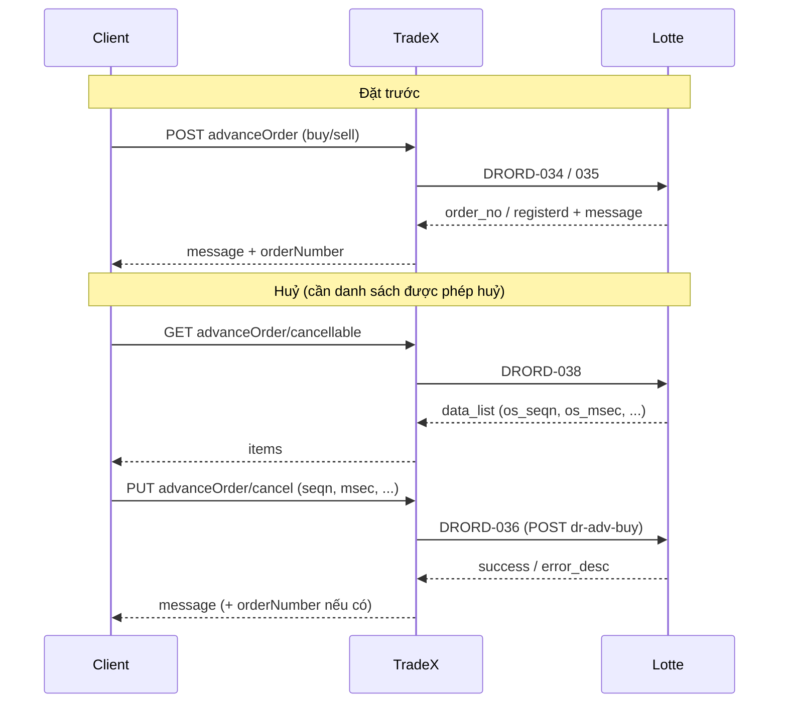

# Advance Order API Specification (Derivatives)

**Document Type:** API Specification  
**Category:** Derivatives Orders — Advance Orders (lệnh đặt trước)  
**Version:** 1.0  
**Date:** March 30, 2026

> **Note:** Lotte-integrated APIs **chỉ Phái sinh**. Nghiệp vụ: đặt / huỷ / tra cứu lệnh **đặt trước** theo **phiên** (ATO, KLLT sáng/chiều, ATC) với **ngày hiệu lực** (`sdate`). **Tham chiếu Lotte:** [Lotte_DR.md](../../../Documentation/[API%20specs]Lotte_DR.md) §2.3.14–2.3.18 — DRORD-034, 035, 036, 037, 038.

---

## 1. Overview

### 1.1 Purpose

**Advance Order (lệnh đặt trước)** khác **Regular Order** ở chỗ lệnh được đăng ký trước cho **phiên giao dịch** và **ngày hiệu lực** theo quy tắc Lotte (`msec`, `jtyp`, `jmgb`, `sdate`), chứ không phải chỉ lệnh “trong ngày” kiểu DRORD-029/030. Client cần luồng: tra cứu lệnh **có thể huỷ** (DRORD-038) để lấy `seqn` / `msec` trước khi gọi huỷ (DRORD-036).

TradeX đề xuất một nhóm endpoint thống nhất dưới resource `advanceOrder`, map sang các DRORD tương ứng (BE có thể gom gateway hiện tại).

### 1.2 API Endpoints (đề xuất TradeX)

| Operation | Method | Endpoint (đề xuất) | Lotte (DR) |
|-----------|--------|--------------------|------------|
| Place Advance Order | POST | `/api/v1/derivatives/advanceOrder` | DRORD-034 (mua), DRORD-035 (bán) |
| Cancel Advance Order | PUT | `/api/v1/derivatives/advanceOrder/cancel` | DRORD-036 |
| History (Advanced orders) | GET | `/api/v1/derivatives/advanceOrder/history` | DRORD-037 |
| List Cancellable | GET | `/api/v1/derivatives/advanceOrder/cancellable` | DRORD-038 |

**DTO / service (đề xuất):**

| Operation | Request | Response | Service method (gợi ý) |
|-----------|---------|----------|------------------------|
| Place | `AdvanceOrderPlaceRequest` | `AdvanceOrderPlaceResponse` | `placeAdvanceOrder` |
| Cancel | `AdvanceOrderCancelRequest` | `AdvanceOrderCancelResponse` | `cancelAdvanceOrder` |
| History | `AdvanceOrderHistoryRequest` | `AdvanceOrderHistoryResponse` | `queryAdvanceOrderHistory` |
| Cancellable | `AdvanceOrderCancellableRequest` | `AdvanceOrderCancellableResponse` | `queryAdvanceOrderCancellable` |

### 1.3 Response Format Standards

Theo quy chuẩn **Lotte-integrated Order APIs** (`@tradex-order-api-response-standards`), Advance Order dùng mutation response: **`message`** (pass-through `error_desc`) + **`orderNumber`** khi Core trả số hiệu lệnh.

**Success (Place / Cancel):**

```json
{
  "message": "[V0350] Lệnh đặt trước đã được hoàn thành",
  "orderNumber": "2026033000001"
}
```

- `orderNumber`: map từ Lotte `order_no` (DRORD-035) hoặc field tương đương; DRORD-034 mẫu tài liệu dùng `registerd` (ghi chú chính tả theo spec nguồn) — BE **chuẩn hoá** sang `orderNumber` nếu Lotte cố định tên field sau UAT.

**Success (History / Cancellable):**

```json
{
  "totalCount": 20,
  "nextKey": "opaque-from-lotte",
  "items": []
}
```

- **GET:** TradeX có thể expose thêm query optional **`fetchCount`** → Lotte `row_count`, **`nextKey`** → `next_key` / `next_data` tùy API (xem TradeX Knowledge — GET optional params).

**Error:** `INVALID_PARAMETER` (400), `ORDER_*_1005` (422) pass-through message Lotte — giống Regular Orders.

**Principles:** HTTP status = chỉ báo thành công; **không** trả `success: true/false` trong body TradeX.

---

## 2. Business Rules

### 2.1 Phiên giao dịch (`msec`)

| Lotte `msec` | Ý nghĩa |
|--------------|---------|
| `1` | ATO |
| `2` | KLLT sáng |
| `3` | KLLT chiều |
| `4` | ATC |

TradeX có thể expose enum có nghĩa, ví dụ `tradingSession`: `ATO` | `MORNING_KLLT` | `AFTERNOON_KLLT` | `ATC` → map số trên.

### 2.2 Loại lệnh và hiệu lực (`jtyp`, `jmgb`)

| `jtyp` (Lotte) | Ý nghĩa |
|----------------|---------|
| `1` | Market (MP) |
| `2` | Limit (LO) |

| `jmgb` (Lotte) | Ý nghĩa |
|----------------|---------|
| `0` | Day |
| `2` | ATO |
| `3` | MAK |
| `4` | MOK |
| `7` | ATC |
| `9` | MTL |

**Ràng buộc (theo Lotte_DR):**

- Nếu **`jtyp` = 2 (Limit)** → **`jmgb` = 0** và **`msec` ∈ {1,2,3,4}**.
- Nếu **`jtyp` = 1 (Market)**:
  - `jmgb` = 2 ↔ `msec` = 1  
  - `jmgb` = 7 ↔ `msec` = 4  
  - `jmgb` ∈ {3,4,9} ↔ `msec` ∈ {2,3}

TradeX nên validate tổ hợp trước khi proxy, hoặc trả lỗi Lotte sau khi gọi Core.

### 2.3 Ngày hiệu lực

- DRORD-034 (mua): `sdate` **bắt buộc**, **yyyymmdd**, phải **trùng ngày làm việc hiện tại** (theo mô tả Lotte_DR).
- DRORD-035 (bán): `sdate` trong bảng Lotte là optional — cần **xác nhận UAT** với Market order; sample tài liệu vẫn có `sdate`.

### 2.4 User id khi gọi Lotte

| API | Field user trên Lotte |
|-----|------------------------|
| DRORD-034 | `hts_user_id` |
| DRORD-035, 036 | `user_id` |

TradeX: derive từ JWT / hệ thống phân quyền; **không** bắt client truyền trùng hai tên khác nhau — BE map một field nội bộ → đúng tên Lotte từng API.

### 2.5 Huỷ (DRORD-036) và path Lotte

Theo Lotte_DR: **cùng URL** `POST .../tuxsvc/der/order/dr-adv-buy` với DRORD-034; phân biệt bằng payload có **`seqn`** (và `msec`, `code`, `acnt_no`, `user_id`). **`seqn`** lấy từ **DRORD-038** (`os_seqn`).

### 2.6 Language Mapping

| Accept-Language | Lotte `lang_code` |
|-----------------|-------------------|
| `vi` | `V` |
| `en` | `E` |
| `ko` | `K` |

---

## 3. Luồng nghiệp vụ (tóm tắt)



---

## 4. API: Place Advance Order

### 4.1 Request (TradeX)

**Endpoint:** `POST /api/v1/derivatives/advanceOrder`

**Body (đề xuất):**

| Field | Type | Required | Description |
|-------|------|----------|-------------|
| `accountNumber` | string | Y | Số TK |
| `symbolCode` | string | Y | Mã HĐ |
| `sellBuyType` | string | Y | `BUY` / `SELL` — route DRORD-034 vs 035 |
| `tradingSession` | string | Y | Map → `msec` (1–4) |
| `orderCategory` | string | Y | `MARKET` / `LIMIT` → `jtyp` 1 / 2 |
| `orderType` | string | Y | Day, ATO, MAK, MOK, ATC, MTL → `jmgb` |
| `orderQuantity` | string/number | Y | → `jqty` |
| `orderPrice` | string/number | N/Y | → `jprc` (LO cần giá; Xác nhận Market) |
| `effectiveDate` | string | Y | yyyymmdd → `sdate` |
| `deviceUniqueId` | string | N | → `cli_mac_addr` (nếu áp dụng như Regular) |

*(Auto-populated: user mapping → `hts_user_id` hoặc `user_id`)*

### 4.2 Request Mapping (TradeX → Lotte)

| TradeX | Lotte (034 Buy) | Lotte (035 Sell) |
|--------|-----------------|------------------|
| `accountNumber` | `acnt_no` | `acnt_no` |
| `symbolCode` | `code` | `code` |
| `tradingSession` | `msec` | `msec` |
| `orderCategory` | `jtyp` | `jtyp` |
| `orderType` | `jmgb` | `jmgb` |
| `orderQuantity` | `jqty` | `jqty` |
| `orderPrice` | `jprc` | `jprc` |
| `effectiveDate` | `sdate` | `sdate` |
| JWT user | `hts_user_id` | `user_id` |
| `deviceUniqueId` | `cli_mac_addr` | `cli_mac_addr` |
| `lang_code` | từ Accept-Language | từ Accept-Language |

**Lotte URL:**

- Buy: `[Root URL APIKEY]/tuxsvc/der/order/dr-adv-buy` (POST)
- Sell: `[Root URL APIKEY]/tuxsvc/der/order/dr-adv-sell` (POST)

### 4.3 Response Mapping

- `error_desc` → `message` (nguyên văn, kèm prefix `[Vxxxx]` nếu có)
- `order_no` hoặc tương đương / `registerd` → `orderNumber`

### 4.4 Error Mapping

| HTTP | `code` | Nguồn |
|------|--------|--------|
| 400 | `INVALID_PARAMETER` | TradeX validation |
| 422 | `ORDER_PLACE_1005` (pattern) | Lotte `error_code` 1005 + pass-through `message` |

---

## 5. API: Cancel Advance Order

### 5.1 Request (TradeX)

**Endpoint:** `PUT /api/v1/derivatives/advanceOrder/cancel`

| Field | Type | Required | Description |
|-------|------|----------|-------------|
| `accountNumber` | string | Y | → `acnt_no` |
| `symbolCode` | string | Y | → `code` |
| `tradingSession` | string | Y | → `msec` (khớp lệnh cần huỷ) |
| `sequenceNumber` | string | Y | → `seqn` (từ DRORD-038 / màn Cancellable) |

*(JWT → `user_id` cho Lotte)*

### 5.2 Request Mapping

| TradeX | Lotte DRORD-036 |
|--------|------------------|
| `accountNumber` | `acnt_no` |
| `symbolCode` | `code` |
| `tradingSession` | `msec` |
| `sequenceNumber` | `seqn` |
| user | `user_id` |

**Lotte:** `POST [Root URL APIKEY]/tuxsvc/der/order/dr-adv-buy` (cùng path DRORD-034 — theo spec Tsolution).

### 5.3 Response

- Pass-through `error_desc` làm `message`; nếu có số hiệu lệnh trong payload Lotte, map `orderNumber` (optional cho cancel).

### 5.4 Error Mapping

- Pattern: `ORDER_CANCEL_1005` hoặc theo convention dự án cho mutation cancel Lotte.

---

## 6. API: Advance Order History

### 6.1 Request (TradeX)

**Endpoint:** `GET /api/v1/derivatives/advanceOrder/history`

**Query (đề xuất):**

| Param | Required | Map Lotte DRORD-037 |
|-------|----------|---------------------|
| `accountNumber` | N | `acnt_no` |
| `symbolCode` | N | `code` (space = all) |
| `fromDate` | Y | `sdate` |
| `toDate` | Y | `edate` |
| `sellBuyFilter` | N | `mdms` 0/1/2 |
| `processingFilter` | N | `sdgb` |
| `matchFilter` | N | `mtch` |
| `validityFilter` | N | `vali` |
| `branchCode` | N | `brcd` |
| `agencyCode` | N | `agcd` |
| `queryType` | N | `qry_tp` Q/N |
| `htsUserId` | N | `hts_user_id` |
| `fetchCount` | N | `row_count` (max 90) |
| `nextKey` | N | `next_key` |

**Ghi chú tích hợp:** Tài liệu Lotte mô tả **GET** kèm body JSON; BE cần xác nhận với Lotte: query string vs body. Sample nguồn có alias `account_no` / `from_dt` / `to_dt` — ưu tiên bảng chính thức `acnt_no`, `sdate`, `edate` khi build client gateway.

### 6.2 Response

- `data_list` items: map các field `os_*` sang tên TradeX có nghĩa (ví dụ `orderDate`, `sequenceNumber`, `matchedQuantity`, `processingStatus`, `rejectReason`, …) — giữ nguyên semantics theo Lotte_DR §2.3.17.
- Pagination: `nextKey` từ item hoặc envelope (theo hành vi thực tế Lotte).

---

## 7. API: Cancellable Advance Order List

### 7.1 Request (TradeX)

**Endpoint:** `GET /api/v1/derivatives/advanceOrder/cancellable`

| Param | Required | Map Lotte DRORD-038 |
|-------|----------|----------------------|
| `accountNumber` | Y | **`account_no`** (Lotte dùng tên này cho API 038) |
| `fromDate` | Y | `from_dt` |
| `toDate` | Y | `to_dt` |
| `symbolCode` | N | `code` |
| `sellBuyFilter` | N | `mdms` |
| `queryType` | N | `qry_tp` |
| `htsUserId` | N | `hts_user_id` |
| `fetchCount` | N | `row_count` |
| `nextKey` | N | `next_key` |

### 7.2 Response

- Mỗi phần tử: ít nhất cần **`os_seqn`** (→ `sequenceNumber` cho cancel), **`os_msec`**, **`os_code`**, khối lượng/giá/trạng thái theo bảng Lotte_DR §2.3.18.

---

## 8. Error Handling Summary

### 8.1 Validation (400)

```json
{
  "code": "INVALID_PARAMETER",
  "params": [
    { "code": "FIELD_IS_REQUIRED", "param": "sequenceNumber" }
  ]
}
```

### 8.2 Business (422)

```json
{
  "code": "ORDER_PLACE_1005",
  "message": "[V3120] Mô tả lỗi từ Lotte"
}
```

### 8.3 Common Lotte codes

- `0000` success (sau khi unwrap, HTTP 200 + body TradeX).
- `1005` failure — pass-through message.

---

## 9. Implementation Notes

1. **Hai tên user (`hts_user_id` vs `user_id`):** BE phải branch theo DR khi gọi Core.
2. **Huỷ dùng path `dr-adv-buy`:** không được route nhầm sang chỉ “mua”; kiểm tra integration test với payload `seqn`.
3. **GET + JSON (037):** làm rõ contract với Lotte trước khi chối FE.
4. **`registerd` vs `order_no`:** chuẩn hoá `orderNumber` ở lớp gateway sau khi ổn định schema response Lotte.
5. **`mdm_tp`:** Nếu Lotte bổ sung cho advance order, áp dụng quy tắc derive từ channel (FE không gửi) như Regular Orders.

---

## 10. Related APIs

| Tài liệu | Mối liên hệ |
|----------|-------------|
| [Regular_Orders_API_Spec.md](./Regular_Orders_API_Spec.md) | So sánh lệnh thường DRORD-029–032 |
| [Order_Availability_Check_API_Spec.md](./Order_Availability_Check_API_Spec.md) | DRORD-028 — khả năng đặt KL (ngữ cảnh khác, không thay Advance) |
| [Lotte_DR.md §2.3.14–18](../../../Documentation/[API%20specs]Lotte_DR.md) | Spec nguồn Lotte |

---

**Document Status:** ✅ Complete (analysis + proposed TradeX contract)  
**For:** BA / BE / FE  
**Next Steps:** Xác nhận với Lotte query/body GET 037; chốt mapping enum `orderType` ↔ `jmgb`; implementation trong `rest-proxy` / `lotte-bridge` (hoặc service tương đương).  
**Estimated Effort:** 1–2 tuần BE + 1 tuần FE (sau khi contract chốt)
