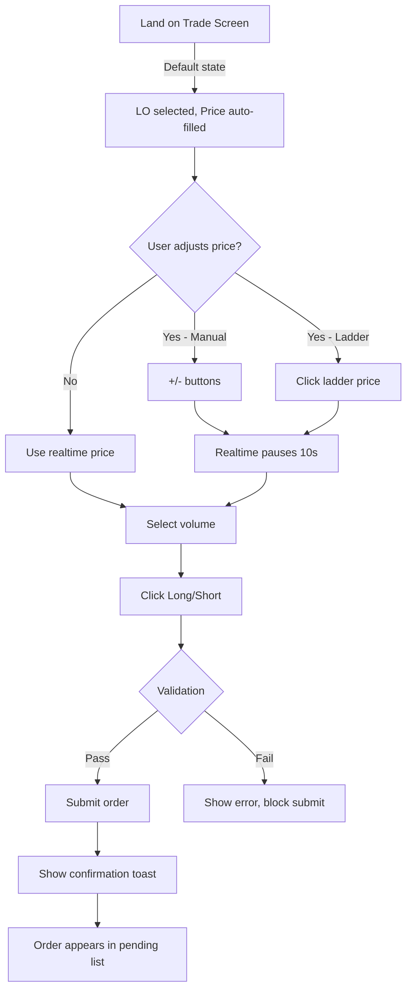
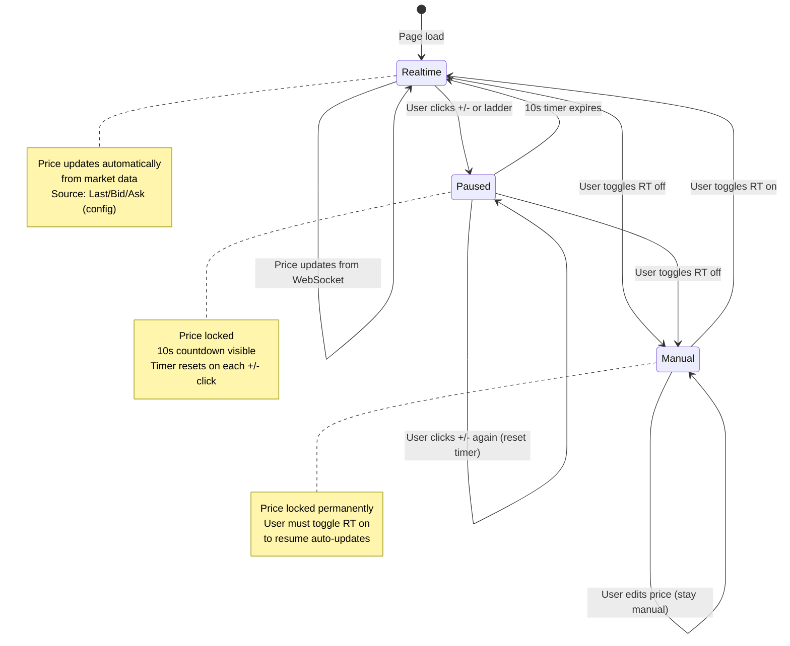
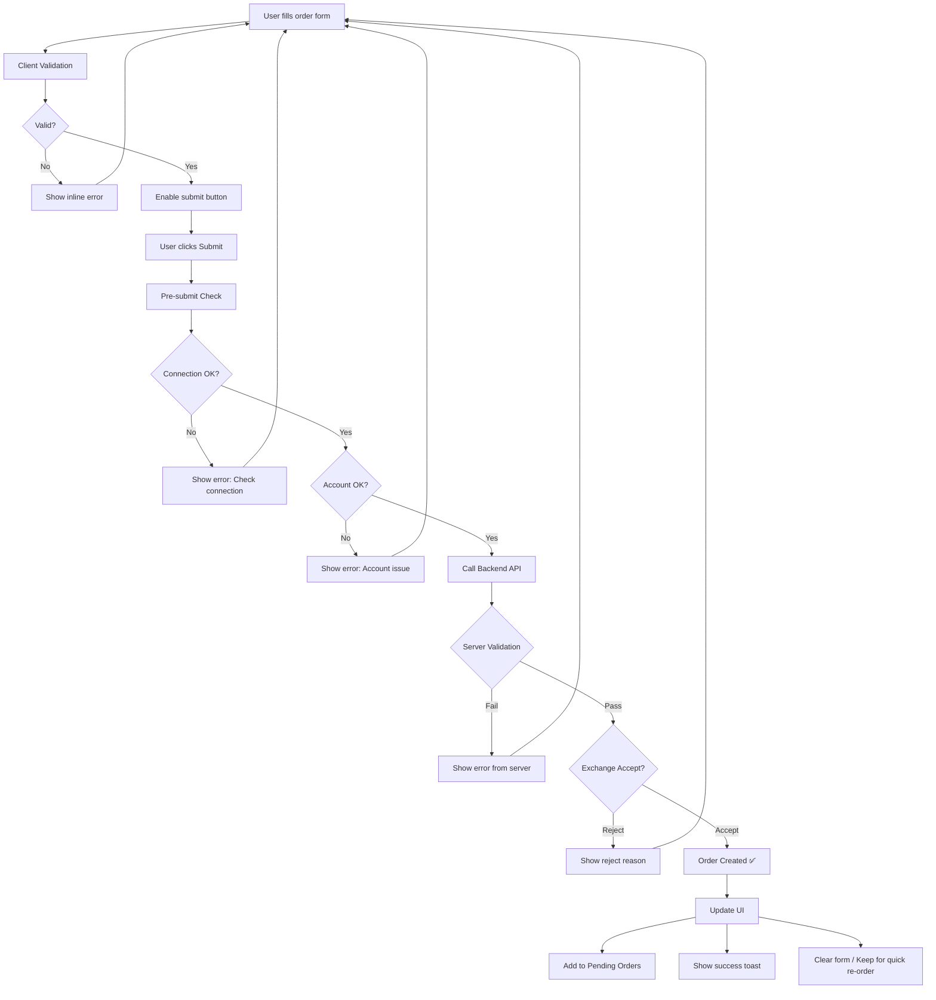
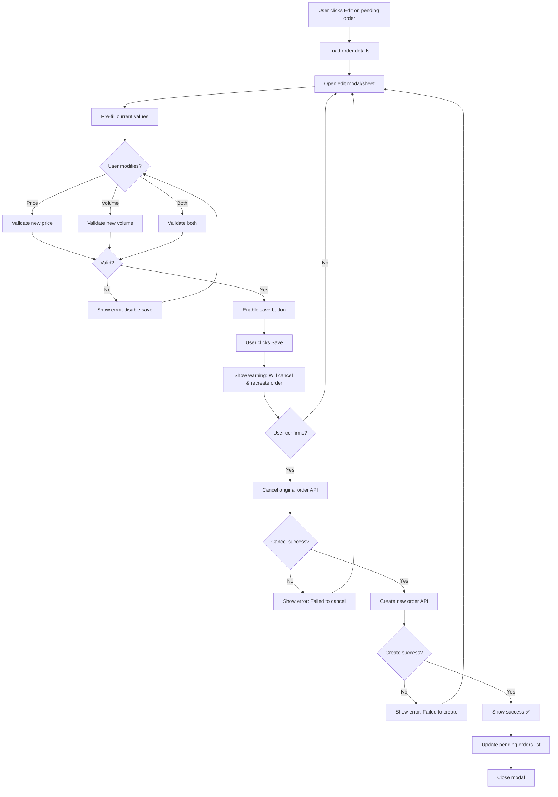
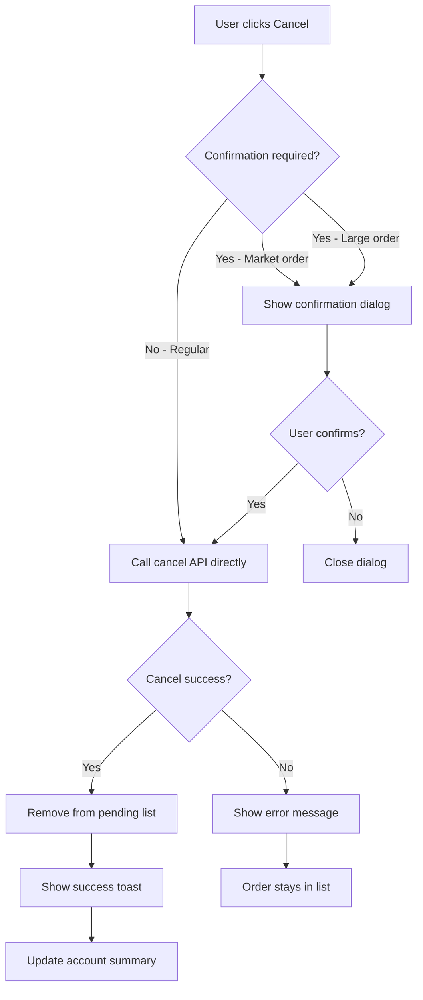

# Information Architecture - Màn hình Trade Phái Sinh
## Trade Screen for Derivatives - Vietnamese Market

## 1. Tổng quan

Màn hình Trade cho phái sinh là màn hình trung tâm cho phép trader thực hiện giao dịch hợp đồng tương lai (VN30F, VN100F). Màn hình cần tối ưu hóa cho **tốc độ thực thi lệnh < 500ms**, hiển thị thông tin realtime với độ trễ < 100ms, và hỗ trợ đầy đủ các loại lệnh theo quy định của HOSE/HNX.

### 1.1 Bối cảnh thị trường Việt Nam

**Đặc thù thị trường:**
- **Phiên giao dịch:** ATO (09:15-09:20), Continuous (09:20-11:30, 13:00-14:30), ATC (14:30-14:45)
- **Tick size:** VN30F = 0.1 điểm, VN100F = 0.1 điểm
- **Hợp đồng phổ biến:** VN30F1M, VN30F2M, VN30F3M, VN100F1M
- **Giới hạn biến động:** ±7% so với giá tham chiếu (RE)
- **Margin requirement:** 10% giá trị hợp đồng (có thể thay đổi)

**User behavior insights:**
- Traders thường mở nhiều lệnh đồng thời (scalping)
- Cần theo dõi BASIS (chênh lệch F/Index) liên tục
- Thường xuyên sửa/hủy lệnh trong vòng vài giây
- Ưu tiên tốc độ hơn độ đẹp UI

---

## 2. Phân tích & Validation Requirements

### 2.1 Requirements Mapping (từ Brief)

| Requirement từ Brief | Component/Feature | Priority | Notes |
|---------------------|-------------------|----------|-------|
| **Thông tin mã** | Contract Header | P0 | Tên hợp đồng, CE/FL/RE, Volume, BASIS |
| **Candle chart** | Chart Component | P1 | TradingView hoặc custom chart |
| **Sức mua/bán** | Depth Chart/Ladder | P1 | Bid/Ask volume & pressure |
| **Lãi/lỗ đã thực hiện** | Account Summary | P0 | Realized P&L (đã chốt) |
| **Lãi/lỗ chưa thực hiện** | Account Summary | P0 | Unrealized P&L (floating) |
| **Vị thế đang mở** | Position Display | P0 | Net position (Long/Short) |
| **Lệnh thường** | Order Entry Panel | P0 | 6 loại lệnh, 1-click selection |
| **Giá realtime** | Price Input | P0 | Auto-fill + 10s pause mechanism |
| **Lệnh đặt trước** | Conditional Orders | P1 | Advance order by session |
| **Stop order** | Conditional Orders | P1 | Stop loss/take profit |
| **Lệnh chờ khớp** | Order Management | P0 | List với Hủy/Sửa actions |

### 2.2 Thông tin đã xác định ✅ (Domain Context)

**CE/FL/RE - Xác nhận:**
- **CE (Ceiling)** = Giá trần = RE + 7%
- **FL (Floor)** = Giá sàn = RE - 7%  
- **RE (Reference)** = Giá tham chiếu (giá đóng cửa phiên trước hoặc giá mở cửa đầu phiên)

**Chênh lệch VN30/VN100 (BASIS):**
- Formula: `BASIS = Giá F - Index`
- Hiển thị cả giá trị tuyệt đối và %: `+5.2 (+0.43%)`
- **Quan trọng:** BASIS dương/âm ảnh hưởng đến chiến lược arbitrage
- VN30F tracking VN30-Index, VN100F tracking VN100-Index

**Sức mua/bán:**
- **Bid Ladder:** 5 mức giá mua tốt nhất + volume
- **Ask Ladder:** 5 mức giá bán tốt nhất + volume  
- **Pressure Indicator:** Tỷ lệ Bid/Ask volume hiển thị bằng progress bar
- **Real-time:** Update mỗi 500ms (market data throttling)

**Long/Short Terminology:**
- ✅ **Sử dụng Long/Short** (chuẩn derivatives)
- Long = Mua kỳ vọng giá tăng
- Short = Bán kỳ vọng giá giảm
- Icon: Long ▲ (xanh), Short ▼ (đỏ)

### 2.3 Thông tin cần làm rõ với Business ⚠️

> [!WARNING]
> **Các điểm cần xác nhận với Product Owner/Trading Team:**

1. **Realtime Price Selection - UX Flow:**
   - **Q:** Nguồn giá auto-fill - Last Price hay Mid Price (Bid+Ask)/2?
   - **Q:** Khi tap vào ô giá → fill ngay hay đợi user confirm?
   - **Đề xuất:** Last Price cho LO, Mid Price cho market orders
   
2. **10-Second Pause Mechanism:**
   - **Q:** Có countdown visible hay chỉ pause background?
   - **Q:** User có thể tắt auto-resume hay không?
   - **Đề xuất:** Hiển thị "Manual ⏱ 8s" với icon toggle RT on/off

3. **Order Confirmation:**
   - **Q:** Có cần confirmation dialog hay submit trực tiếp?
   - **Risk:** Derivatives có rủi ro cao, nhưng confirmation làm chậm execution
   - **Đề xuất:** 
     - LO/MTL: No confirmation (can modify/cancel)
     - MAK/MOK: Required confirmation (market order rủi ro cao)

4. **Pending Orders - Edit Scope:**
   - **Q:** Cho phép sửa những field nào? Price only? Volume? Order type?
   - **Technical:** HOSE/HNX có thể không cho phép modify order type
   - **Đề xuất:** Chỉ cho phép sửa Price & Volume (giữ nguyên order type)

5. **Stop Order Implementation:**
   - **Q:** Stop order có được exchange support hay là local stop?
   - **Important:** Nếu local stop → cần persistent service (không mất khi refresh)
   - **Q:** Stop Market vs Stop Limit - cần cả 2?

6. **Multi-Contract Support:**
   - **Q:** User có mở nhiều contract cùng lúc không (VN30F + VN100F)?
   - **Q:** Cần switch nhanh hay mở multiple tabs?
   - **Đề xuất:** Watchlist dropdown + favorite contracts

7. **Mobile Priority:**
   - **Q:** Desktop-first hay mobile-first?
   - **Observation:** Traders VN chủ yếu dùng desktop khi trade derivatives
   - **Đề xuất:** Desktop-first, mobile cho monitoring + emergency actions

8. **Chart Integration:**
   - **Q:** TradingView (paid) vs Custom Chart (free)?
   - **Q:** Indicators required: MA, Volume, RSI, MACD?
   - **Đề xuất:** Phase 1 - Basic candles + Volume, Phase 2 - Add indicators

---

## 3. Information Architecture

### 3.1 Cấu trúc phân cấp thông tin (Optimized for Trading Flow)

```
Màn hình Trade Phái Sinh
│
├── [Zone 1] Contract Header (Always Visible - Sticky)
│   ├── Symbol Selector (Dropdown: VN30F2401, VN30F2402, VN100F...)
│   ├── Giá hiện tại + CE/FL/RE (Color coded)
│   ├── Volume phiên (Format: 5.2K, 15.3M)
│   ├── BASIS (Chênh lệch F/Index) → +5.2 (+0.43%) ▲
│   └── Session Indicator (ATO/Continuous/ATC + Countdown)
│
├── [Zone 2] Account Summary (Collapsible trên Mobile)
│   ├── P&L Realized (Đã chốt) → +2,500,000 ₫
│   ├── P&L Unrealized (Floating) → -500,000 ₫ (red, live update)
│   ├── Net Position → Long 10 lots @ 1,195 (avg price)
│   ├── Margin Used / Available
│   └── Quick Stats (Win rate, số lệnh hôm nay)
│
├── [Zone 3] Market Data - Split View
│   │
│   ├── [3A] Bid/Ask Ladder (Always visible)
│   │   ├── Ask Ladder (5 levels) - Red
│   │   │   ├── 1,205 | Vol: 150 | Orders: 25
│   │   │   ├── 1,204 | Vol: 200 | Orders: 30
│   │   │   ├── 1,203 | Vol: 180 | Orders: 28
│   │   │   └── ...
│   │   │
│   │   ├── Spread Indicator → 0.1 (1 tick)
│   │   │
│   │   └── Bid Ladder (5 levels) - Green
│   │       ├── 1,202 | Vol: 220 | Orders: 35
│   │       ├── 1,201 | Vol: 190 | Orders: 32
│   │       └── ...
│   │
│   └── [3B] Chart Area (Resizable)
│       ├── Candlestick Chart (1M/5M/15M/1H/4H/1D)
│       ├── Volume bars (bottom)
│       ├── Overlay: MA(20), MA(50) - Optional
│       └── Click on ladder price → highlight on chart
│
├── [Zone 4] Order Entry Panel ⚡ (CRITICAL - Always Accessible)
│   │
│   ├── Tab Navigation (Horizontal Tabs)
│   │   ├── 📋 Lệnh thường (Active by default)
│   │   ├── ⏰ Lệnh đặt trước
│   │   └── 🛑 Stop Order
│   │
│   ├── [Tab 1] Lệnh thường
│   │   ├── Order Type Selector (Segmented Control - 1 click)
│   │   │   └── [ATO] [ATC] [LO] [MTL] [MAK] [MOK]
│   │   │       ↑ Active state: filled bg + bold
│   │   │
│   │   ├── Price Input (Smart Input)
│   │   │   ├── [-] [1,200.0] [+] [🔄 RT]
│   │   │   │    ↑ tick   ↑ value  ↑ tick  ↑ realtime toggle
│   │   │   ├── Manual mode: ⏱ 8s (countdown)
│   │   │   └── Quick fills: [Bid] [Mid] [Ask] [Last]
│   │   │
│   │   ├── Volume Input
│   │   │   ├── [1] [5] [10] [20] [Custom: ___]
│   │   │   └── Max available: 50 lots
│   │   │
│   │   ├── Estimated Value & Margin
│   │   │   ├── Value: 12,000,000 ₫
│   │   │   └── Margin: 1,200,000 ₫
│   │   │
│   │   └── Action Buttons (Large, Clear)
│   │       ├── [LONG ▲] (Green, left 50%)
│   │       └── [SHORT ▼] (Red, right 50%)
│   │
│   ├── [Tab 2] Lệnh đặt trước (Advance Order)
│   │   ├── Session Selection
│   │   │   └── [○ ATO] [○ ATC] [● Continuous]
│   │   ├── Giá đặt (with validation)
│   │   │   └── Input + Session-specific rules
│   │   ├── Ngày đặt (Date picker)
│   │   │   └── Default: T+0 (hôm nay)
│   │   ├── KL đặt (Volume)
│   │   └── [Đặt lệnh] button
│   │
│   └── [Tab 3] Stop Order
│       ├── Stop Type
│       │   └── [● Stop Loss] [○ Take Profit]
│       ├── Session (when to execute)
│       ├── Stop Price (trigger price)
│       │   └── Validation: > Current (TP) or < Current (SL)
│       ├── Limit Price (optional - for Stop Limit)
│       ├── Ngày hết hạn
│       ├── Volume
│       └── [Đặt Stop Order] button
│
└── [Zone 5] Order Management
    │
    ├── Tabs: [Chờ khớp] [Đã khớp hôm nay] [Lịch sử]
    │
    └── [Active Tab: Chờ khớp] - Real-time List
        ├── Filter Bar
        │   ├── Symbol: [All ▾]
        │   ├── Side: [All ▾] [Long] [Short]
        │   └── Type: [All ▾] [LO] [MAK]...
        │
        └── Order List (Table - Desktop, Cards - Mobile)
            ├── Order #123456 | 09:35:12
            │   ├── VN30F2401 | Long ▲ | LO
            │   ├── Price: 1,200 | Vol: 10 (Đã đặt)
            │   ├── Matched: 3 | Pending: 7
            │   ├── Actions: [✏️ Sửa] [❌ Hủy]
            │   └── Status: ⏳ Chờ khớp (70% pending)
            │
            └── [Load more...] (Infinite scroll)
```

### 3.2 Nguyên tắc phân tầng (Z-Index Hierarchy)

| Layer | Component | Reasoning |
|-------|-----------|-----------|
| **L5** | Confirmation Dialogs | Modal overlays |
| **L4** | Order Entry (pinned) | Sticky access for quick trading |
| **L3** | Contract Header (sticky) | Always visible context |
| **L2** | Pending Orders Alert | Toast notifications cho fill/cancel |
| **L1** | Chart + Ladder | Main content area |

### 3.3 Mức độ ưu tiên & Loading Strategy

| Priority | Component | Load Strategy | Reason |
|----------|-----------|---------------|--------|
| **P0** | Bid/Ask Ladder + Last Price | SSR + WebSocket | Critical for trading decision |
| **P0** | Order Entry Panel | SSR | Must be interactive immediately |
| **P0** | Pending Orders | API + WebSocket | User needs to see active orders |
| **P1** | Account Summary | API (cache 30s) | Important but not real-time critical |
| **P1** | Chart | Lazy load (IntersectionObserver) | Large data, defer to after P0 |
| **P2** | Order History | On-demand (tab click) | Not needed for active trading |

## 4. Thiết kế Layout - Desktop First (Optimized for Professional Traders)

### 4.1 Desktop Layout - 3 Column Grid (1920x1080 baseline)

```
┌─────────────────────────────────────────────────────────────────────────────────┐
│ [HEADER - Sticky] VN30F2401 ▼ | 1,200.5 (+5.0) | CE: 1,250 FL: 1,150 RE: 1,200  │
│ Vol: 15.2M | BASIS: +5.2 (+0.43%) ▲ | 🔴 ATC 14:40:25                            │
├───────────────┬─────────────────────────────────┬───────────────────────────────┤
│ [LEFT PANEL]  │ [CENTER - Chart Area]           │ [RIGHT PANEL - Order Entry]   │
│ 240px         │ Flexible (grow)                 │ 380px (fixed)                 │
│               │                                 │                               │
│ [Bid/Ask]     │  ┌─────────────────────────┐   │ [Account Summary]             │
│               │  │  Candlestick Chart      │   │ ┌───────────────────────────┐ │
│ ASK (Red)     │  │                         │   │ │ P&L Real: +2.5M 🟢        │ │
│ 1,205│  150   │  │      [Chart Controls]   │   │ │ P&L Unreal: -500K 🔴      │ │
│ 1,204│  200   │  │      1M 5M 15M 1H 1D    │   │ │ Position: Long 10@1,195   │ │
│ 1,203│  180   │  │                         │   │ │ Margin: 1.2M/5M (24%)     │ │
│ ─────────────  │  │                         │   │ └───────────────────────────┘ │
│ Spread: 0.1   │  │                         │   │                               │
│ ─────────────  │  │                         │   │ [Tabs: Order Entry]           │
│ BID (Green)   │  │                         │   │ ┌──────┬────────┬─────────┐   │
│ 1,202│  220   │  │                         │   │ │Thường│Đặt trước│Stop    │   │
│ 1,201│  190   │  │                         │   │ └──────┴────────┴─────────┘   │
│ 1,200│  250   │  │                         │   │                               │
│               │  │                         │   │ Order Type (Segmented)        │
│ [Pressure]    │  │                         │   │ ┌───┬───┬───┬───┬───┬───┐    │
│ 🟢▓▓▓▓▓▓░░ 60%│  │                         │   │ │ATO│ATC│LO │MTL│MAK│MOK│    │
│ Bid dominant  │  │                         │   │ └───┴───┴───┴───┴───┴───┘    │
│               │  │                         │   │                               │
│ [Quick Stats] │  └─────────────────────────┘   │ Price (Smart Input)           │
│ Today's Range │  Volume Bar Chart              │ ┌─────────────────────────┐   │
│ H: 1,208      │  ▃▅▇▆▅▃▂                       │ │[-] 1,200.5 [+] [🔄RT] │   │
│ L: 1,192      │                                │ └─────────────────────────┘   │
│               │                                │ [Bid] [Mid] [Ask] [Last]      │
├───────────────┴─────────────────────────────────┤                               │
│ [BOTTOM - Order Management] Full Width          │ Volume                        │
│ ┌────────────────────────────────────────────┐ │ ┌───┬───┬────┬────┬─────┐    │
│ │ [Chờ khớp: 3] [Đã khớp: 12] [Lịch sử]     │ │ │ 1 │ 5 │ 10 │ 20 │ ___ │    │
│ ├────────────────────────────────────────────┤ │ └───┴───┴────┴────┴─────┘    │
│ │ #123456│VN30F│Long▲│LO 1,200│10│3/7│[✏️][❌]│ │ Max: 50 lots                  │
│ │ 09:35:12│Pending 70% ▓▓▓▓▓▓▓░░░           │ │                               │
│ │─────────────────────────────────────────────│ │ Est. Value: 12,000,000 ₫     │
│ │ #123455│VN30F│Short▼│MAK│10│10/0│ Filled  │ │ Margin: 1,200,000 ₫           │
│ └────────────────────────────────────────────┘ │                               │
│ [Load more orders...]                          │ ┌─────────────────────────┐   │
└────────────────────────────────────────────────┤ │ LONG ▲ │ SHORT ▼         │   │
                                                  │ │  🟢    │   🔴            │   │
                                                  │ └─────────────────────────┘   │
                                                  └───────────────────────────────┘
```

**Key measurements:**
- **Left panel (Ladder):** 240px - Enough for price + volume
- **Right panel (Order Entry):** 380px - Form inputs + buttons
- **Center:** Flexible - Chart expands to fill available space
- **Bottom panel:** 180-220px height - 3-5 orders visible
- **Header:** 60px height - Sticky on scroll

### 4.2 Mobile Layout - Vertical Stack + Bottom Sheet (375x812 baseline)

```
┌─────────────────────────┐
│ [Header - Compact]      │
│ VN30F2401 ▼             │
│ 1,200.5 (+5.0) 🟢       │
│ BASIS: +5.2 (+0.43%)▲   │
│ Vol: 15M | ATC 14:40:25 │
├─────────────────────────┤
│                         │
│   [Mini Chart - 40%]    │
│   Candlestick view      │
│   Tap to expand fullscreen
│                         │
├─────────────────────────┤
│ P&L: +2M | Pos: L10     │ ← Swipe up for details
├─────────────────────────┤
│                         │
│ [Bid/Ask Compact]       │
│ 1,205  150  │  180 1,206│
│ 1,204  200  │  150 1,207│
│ ── 1,203.5 (Last) ──    │
│ 1,202  220  │  200 1,200│
│ 1,201  190  │  170 1,199│
│                         │
├─────────────────────────┤
│ [Order Entry - Sticky]  │ ← Always accessible
│ ┌──────┬────────┬─────┐ │
│ │Thường│Đặt trước│Stop│ │
│ └──────┴────────┴─────┘ │
│ [ATO][ATC][LO][MAK]...  │
│ ┌─────────────────────┐ │
│ │[-] 1,200.5 [+] [RT]│ │
│ └─────────────────────┘ │
│ Vol: [1][5][10][__]     │
│ ┌──────────┬──────────┐ │
│ │ LONG ▲   │ SHORT ▼  │ │
│ │   🟢     │   🔴     │ │
│ └──────────┴──────────┘ │
├─────────────────────────┤
│ [Pending Orders - Tab]  │
│ ▼ VN30F L 1,200 │ 3/7   │ ← Swipe: ✏️Edit / ❌Cancel
│ ▼ VN30F S 1,205 │ 10/0  │
│ [View all orders]       │
└─────────────────────────┘
       │
       ▼ (Swipe up)
┌─────────────────────────┐
│ [Bottom Sheet - Full]   │
│ Order Management        │
│                         │
│ [Filters: All ▾]        │
│                         │
│ ┌─────────────────────┐ │
│ │ #123456 | 09:35:12  │ │
│ │ VN30F Long▲ LO 1,200│ │
│ │ Vol: 10 | 3/7       │ │
│ │ [Edit] [Cancel]     │ │
│ └─────────────────────┘ │
│ ...more orders          │
│                         │
│ [━━━━━ Pull to close]   │
└─────────────────────────┘
```

**Mobile-specific patterns:**
- **Bottom Sheet** for order management (iOS/Android native feel)
- **Swipe gestures:** Left = Cancel, Right = Edit
- **Collapsible sections:** Chart, Account summary
- **Sticky order entry:** Always within thumb reach
- **Tap zones:** Min 44x44px for touch targets

### 4.3 Tablet Layout - Hybrid (1024x768)

```
┌───────────────────────────────────────────────┐
│ [Header - Full]                               │
├─────────────────────────┬─────────────────────┤
│ [Ladder + Chart]        │ [Order Entry]       │
│ Side-by-side 60/40      │ Fixed 340px         │
│                         │                     │
│ [Ladder] │ [Chart]      │ Full panel visible  │
│  120px   │  Flex        │                     │
│                         │                     │
│                         │                     │
├─────────────────────────┴─────────────────────┤
│ [Pending Orders - Bottom Drawer]              │
│ Pull up to expand                             │
└───────────────────────────────────────────────┘
```

## 5. UX/UI Design Specifications (Production-Ready)

### 5.1 Order Type Selection - Segmented Control Design

> [!TIP]
> **Thiết kế: iOS-style Segmented Control với Visual States**

**Desktop Implementation:**
```
┌─────────────────────────────────────────────────────────┐
│  Order Type                                             │
│  ┌─────┬─────┬─────┬─────┬─────┬─────┐                │
│  │ ATO │ ATC │ LO  │ MTL │ MAK │ MOK │                │
│  └─────┴─────┴─────┴─────┴─────┴─────┘                │
└─────────────────────────────────────────────────────────┘

States:
- Default: #F5F5F5 bg, #666 text
- Hover: #E0E0E0 bg, #333 text  
- Active: #1976D2 bg, #FFF text, bold
- Disabled: #FAFAFA bg, #CCC text, cursor: not-allowed
```

**Mobile Implementation (Horizontal scroll if needed):**
```
┌──────────────────────────────────────┐
│ [ATO] [ATC] [LO] [MTL] [MAK] [MOK] → │
│  ↑ Scroll horizontally if overflow   │
└──────────────────────────────────────┘
```

**Behavior:**
- Single selection (radio button pattern)
- Keyboard navigation: Arrow keys + Enter
- Tooltip on hover: "ATO: At The Open - Khớp giá mở cửa"
- Auto-disable ATO outside opening session
- Visual feedback: 150ms transition

### 5.2 Realtime Price Selection - Advanced Input Component

> [!IMPORTANT]
> **Cơ chế "Smart Price Input" với Auto-pause**

**Component Design:**
```
┌─────────────────────────────────────────┐
│ Giá đặt lệnh                           │
│ ┌─────────────────────────────────────┐│
│ │  [−]  1,200.5  [+]  [🔄]  [⋮]     ││
│ │   ↑     ↑       ↑    ↑     ↑      ││
│ │  -0.1  Value   +0.1  RT   More    ││
│ └─────────────────────────────────────┘│
│ 🟢 Realtime ON                          │ ← Status indicator
│                                         │
│ Quick fills: [Bid] [Mid] [Ask] [Last]  │
└─────────────────────────────────────────┘
```

**State Machine:**
```typescript
type PriceMode = 'REALTIME' | 'MANUAL' | 'PAUSED';

interface PriceState {
  mode: PriceMode;
  value: number;
  source: 'BID' | 'ASK' | 'LAST' | 'MID';
  pauseTimer: number; // seconds remaining
}

// Flow:
1. Initial: mode = REALTIME, auto-fill from Last Price
2. User clicks +/- → mode = PAUSED, start 10s timer
3. Timer expires → mode = REALTIME
4. User clicks RT button → toggle REALTIME/MANUAL
```

**Visual Feedback:**
```
Realtime Mode:
┌─────────────────────────────────────┐
│ [−]  1,200.5  [+]  [🔄]           │
│ 🟢 Realtime | Auto-updating         │
└─────────────────────────────────────┘

Paused Mode (after +/- click):
┌─────────────────────────────────────┐
│ [−]  1,201.0  [+]  [🔄]           │
│ ⏱️  Manual (8s) | Resume in 8s      │
└─────────────────────────────────────┘

Manual Mode (RT toggle OFF):
┌─────────────────────────────────────┐
│ [−]  1,201.5  [+]  [🔄]           │
│ 🔴 Manual | Tap RT to resume        │
└─────────────────────────────────────┘
```

**Quick Fill Buttons:**
- **Bid:** Fill best bid price (good for Long orders)
- **Ask:** Fill best ask price (good for Short orders)
- **Mid:** (Bid + Ask) / 2
- **Last:** Last traded price
- One-click to fill, updates immediately

### 5.3 Price Validation - Real-time Feedback System

**Validation Rules (VN30F example):**
```typescript
interface ValidationRule {
  orderType: OrderType;
  priceRequired: boolean;
  priceRange?: [number, number]; // [min, max]
  sessionRestriction?: 'ATO' | 'ATC' | 'CONTINUOUS' | null;
  tickSize: number;
}

const rules: Record<OrderType, ValidationRule> = {
  ATO: {
    orderType: 'ATO',
    priceRequired: false,
    sessionRestriction: 'ATO', // 09:15-09:20 only
    tickSize: 0.1
  },
  ATC: {
    orderType: 'ATC',
    priceRequired: false,
    sessionRestriction: 'ATC', // 14:30-14:45 only
    tickSize: 0.1
  },
  LO: {
    orderType: 'LO',
    priceRequired: true,
    priceRange: [FL, CE], // Must be within floor-ceiling
    tickSize: 0.1
  },
  MAK: {
    orderType: 'MAK',
    priceRequired: false, // Market price
    tickSize: 0.1
  },
  // ... MTL, MOK
};
```

**Visual States:**
```
✅ Valid Price (within range):
┌─────────────────────────────┐
│ [−]  1,200.0  [+]  [🔄]   │ ← Green border
│ ✅ Giá hợp lệ                │
└─────────────────────────────┘

⚠️  Warning (near limit):
┌─────────────────────────────┐
│ [−]  1,248.0  [+]  [🔄]   │ ← Yellow border
│ ⚠️  Gần giá trần (CE: 1,250) │
└─────────────────────────────┘

❌ Invalid Price (out of range):
┌─────────────────────────────┐
│ [−]  1,255.0  [+]  [🔄]   │ ← Red border
│ ❌ Vượt giá trần (CE: 1,250) │
└─────────────────────────────┘
[Submit button DISABLED]

⚠️  Session Error:
┌─────────────────────────────┐
│ Order Type: [ATO] (selected)│
│ ❌ Không thể đặt lệnh ATO    │
│    ngoài phiên mở cửa       │
│    (09:15-09:20)            │
└─────────────────────────────┘
```

**Validation Timing:**
- On input change: Debounced 300ms
- On submit: Immediate blocking validation
- On session change: Real-time (every 1s)

### 5.4 Pending Orders Management - Action Patterns

**Desktop: Hover Actions**
```
┌──────────────────────────────────────────────────────┐
│ Order #123456 | 09:35:12                             │
│ VN30F2401 | Long ▲ | LO 1,200.0 | Vol: 10           │
│ Matched: 3 | Pending: 7 | ⏳ 70%                    │
│                                [Edit ✏️] [Cancel ❌] │ ← Hover to show
└──────────────────────────────────────────────────────┘

On Hover: Show actions + highlight row (#F5F5F5 bg)
```

**Mobile: Swipe Actions (iOS/Android pattern)**
```
Default state:
┌─────────────────────────────┐
│ VN30F Long▲ LO 1,200        │
│ 3/7 matched | 09:35:12      │
└─────────────────────────────┘

← Swipe left (Delete):
┌─────────────────────────────┐
│ VN30F Long▲ LO 1,200  [🗑️] │ ← Red bg
└─────────────────────────────┘

Swipe right → (Edit):
┌─────────────────────────────┐
│ [✏️] VN30F Long▲ LO 1,200   │ ← Blue bg
└─────────────────────────────┘
```

**Edit Order - Modal Dialog:**
```
┌─────────────────────────────────────┐
│ Sửa lệnh #123456                    │
├─────────────────────────────────────┤
│ Symbol: VN30F2401 (read-only)       │
│ Side: Long ▲ (read-only)            │
│ Type: LO (read-only)                │
│                                     │
│ New Price: [1,200.0] → [1,201.0]   │
│            (can edit)               │
│                                     │
│ New Volume: [10] → [15]             │
│             (can edit)              │
│                                     │
│ ⚠️  Warning: Editing will cancel    │
│    existing order and create new    │
│                                     │
│ [Cancel]           [Confirm Edit]   │
└─────────────────────────────────────┘
```

**Cancel Confirmation:**
```
┌─────────────────────────────────────┐
│ ⚠️  Xác nhận hủy lệnh?              │
├─────────────────────────────────────┤
│ Order #123456                       │
│ VN30F2401 Long ▲ LO 1,200.0        │
│ Volume: 10 | Pending: 7             │
│                                     │
│ ❌ Hành động này không thể hoàn tác │
│                                     │
│ [Đóng]          [Xác nhận hủy]      │
└─────────────────────────────────────┘
```

### 5.5 Color System - Professional Trading Theme

**Primary Colors:**
| Element | Color | Hex | Usage |
|---------|-------|-----|-------|
| **Long/Buy** | Green | `#00C853` | Buttons, text, borders |
| **Short/Sell** | Red | `#FF1744` | Buttons, text, borders |
| **Ceiling (CE)** | Purple | `#9C27B0` | Price indicators |
| **Floor (FL)** | Blue | `#2196F3` | Price indicators |
| **Reference (RE)** | Amber | `#FFA726` | Reference line |
| **Profit** | Green | `#00C853` | Positive P&L |
| **Loss** | Red | `#FF1744` | Negative P&L |
| **Neutral** | Gray | `#757575` | Unchanged values |

**Status Colors:**
| Status | Color | Hex | Indicator |
|--------|-------|-----|-----------|
| Pending | Blue | `#2196F3` | ⏳ |
| Partial Fill | Orange | `#FF9800` | ⚡ |
| Filled | Green | `#4CAF50` | ✅ |
| Cancelled | Gray | `#9E9E9E` | ❌ |
| Rejected | Red | `#F44336` | 🚫 |

**Background System:**
```css
--bg-primary: #FFFFFF;
--bg-secondary: #F5F5F5;
--bg-elevated: #FAFAFA;
--bg-danger: #FFEBEE;
--bg-success: #E8F5E9;
--bg-warning: #FFF3E0;

/* Dark Mode (Optional) */
--bg-primary-dark: #121212;
--bg-secondary-dark: #1E1E1E;
--bg-elevated-dark: #2C2C2C;
```

**Typography:**
```css
--font-family-primary: 'Inter', -apple-system, sans-serif;
--font-family-mono: 'JetBrains Mono', 'Consolas', monospace;

/* Sizes */
--text-xs: 11px;  /* Timestamps, labels */
--text-sm: 13px;  /* Secondary info */
--text-base: 15px; /* Body text */
--text-lg: 18px;   /* Prices */
--text-xl: 24px;   /* Main price display */
--text-2xl: 32px;  /* Hero numbers */

/* Weights */
--font-normal: 400;
--font-medium: 500;
--font-semibold: 600;
--font-bold: 700;
```

### 5.6 Accessibility Enhancements

**Không dựa chỉ vào màu sắc:**
```
Long order:
┌─────────────────────────┐
│ ▲ Long  🟢              │ ← Icon + Color + Text
└─────────────────────────┘

Short order:
┌─────────────────────────┐
│ ▼ Short 🔴              │ ← Icon + Color + Text
└─────────────────────────┘
```

**Keyboard Navigation:**
- Tab: Move between inputs
- Enter: Submit order (with focus on button)
- Esc: Cancel/Close dialogs
- Arrow Up/Down: Adjust price (when focused on price input)
- Ctrl/Cmd + H: Quick help overlay

**Screen Reader Support:**
```html
<button aria-label="Place Long order for VN30F at 1,200 with volume 10 lots">
  Long ▲
</button>

<div role="status" aria-live="polite" aria-atomic="true">
  Order #123456 filled. 10 lots at 1,200.5
</div>
```

**High Contrast Mode:**
- Border widths: 2px → 3px
- Font weights: +100
- Remove subtle shadows
- Increase color contrast ratio to 7:1 (AAA)

## 6. Component Specifications (Technical Implementation)

### 6.1 Header - Contract Info Component

**Data Interface:**
```typescript
interface ContractHeader {
  // Basic Info
  symbol: string;              // "VN30F2401"
  contractMonth: string;        // "2401" → Jan 2024
  underlyingIndex: 'VN30' | 'VN100';
  
  // Price Data
  lastPrice: number;
  priceChange: number;          // Absolute change
  priceChangePercent: number;   // Percentage change
  ceilingPrice: number;         // CE - Giá trần
  floorPrice: number;           // FL - Giá sàn
  referencePrice: number;       // RE - Giá tham chiếu
  
  // Volume & Basis
  totalVolume: number;          // Session volume
  totalValue: number;           // Session value in VND
  basis: number;                // F price - Index price
  basisPercent: number;         // (F - Index) / Index * 100
  
  // Session Info
  session: 'PRE_OPEN' | 'ATO' | 'CONTINUOUS' | 'ATC' | 'CLOSED';
  sessionTimeRemaining: number; // Seconds
  
  // Open Interest (optional)
  openInterest?: number;        // Total open contracts
  
  // Update timestamp
  lastUpdate: Date;
}
```

**Display Logic:**
```typescript
const formatHeaderDisplay = (data: ContractHeader) => {
  return {
    title: `${data.symbol} - ${data.underlyingIndex}`,
    price: {
      value: formatPrice(data.lastPrice),
      change: formatChange(data.priceChange),
      changePercent: formatPercent(data.priceChangePercent),
      color: data.priceChange > 0 ? 'green' : 
             data.priceChange < 0 ? 'red' : 'neutral'
    },
    priceRange: `CE ${formatPrice(data.ceilingPrice)} | ` +
                `FL ${formatPrice(data.floorPrice)} | ` +
                `RE ${formatPrice(data.referencePrice)}`,
    volume: formatVolume(data.totalVolume), // "15.2M", "5.3K"
    basis: {
      value: formatPrice(data.basis),
      percent: formatPercent(data.basisPercent),
      indicator: data.basis > 0 ? '▲' : data.basis < 0 ? '▼' : '─'
    },
    session: {
      name: SESSION_NAMES[data.session],
      timeRemaining: formatCountdown(data.sessionTimeRemaining)
    }
  };
};
```

**Update Frequency:**
- Price data: Real-time via WebSocket (every market tick)
- Session timer: Local countdown every 1s
- Basis: Calculated on price update

### 6.2 Order Entry - Regular Order Component

**Data Model:**
```typescript
type OrderType = 'ATO' | 'ATC' | 'LO' | 'MTL' | 'MAK' | 'MOK';
type OrderSide = 'LONG' | 'SHORT';

interface RegularOrderForm {
  // Order Params
  symbol: string;
  orderType: OrderType;
  price: number | null;         // null for market orders
  volume: number;
  side: OrderSide;
  
  // Price Input State
  priceMode: 'REALTIME' | 'MANUAL' | 'PAUSED';
  priceSource: 'BID' | 'ASK' | 'LAST' | 'MID';
  pauseTimeRemaining: number;   // seconds
  
  // Validation
  isValid: boolean;
  errors: OrderError[];
  warnings: OrderWarning[];
  
  // Estimates
  estimatedValue: number;       // price * volume * multiplier
  requiredMargin: number;       // estimatedValue * marginRate
  
  // Metadata
  timestamp: Date;
}

interface OrderError {
  field: 'orderType' | 'price' | 'volume' | 'session';
  message: string;
  severity: 'ERROR' | 'WARNING';
}
```

**Validation Rules:**
```typescript
const ORDER_TYPE_RULES: Record<OrderType, OrderTypeRule> = {
  ATO: {
    priceRequired: false,
    priceEditable: false,
    sessionRequired: 'ATO',        // Can only submit during ATO
    sessionTimeRange: ['09:15', '09:20'],
    description: 'At The Open - Khớp giá mở cửa'
  },
  ATC: {
    priceRequired: false,
    priceEditable: false,
    sessionRequired: 'ATC',
    sessionTimeRange: ['14:30', '14:45'],
    description: 'At The Close - Khớp giá đóng cửa'
  },
  LO: {
    priceRequired: true,
    priceEditable: true,
    priceRange: (contract) => [contract.floorPrice, contract.ceilingPrice],
    tickSize: 0.1,
    description: 'Limit Order - Lệnh giới hạn'
  },
  MTL: {
    priceRequired: true,
    priceEditable: true,
    priceRange: (contract) => [contract.floorPrice, contract.ceilingPrice],
    tickSize: 0.1,
    matchingPriority: 'MARKET_FIRST', // Try market first, then limit
    description: 'Market To Limit - Thị trường chuyển giới hạn'
  },
  MAK: {
    priceRequired: false,
    priceEditable: false,
    description: 'Market - Lệnh thị trường',
    warningMessage: '⚠️ Lệnh MAK khớp ở giá thị trường, có thể khác giá hiện tại'
  },
  MOK: {
    priceRequired: false,
    priceEditable: false,
    fillOrKill: true,
    description: 'Market Or Kill - Khớp toàn bộ hoặc hủy',
    warningMessage: '⚠️ Lệnh MOK sẽ bị hủy nếu không khớp hết ngay lập tức'
  }
};

// Validation Function
const validateOrder = (form: RegularOrderForm, contract: ContractHeader): ValidationResult => {
  const errors: OrderError[] = [];
  const warnings: OrderWarning[] = [];
  
  const rule = ORDER_TYPE_RULES[form.orderType];
  
  // Check session
  if (rule.sessionRequired && contract.session !== rule.sessionRequired) {
    errors.push({
      field: 'session',
      message: `Lệnh ${form.orderType} chỉ có thể đặt trong phiên ${rule.sessionRequired}`,
      severity: 'ERROR'
    });
  }
  
  // Check price
  if (rule.priceRequired && !form.price) {
    errors.push({
      field: 'price',
      message: 'Giá đặt lệnh là bắt buộc',
      severity: 'ERROR'
    });
  }
  
  if (form.price && rule.priceRange) {
    const [min, max] = rule.priceRange(contract);
    if (form.price < min || form.price > max) {
      errors.push({
        field: 'price',
        message: `Giá phải trong khoảng ${min} - ${max}`,
        severity: 'ERROR'
      });
    }
    
    // Warning near limits
    const threshold = (max - min) * 0.05; // 5% threshold
    if (form.price > max - threshold) {
      warnings.push({
        field: 'price',
        message: `Giá gần giá trần (CE: ${max})`,
        severity: 'WARNING'
      });
    }
  }
  
  // Check tick size
  if (form.price && rule.tickSize) {
    const remainder = form.price % rule.tickSize;
    if (remainder !== 0) {
      errors.push({
        field: 'price',
        message: `Giá phải là bội số của ${rule.tickSize}`,
        severity: 'ERROR'
      });
    }
  }
  
  // Check volume
  if (form.volume < 1) {
    errors.push({
      field: 'volume',
      message: 'Khối lượng tối thiểu là 1',
      severity: 'ERROR'
    });
  }
  
  // Check margin
  if (form.requiredMargin > availableMargin) {
    errors.push({
      field: 'volume',
      message: `Không đủ margin. Cần ${formatMoney(form.requiredMargin)}, còn ${formatMoney(availableMargin)}`,
      severity: 'ERROR'
    });
  }
  
  return {
    isValid: errors.length === 0,
    errors,
    warnings
  };
};
```

**Component State Management:**
```typescript
const useOrderForm = () => {
  const [form, setForm] = useState<RegularOrderForm>(initialState);
  const contract = useContractData(); // From context/store
  const { bid, ask, last } = useMarketPrice(); // From WebSocket
  
  // Price realtime effect
  useEffect(() => {
    if (form.priceMode === 'REALTIME' && form.orderType === 'LO') {
      const source = form.priceSource;
      const price = source === 'BID' ? bid :
                   source === 'ASK' ? ask :
                   source === 'MID' ? (bid + ask) / 2 :
                   last;
      
      setForm(prev => ({ ...prev, price }));
    }
  }, [bid, ask, last, form.priceMode, form.priceSource]);
  
  // Pause timer
  useEffect(() => {
    if (form.priceMode === 'PAUSED' && form.pauseTimeRemaining > 0) {
      const timer = setInterval(() => {
        setForm(prev => {
          const remaining = prev.pauseTimeRemaining - 1;
          if (remaining <= 0) {
            return { ...prev, priceMode: 'REALTIME', pauseTimeRemaining: 0 };
          }
          return { ...prev, pauseTimeRemaining: remaining };
        });
      }, 1000);
      
      return () => clearInterval(timer);
    }
  }, [form.priceMode, form.pauseTimeRemaining]);
  
  // Validation effect
  useEffect(() => {
    const validation = validateOrder(form, contract);
    setForm(prev => ({
      ...prev,
      isValid: validation.isValid,
      errors: validation.errors,
      warnings: validation.warnings
    }));
  }, [form.orderType, form.price, form.volume, contract]);
  
  return { form, setForm };
};
```

### 6.3 Conditional Orders - Advance Order & Stop Order

**Lệnh đặt trước (Advance Order):**
```typescript
interface AdvanceOrder {
  // Basic
  symbol: string;
  side: OrderSide;
  
  // Target Session
  targetSession: 'ATO' | 'ATC' | 'CONTINUOUS';
  targetDate: Date;             // T+0, T+1, T+2...
  
  // Order Details
  orderType: 'LO' | 'MTL';      // Only limit-based orders
  price: number;
  volume: number;
  
  // Validation specific to target session
  sessionValidation: {
    isValid: boolean;
    message?: string;
  };
  
  // Expiry
  expiryDate?: Date;            // Auto-cancel if not triggered
  
  // Metadata
  createdAt: Date;
  status: 'PENDING' | 'ACTIVATED' | 'EXPIRED' | 'CANCELLED';
}

// Example: Place order for tomorrow's ATO
const exampleAdvanceOrder: AdvanceOrder = {
  symbol: 'VN30F2401',
  side: 'LONG',
  targetSession: 'ATO',
  targetDate: addDays(new Date(), 1), // Tomorrow
  orderType: 'LO',
  price: 1200,
  volume: 10,
  status: 'PENDING'
};
```

**Stop Order:**
```typescript
interface StopOrder {
  // Basic
  symbol: string;
  side: OrderSide;
  
  // Stop Params
  stopType: 'STOP_LOSS' | 'TAKE_PROFIT';
  stopPrice: number;            // Trigger price
  
  // Execution Order
  executionType: 'MARKET' | 'LIMIT';
  limitPrice?: number;          // For stop-limit orders
  
  // Position Link (optional)
  linkedPositionId?: string;    // Auto-close specific position
  
  // Volume
  volume: number;
  
  // Expiry
  expiryDate: Date;             // GTC, Day, Date
  
  // Condition checking
  triggerCondition: {
    type: 'LAST_PRICE' | 'BID_PRICE' | 'ASK_PRICE';
    operator: '>=' | '<=';
    value: number;
  };
  
  // State
  status: 'PENDING' | 'TRIGGERED' | 'FILLED' | 'EXPIRED' | 'CANCELLED';
  triggerTime?: Date;
  fillPrice?: number;
  
  // Metadata
  createdAt: Date;
  note?: string;
}

// Example: Stop Loss at 1,190
const exampleStopLoss: StopOrder = {
  symbol: 'VN30F2401',
  side: 'SHORT',                 // Close LONG position
  stopType: 'STOP_LOSS',
  stopPrice: 1190,
  executionType: 'MARKET',       // Execute at market when triggered
  volume: 10,
  expiryDate: endOfDay(new Date()),
  triggerCondition: {
    type: 'LAST_PRICE',
    operator: '<=',
    value: 1190
  },
  status: 'PENDING',
  createdAt: new Date()
};

// Stop order monitoring (backend service)
const monitorStopOrders = async (stopOrders: StopOrder[]) => {
  for (const order of stopOrders) {
    const currentPrice = await getMarketPrice(order.symbol, order.triggerCondition.type);
    
    const isTriggered = 
      order.triggerCondition.operator === '>=' 
        ? currentPrice >= order.triggerCondition.value
        : currentPrice <= order.triggerCondition.value;
    
    if (isTriggered && order.status === 'PENDING') {
      // Trigger stop order → Place actual order
      await triggerStopOrder(order);
    }
  }
};
```

### 6.4 Pending Orders List Component

**Data Model:**
```typescript
interface PendingOrder {
  // Order Identity
  orderNumber: string;          // Exchange order ID
  clientOrderId: string;        // Local reference
  
  // Contract
  symbol: string;
  contractName: string;
  
  // Order Details
  side: OrderSide;
  orderType: OrderType;
  price: number | null;         // null for market orders
  volume: number;
  
  // Matching Status
  matchedVolume: number;
  pendingVolume: number;
  cancelledVolume: number;
  avgMatchedPrice: number;
  
  // Timestamps
  orderTime: Date;
  lastUpdateTime: Date;
  
  // Status
  status: 'PENDING' | 'PARTIAL' | 'FILLED' | 'CANCELLED' | 'REJECTED';
  statusMessage?: string;
  
  // Actions availability
  canEdit: boolean;
  canCancel: boolean;
  
  // Matching details (for partial fills)
  matches: OrderMatch[];
}

interface OrderMatch {
  matchId: string;
  matchTime: Date;
  price: number;
  volume: number;
}

// Display Component
const PendingOrderRow = ({ order }: { order: PendingOrder }) => {
  const matchRate = (order.matchedVolume / order.volume) * 100;
  
  return (
    <div className="order-row">
      <div className="order-header">
        <span className="order-number">#{order.orderNumber}</span>
        <span className="order-time">{formatTime(order.orderTime)}</span>
        <OrderStatusBadge status={order.status} />
      </div>
      
      <div className="order-details">
        <span className="symbol">{order.symbol}</span>
        <OrderSideIndicator side={order.side} />
        <span className="order-type">{order.orderType}</span>
        {order.price && <span className="price">{formatPrice(order.price)}</span>}
      </div>
      
      <div className="order-volume">
        <span>Đã đặt: {order.volume}</span>
        <span>Khớp: {order.matchedVolume}</span>
        <span>Chờ: {order.pendingVolume}</span>
        <ProgressBar value={matchRate} />
      </div>
      
      <div className="order-actions">
        {order.canEdit && <button onClick={() => handleEdit(order)}>✏️ Sửa</button>}
        {order.canCancel && <button onClick={() => handleCancel(order)}>❌ Hủy</button>}
      </div>
    </div>
  );
};
```

**Real-time Updates:**
```typescript
// WebSocket subscription for order updates
const useOrderUpdates = (accountId: string) => {
  const [orders, setOrders] = useState<PendingOrder[]>([]);
  
  useEffect(() => {
    const ws = connectWebSocket(`account.${accountId}.orders`);
    
    ws.on('order.new', (order: PendingOrder) => {
      setOrders(prev => [order, ...prev]);
      showNotification('✅ Đặt lệnh thành công', `${order.symbol} ${order.side} ${order.volume} lots`);
    });
    
    ws.on('order.match', (update: OrderMatchUpdate) => {
      setOrders(prev => prev.map(o => 
        o.orderNumber === update.orderNumber
          ? { ...o, matchedVolume: update.matchedVolume, pendingVolume: update.pendingVolume }
          : o
      ));
      
      if (update.status === 'FILLED') {
        showNotification('✅ Lệnh khớp đủ', `${update.symbol} - ${update.matchedVolume} lots @ ${update.avgPrice}`);
      } else {
        showNotification('⚡ Khớp một phần', `${update.symbol} - ${update.matchedVolume}/${update.volume} lots`);
      }
    });
    
    ws.on('order.cancel', (orderNumber: string) => {
      setOrders(prev => prev.filter(o => o.orderNumber !== orderNumber));
      showNotification('❌ Lệnh đã hủy', orderNumber);
    });
    
    return () => ws.disconnect();
  }, [accountId]);
  
  return orders;
};
```

## 7. Interaction Flows & User Journeys

### 7.1 Quick Order Flow - Speed Optimized (Target: < 3 seconds)

**Primary Flow (Familiar User):**
```
1. [Page Load] 
   ↓ Already on correct symbol (VN30F2401)
   ↓ Default order type: LO
   ↓ Realtime price auto-filled: 1,200.5
   
2. [User Action 1] Adjust price: +2 clicks → 1,200.7
   ↓ (0.5s)
   
3. [User Action 2] Select volume preset: [10]
   ↓ (0.3s)
   
4. [User Action 3] Click [LONG ▲]
   ↓ Validation passes
   ↓ Order submitted
   
5. [Result] Order #123456 created
   ↓ Total time: ~1 second ✅
```

**Alternative Flow (Price Selection from Ladder):**
```
1. User clicks on Bid price in ladder: 1,200.0
   ↓ Price fills automatically
   ↓ Realtime pauses
   
2. Volume already preset: 10
   
3. Click [LONG ▲]
   ↓ Done! (~0.5s) ⚡
```

**Flow Diagram:**


**Performance Targets:**
| Action | Target Time | Measurement |
|--------|-------------|-------------|
| Page load to interactive | < 1.5s | First Input Delay |
| Price update latency | < 100ms | WebSocket → UI render |
| Click to order submit | < 300ms | Button click → API call |
| Order confirmation | < 500ms | API response → UI update |
| **Total: Click-to-Trade** | **< 3s** | User intent → Order in market |

### 7.2 Realtime Price Management - State Machine

**State Diagram:**


**Implementation:**
```typescript
type PriceState = 'REALTIME' | 'PAUSED' | 'MANUAL';

const usePriceManagement = () => {
  const [state, setState] = useState<PriceState>('REALTIME');
  const [price, setPrice] = useState<number>(0);
  const [pauseTimer, setPauseTimer] = useState(10);
  const marketPrice = useMarketPrice(); // From WebSocket
  
  // Realtime update
  useEffect(() => {
    if (state === 'REALTIME') {
      setPrice(marketPrice);
    }
  }, [marketPrice, state]);
  
  // Pause timer countdown
  useEffect(() => {
    if (state === 'PAUSED' && pauseTimer > 0) {
      const timer = setTimeout(() => {
        setPauseTimer(pauseTimer - 1);
      }, 1000);
      
      if (pauseTimer === 1) {
        setState('REALTIME');
        setPauseTimer(10);
      }
      
      return () => clearTimeout(timer);
    }
  }, [state, pauseTimer]);
  
  const adjustPrice = (delta: number) => {
    setPrice(price + delta);
    setState('PAUSED');
    setPauseTimer(10); // Reset timer
  };
  
  const toggleRealtime = () => {
    if (state === 'REALTIME') {
      setState('MANUAL');
    } else {
      setState('REALTIME');
      setPauseTimer(10);
    }
  };
  
  return { state, price, pauseTimer, adjustPrice, toggleRealtime };
};
```

### 7.3 Order Validation Flow - Multi-Layer

**Validation Layers:**
```
Layer 1: Client-side (Immediate)
│
├─ Field validation (price, volume format)
├─ Range validation (FL ≤ price ≤ CE)
├─ Session validation (ATO during ATO time only)
└─ Margin check (estimated vs available)
   │
   ↓ [All pass]
   │
Layer 2: Pre-submit (On button click)
│
├─ Re-validate all Layer 1 checks
├─ Check connection status
├─ Check account status (not locked/suspended)
└─ Check market status (not halted)
   │
   ↓ [All pass]
   │
Layer 3: Server-side (Backend API)
│
├─ Authenticate request
├─ Verify account balance (real-time)
├─ Validate against exchange rules
├─ Check position limits
└─ Risk management checks
   │
   ↓ [All pass]
   │
Layer 4: Exchange Gateway
│
├─ Exchange-specific validation
├─ Final price/volume check
└─ Submit to exchange
   │
   ↓
   │
[Order Accepted ✅]
```

**Flow Diagram:**


### 7.4 Edit Order Flow



**Important Note:**
> [!WARNING]
> **Editing orders on Vietnamese exchanges typically requires:**
> 1. Cancel the original order
> 2. Create a new order with updated params
> 
> This is **NOT atomic** - there's a risk window where:
> - Original order is cancelled but new order fails to create
> - Market moves between cancel and create
> 
> **UI must warn users** about this behavior!

### 7.5 Cancel Order Flow



### 7.6 Multi-Order Management

**Scenario: Cancel multiple orders at once**
```
1. User selects multiple pending orders (checkbox)
   ↓
2. Click "Cancel Selected (3 orders)"
   ↓
3. Confirmation: "Cancel 3 orders? This cannot be undone."
   ↓
4. User confirms
   ↓
5. Batch cancel API call
   ↓
6. Show progress: "Cancelling 1/3... 2/3... 3/3"
   ↓
7. Results:
   - 2 success ✅
   - 1 failed ❌ (already filled)
   ↓
8. Show summary:
   "✅ Cancelled 2 orders
    ❌ Failed 1 order: #123456 (Already filled)"
```

## 8. Responsive Design & Device Adaptation

### 8.1 Breakpoint Strategy

| Breakpoint | Device Category | Width Range | Layout Strategy | Priority Features |
|------------|----------------|-------------|-----------------|-------------------|
| **XS** | Mobile Portrait | 320-480px | Single column | Order entry + Critical info only |
| **SM** | Mobile Landscape | 481-768px | 2-col compact | + Mini chart + Compact ladder |
| **MD** | Tablet Portrait | 769-1024px | 2-col balanced | + Full chart + Account summary |
| **LG** | Desktop / Tablet Landscape | 1025-1440px | 3-col layout | + Bid/Ask ladder + Full features |
| **XL** | Large Desktop | 1441-1920px | 3-col optimized | + Extended ladder (10 levels) |
| **XXL** | Ultra-wide | 1921px+ | Multi-panel | + Multiple charts + Advanced tools |

### 8.2 Component Adaptation Matrix

| Component | XS (Mobile) | SM (Mobile-L) | MD (Tablet) | LG+ (Desktop) |
|-----------|-------------|---------------|-------------|---------------|
| **Header** | 2-line compact | 2-line | 1-line full | 1-line full + OI |
| **Chart** | 40% height | 50% height | 60% height | Full flexible |
| **Bid/Ask Ladder** | Compact 3 levels | 5 levels | 5 levels | 5-10 levels |
| **Order Entry** | Bottom sticky | Bottom sticky | Right panel | Right panel |
| **Account Summary** | Collapsed | Collapsed | Visible | Always visible |
| **Pending Orders** | Bottom sheet | Bottom sheet | Bottom bar | Bottom table |
| **Tabs** | Bottom nav | Bottom nav | Top tabs | Top tabs |

### 8.3 Mobile-Specific Optimizations

**Touch Target Sizes:**
```css
/* Minimum touch targets */
.btn-order {
  min-height: 44px;  /* iOS recommendation */
  min-width: 44px;
}

.btn-primary {
  height: 56px;      /* Long/Short buttons */
  font-size: 18px;
  font-weight: 600;
}

.price-adjust-btn {
  width: 48px;
  height: 48px;      /* +/- buttons */
}

/* Spacing for thumb reach */
.bottom-section {
  padding-bottom: max(20px, env(safe-area-inset-bottom));
}
```

**Gesture Support:**
```typescript
// Swipe to cancel/edit orders
const useSwipeActions = (orderId: string) => {
  const handlers = useSwipeable({
    onSwipedLeft: () => confirmDelete(orderId),
    onSwipedRight: () => openEditModal(orderId),
    threshold: 80,        // Min swipe distance
    preventDefaultTouchmoveEvent: true
  });
  
  return handlers;
};

// Pull to refresh pending orders
const usePullToRefresh = () => {
  const onRefresh = useCallback(async () => {
    await refetchOrders();
  }, []);
  
  return { onRefresh };
};
```

**Bottom Sheet Pattern:**
```
┌─────────────────────────┐
│ [Trade Screen Content]  │
│                         │
│ ...                     │
│                         │
├─────────────────────────┤ ← Swipe up to expand
│ ▲ Pending Orders (3)    │
├─────────────────────────┤
│ VN30F L 1,200 | 3/7     │
└─────────────────────────┘

      ▼ (Swipe up)

┌─────────────────────────┐
│ ━━━━━ Pull to close     │ ← Drag handle
├─────────────────────────┤
│ [Filters: All ▾]        │
│                         │
│ [Order List - Full]     │
│ #123456 | VN30F L...    │
│ #123455 | VN30F S...    │
│ ...                     │
│                         │
│ [Load more]             │
└─────────────────────────┘
```

### 8.4 Desktop-Specific Features

**Keyboard Shortcuts:**
```typescript
const keyboardShortcuts = {
  'Ctrl+B': () => selectSide('LONG'),         // Buy/Long
  'Ctrl+S': () => selectSide('SHORT'),        // Sell/Short
  'Ctrl+Enter': () => submitOrder(),          // Quick submit
  'Esc': () => clearForm(),                   // Clear/Cancel
  'Arrow Up': () => adjustPrice(+0.1),        // Increase price
  'Arrow Down': () => adjustPrice(-0.1),      // Decrease price
  'Ctrl+1': () => selectOrderType('LO'),
  'Ctrl+2': () => selectOrderType('MAK'),
  // ... more shortcuts
  'Ctrl+H': () => showHelpOverlay()           // Help
};
```

**Multi-Monitor Support:**
```
Monitor 1: Trade Screen (main)
│
├─ Order Entry + Chart + Pending Orders
│
Monitor 2: Market Watch + Portfolio
│
├─ Symbol watchlist
├─ Full portfolio positions
├─ Advanced charts
└─ News feed
```

**Hover States & Tooltips:**
```css
/* Rich hover information */
.order-row:hover {
  background: #F5F5F5;
  box-shadow: 0 2px 8px rgba(0,0,0,0.1);
  transform: translateY(-1px);
  transition: all 150ms ease;
}

.order-row:hover .actions {
  opacity: 1;          /* Show Edit/Cancel buttons */
  pointer-events: all;
}
```

**Context Menus (Right-click):**
```
Right-click on Order Row:
┌────────────────────┐
│ ✏️  Edit Order      │
│ ❌ Cancel Order     │
│ 📋 Copy Order #    │
│ ━━━━━━━━━━━━━━━━  │
│ 📊 View in Chart   │
│ 📄 Order Details   │
└────────────────────┘

Right-click on Chart:
┌────────────────────┐
│ 📈 Place Buy Order │
│ 📉 Place Sell Order│
│ ━━━━━━━━━━━━━━━━  │
│ 🔧 Chart Settings  │
│ 📸 Screenshot      │
└────────────────────┘
```

### 8.5 Performance by Device

**Loading Strategy:**
```typescript
// Progressive enhancement based on device
const getDeviceCapability = () => {
  const memory = (navigator as any).deviceMemory || 4; // GB
  const cores = navigator.hardwareConcurrency || 2;
  
  if (memory < 2 || cores < 2) {
    return 'LOW';      // Basic phone
  } else if (memory < 4 || cores < 4) {
    return 'MEDIUM';   // Mid-range phone/tablet
  } else {
    return 'HIGH';     // Desktop/flagship phone
  }
};

const loadFeatures = (capability: DeviceCapability) => {
  switch (capability) {
    case 'LOW':
      return {
        chartType: 'SIMPLE',          // Line chart only
        ladderLevels: 3,
        updateInterval: 1000,          // 1s throttle
        animations: false,
        prefetch: false
      };
    
    case 'MEDIUM':
      return {
        chartType: 'CANDLESTICK',
        ladderLevels: 5,
        updateInterval: 500,
        animations: true,
        prefetch: true
      };
    
    case 'HIGH':
      return {
        chartType: 'ADVANCED',         // With indicators
        ladderLevels: 10,
        updateInterval: 100,           // Real-time
        animations: true,
        prefetch: true,
        multiChart: true               // Multiple timeframes
      };
  }
};
```

**Network-aware Loading:**
```typescript
const connection = (navigator as any).connection;
const effectiveType = connection?.effectiveType; // '4g', '3g', '2g'

const optimizeForNetwork = (networkType: string) => {
  if (networkType === '2g' || networkType === 'slow-2g') {
    // Critical data only
    return {
      chartResolution: 'LOW',
      disableAnimations: true,
      prefetch: false,
      compression: true
    };
  } else if (networkType === '3g') {
    // Balanced
    return {
      chartResolution: 'MEDIUM',
      disableAnimations: false,
      prefetch: false,
      compression: true
    };
  } else {
    // Full features
    return {
      chartResolution: 'HIGH',
      disableAnimations: false,
      prefetch: true,
      compression: false
    };
  }
};
```

## 9. Performance & Technical Requirements

### 9.1 Performance Benchmarks

| Metric | Target | Critical Threshold | Measurement Method |
|--------|--------|-------------------|-------------------|
| **Initial Page Load** | < 1.5s | 3s | Time to Interactive (TTI) |
| **Price Update Latency** | < 100ms | 200ms | WebSocket receive → UI render |
| **Order Submit Latency** | < 300ms | 500ms | Button click → API response |
| **Chart Render** | < 500ms | 1s | Data load → Complete render |
| **Order List Update** | < 200ms | 400ms | WS update → UI reflect |
| **Realtime Data FPS** | 10 fps | 5 fps | Price updates per second |
| **Memory Usage** | < 200MB | 400MB | Active trading session |
| **Bundle Size** | < 300KB | 500KB | Initial JS (gzipped) |

**Performance Budget:**
```typescript
const performanceBudget = {
  // First Load
  FCP: 1000,      // First Contentful Paint
  LCP: 1500,      // Largest Contentful Paint
  TTI: 2000,      // Time to Interactive
  TBT: 200,       // Total Blocking Time
  CLS: 0.1,       // Cumulative Layout Shift
  
  // Assets
  totalJS: 300,   // KB (gzipped)
  totalCSS: 50,   // KB (gzipped)
  totalImages: 100, // KB
  
  // Runtime
  taskDuration: 50,     // Max main thread task (ms)
  frameDrop: 0.05,      // Max 5% frame drops
  memoryGrowth: 10      // MB per hour
};
```

### 9.2 WebSocket Architecture

**Connection Strategy:**
```typescript
interface WebSocketConfig {
  url: string;
  reconnect: boolean;
  maxReconnectAttempts: number;
  reconnectInterval: number;
  heartbeatInterval: number;
}

class TradingWebSocket {
  private ws: WebSocket;
  private subscriptions: Map<string, Subscription>;
  private reconnectCount: number = 0;
  private heartbeatTimer: NodeJS.Timer;
  
  constructor(private config: WebSocketConfig) {
    this.connect();
  }
  
  connect() {
    this.ws = new WebSocket(this.config.url);
    
    this.ws.onopen = () => {
      console.log('✅ WebSocket connected');
      this.reconnectCount = 0;
      this.startHeartbeat();
      this.resubscribeAll();
    };
    
    this.ws.onmessage = (event) => {
      this.handleMessage(JSON.parse(event.data));
    };
    
    this.ws.onerror = (error) => {
      console.error('❌ WebSocket error:', error);
    };
    
    this.ws.onclose = () => {
      console.warn('🔌 WebSocket closed');
      this.stopHeartbeat();
      this.attemptReconnect();
    };
  }
  
  subscribe(channel: string, callback: (data: any) => void) {
    this.subscriptions.set(channel, { channel, callback });
    
    if (this.ws.readyState === WebSocket.OPEN) {
      this.ws.send(JSON.stringify({
        action: 'subscribe',
        channel: channel
      }));
    }
  }
  
  unsubscribe(channel: string) {
    this.subscriptions.delete(channel);
    
    if (this.ws.readyState === WebSocket.OPEN) {
      this.ws.send(JSON.stringify({
        action: 'unsubscribe',
        channel: channel
      }));
    }
  }
  
  private handleMessage(message: any) {
    const { channel, data } = message;
    const subscription = this.subscriptions.get(channel);
    
    if (subscription) {
      subscription.callback(data);
    }
  }
  
  private attemptReconnect() {
    if (this.reconnectCount < this.config.maxReconnectAttempts) {
      this.reconnectCount++;
      console.log(`🔄 Reconnecting... (${this.reconnectCount}/${this.config.maxReconnectAttempts})`);
      
      setTimeout(() => {
        this.connect();
      }, this.config.reconnectInterval);
    } else {
      console.error('❌ Max reconnect attempts reached');
      // Show user error message
    }
  }
  
  private startHeartbeat() {
    this.heartbeatTimer = setInterval(() => {
      if (this.ws.readyState === WebSocket.OPEN) {
        this.ws.send(JSON.stringify({ action: 'ping' }));
      }
    }, this.config.heartbeatInterval);
  }
  
  private stopHeartbeat() {
    clearInterval(this.heartbeatTimer);
  }
  
  private resubscribeAll() {
    this.subscriptions.forEach((sub) => {
      this.subscribe(sub.channel, sub.callback);
    });
  }
}
```

**Channel Structure:**
```typescript
const channels = {
  // Market Data
  marketPrice: (symbol: string) => `market.${symbol}.price`,
  marketDepth: (symbol: string) => `market.${symbol}.depth`,
  marketTrades: (symbol: string) => `market.${symbol}.trades`,
  
  // Account Data
  accountOrders: (accountId: string) => `account.${accountId}.orders`,
  accountPositions: (accountId: string) => `account.${accountId}.positions`,
  accountPnL: (accountId: string) => `account.${accountId}.pnl`,
  accountBalance: (accountId: string) => `account.${accountId}.balance`,
  
  // System
  systemStatus: 'system.status',
  systemAnnouncements: 'system.announcements'
};

// Usage
const ws = new TradingWebSocket({
  url: 'wss://api.tradex.vn/ws',
  reconnect: true,
  maxReconnectAttempts: 5,
  reconnectInterval: 3000,
  heartbeatInterval: 30000
});

ws.subscribe(channels.marketPrice('VN30F2401'), (data) => {
  updatePriceDisplay(data);
});

ws.subscribe(channels.accountOrders(userId), (data) => {
  updatePendingOrders(data);
});
```

### 9.3 State Management Architecture

**Recommended: Zustand + React Query**

```typescript
// Global State (Zustand) - UI State & User Preferences
interface TradingStore {
  // UI State
  selectedSymbol: string;
  orderFormData: RegularOrderForm;
  isOrderEntryExpanded: boolean;
  
  // User Preferences
  defaultVolume: number;
  priceSource: 'BID' | 'ASK' | 'LAST' | 'MID';
  confirmBeforeSubmit: boolean;
  
  // Actions
  setSelectedSymbol: (symbol: string) => void;
  updateOrderForm: (form: Partial<RegularOrderForm>) => void;
  resetOrderForm: () => void;
}

const useTradingStore = create<TradingStore>((set) => ({
  selectedSymbol: 'VN30F2401',
  orderFormData: defaultOrderForm,
  isOrderEntryExpanded: true,
  defaultVolume: 1,
  priceSource: 'LAST',
  confirmBeforeSubmit: false,
  
  setSelectedSymbol: (symbol) => set({ selectedSymbol: symbol }),
  updateOrderForm: (form) => set((state) => ({
    orderFormData: { ...state.orderFormData, ...form }
  })),
  resetOrderForm: () => set({ orderFormData: defaultOrderForm })
}));

// Server State (React Query) - API & WebSocket Data
const useMarketData = (symbol: string) => {
  return useQuery({
    queryKey: ['market', symbol],
    queryFn: () => fetchMarketData(symbol),
    refetchInterval: false,  // Use WebSocket for updates
    staleTime: Infinity
  });
};

const useMarketPrice = (symbol: string) => {
  const queryClient = useQueryClient();
  
  useEffect(() => {
    const ws = getWebSocketInstance();
    
    ws.subscribe(channels.marketPrice(symbol), (data) => {
      // Update React Query cache
      queryClient.setQueryData(['market', symbol], (old: any) => ({
        ...old,
        lastPrice: data.price,
        priceChange: data.change,
        timestamp: data.timestamp
      }));
    });
    
    return () => ws.unsubscribe(channels.marketPrice(symbol));
  }, [symbol, queryClient]);
  
  return useQuery(['market', symbol]);
};

const usePendingOrders = (accountId: string) => {
  return useQuery({
    queryKey: ['orders', 'pending', accountId],
    queryFn: () => fetchPendingOrders(accountId),
    // WebSocket will update this cache in real-time
  });
};

// Mutations for Order Actions
const useSubmitOrder = () => {
  const queryClient = useQueryClient();
  
  return useMutation({
    mutationFn: (order: RegularOrderForm) => submitOrderAPI(order),
    onSuccess: (newOrder) => {
      // Optimistic update
      queryClient.setQueryData(['orders', 'pending'], (old: any) => {
        return [newOrder, ...(old || [])];
      });
      
      showNotification('✅ Đặt lệnh thành công');
    },
    onError: (error: any) => {
      showNotification(`❌ Lỗi: ${error.message}`, 'error');
    }
  });
};
```

### 9.4 Caching Strategy

**Multi-layer Cache:**
```typescript
const cacheStrategy = {
  // Layer 1: In-Memory (React Query)
  inMemory: {
    marketData: {
      staleTime: Infinity,      // WebSocket keeps fresh
      cacheTime: 5 * 60 * 1000  // 5 minutes after unmount
    },
    orderHistory: {
      staleTime: 60 * 1000,     // 1 minute
      cacheTime: 10 * 60 * 1000 // 10 minutes
    },
    accountSummary: {
      staleTime: 30 * 1000,     // 30 seconds
      cacheTime: 5 * 60 * 1000
    }
  },
  
  // Layer 2: IndexedDB (Persistence)
  indexedDB: {
    orderHistory: 24 * 60 * 60 * 1000,    // 1 day
    chartData: 7 * 24 * 60 * 60 * 1000,   // 7 days
    userPreferences: Infinity              // Forever
  },
  
  // Layer 3: Service Worker (Offline)
  serviceWorker: {
    staticAssets: 'cache-first',
    apiResponses: 'network-first',
    fallback: 'cache-only'
  }
};

// IndexedDB for chart data
const chartDataDB = {
  save: async (symbol: string, timeframe: string, data: CandleData[]) => {
    const db = await openDB('trading-charts', 1);
    await db.put('charts', {
      key: `${symbol}_${timeframe}`,
      data: data,
      timestamp: Date.now()
    });
  },
  
  load: async (symbol: string, timeframe: string) => {
    const db = await openDB('trading-charts', 1);
    const cached = await db.get('charts', `${symbol}_${timeframe}`);
    
    if (!cached) return null;
    
    // Check if cache is still valid (< 1 hour old)
    const age = Date.now() - cached.timestamp;
    if (age > 60 * 60 * 1000) {
      return null;
    }
    
    return cached.data;
  }
};
```

### 9.5 Error Handling & Resilience

**Error Boundary:**
```typescript
class TradingErrorBoundary extends React.Component {
  state = { hasError: false, error: null };
  
  static getDerivedStateFromError(error: any) {
    return { hasError: true, error };
  }
  
  componentDidCatch(error: any, errorInfo: any) {
    // Log to monitoring service
    logErrorToService(error, errorInfo);
    
    // Critical errors - reload page
    if (error.name === 'ChunkLoadError') {
      window.location.reload();
    }
  }
  
  render() {
    if (this.state.hasError) {
      return (
        <ErrorFallback
          error={this.state.error}
          onReset={() => this.setState({ hasError: false })}
        />
      );
    }
    
    return this.props.children;
  }
}
```

**Retry Logic:**
```typescript
const retryWithBackoff = async (
  fn: () => Promise<any>,
  maxRetries: number = 3,
  baseDelay: number = 1000
) => {
  for (let i = 0; i < maxRetries; i++) {
    try {
      return await fn();
    } catch (error) {
      if (i === maxRetries - 1) throw error;
      
      const delay = baseDelay * Math.pow(2, i); // Exponential backoff
      await new Promise(resolve => setTimeout(resolve, delay));
    }
  }
};

// Usage
const submitOrder = async (order: RegularOrderForm) => {
  return retryWithBackoff(
    () => apiClient.post('/orders', order),
    3,  // Max 3 retries
    1000 // Start with 1s delay
  );
};
```

**Circuit Breaker Pattern:**
```typescript
class CircuitBreaker {
  private failureCount = 0;
  private state: 'CLOSED' | 'OPEN' | 'HALF_OPEN' = 'CLOSED';
  private nextAttempt = Date.now();
  
  constructor(
    private threshold: number = 5,
    private timeout: number = 60000
  ) {}
  
  async call<T>(fn: () => Promise<T>): Promise<T> {
    if (this.state === 'OPEN') {
      if (Date.now() < this.nextAttempt) {
        throw new Error('Circuit breaker is OPEN');
      }
      this.state = 'HALF_OPEN';
    }
    
    try {
      const result = await fn();
      this.onSuccess();
      return result;
    } catch (error) {
      this.onFailure();
      throw error;
    }
  }
  
  private onSuccess() {
    this.failureCount = 0;
    this.state = 'CLOSED';
  }
  
  private onFailure() {
    this.failureCount++;
    
    if (this.failureCount >= this.threshold) {
      this.state = 'OPEN';
      this.nextAttempt = Date.now() + this.timeout;
    }
  }
}

// Usage
const apiCircuitBreaker = new CircuitBreaker(5, 60000);

const callAPI = async (endpoint: string, data: any) => {
  return apiCircuitBreaker.call(() => 
    fetch(endpoint, { method: 'POST', body: JSON.stringify(data) })
  );
};
```

## 10. Security & Risk Management

### 10.1 Input Validation & Sanitization

**Client-side Protection:**
```typescript
const sanitizeOrderInput = (input: any): RegularOrderForm => {
  return {
    symbol: sanitizeSymbol(input.symbol),
    orderType: validateOrderType(input.orderType),
    price: sanitizePrice(input.price),
    volume: sanitizeVolume(input.volume),
    side: validateSide(input.side)
  };
};

const sanitizePrice = (price: any): number | null => {
  // Remove non-numeric characters
  const cleaned = String(price).replace(/[^0-9.]/g, '');
  const parsed = parseFloat(cleaned);
  
  // Validate range
  if (isNaN(parsed) || parsed < 0 || parsed > 999999) {
    throw new ValidationError('Invalid price');
  }
  
  // Round to tick size
  return Math.round(parsed / 0.1) * 0.1;
};

const sanitizeVolume = (volume: any): number => {
  const parsed = parseInt(String(volume), 10);
  
  if (isNaN(parsed) || parsed < 1 || parsed > 10000) {
    throw new ValidationError('Invalid volume');
  }
  
  return parsed;
};
```

**XSS Protection:**
```typescript
// Escape user-generated content
const escapeHTML = (str: string): string => {
  const div = document.createElement('div');
  div.textContent = str;
  return div.innerHTML;
};

// Content Security Policy (CSP)
const cspHeaders = {
  'Content-Security-Policy': 
    "default-src 'self'; " +
    "script-src 'self' 'unsafe-inline'; " +
    "style-src 'self' 'unsafe-inline'; " +
    "img-src 'self' data: https:; " +
    "connect-src 'self' wss://api.tradex.vn; " +
    "frame-ancestors 'none';"
};
```

### 10.2 Authentication & Authorization

**Token Management:**
```typescript
interface AuthToken {
  accessToken: string;
  refreshToken: string;
  expiresAt: number;
}

class AuthManager {
  private token: AuthToken | null = null;
  
  async login(username: string, password: string) {
    const response = await fetch('/api/auth/login', {
      method: 'POST',
      body: JSON.stringify({ username, password })
    });
    
    const { accessToken, refreshToken, expiresIn } = await response.json();
    
    this.token = {
      accessToken,
      refreshToken,
      expiresAt: Date.now() + expiresIn * 1000
    };
    
    // Store refresh token in httpOnly cookie (server-side)
    // Store access token in memory only (not localStorage!)
  }
  
  async getValidToken(): Promise<string> {
    if (!this.token) {
      throw new Error('Not authenticated');
    }
    
    // Check if token is about to expire (within 5 minutes)
    if (this.token.expiresAt - Date.now() < 5 * 60 * 1000) {
      await this.refreshAccessToken();
    }
    
    return this.token.accessToken;
  }
  
  private async refreshAccessToken() {
    const response = await fetch('/api/auth/refresh', {
      method: 'POST',
      credentials: 'include'  // Send refresh token cookie
    });
    
    if (!response.ok) {
      this.logout();
      throw new Error('Session expired');
    }
    
    const { accessToken, expiresIn } = await response.json();
    
    this.token!.accessToken = accessToken;
    this.token!.expiresAt = Date.now() + expiresIn * 1000;
  }
  
  logout() {
    this.token = null;
    // Clear server-side cookie
    fetch('/api/auth/logout', { method: 'POST', credentials: 'include' });
  }
}
```

**Session Management:**
```typescript
// Detect multiple tabs/windows
const useSessionMonitor = () => {
  useEffect(() => {
    const channel = new BroadcastChannel('trading-session');
    
    // Notify other tabs of this tab's existence
    channel.postMessage({ type: 'TAB_OPENED', tabId: generateTabId() });
    
    channel.onmessage = (event) => {
      if (event.data.type === 'FORCE_LOGOUT') {
        // Another tab logged out - log out this tab too
        handleLogout();
      } else if (event.data.type === 'TAB_OPENED') {
        // Show warning if multiple tabs detected
        showWarning('⚠️ Multiple tabs detected. Trading in multiple tabs may cause issues.');
      }
    };
    
    return () => channel.close();
  }, []);
};

// Auto-logout on inactivity
const useInactivityLogout = (timeoutMinutes: number = 30) => {
  const [lastActivity, setLastActivity] = useState(Date.now());
  
  useEffect(() => {
    const events = ['mousedown', 'keydown', 'scroll', 'touchstart'];
    
    const updateActivity = () => setLastActivity(Date.now());
    
    events.forEach(event => {
      window.addEventListener(event, updateActivity);
    });
    
    const checkInactivity = setInterval(() => {
      const inactiveTime = Date.now() - lastActivity;
      const warningTime = (timeoutMinutes - 5) * 60 * 1000; // 5 min warning
      const logoutTime = timeoutMinutes * 60 * 1000;
      
      if (inactiveTime > logoutTime) {
        handleLogout('Logged out due to inactivity');
      } else if (inactiveTime > warningTime) {
        showWarning(`⚠️ You will be logged out in ${Math.ceil((logoutTime - inactiveTime) / 60000)} minutes`);
      }
    }, 60 * 1000); // Check every minute
    
    return () => {
      events.forEach(event => window.removeEventListener(event, updateActivity));
      clearInterval(checkInactivity);
    };
  }, [lastActivity, timeoutMinutes]);
};
```

### 10.3 Rate Limiting & Anti-Abuse

**Client-side Rate Limiting:**
```typescript
class RateLimiter {
  private queue: number[] = [];
  
  constructor(
    private maxRequests: number,
    private windowMs: number
  ) {}
  
  canMakeRequest(): boolean {
    const now = Date.now();
    
    // Remove old requests outside the window
    this.queue = this.queue.filter(time => now - time < this.windowMs);
    
    return this.queue.length < this.maxRequests;
  }
  
  recordRequest() {
    this.queue.push(Date.now());
  }
  
  getWaitTime(): number {
    if (this.canMakeRequest()) return 0;
    
    const oldestRequest = this.queue[0];
    return this.windowMs - (Date.now() - oldestRequest);
  }
}

// Usage
const orderRateLimiter = new RateLimiter(10, 60000); // 10 orders per minute

const submitOrderWithRateLimit = async (order: RegularOrderForm) => {
  if (!orderRateLimiter.canMakeRequest()) {
    const waitTime = orderRateLimiter.getWaitTime();
    throw new Error(`Rate limit exceeded. Please wait ${Math.ceil(waitTime / 1000)}s`);
  }
  
  orderRateLimiter.recordRequest();
  return await submitOrderAPI(order);
};
```

**Duplicate Prevention:**
```typescript
// Prevent double-submission
const useSubmitOnce = () => {
  const [isSubmitting, setIsSubmitting] = useState(false);
  const [lastSubmitTime, setLastSubmitTime] = useState(0);
  
  const submitOrder = async (order: RegularOrderForm) => {
    // Prevent submit within 1 second
    if (Date.now() - lastSubmitTime < 1000) {
      throw new Error('Please wait before submitting another order');
    }
    
    if (isSubmitting) {
      throw new Error('Order is already being submitted');
    }
    
    setIsSubmitting(true);
    setLastSubmitTime(Date.now());
    
    try {
      const result = await submitOrderAPI(order);
      return result;
    } finally {
      setIsSubmitting(false);
    }
  };
  
  return { submitOrder, isSubmitting };
};
```

### 10.4 Data Encryption & Privacy

**Sensitive Data Handling:**
```typescript
// Never log sensitive data
const sanitizeForLogging = (data: any) => {
  const sensitive = ['password', 'token', 'accountNumber', 'idNumber'];
  
  const sanitized = { ...data };
  
  sensitive.forEach(key => {
    if (key in sanitized) {
      sanitized[key] = '***REDACTED***';
    }
  });
  
  return sanitized;
};

// Encrypt data in IndexedDB
const encryptData = async (data: string, key: CryptoKey): Promise<string> => {
  const encoder = new TextEncoder();
  const dataBuffer = encoder.encode(data);
  
  const iv = crypto.getRandomValues(new Uint8Array(12));
  
  const encryptedBuffer = await crypto.subtle.encrypt(
    { name: 'AES-GCM', iv },
    key,
    dataBuffer
  );
  
  return btoa(String.fromCharCode(...new Uint8Array(encryptedBuffer)));
};
```

### 10.5 Order Verification & Confirmation

**Pre-submit Checklist:**
```typescript
interface OrderCheckResult {
  passed: boolean;
  warnings: string[];
  critical: string[];
}

const performOrderChecks = async (order: RegularOrderForm): Promise<OrderCheckResult> => {
  const warnings: string[] = [];
  const critical: string[] = [];
  
  // Check 1: Unusual price
  const marketPrice = await getMarketPrice(order.symbol);
  const priceDiff = Math.abs((order.price! - marketPrice) / marketPrice);
  
  if (priceDiff > 0.02) { // More than 2% difference
    warnings.push(`⚠️ Giá đặt lệnh chênh ${(priceDiff * 100).toFixed(1)}% so với giá thị trường`);
  }
  
  // Check 2: Large order
  const avgVolume = await getAverageVolume(order.symbol);
  
  if (order.volume > avgVolume * 0.1) { // > 10% of avg volume
    warnings.push(`⚠️ Lệnh lớn: ${order.volume} lots (trung bình: ${avgVolume} lots)`);
  }
  
  // Check 3: Sufficient margin
  const { available, required } = await checkMargin(order);
  
  if (required > available) {
    critical.push(`❌ Không đủ margin: Cần ${formatMoney(required)}, còn ${formatMoney(available)}`);
  } else if (required > available * 0.9) {
    warnings.push(`⚠️ Margin sẽ còn < 10% sau lệnh này`);
  }
  
  // Check 4: Opposite position
  const currentPosition = await getPosition(order.symbol);
  
  if (currentPosition.side !== order.side && currentPosition.volume > 0) {
    warnings.push(`⚠️ Bạn đang có vị thế ${currentPosition.side} ${currentPosition.volume} lots`);
  }
  
  // Check 5: Market hours
  const marketStatus = await getMarketStatus();
  
  if (marketStatus !== 'OPEN' && order.orderType !== 'ATO' && order.orderType !== 'ATC') {
    critical.push('❌ Thị trường đã đóng cửa');
  }
  
  return {
    passed: critical.length === 0,
    warnings,
    critical
  };
};

// Confirmation Dialog
const OrderConfirmationDialog = ({ order, onConfirm, onCancel }: Props) => {
  const [checkResult, setCheckResult] = useState<OrderCheckResult | null>(null);
  
  useEffect(() => {
    performOrderChecks(order).then(setCheckResult);
  }, [order]);
  
  if (!checkResult) return <LoadingSpinner />;
  
  return (
    <Dialog>
      <DialogTitle>Xác nhận đặt lệnh</DialogTitle>
      <DialogContent>
        <OrderSummary order={order} />
        
        {checkResult.critical.length > 0 && (
          <ErrorList items={checkResult.critical} />
        )}
        
        {checkResult.warnings.length > 0 && (
          <WarningList items={checkResult.warnings} />
        )}
        
        <Checkbox label="Tôi xác nhận đã kiểm tra thông tin lệnh" required />
      </DialogContent>
      <DialogActions>
        <Button onClick={onCancel}>Hủy</Button>
        <Button 
          onClick={onConfirm} 
          disabled={!checkResult.passed}
          variant="primary"
        >
          Xác nhận đặt lệnh
        </Button>
      </DialogActions>
    </Dialog>
  );
};
```

## 11. Implementation Roadmap

### 11.1 Phase 1: MVP - Core Trading (Sprint 1-3, ~6 weeks)

**Sprint 1: Foundation (2 weeks)**
- ✅ Setup project structure (React + TypeScript + Vite)
- ✅ Authentication & session management
- ✅ WebSocket infrastructure & reconnection logic
- ✅ State management setup (Zustand + React Query)
- ✅ Design system & component library basics
- ✅ API client with retry & error handling

**Sprint 2: Core Features (2 weeks)**
- ✅ Contract header with real-time price
- ✅ Basic order entry panel (LO & MAK only)
- ✅ Price input with +/- controls
- ✅ Volume input with presets
- ✅ Long/Short action buttons
- ✅ Order validation (client-side)
- ✅ Pending orders list (read-only)
- ✅ Basic responsive layout

**Sprint 3: Order Management (2 weeks)**
- ✅ Cancel order functionality
- ✅ Edit order (cancel + recreate)
- ✅ Order status real-time updates
- ✅ Success/error notifications
- ✅ Account summary (P&L, Position)
- ✅ Basic error handling

**MVP Launch Criteria:**
- Can place LO & MAK orders
- Can cancel/edit pending orders
- Price updates in < 200ms
- Order submit in < 500ms
- Mobile responsive
- Basic security (auth, input validation)

### 11.2 Phase 2: Enhanced Trading (Sprint 4-6, ~6 weeks)

**Sprint 4: Advanced Order Types (2 weeks)**
- All order types: ATO/ATC/MTL/MOK
- Session-based validation
- Order type-specific rules
- Enhanced price validation
- Margin calculation & warning

**Sprint 5: Market Data (2 weeks)**
- Bid/Ask ladder (5 levels)
- Depth chart visualization
- Buy/Sell pressure indicator
- Last trades feed
- BASIS calculation & display
- Session countdown timer

**Sprint 6: Chart Integration (2 weeks)**
- Candlestick chart (TradingView or custom)
- Multiple timeframes (1M, 5M, 15M, 1H, 1D)
- Volume bars
- Price line from ladder click
- Chart zoom & pan
- Touch gestures (mobile)

**Phase 2 Goals:**
- Full feature parity with requirements
- Professional-grade UX
- Performance: < 100ms price updates

### 11.3 Phase 3: Advanced Features (Sprint 7-9, ~6 weeks)

**Sprint 7: Realtime Price & Smart Input (2 weeks)**
- Realtime price auto-fill
- 10-second pause mechanism
- Quick fill buttons (Bid/Mid/Ask/Last)
- Price source selection
- Keyboard shortcuts
- Desktop hover states

**Sprint 8: Conditional Orders (2 weeks)**
- Advance orders (đặt trước)
- Stop Loss orders
- Take Profit orders
- Order expiry management
- Stop order monitoring service
- Persistent storage (IndexedDB)

**Sprint 9: UX Polish & Optimization (2 weeks)**
- Swipe actions (mobile)
- Bottom sheet (mobile)
- Multi-order actions (batch cancel)
- Order confirmation dialog
- Advanced filters & search
- Performance optimization

**Phase 3 Goals:**
- Power user features
- Mobile UX excellence
- 99.9% uptime for critical features

### 11.4 Phase 4: Scale & Monitoring (Sprint 10-12, ~6 weeks)

**Sprint 10: Performance & Reliability (2 weeks)**
- Circuit breaker for API calls
- Advanced error boundaries
- Offline mode support
- Data synchronization
- Memory leak prevention
- Bundle size optimization

**Sprint 11: Analytics & Monitoring (2 weeks)**
- User behavior tracking
- Performance monitoring (RUM)
- Error tracking (Sentry)
- WebSocket health monitoring
- Order flow analytics
- A/B testing infrastructure

**Sprint 12: Advanced Trading Tools (2 weeks)**
- Multiple symbol watchlist
- Quick symbol switching
- Order templates
- Hotkeys customization
- Dark mode
- Multi-language support

### 11.5 Technical Debt & Maintenance

**Ongoing (Every Sprint):**
- Code reviews
- Unit tests (80% coverage target)
- Integration tests for critical flows
- Performance testing
- Security audits
- Dependency updates
- Documentation updates

**Monthly:**
- Accessibility audit
- Performance benchmark
- Security scan
- User feedback review
- Bug triage & prioritization

### 11.6 Success Metrics & KPIs

**Technical Metrics:**
| Metric | Target | Measurement |
|--------|--------|-------------|
| Page Load Time | < 1.5s | Google Analytics |
| Price Update Latency | < 100ms | Custom instrumentation |
| Order Submit Time | < 300ms | Custom instrumentation |
| WebSocket Uptime | > 99.9% | Uptime monitoring |
| Error Rate | < 0.1% | Sentry |
| Mobile Crash Rate | < 0.01% | Firebase Crashlytics |

**Business Metrics:**
| Metric | Target | Measurement |
|--------|--------|-------------|
| Daily Active Traders | 1,000+ | Analytics |
| Orders Per Day | 10,000+ | Backend logs |
| Order Success Rate | > 99.5% | Backend logs |
| Average Order Time | < 5s | User session tracking |
| Mobile Usage | > 30% | Device analytics |
| User Satisfaction | > 4.5/5 | In-app surveys |

**Performance SLAs:**
- **Availability:** 99.9% (excluding maintenance windows)
- **Price Update:** P95 < 100ms, P99 < 200ms
- **Order Submit:** P95 < 300ms, P99 < 500ms
- **Page Load:** P95 < 2s, P99 < 3s

## 12. Critical Questions for Stakeholders

> [!IMPORTANT]
> **Must be answered before Phase 2 begins:**

### 12.1 Business & Product Questions

1. **Realtime Price Auto-fill:**
   - ❓ Which price source by default? Last Price (most common) vs Mid Price (safer)?
   - ❓ Should auto-fill work for all order types or only LO?
   - ❓ Can users configure their preferred price source?

2. **Order Confirmation:**
   - ❓ Require confirmation for all orders or only high-risk ones (MAK/MOK)?
   - ❓ Pro traders prefer no confirmation for speed - target audience?
   - ❓ Different confirmation flows for Mobile vs Desktop?

3. **10-Second Pause Mechanism:**
   - ❓ Is 10s the right duration? Should it be configurable (5s/10s/15s)?
   - ❓ Show countdown visually or just status indicator?
   - ❓ Allow users to disable auto-resume permanently?

4. **Pending Orders - Edit Capability:**
   - ❓ Exchange API supports modify order or only cancel+create?
   - ❓ Which fields can be edited: Price only? Volume? Both?
   - ❓ Show warning about non-atomic operation?

5. **Stop Orders Implementation:**
   - ❓ Does exchange support native stop orders?
   - ❓ If not, implement as local stop (requires persistent service)?
   - ❓ Stop Market vs Stop Limit - need both?
   - ❓ How to handle when user closes browser with active stop orders?

6. **Multi-Symbol Support:**
   - ❓ Can users trade multiple symbols simultaneously (tabs/windows)?
   - ❓ Symbol watchlist with favorites?
   - ❓ Quick switch between symbols or dedicated page per symbol?

7. **Mobile Priority:**
   - ❓ What % of users trade on mobile vs desktop?
   - ❓ Mobile-first or desktop-first development priority?
   - ❓ Native app in future or PWA is sufficient?

8. **Chart Requirements:**
   - ❓ TradingView (paid, professional) vs Custom (free, limited)?
   - ❓ Essential indicators: MA, Volume, RSI, MACD - which ones?
   - ❓ Chart technical analysis or just visual reference?

### 12.2 Technical & Infrastructure Questions

9. **WebSocket Infrastructure:**
   - ❓ WebSocket endpoint URLs (dev/staging/prod)?
   - ❓ Authentication method for WS (JWT in header? Query param?)?
   - ❓ Message format & protocol documentation?
   - ❓ Rate limits for subscriptions?

10. **API Specifications:**
    - ❓ REST API base URL & documentation?
    - ❓ Rate limits for order submission (orders per minute)?
    - ❓ Error response format & error codes?
    - ❓ Idempotency key support for order submission?

11. **Exchange Integration:**
    - ❓ HOSE vs HNX - different rules or unified?
    - ❓ Exchange order lifecycle states mapping?
    - ❓ How to handle exchange downtime/maintenance?
    - ❓ Order modification rules per exchange?

12. **Security Requirements:**
    - ❓ Session timeout duration (30 min standard?)?
    - ❓ OTP/2FA required for order placement?
    - ❓ IP whitelist or device fingerprinting?
    - ❓ Audit log requirements for compliance?

13. **Data Retention:**
    - ❓ How long to keep order history in frontend cache?
    - ❓ Historical chart data - how many days?
    - ❓ LocalStorage/IndexedDB usage - any compliance issues?

14. **Performance Expectations:**
    - ❓ Expected concurrent users (100? 1,000? 10,000?)?
    - ❓ Peak load during market open/close?
    - ❓ Acceptable downtime during trading hours?

### 12.3 UX & Design Questions

15. **Terminology:**
    - ❓ Confirm: Long/Short (derivatives standard) vs Buy/Sell (more familiar)?
    - ❓ Vietnamese terms: "Khối lượng" vs "KL" vs "Volume"?
    - ❓ CE/FL/RE - show full names or abbreviations?

16. **User Onboarding:**
    - ❓ First-time user tutorial required?
    - ❓ Demo mode for practice trading?
    - ❓ Help documentation - where to host?

17. **Notifications:**
    - ❓ Browser push notifications for order fills?
    - ❓ Email/SMS alerts for critical events?
    - ❓ In-app notification center?

18. **Accessibility:**
    - ❓ WCAG compliance level required (A/AA/AAA)?
    - ❓ Screen reader support priority?
    - ❓ Keyboard-only navigation essential?

### 12.4 Compliance & Legal Questions

19. **Risk Warnings:**
    - ❓ Required disclaimers before order submission?
    - ❓ Daily loss limit enforcement?
    - ❓ Warning for leveraged positions?

20. **Audit Trail:**
    - ❓ What user actions must be logged?
    - ❓ How long to retain audit logs?
    - ❓ Format for regulatory reporting?

---

## 13. Risk Assessment & Mitigation

### 13.1 Technical Risks

| Risk | Impact | Probability | Mitigation |
|------|--------|-------------|------------|
| **WebSocket connection instability** | High | Medium | Automatic reconnection + fallback to polling |
| **Price data latency > 200ms** | High | Medium | Optimize data pipeline + regional servers |
| **Order submission failures** | Critical | Low | Retry logic + circuit breaker + user notification |
| **Browser compatibility issues** | Medium | Medium | Cross-browser testing + polyfills |
| **Mobile performance degradation** | Medium | High | Progressive enhancement + device capability detection |
| **Memory leaks in long sessions** | Medium | Low | Proper cleanup + memory profiling |
| **Bundle size too large** | Low | Medium | Code splitting + lazy loading + tree shaking |

### 13.2 Business Risks

| Risk | Impact | Probability | Mitigation |
|------|--------|-------------|------------|
| **User confusion with complex UI** | High | High | User testing + iterative design + onboarding |
| **Accidental orders** | Critical | Medium | Confirmation dialogs + undo buffer (5s window) |
| **Insufficient margin warnings** | High | Medium | Real-time validation + prominent warnings |
| **Exchange downtime** | High | Low | Status page + graceful degradation + notifications |
| **Regulatory non-compliance** | Critical | Low | Legal review + audit trail + risk warnings |
| **Low user adoption** | High | Medium | Beta testing + user feedback + gradual rollout |

### 13.3 Security Risks

| Risk | Impact | Probability | Mitigation |
|------|--------|-------------|------------|
| **XSS attacks** | High | Low | Input sanitization + CSP headers + regular audits |
| **Session hijacking** | Critical | Low | Secure tokens + HTTPS only + short expiry |
| **API abuse / DoS** | Medium | Medium | Rate limiting + CAPTCHA + monitoring |
| **Data leakage** | Critical | Low | Encryption + access control + audit logs |
| **Man-in-the-middle** | High | Low | TLS 1.3 + certificate pinning |

---

## 14. Appendix

### 14.1 Glossary - Vietnamese Market Terms

| Term (EN) | Term (VI) | Abbreviation | Explanation |
|-----------|-----------|--------------|-------------|
| **At The Open** | Khớp lệnh mở cửa | ATO | Order executed at opening auction (09:15-09:20) |
| **At The Close** | Khớp lệnh đóng cửa | ATC | Order executed at closing auction (14:30-14:45) |
| **Limit Order** | Lệnh giới hạn | LO | Order with specific price limit |
| **Market To Limit** | Thị trường chuyển giới hạn | MTL | Market order converts to limit if not filled |
| **Market** | Lệnh thị trường | MAK | Order at best available price |
| **Market Or Kill** | Thị trường hoặc hủy | MOK | Market order, cancel if not fully filled |
| **Ceiling Price** | Giá trần | CE | Maximum allowed price (RE + 7%) |
| **Floor Price** | Giá sàn | FL | Minimum allowed price (RE - 7%) |
| **Reference Price** | Giá tham chiếu | RE | Reference price (prev close or opening price) |
| **Basis** | Chênh lệch cơ sở | - | Futures price - Index price |
| **Long Position** | Vị thế mua | - | Buy position expecting price increase |
| **Short Position** | Vị thế bán | - | Sell position expecting price decrease |
| **P&L** | Lãi/Lỗ | - | Profit & Loss |
| **Realized P&L** | Lãi/Lỗ đã thực hiện | - | Closed position P&L |
| **Unrealized P&L** | Lãi/Lỗ chưa thực hiện | - | Open position P&L (floating) |
| **Margin** | Ký quỹ | - | Required deposit for futures trading |
| **Open Interest** | Vị thế mở | OI | Total open contracts in market |
| **Tick Size** | Bước giá | - | Minimum price movement (0.1 for VN30F) |
| **Contract Multiplier** | Hệ số nhân | - | 100,000 VND per index point |
| **Settlement** | Thanh toán | - | Daily mark-to-market or final settlement |
| **Advance Order** | Lệnh đặt trước | - | Order for future session |
| **Stop Loss** | Cắt lỗ | SL | Auto-sell when price drops to stop price |
| **Take Profit** | Chốt lời | TP | Auto-sell when price rises to target |

### 14.2 Order Type Decision Tree

```
Muốn đặt lệnh gì?
│
├─ Khớp ngay lập tức → MAK (Market)
│  ├─ Phải khớp hết hoặc hủy → MOK (Market Or Kill)
│  └─ Không khớp hết chuyển LO → MTL (Market To Limit)
│
├─ Khớp ở giá xác định → LO (Limit Order)
│  └─ Vào phiên cụ thể
│     ├─ Phiên mở cửa → ATO (At The Open)
│     ├─ Phiên đóng cửa → ATC (At The Close)
│     └─ Phiên sau/ngày sau → Lệnh đặt trước (Advance Order)
│
└─ Khớp khi giá chạm điều kiện → Stop Order
   ├─ Cắt lỗ → Stop Loss
   └─ Chốt lời → Take Profit
```

### 14.3 Session Timeline (Vietnamese Market)

```
08:30 ─────── Pre-Market (Không giao dịch)
09:00 ─────── Pre-Open (Nhập lệnh)
09:15 ────┐
          │  ATO Session (Khớp lệnh mở cửa)
09:20 ────┘
          │
          │  Continuous Session (Liên tục)
          │
11:30 ────┐
          │  Lunch Break
13:00 ────┘
          │
          │  Continuous Session (Liên tục)
          │
14:30 ────┐
          │  ATC Session (Khớp lệnh đóng cửa)
14:45 ────┘
          │
15:00 ─────── After Market (Không giao dịch)
```

### 14.4 References & Resources

**Exchange Documentation:**
- HOSE Trading Rules: https://www.hsx.vn/
- HNX Derivatives Handbook: https://www.hnx.vn/
- VSD Margin Requirements: https://www.vsd.vn/

**Technical Standards:**
- FIX Protocol: https://www.fixtrading.org/
- WebSocket RFC: https://datatracker.ietf.org/doc/html/rfc6455
- WCAG 2.1: https://www.w3.org/WAI/WCAG21/

**Design References:**
- Interactive Brokers TWS: Professional trader UI
- TradingView: Chart & analysis tools
- Robinhood: Mobile-first simplicity
- Binance Futures: Derivatives trading UX

**Libraries & Tools:**
- React: https://react.dev/
- TypeScript: https://www.typescriptlang.org/
- TanStack Query: https://tanstack.com/query/
- Zustand: https://zustand-demo.pmnd.rs/
- TradingView Charting: https://www.tradingview.com/charting-library/

---

**Document Version:** 2.0  
**Last Updated:** 2026-01-21  
**Author:** Senior Product Designer  
**Status:** Ready for Review  
**Next Review:** Before Phase 2 Sprint Planning
