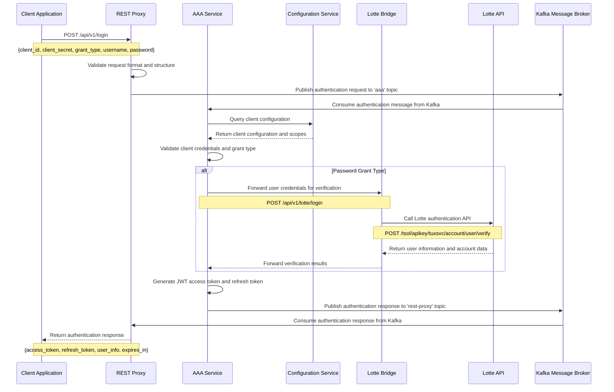
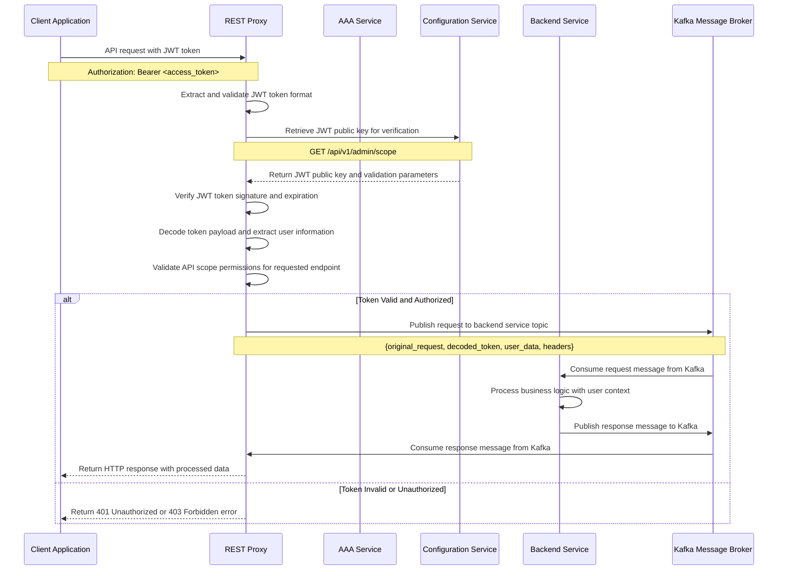
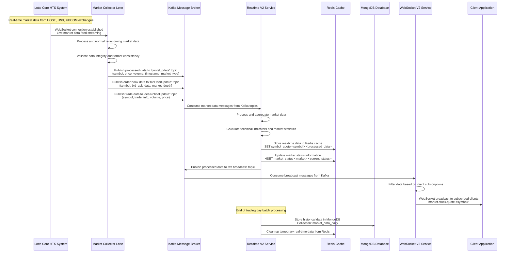
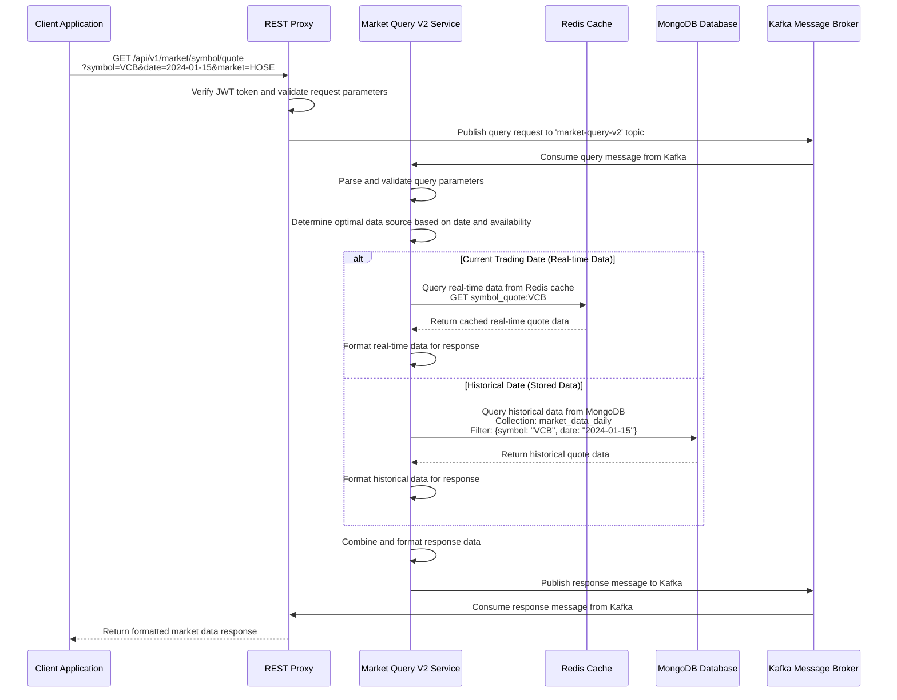
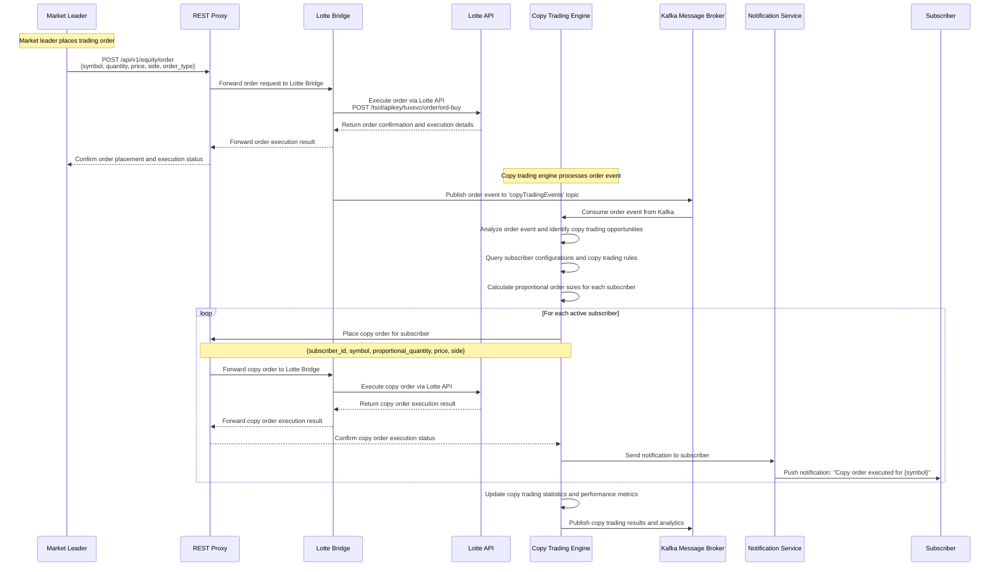
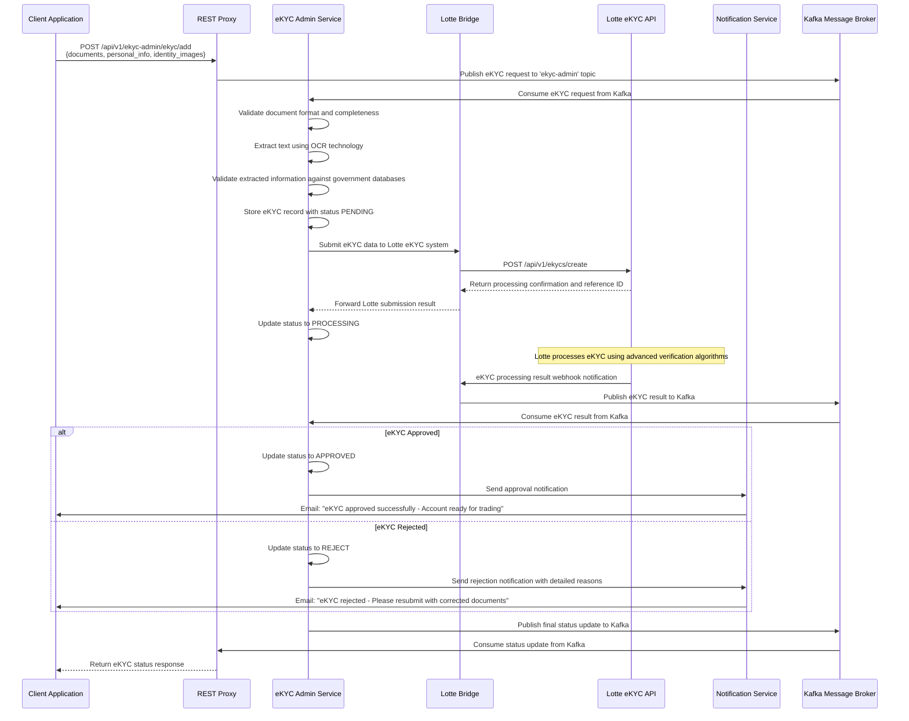
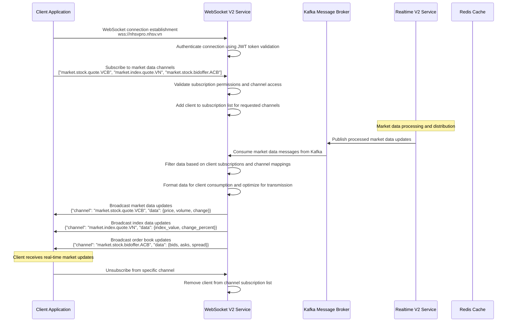
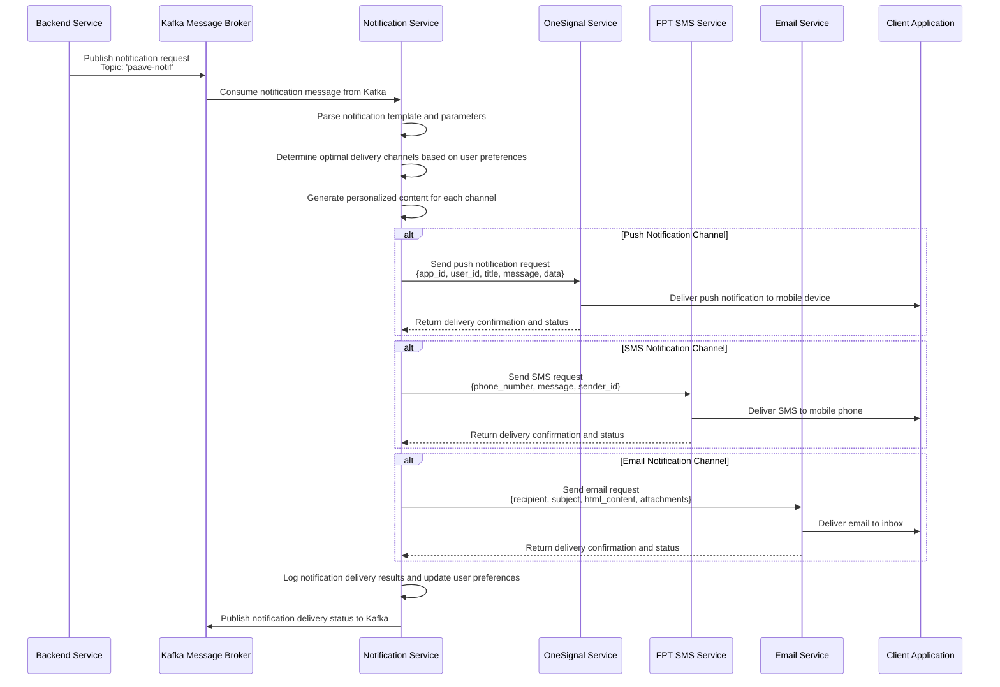

# Tradex Api System - Complete Architecture Documentation

## Executive Summary

The Tradex Api (New Health Stock Vietnam) system represents a comprehensive, enterprise-grade stock trading platform built on modern microservices architecture. This sophisticated financial technology ecosystem seamlessly integrates with Vietnamese stock exchanges through strategic partnerships with Lotte Securities and VietStock, providing a robust, scalable, and secure trading infrastructure for institutional and retail investors.

## System Architecture Overview

### Core Architectural Principles

The Tradex Api system is designed following industry best practices for financial technology platforms:

- **Microservices Architecture**: Decoupled, independently deployable services
- **Event-Driven Communication**: Asynchronous message processing via Apache Kafka
- **Multi-Database Strategy**: Purpose-built data storage solutions
- **API-First Design**: RESTful APIs with comprehensive documentation
- **Security by Design**: Multi-layered security with OAuth2 and JWT
- **High Availability**: Fault-tolerant, self-healing infrastructure
- **Horizontal Scalability**: Cloud-native, containerized deployment

### System Components Architecture

#### 1. **API Gateway Layer**
The entry point for all client interactions, providing unified access to backend services.

- **rest-proxy**: Central API Gateway handling HTTP request routing, authentication, rate limiting, and protocol translation between HTTP and Kafka messaging systems.

#### 2. **Authentication & Authorization Layer**
Comprehensive security framework ensuring secure access control across the entire platform.

- **aaa**: OAuth2-compliant authentication and authorization service supporting multiple authentication methods including password-based, biometric, social login, and multi-factor authentication.
- **configuration**: Centralized configuration management service handling client registrations, scope definitions, permission matrices, and system-wide configuration updates.

#### 3. **Core Business Services**
Essential business logic services that power the trading platform's core functionality.

- **nhsv-admin**: Administrative dashboard and management interface for system configuration, user management, and operational oversight.
- **ekyc-admin**: Electronic Know Your Customer service handling customer identity verification, document processing, and regulatory compliance.
- **copy-trading-engine**: Sophisticated algorithmic trading engine that enables automated replication of successful traders' strategies for subscribers.

#### 4. **External Integration Layer**
Strategic integration services connecting the platform with external financial data and trading systems.

- **lotte-bridge**: Comprehensive integration service with Lotte Securities APIs, handling trading operations, account management, and real-time market data.
- **lotte-ws-bridge**: Real-time WebSocket event processing service that monitors Lotte trading events and forwards them to the internal messaging system.
- **viet-stock-bridge**: Integration service with VietStock APIs providing company information, financial data, news feeds, and market analysis.
- **market-collector-lotte**: High-performance market data collection service that aggregates real-time trading data from multiple Vietnamese stock exchanges.

#### 5. **Data Processing & Storage Layer**
Advanced data processing infrastructure ensuring real-time performance and historical data integrity.

- **realtime-v2**: Real-time data processing engine that consumes market data streams, performs complex calculations, and maintains live trading state in Redis.
- **market-query-v2**: High-performance query service providing fast access to both real-time and historical market data through optimized caching strategies.
- **ws-v2**: WebSocket service delivering real-time market updates to connected clients with low-latency, high-throughput data streaming.

#### 6. **Notification & Communication Layer**
Multi-channel communication infrastructure ensuring timely delivery of critical information.

- **notification**: Comprehensive notification service supporting multiple delivery channels including email, SMS, push notifications, and in-app messaging with template management and delivery tracking.

#### 7. **Common Libraries**
Shared code libraries ensuring consistency and reducing development overhead across services.

- **tradex-common-16.16.0**: TypeScript common library providing shared utilities, data models, and business logic.
- **tradex-common-java**: Java common library containing shared components, data access objects, and integration utilities.

## Detailed Service Specifications

### 1. AAA Service (Authentication, Authorization, Accounting)

**Purpose**: Centralized authentication and authorization service providing comprehensive security for the entire Tradex Api platform.

**Core Functionality**:
- **Multi-Modal Authentication**: Supports password-based authentication, OTP verification, biometric authentication (Face ID, fingerprint), social login (Google, Facebook, Apple), and domain-based enterprise access.
- **Token Management**: Advanced JWT token lifecycle management with configurable expiration, refresh token rotation, and secure token revocation.
- **OAuth2 Compliance**: Full OAuth2 specification implementation supporting multiple grant types and client credential management.
- **Scope-Based Access Control**: Granular permission system with dynamic scope assignment and role-based access control.
- **Client Management**: Comprehensive OAuth2 client application registration, secret management, and access control configuration.

**Technology Stack**: Node.js, TypeScript, MySQL, Redis, Apache Kafka, RSA Encryption

**Key API Endpoints**:
- `POST /api/v1/login` - Standard user authentication
- `POST /api/v1/refreshToken` - Access token refresh mechanism
- `POST /api/v1/revokeToken` - Secure token revocation

### 2. Configuration Service

**Purpose**: Centralized configuration management system ensuring consistent system behavior and enabling dynamic configuration updates across all services.

**Core Functionality**:
- **Client Management**: OAuth2 client registration, secret rotation, and authentication configuration management.
- **Scope & Permission Management**: Dynamic role-based access control with hierarchical scope groups and granular permission definitions.

**Technology Stack**: Node.js, TypeScript, MySQL, TypeORM, Apache Kafka, AWS S3

### 3. Tradex Api Admin Service

**Purpose**: Comprehensive administrative interface providing complete system management capabilities for platform administrators and operational staff.

**Core Functionality**:
- **User Management**: Complete user lifecycle management including registration, profile management, role assignment, and account status control.
- **Copy Trading Configuration**: Advanced configuration management for copy trading algorithms, risk parameters, and subscriber management.
- **Chat Room Management**: Real-time communication platform management with moderation tools and user interaction monitoring.
- **Portfolio Management**: Market leader portfolio oversight with performance tracking and risk assessment tools.

**Technology Stack**: Java Spring Boot, React, MySQL, MongoDB, Apache Kafka

### 4. eKYC Admin Service

**Purpose**: Electronic Know Your Customer service ensuring regulatory compliance and secure customer identity verification.

**Core Functionality**:
- **Document Processing**: Advanced OCR technology for identity document processing and information extraction.
- **Identity Verification**: Multi-step verification process including document authenticity checks and government database validation.
- **Lotte Integration**: Seamless integration with Lotte Securities eKYC system for account creation and verification.
- **Status Management**: Comprehensive status tracking system (PENDING, REJECT, APPROVED) with audit trails.
- **OTP Verification**: Secure one-time password generation and verification for additional security layers.
- **FPT E-Contract Management**: 

**Technology Stack**: Java Spring Boot, React, MySQL, Apache Kafka, OCR Technology

### 5. Copy Trading Engine

**Purpose**: Sophisticated algorithmic trading engine enabling automated replication of successful trading strategies.

**Core Functionality**:
- **Strategy Replication**: Real-time monitoring and replication of market leader trading activities.
- **Risk Management**: Advanced risk assessment algorithms with position sizing, stop-loss management, and exposure limits.
- **Portfolio Management**: Dynamic portfolio allocation and rebalancing based on market leader performance.
- **Scheduled Execution**: Automated trading execution with configurable timing and market condition filters.
- **Performance Analytics**: Comprehensive performance tracking and reporting for copy trading activities.

**Technology Stack**: Java Spring Boot, MySQL, Apache Kafka, Advanced Algorithms

### 6. Lotte Bridge

**Purpose**: Comprehensive integration service with Lotte Securities providing seamless access to trading operations and market data.

**Core Functionality**:
- **Trading Operations**: Complete trading functionality including order placement, modification, cancellation, and execution monitoring.
- **Account Management**: Comprehensive account information retrieval, balance inquiries, and transaction history access.
- **Market Data Integration**: Real-time market data access including quotes, order book data, and trading statistics.
- **Risk Management**: Integration with Lotte's risk management systems for position monitoring and compliance.
- **API Translation**: Protocol translation between internal systems and Lotte's proprietary API formats.

**Technology Stack**: Node.js, TypeScript, Axios, Apache Kafka, REST APIs

### 7. Lotte WebSocket Bridge

**Purpose**: Real-time event processing service monitoring Lotte trading system events and forwarding them to internal systems.

**Core Functionality**:
- **Event Monitoring**: Continuous monitoring of Lotte WebSocket events including order status changes, balance updates, and trading notifications.
- **Message Translation**: Conversion of Lotte-specific event formats to standardized internal message formats.
- **Connection Management**: Robust WebSocket connection management with automatic reconnection and error handling.
- **Event Filtering**: Intelligent event filtering and routing based on user subscriptions and system requirements.
- **Notification Integration**: Integration with notification services for critical event alerting.

**Technology Stack**: Node.js, TypeScript, WebSocket, Apache Kafka, Event Processing

### 8. Market Collector Lotte

**Purpose**: High-performance market data collection service aggregating real-time trading data from Vietnamese stock exchanges.

**Core Functionality**:
- **Real-Time Data Collection**: Continuous collection of live market data from HOSE, HNX, and UPCOM exchanges.
- **Data Processing**: Advanced data normalization, validation, and enrichment processes.
- **Historical Data Management**: Comprehensive historical data collection and storage for analysis and reporting.
- **Symbol Management**: Dynamic symbol information management including corporate actions and market changes.
- **Data Quality Assurance**: Advanced data validation and quality control processes ensuring data accuracy.

**Technology Stack**: Java Spring Boot, MongoDB, Redis, Apache Kafka, WebSocket

### 9. Realtime V2

**Purpose**: Advanced real-time data processing engine providing high-performance market data processing and distribution.

**Core Functionality**:
- **Stream Processing**: High-throughput stream processing of market data with sub-millisecond latency.
- **Data Aggregation**: Real-time data aggregation and calculation including moving averages, technical indicators, and market statistics.
- **Cache Management**: Intelligent caching strategies for frequently accessed data with automatic cache invalidation.
- **Batch Processing**: End-of-day batch processing for historical data storage and analytics.
- **Performance Optimization**: Advanced performance optimization techniques including parallel processing and memory management.

**Technology Stack**: Java Spring Boot, Redis, MongoDB, Apache Kafka, Stream Processing

### 10. Market Query V2

**Purpose**: High-performance query service providing fast access to both real-time and historical market data.

**Core Functionality**:
- **Query Optimization**: Advanced query optimization techniques for fast data retrieval across multiple data sources.
- **Caching Strategy**: Multi-level caching strategy including Redis for real-time data and MongoDB for historical data.
- **Data Fusion**: Intelligent data fusion combining real-time and historical data for comprehensive market analysis.
- **API Management**: RESTful API management with rate limiting, authentication, and comprehensive documentation.
- **Performance Monitoring**: Real-time performance monitoring and optimization for query response times.

**Technology Stack**: Node.js, TypeScript, Redis, MongoDB, Apache Kafka, Query Optimization

### 11. WebSocket V2

**Purpose**: Real-time data streaming service providing low-latency market data delivery to connected clients.

**Core Functionality**:
- **Connection Management**: Advanced WebSocket connection management with load balancing and failover capabilities.
- **Channel Management**: Dynamic channel subscription management with topic-based routing and filtering.
- **Data Broadcasting**: High-performance data broadcasting with compression and optimization techniques.
- **Authentication**: Secure WebSocket authentication and authorization with JWT token validation.
- **Monitoring**: Comprehensive connection monitoring and analytics for performance optimization.

**Technology Stack**: Node.js, SocketCluster, Apache Kafka, WebSocket, Real-time Processing

### 12. VietStock Bridge

**Purpose**: Integration service with VietStock providing comprehensive financial data and market analysis.

**Core Functionality**:
- **Company Information**: Comprehensive company profile data including financial statements, corporate actions, and business information.
- **News Integration**: Real-time news feed integration with filtering and categorization capabilities.
- **Financial Data**: Historical financial data access including earnings, revenue, and performance metrics.
- **Market Analysis**: Advanced market analysis tools and data visualization capabilities.
- **Data Caching**: Intelligent data caching with TTL management and automatic refresh mechanisms.

**Technology Stack**: Node.js, TypeScript, Redis, MongoDB, Apache Kafka, REST APIs

### 13. Notification Service

**Purpose**: Multi-channel notification service ensuring timely delivery of critical information across multiple communication channels.

**Core Functionality**:
- **Multi-Channel Delivery**: Support for email, SMS, push notifications, in-app messaging, and social media integration.
- **Template Management**: Advanced template management system with dynamic content generation and multi-language support.
- **Delivery Tracking**: Comprehensive delivery tracking and analytics with delivery confirmation and failure handling.
- **Retry Logic**: Intelligent retry mechanisms with exponential backoff and circuit breaker patterns.
- **Personalization**: Advanced personalization capabilities with user preference management and content customization.

**Technology Stack**: Java Spring Boot, FreeMarker, OneSignal, FPT SMS, Apache Kafka

### 14. REST Proxy

**Purpose**: Central API Gateway providing unified access to all backend services with comprehensive security and routing capabilities.

**Core Functionality**:
- **Request Routing**: Intelligent request routing with load balancing and failover capabilities.
- **Authentication**: Comprehensive authentication and authorization with JWT token validation and scope checking.
- **Protocol Translation**: Seamless translation between HTTP and Kafka messaging protocols.
- **Rate Limiting**: Advanced rate limiting and throttling capabilities to prevent abuse and ensure fair usage.
- **Monitoring**: Comprehensive API monitoring and analytics with performance metrics and error tracking.

**Technology Stack**: Node.js, TypeScript, Express, Apache Kafka, API Gateway

## Apache Kafka - Central Communication Hub and Load Balancer

### Overview

Apache Kafka serves as the central communication hub and load balancer for the entire Tradex Api system. It acts as the primary message broker that enables asynchronous communication between all microservices while providing intelligent load distribution and routing capabilities. Kafka is the backbone that connects all services, ensuring reliable message delivery and system scalability.

### Core Role in Tradex Api System

#### 1. Central Communication Hub
- **Service-to-Service Communication**: All inter-service communication flows through Kafka topics
- **Protocol Translation**: Converts HTTP requests from REST Proxy into Kafka messages for backend services
- **Message Routing**: Routes messages to appropriate services based on URI patterns and topic configurations
- **Request-Response Handling**: Manages synchronous request-response patterns between services

#### 2. Load Balancer and Traffic Distribution
- **Horizontal Scaling**: Distributes load across multiple instances of the same service
- **Partition-based Load Balancing**: Uses Kafka partitions to distribute messages evenly across service instances
- **Consumer Groups**: Enables multiple service instances to process messages in parallel
- **Dynamic Scaling**: Automatically adapts to varying load conditions

#### 3. Message Queuing and Buffering
- **Asynchronous Processing**: Decouples service communication for better performance
- **Message Persistence**: Stores messages temporarily to handle service unavailability
- **Backpressure Handling**: Manages message flow when downstream services are slow
- **Retry Mechanisms**: Automatically retries failed message processing

### Common Message Pattern

The Tradex Api system uses a standardized message format across all services, defined in the `tradex-common-java` library:

#### Message Structure
```java
public class Message<T> {
    protected MessageTypeEnum messageType;        // REQUEST, RESPONSE, MESSAGE
    protected String sourceId;                    // Service that sent the message
    protected String transactionId;               // Unique transaction identifier
    protected String messageId;                   // Unique message identifier. 1 transaction may have multiple message id
    protected String uri;                         // API endpoint URI
    protected ResponseDestination responseDestination; // Where to send response
    protected T data;                            // Actual message payload
    protected Long t;                            // Timestamp when message was sent
}
```

#### Message Types

Kafka messages in the Tradex Api system follow two fundamental patterns:

**1. REQUEST/RESPONSE Pattern (Synchronous)**
- **Purpose**: Similar to REST API calls - one service receives a request, processes it, and responds
- **Flow**: REST Proxy → Kafka Topic → Single Backend Service Instance → Response Topic → REST Proxy
- **Characteristics**:
  - One-to-one communication pattern
  - Single service instance processes the request
  - Immediate response required
  - Uses `ResponseDestination` to specify where to send the response
- **Examples**: Authentication requests, data queries, order placements, configuration lookups
- **Message Types**: `REQUEST` and `RESPONSE`

**2. PUBLISH/SUBSCRIBE Pattern (Asynchronous)**
- **Purpose**: One-to-many communication where one service publishes updates and multiple services may consume them
- **Flow**: Producer Service → Kafka Topic → Multiple Consumer Service Instances
- **Characteristics**:
  - One-to-many communication pattern
  - Multiple service instances can process the same message
  - No response required (fire-and-forget)
  - Event-driven architecture
- **Examples**: Market data updates, system notifications, audit logs, status changes
- **Message Type**: `MESSAGE`

#### ResponseDestination Structure
```java
public class ResponseDestination {
    private String topic;    // Kafka topic to send response to
    private String uri;      // URI endpoint for the response. normally not using.
}
```

### REST Proxy Integration

The REST Proxy service acts as the primary gateway that translates HTTP requests into Kafka messages:

#### Request Flow
1. **HTTP Request**: Client sends HTTP request to REST Proxy
2. **Authentication**: REST Proxy validates JWT token and extracts user context
3. **Message Creation**: Creates Kafka message with standardized format
4. **Topic Routing**: Routes message to appropriate Kafka topic based on URI pattern
5. **Response Handling**: Waits for response message on designated response topic
6. **HTTP Response**: Converts Kafka response back to HTTP response for client


#### Load Balancing Strategy
- **Partition-based Distribution**: Messages are distributed across Kafka partitions
- **Consumer Group Scaling**: Multiple service instances consume from the same topic
- **Round-robin Assignment**: Kafka automatically assigns partitions to consumers
- **Rebalancing**: Automatic rebalancing when service instances are added/removed

### Key Kafka Topics

Based on source code analysis, the Tradex Api system uses the following Kafka topics:

#### Authentication & Authorization
- **`aaa`**: Authentication and authorization requests
- **`configuration`**: Configuration service requests and responses

#### Copy Trading
- **`copy-trading-engine`**: Copy trading operations

#### Market Data & Real-time Updates
- **`quoteUpdate`**: Stock and index quote updates
- **`quoteRecover`**: Quote recovery operations
- **`quoteOddLotUpdate`**: Odd lot quote updates
- **`extraUpdate`**: Extra market data updates
- **`bidOfferUpdate`**: Bid/offer updates
- **`bidOfferOddLotUpdate`**: Odd lot bid/offer updates
- **`dealNoticeUpdate`**: Trade deal notifications
- **`advertisedUpdate`**: Advertised trade updates
- **`marketStatus`**: Market status updates
- **`marketInit`**: Market initialization data
- **`tickerMesgUpdate`**: Ticker message updates
- **`refreshData`**: Data refresh operations
- **`symbolInfoUpdate`**: Symbol information updates
- **`indexStockListUpdate`**: Index stock list updates
- **`statisticUpdate`**: Market statistics updates

#### WebSocket & Real-time Communication
- **`market.stock.quote`**: Stock quote WebSocket channel
- **`market.futures.quote`**: Futures quote WebSocket channel
- **`market.index.quote`**: Index quote WebSocket channel
- **`market.stock.bidoffer`**: Stock bid/offer WebSocket channel
- **`market.futures.bidoffer`**: Futures bid/offer WebSocket channel
- **`market.stock.putthrough.deal`**: Put-through deal WebSocket channel
- **`market.stock.putthrough.advertise`**: Put-through advertise WebSocket channel
- **`market.mastertbl`**: Master table WebSocket channel
- **`market.status`**: Market status WebSocket channel
- **`market.tickerMesg`**: Ticker message WebSocket channel
- **`market.refreshData`**: Refresh data WebSocket channel
- **`market.statistic`**: Market statistics WebSocket channel
- **`market.theme`**: Theme WebSocket channel
- **`market.extra`**: Extra market data WebSocket channel

#### Notifications
- **`notification`**: General notification service


#### Message Flow Patterns

**1. Synchronous Request-Response**
```
Client → REST Proxy → Kafka Topic → Service → Response Topic → REST Proxy → Client
```

**2. Asynchronous Event Streaming**
```
Producer Service → Kafka Topic → Multiple Consumer Services
```

**3. Broadcast Pattern**
```
Single Producer → Kafka Topic → All Subscribed Services
```

### Performance and Scalability

#### Load Distribution
- **Partitioning**: Each topic is divided into multiple partitions for parallel processing
- **Consumer Groups**: Multiple service instances can process messages concurrently
- **Message Ordering**: Messages within the same partition maintain order
- **Horizontal Scaling**: Easy to add more service instances to handle increased load

#### Reliability Features
- **Message Persistence**: Messages are stored on disk for durability
- **Replication**: Messages are replicated across multiple Kafka brokers
- **At-least-once Delivery**: Guarantees message delivery (may have duplicates)
- **Dead Letter Queues**: Failed messages can be moved to error topics

#### Monitoring and Observability
- **Message Throughput**: Track messages per second per topic
- **Consumer Lag**: Monitor delay between producers and consumers
- **Error Rates**: Track failed message processing
- **Service Health**: Monitor service availability and performance

### Client, Login Methods, Scope Groups, and Scopes

The Tradex Api System implements a comprehensive authentication and authorization model based on OAuth2 standards, with fine-grained access control through clients, login methods, scope groups, and scopes.

#### Client Applications
**Clients** represent applications or services that can authenticate with the system. Each client has:
- **Client ID**: Unique identifier for the application
- **Client Secret**: Secret key for secure authentication
- **Domain**: Associated domain for multi-tenant support
- **Configuration**: Client-specific settings and permissions

#### Login Methods
**Login Methods** define the authentication mechanisms available to clients:
- **Password-based**: Traditional username/password authentication
- **Social Login**: Integration with Google, Facebook, Apple, and TechX
- **Biometric Authentication**: Face ID, fingerprint, and other biometric methods
- **OTP Verification**: SMS and mobile app-based one-time passwords
- **Client Credentials**: Service-to-service authentication
- **Demo Account**: Testing and demonstration access
- **Organization Login**: Enterprise domain-based authentication
- **Link Account**: Multi-provider account linking

#### Scope Groups
**Scope Groups** are collections of related permissions that can be assigned to users or clients:
- **Grouping Mechanism**: Organizes scopes into logical permission sets
- **Assignment**: Users receive scope groups based on their login method and client
- **Hierarchical Structure**: Supports nested permission groupings
- **Dynamic Loading**: Scope groups are loaded from the configuration service

#### Scopes (API Permissions)
**Scopes** represent individual API permissions or endpoints that users can access:
- **URI Pattern Matching**: Each scope defines a URI pattern (e.g., `/api/v1/equity/order/*`)
- **Forward Configuration**: Specifies how requests should be forwarded to backend services
- **Permission Granularity**: Each scope corresponds to a specific API endpoint or resource
- **Dynamic Resolution**: Scopes are resolved at runtime based on the requested URI

#### Scope Resolution Process
1. **Client Authentication**: Client provides `client_id` and `client_secret`
2. **Login Method Selection**: System determines available login methods for the client
3. **User Authentication**: User authenticates using the selected login method
4. **Scope Group Assignment**: User receives scope groups based on login method and client
5. **Scope Resolution**: System matches requested URI against available scopes
6. **Permission Validation**: Request is allowed or denied based on scope match

#### Example Scope Structure
```javascript
// Example scope configuration
{
  "id": 1,
  "name": "Equity Trading",
  "uriPattern": "/api/v1/equity/order/*",
  "forwardType": "kafka",
  "forwardData": {
    "topic": "paave-real-trading",
    "uri": "post:/api/v1/real-trading/kis/eqt/order",
    "tokenType": "VERIFIED"
  }
}
```

This granular permission system ensures that users only have access to the APIs they are authorized to use, providing both security and flexibility in the Tradex Api System.

## System Flows and Processes

### 1. User Authentication and Authorization Flow



### 2. API Request Processing with Token Validation



### 3. Market Data Collection and Processing Pipeline



### 4. Market Data Query and Retrieval Process



### 5. Copy Trading Execution Flow



### 6. eKYC Document Processing Workflow



### 7. WebSocket Real-time Data Streaming



### 8. Multi-Channel Notification Delivery Process



## System Architecture Summary

The Tradex Api platform represents a sophisticated microservices architecture built around Apache Kafka as the central communication hub and load balancer. The system demonstrates several key architectural patterns:

### Core Architectural Principles

**1. Event-Driven Architecture**
- All inter-service communication flows through Kafka topics
- Asynchronous message processing enables high scalability
- Event sourcing patterns maintain system state and audit trails

**2. Microservices Design**
- Each service has a single responsibility and clear boundaries
- Services are independently deployable and scalable
- Loose coupling through message-based communication

**3. Load Balancing and Scalability**
- Kafka partitions distribute load across service instances
- Consumer groups enable horizontal scaling
- Dynamic scaling based on message volume and processing capacity

**4. Data Consistency and Reliability**
- At-least-once message delivery guarantees
- Eventual consistency with compensation patterns
- Comprehensive error handling and retry mechanisms

### Technology Stack Integration

**Backend Services**
- **Node.js/TypeScript**: REST Proxy, AAA, Configuration, Market Query V2
- **Java Spring Boot**: Tradex Api-Admin, eKYC-Admin, Copy Trading Engine, Notification
- **Message Broker**: Apache Kafka for all inter-service communication
- **Databases**: MySQL (relational), MongoDB (document), Redis (cache)

**Real-time Capabilities**
- **WebSocket Services**: Real-time market data streaming
- **Event Streaming**: Continuous data processing and distribution
- **Caching**: Redis for high-performance data access

**External Integrations**
- **Lotte APIs**: Trading operations and market data
- **VietStock APIs**: Additional market data sources
- **Notification Services**: Multi-channel delivery (SMS, Email, Push)

### System Flow Patterns

**1. Request-Response Pattern**
- Synchronous operations requiring immediate responses
- Used for authentication, data queries, and order placements
- REST Proxy translates HTTP to Kafka messages

**2. Event Streaming Pattern**
- Continuous data flow for market data and system events
- Real-time processing and distribution
- WebSocket delivery to clients

**3. CQRS Pattern**
- Separate command and query responsibilities
- Optimized read and write operations
- Event sourcing for audit and state reconstruction

**4. Saga Pattern**
- Distributed transaction management
- Compensation patterns for error handling
- Maintains data consistency across services

### Performance and Scalability Features

**Load Distribution**
- Kafka partitioning for parallel processing
- Consumer group scaling
- Round-robin message assignment

**Reliability**
- Message persistence and replication
- Dead letter queues for failed messages
- Comprehensive monitoring and alerting

**Security**
- JWT token-based authentication
- Scope-based authorization
- TLS encryption for data in transit

### Monitoring and Observability

**Key Metrics**
- Message throughput and latency
- Consumer lag and error rates
- Service health and performance
- Resource utilization

**Alerting**
- Real-time system health monitoring
- Automated alerting for critical issues
- Performance threshold monitoring

This architecture provides a robust, scalable, and maintainable foundation for the Tradex Api trading platform, enabling high-performance financial services with real-time capabilities and comprehensive monitoring.
