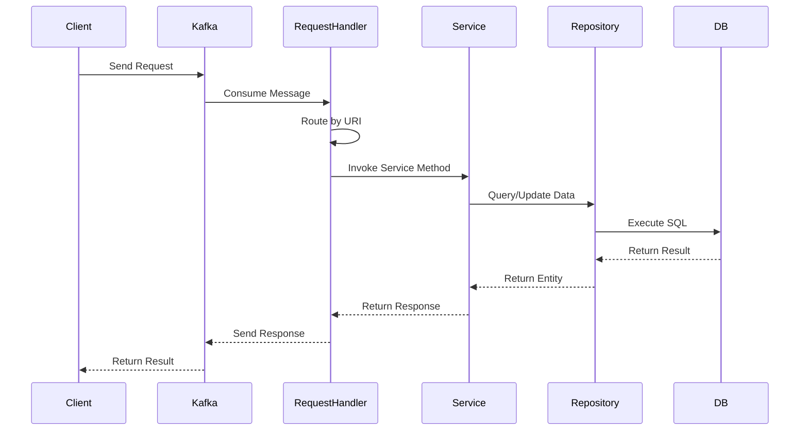
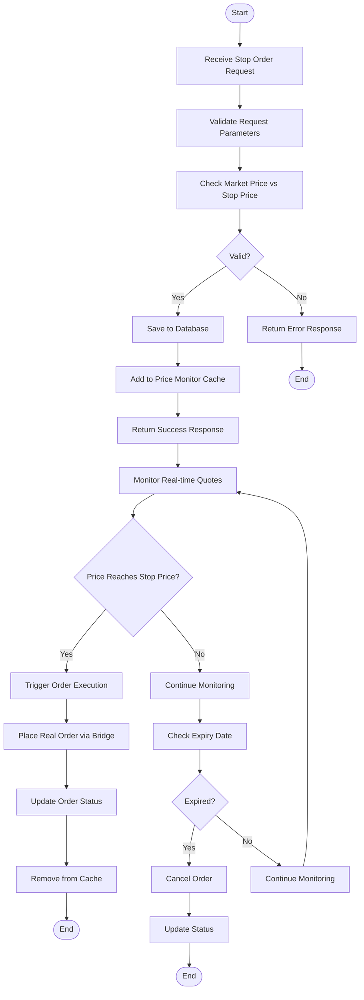
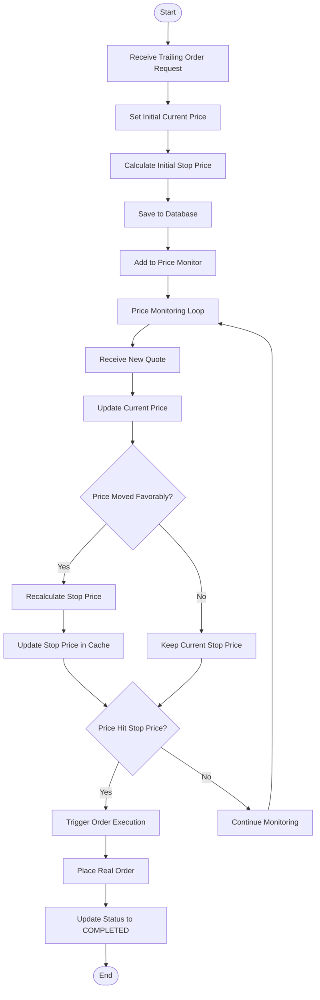
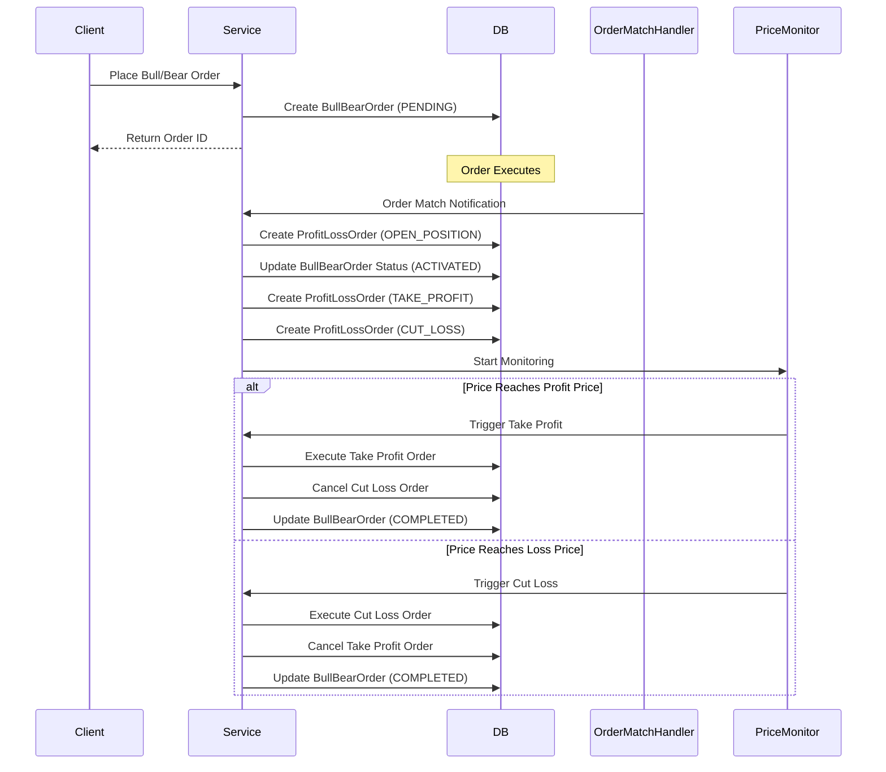
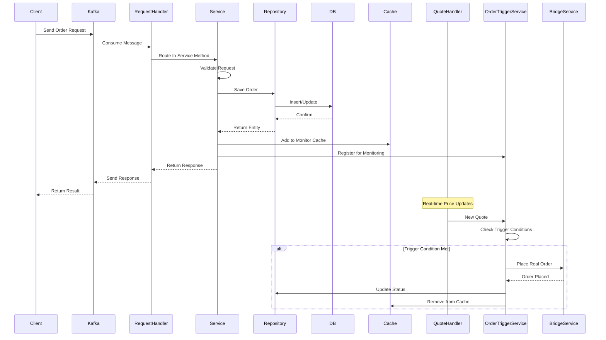
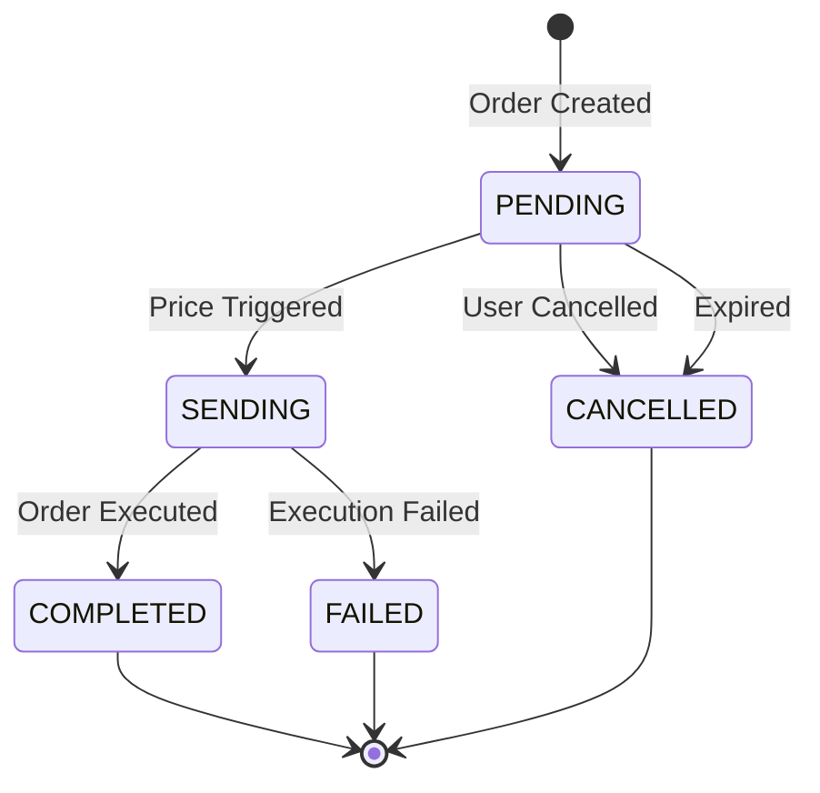

# Order-V2 Service Documentation

## Table of Contents

1. [Introduction](#1-introduction)
2. [Architecture Overview](#2-architecture-overview)
3. [RequestHandler Layer](#3-requesthandler-layer)
4. [Service Layer](#4-service-layer)
5. [Repository Layer](#5-repository-layer)
6. [Database Schema](#6-database-schema)
7. [Conditional Order Types](#7-conditional-order-types)
8. [Order Processing Flow](#8-order-processing-flow)
9. [Conclusion](#9-conclusion)

---

## 1. Introduction

### 1.1 Overview

The **order-v2** service is a sophisticated conditional order management system designed to handle various types of advanced trading orders in the Vietnamese stock market. The service provides functionality for placing, modifying, canceling, and monitoring conditional orders that execute based on specific market conditions.

### 1.2 Purpose

The order-v2 service enables traders to:
- Place stop orders that trigger when price reaches a specified level
- Create OCO (One-Cancels-Other) orders for profit-taking and loss-cutting
- Set up trailing stop orders that adjust dynamically with price movements
- Manage bull/bear orders with automatic profit and loss management

### 1.3 Technology Stack

- **Framework**: Spring Boot 3.1.1
- **Java Version**: 17
- **Database**: MySQL
- **Messaging**: Apache Kafka
- **Caching**: Redis
- **ORM**: JPA/Hibernate

---

## 2. Architecture Overview

### 2.1 System Architecture

The order-v2 service follows a layered architecture pattern with clear separation of concerns:

```
┌─────────────────────────────────────────────────────────┐
│                    Kafka Consumers                        │
│  (RequestHandler, QuoteHandler, OrderMatchHandler)      │
└────────────────────┬──────────────────────────────────────┘
                     │
┌────────────────────▼──────────────────────────────────────┐
│                    Service Layer                          │
│  (StopOrderService, OcoOrderService, TrailingOrderService)│
└────────────────────┬──────────────────────────────────────┘
                     │
┌────────────────────▼──────────────────────────────────────┐
│                  Repository Layer                         │
│  (StopOrderRepository, OcoOrderRepository, etc.)          │
└────────────────────┬──────────────────────────────────────┘
                     │
┌────────────────────▼──────────────────────────────────────┐
│                    Database Layer                          │
│              (MySQL - Conditional Orders)                  │
└─────────────────────────────────────────────────────────────┘
```

### 2.2 Key Components

1. **RequestHandler**: Handles incoming API requests via Kafka
2. **QuoteHandler**: Processes real-time market price updates
3. **OrderMatchHandler**: Processes order execution notifications
4. **OrderTriggerService**: Manages price monitoring and order triggering
5. **Service Layer**: Implements business logic for each order type
6. **Repository Layer**: Provides data access abstraction

---

## 3. RequestHandler Layer

### 3.1 Overview

The `RequestHandler` is the entry point for all API requests in the order-v2 service. It extends `JobHandler` and routes incoming Kafka messages to appropriate service methods based on URI patterns.

### 3.2 Responsibilities

- **Request Routing**: Maps URI patterns to service methods
- **Mode-based Routing**: Routes requests to different clusters based on service mode (QUERY vs ENGINE)
- **Request Forwarding**: Forwards requests to appropriate cluster when service is in QUERY mode

### 3.3 Key Features

#### 3.3.1 Dual Mode Operation

The service operates in two modes:
- **QUERY Mode**: Handles read-only operations (history, detail queries)
- **ENGINE Mode**: Handles write operations (place, modify, cancel orders)

When a request comes to the wrong mode, it's automatically forwarded to the correct cluster.

#### 3.3.2 Request Mapping

The RequestHandler maps URIs to service methods:

```java
// Stop Order Operations
"post:/api/v1/stopOrder" → stopOrderService::placeStopOrder
"put:/api/v1/stopOrder/modify" → stopOrderService::modifyStopOrder
"put:/api/v1/stopOrder/cancel" → stopOrderService::cancelStopOrder
"put:/api/v1/stopOrder/cancel/multi" → stopOrderService::cancelMultiStopOrders
"get:/api/v1/stopOrder/history" → stopOrderService::queryStopOrderHistory

// OCO Order Operations
"post:/api/v1/ocoOrder" → ocoOrderService::addOcoOrder
"put:/api/v1/ocoOrder/cancel" → ocoOrderService::cancelOcoOrder
"get:/api/v1/ocoOrder/history" → ocoOrderService::queryOcoOrderHistory

// Trailing Order Operations
"post:/api/v1/trailingOrder" → trailingOrderService::addTrailingOrder
"put:/api/v1/trailingOrder/cancel" → trailingOrderService::cancelTrailingOrder
"get:/api/v1/trailingOrder/history" → trailingOrderService::queryTrailingOrderHistory

// Bull/Bear Order Operations
"post:/api/v1/bullBear" → bullBearOrderService::addBullBearOrder
"put:/api/v1/bullBear/cancel" → bullBearOrderService::cancelBullBearOrder
```

### 3.4 Request Flow



---

## 4. Service Layer

### 4.1 Overview

The Service Layer contains the core business logic for managing conditional orders. Each order type has its dedicated service interface and implementation.

### 4.2 Service Interfaces

#### 4.2.1 StopOrderService

Manages stop orders - orders that trigger when price reaches a specified stop price.

**Key Methods:**
- `placeStopOrder()`: Creates a new stop order
- `modifyStopOrder()`: Modifies an existing stop order
- `cancelStopOrder()`: Cancels a single stop order
- `cancelMultiStopOrders()`: Cancels multiple stop orders
- `queryStopOrderHistory()`: Retrieves stop order history

**Business Logic:**
- Validates stop price against current market price
- Validates date range (fromDate, toDate)
- Checks market hours and trading rules
- Stores order in database and adds to price monitoring cache

#### 4.2.2 OcoOrderService

Manages OCO (One-Cancels-Other) orders - orders that automatically create profit-taking and loss-cutting orders.

**Key Methods:**
- `addOcoOrder()`: Creates a new OCO order
- `cancelOcoOrder()`: Cancels an OCO order
- `queryOcoOrderHistory()`: Retrieves OCO order history
- `queryOcoOrderToday()`: Retrieves today's OCO orders
- `queryOcoOrderDetail()`: Retrieves detailed OCO order information

**Business Logic:**
- Creates a BullBearOrder (main order)
- Creates an OcoOrder (opposite side order)
- Monitors main order execution
- Automatically triggers profit/loss orders when conditions are met

#### 4.2.3 TrailingOrderService

Manages trailing stop orders - orders that adjust stop price dynamically as price moves favorably.

**Key Methods:**
- `addTrailingOrder()`: Creates a new trailing order
- `cancelTrailingOrder()`: Cancels a trailing order
- `queryTrailingOrderHistory()`: Retrieves trailing order history
- `cancelAllBySchedule()`: Scheduled cancellation of expired orders

**Business Logic:**
- Tracks current price and trailing amount
- Adjusts stop price as price moves favorably
- Triggers order when stop price is hit

#### 4.2.4 BullBearOrderService

Manages bull/bear orders - orders with automatic profit and loss management.

**Key Methods:**
- `addBullBearOrder()`: Creates a new bull/bear order
- `cancelBullBearOrder()`: Cancels a bull/bear order
- `queryBullBearOrderHistory()`: Retrieves bull/bear order history

**Business Logic:**
- Places initial order
- Sets profit price and trigger loss price
- Monitors order execution
- Creates profit/loss orders when conditions are met

### 4.3 Service Implementation Pattern

All services follow a consistent pattern:

1. **Request Validation**: Validate input parameters
2. **Business Rule Validation**: Check business rules and constraints
3. **Data Persistence**: Save to database
4. **Cache Update**: Update in-memory cache for real-time monitoring
5. **Response Generation**: Create and return response

---

## 5. Repository Layer

### 5.1 Overview

The Repository Layer provides data access abstraction using Spring Data JPA. Each entity has a corresponding repository interface that extends `JpaRepository`.

### 5.2 Repository Interfaces

#### 5.2.1 StopOrderRepository

```java
public interface StopOrderRepository extends JpaRepository<StopOrder, Long> {
    List<StopOrder> findTodayPendingStopOrder();
    List<StopOrder> findByAccountNumberAndStatus(String accountNumber, StopOrderStatusEnum status);
    // Additional query methods...
}
```

**Key Queries:**
- Find pending stop orders for today
- Find orders by account number and status
- Find orders by date range

#### 5.2.2 OcoOrderRepository

```java
public interface OcoOrderRepository extends JpaRepository<OcoOrder, Long> {
    List<OcoOrder> findByAccountNumberAndStatus(String accountNumber, OcoOrderStatusEnum status);
    OcoOrder findByBullBearOrderId(Long bullBearOrderId);
    // Additional query methods...
}
```

**Key Queries:**
- Find OCO orders by account and status
- Find OCO order by associated bull/bear order ID

#### 5.2.3 TrailingOrderRepository

```java
public interface TrailingOrderRepository extends JpaRepository<TrailingOrder, Long> {
    List<TrailingOrder> findByAccountNumberAndStatus(String accountNumber, TrailingOrderStatusEnum status);
    // Additional query methods...
}
```

#### 5.2.4 BullBearOrderRepository

```java
public interface BullBearOrderRepository extends JpaRepository<BullBearOrder, Long> {
    List<BullBearOrder> findByAccountNumberAndStatus(String accountNumber, BullBearOrderStatusEnum status);
    // Additional query methods...
}
```

#### 5.2.5 ProfitLossOrderRepository

```java
public interface ProfitLossOrderRepository extends JpaRepository<ProfitLossOrder, Long> {
    List<ProfitLossOrder> findByOcoOrderId(Long ocoOrderId);
    // Additional query methods...
}
```

### 5.3 Repository Responsibilities

- **Data Access**: Provide CRUD operations
- **Query Methods**: Define custom queries using method naming conventions
- **Transaction Management**: Participate in service-level transactions
- **Entity Management**: Handle entity lifecycle and relationships

---

## 6. Database Schema

### 6.1 Entity Relationship Diagram

```mermaid
erDiagram
    STOP_ORDER ||--o{ BULL_BEAR_ORDER : "can create"
    BULL_BEAR_ORDER ||--|| OCO_ORDER : "one-to-one"
    BULL_BEAR_ORDER ||--|| PROFIT_LOSS_ORDER : "one-to-one"
    OCO_ORDER ||--o{ PROFIT_LOSS_ORDER : "one-to-many"
    TRAILING_ORDER }o--|| STOP_ORDER : "similar structure"

    STOP_ORDER {
        bigint id PK
        varchar code
        int quantity
        enum sell_buy_type
        decimal stop_price
        decimal order_price
        enum order_type
        enum status
        varchar account_number
        varchar order_number
        timestamp from_date
        timestamp to_date
        timestamp created_at
        timestamp updated_at
    }

    TRAILING_ORDER {
        bigint id PK
        varchar code
        int quantity
        enum sell_buy_type
        decimal trailing_amount
        decimal limit_offset
        decimal current_price
        decimal stop_price
        enum status
        varchar account_number
        timestamp created_at
        timestamp updated_at
    }

    BULL_BEAR_ORDER {
        bigint id PK
        varchar code
        int quantity
        int match_quantity
        enum sell_buy_type
        decimal order_price
        decimal profit_price
        decimal trigger_loss_price
        decimal toler
        enum status
        varchar account_number
        varchar order_number
        timestamp created_at
        timestamp updated_at
    }

    OCO_ORDER {
        bigint id PK
        bigint bull_bear_id FK
        varchar code
        int quantity
        int match_quantity
        int unmatch_quantity
        enum sell_buy_type
        decimal current_price
        decimal profit_price
        decimal trigger_loss_price
        decimal toler
        enum status
        varchar account_number
        timestamp created_at
        timestamp updated_at
    }

    PROFIT_LOSS_ORDER {
        bigint id PK
        bigint bull_bear_id FK
        bigint oco_id FK
        varchar code
        int quantity
        int match_quantity
        enum sell_buy_type
        decimal order_price
        enum status
        enum profit_loss_type
        varchar account_number
        varchar order_number
        timestamp created_at
        timestamp updated_at
    }
```



### 6.2 Table Descriptions

#### 6.2.1 t_stop_order

Stores stop orders that trigger when price reaches stop price.

**Key Fields:**
- `stop_price`: Price level that triggers the order
- `order_price`: Price at which to execute the order (for STOP_LIMIT)
- `order_type`: STOP or STOP_LIMIT
- `from_date` / `to_date`: Validity period
- `status`: PENDING, COMPLETED, CANCELLED, FAILED, SENDING

#### 6.2.2 t_trailing_order

Stores trailing stop orders that adjust dynamically.

**Key Fields:**
- `trailing_amount`: Amount to trail behind current price
- `limit_offset`: Offset from stop price for limit orders
- `current_price`: Current market price being tracked
- `stop_price`: Calculated stop price

#### 6.2.3 t_bull_bear_order

Stores the main order in bull/bear trading strategies.

**Key Fields:**
- `order_price`: Initial order price
- `profit_price`: Price to take profit
- `trigger_loss_price`: Price that triggers loss-cutting
- `toler`: Tolerance/slippage for loss orders
- `match_quantity`: Quantity that has been matched

#### 6.2.4 t_oco_order

Stores the opposite side order in OCO strategy.

**Key Fields:**
- `bull_bear_id`: Reference to main order
- `profit_price`: Price to take profit
- `trigger_loss_price`: Price to cut loss
- `match_quantity` / `unmatch_quantity`: Execution tracking

#### 6.2.5 t_profit_loss_order

Stores profit-taking and loss-cutting orders.

**Key Fields:**
- `bull_bear_id`: Reference to main order
- `oco_id`: Reference to OCO order (if applicable)
- `profit_loss_type`: OPEN_POSITION, TAKE_PROFIT, or CUT_LOSS
- `order_price`: Execution price

### 6.3 Relationships

- **BullBearOrder ↔ OcoOrder**: One-to-one relationship
- **BullBearOrder ↔ ProfitLossOrder**: One-to-one for open position
- **OcoOrder ↔ ProfitLossOrder**: One-to-many (can have multiple profit/loss orders)

---

## 7. Conditional Order Types

### 7.1 Stop Order

#### 7.1.1 Overview

A stop order is an order that becomes active when the market price reaches a specified stop price. Once triggered, it executes as a market order (STOP) or limit order (STOP_LIMIT).

#### 7.1.2 Types

1. **STOP Order**: Executes as market order when stop price is reached
2. **STOP_LIMIT Order**: Executes as limit order at specified order price when stop price is reached

#### 7.1.3 Logic Flow



#### 7.1.4 Price Monitoring

The system uses `OrderThreadHandler` to monitor prices in real-time:

1. **Quote Reception**: Receives real-time price updates via Kafka
2. **Price Comparison**: Compares current price with stop price
3. **Trigger Condition**:
   - For BUY: Trigger when `stopPrice >= currentPrice`
   - For SELL: Trigger when `stopPrice <= currentPrice`
4. **Order Execution**: Places real order via bridge service

### 7.2 OCO Order (One-Cancels-Other)

#### 7.2.1 Overview

An OCO order is a combination of a main order (BullBearOrder) and an opposite side order (OcoOrder). When the main order is executed, it automatically creates profit-taking and loss-cutting orders.

#### 7.2.2 Components

1. **BullBearOrder**: The main order (BUY or SELL)
2. **OcoOrder**: The opposite side order (opposite of main order)
3. **ProfitLossOrder**: Orders created for profit-taking and loss-cutting

#### 7.2.3 Logic Flow

```mermaid
sequenceDiagram
    participant Client
    participant Service
    participant DB
    participant OrderMatchHandler
    participant TriggerService

    Client->>Service: Place OCO Order
    Service->>DB: Create BullBearOrder
    Service->>DB: Create OcoOrder
    Service-->>Client: Return Order IDs
    
    Note over DB: Main Order Executes
    OrderMatchHandler->>Service: Order Match Notification
    Service->>Service: Check Match Quantity
    Service->>DB: Update BullBearOrder Status
    Service->>DB: Update OcoOrder Status
    
    alt Main Order Fully Matched
        Service->>DB: Create ProfitLossOrder (TAKE_PROFIT)
        Service->>DB: Create ProfitLossOrder (CUT_LOSS)
        Service->>TriggerService: Activate Profit/Loss Monitoring
    end
    
    Note over TriggerService: Price Monitoring
    alt Price Reaches Profit Price
        TriggerService->>Service: Trigger Take Profit Order
        Service->>DB: Update ProfitLossOrder Status
    else Price Reaches Loss Price
        TriggerService->>Service: Trigger Cut Loss Order
        Service->>DB: Update ProfitLossOrder Status
        Service->>DB: Cancel Other ProfitLossOrder
    end
```



#### 7.2.4 Business Rules

1. **Order Creation**: 
   - Main order and OCO order are created simultaneously
   - OCO order has opposite sell/buy type
   - Both orders reference each other

2. **Execution Flow**:
   - When main order executes, OCO order becomes active
   - Profit and loss orders are created based on match quantity
   - Only one profit/loss order can execute (one cancels other)

3. **Price Monitoring**:
   - Monitors current price against profit price and trigger loss price
   - When profit price is reached, take profit order executes
   - When loss price is reached, cut loss order executes and cancels take profit

### 7.3 Trailing Order

#### 7.3.1 Overview

A trailing order is a stop order that adjusts its stop price dynamically as the market price moves favorably. The stop price "trails" behind the current price by a specified amount.

#### 7.3.2 Logic Flow



#### 7.3.3 Stop Price Calculation

- **For BUY Orders**: 
  - Stop Price = Current Price - Trailing Amount
  - Only moves up (increases) as price increases
  
- **For SELL Orders**:
  - Stop Price = Current Price + Trailing Amount
  - Only moves down (decreases) as price decreases

#### 7.3.4 Example

Initial Setup:
- Current Price: 100,000 VND
- Trailing Amount: 2,000 VND
- Initial Stop Price: 98,000 VND (for BUY)

Price Movement:
- Price moves to 105,000 → Stop Price becomes 103,000
- Price moves to 110,000 → Stop Price becomes 108,000
- Price drops to 108,000 → Stop Price stays at 108,000 (doesn't move down)
- Price drops to 107,000 → Order triggers at 108,000

### 7.4 Bull/Bear Order

#### 7.4.1 Overview

A bull/bear order is an order with automatic profit and loss management. It places an initial order and automatically creates profit-taking and loss-cutting orders when the initial order executes.

#### 7.4.2 Components

1. **BullBearOrder**: Main order with profit/loss parameters
2. **ProfitLossOrder (OPEN_POSITION)**: The initial order execution
3. **ProfitLossOrder (TAKE_PROFIT)**: Profit-taking order
4. **ProfitLossOrder (CUT_LOSS)**: Loss-cutting order

#### 7.4.3 Logic Flow



#### 7.4.4 Business Rules

1. **Order Placement**: Initial order is placed immediately
2. **Activation**: When order executes, status changes to ACTIVATED
3. **Profit/Loss Orders**: Created automatically upon activation
4. **Execution**: Only one profit/loss order can execute
5. **Cancellation**: When one executes, the other is automatically cancelled

---

## 8. Order Processing Flow

### 8.1 Overall System Flow



### 8.2 Price Monitoring Architecture

The system uses a multi-threaded architecture for price monitoring:

1. **OrderThreadHandler**: Each thread handles orders for specific symbols
2. **Round-Robin Distribution**: Orders are distributed across threads using round-robin
3. **In-Memory Cache**: Active orders are cached in memory for fast access
4. **Real-time Quotes**: Quotes are received via Kafka and distributed to appropriate threads

### 8.3 Order Lifecycle



### 8.4 Error Handling

The system implements comprehensive error handling:

1. **Validation Errors**: Caught at service layer, returned to client
2. **Business Rule Violations**: Thrown as GeneralException with specific error codes
3. **Database Errors**: Handled by transaction rollback
4. **External Service Errors**: Logged and order status updated to FAILED

---

## 9. Conclusion

### 9.1 Summary

The order-v2 service provides a robust, scalable solution for managing conditional orders in the Vietnamese stock market. It supports multiple order types, real-time price monitoring, and automatic order execution based on market conditions.

### 9.2 Key Features

- **Multiple Order Types**: Stop, OCO, Trailing, and Bull/Bear orders
- **Real-time Monitoring**: Multi-threaded price monitoring system
- **High Performance**: In-memory caching and efficient database queries
- **Scalability**: Kafka-based messaging for horizontal scaling
- **Reliability**: Transaction management and error handling

### 9.3 Architecture Strengths

1. **Layered Architecture**: Clear separation of concerns
2. **Service Abstraction**: Easy to extend and maintain
3. **Event-Driven**: Real-time processing via Kafka
4. **Database Design**: Normalized schema with proper relationships

### 9.4 Future Enhancements

Potential improvements for the order-v2 service:

1. **Additional Order Types**: Iceberg orders, TWAP orders
2. **Advanced Analytics**: Order performance metrics
3. **Risk Management**: Position limits and risk checks
4. **Notification System**: Real-time notifications for order events
5. **API Enhancements**: GraphQL support, WebSocket for real-time updates

---

## Appendix A: API Endpoints Summary

### Stop Order APIs
- `POST /api/v1/stopOrder` - Place stop order
- `PUT /api/v1/stopOrder/modify` - Modify stop order
- `PUT /api/v1/stopOrder/cancel` - Cancel stop order
- `PUT /api/v1/stopOrder/cancel/multi` - Cancel multiple orders
- `GET /api/v1/stopOrder/history` - Query history
- `GET /api/v1/stopOrder/lastUpdate` - Get last update time

### OCO Order APIs
- `POST /api/v1/ocoOrder` - Place OCO order
- `PUT /api/v1/ocoOrder/cancel` - Cancel OCO order
- `GET /api/v1/ocoOrder/history` - Query history
- `GET /api/v1/ocoOrder/today` - Query today's orders
- `GET /api/v1/ocoOrder/detail` - Get order details

### Trailing Order APIs
- `POST /api/v1/trailingOrder` - Place trailing order
- `PUT /api/v1/trailingOrder/cancel` - Cancel trailing order
- `GET /api/v1/trailingOrder/history` - Query history

### Bull/Bear Order APIs
- `POST /api/v1/bullBear` - Place bull/bear order
- `PUT /api/v1/bullBear/cancel` - Cancel bull/bear order
- `GET /api/v1/bullBear/history` - Query history
- `GET /api/v1/bullBear/today` - Query today's orders
- `GET /api/v1/bullBear/detail` - Get order details

---

## Appendix B: Status Enums

### StopOrderStatusEnum
- `PENDING`: Order is waiting to be triggered
- `COMPLETED`: Order has been executed
- `CANCELLED`: Order has been cancelled
- `FAILED`: Order execution failed
- `SENDING`: Order is being sent to exchange

### OcoOrderStatusEnum
- `PENDING`: Order is pending
- `ACTIVATED`: Order is activated (main order executed)
- `COMPLETED`: Order is completed
- `CANCELLED`: Order is cancelled
- `FAILED`: Order failed
- `EXPIRED`: Order expired

### TrailingOrderStatusEnum
- `PENDING`: Order is pending
- `COMPLETED`: Order executed
- `CANCELLED`: Order cancelled
- `FAILED`: Order failed
- `SENDING`: Order being sent

### ProfitLossOrderStatusEnum
- `PENDING`: Order pending
- `COMPLETED`: Order completed
- `CANCELLED`: Order cancelled
- `FAILED`: Order failed
- `SENDING`: Order being sent

---

**Document Version**: 1.0  
**Last Updated**: December 2024  
**Author**: Order-V2 Development Team

