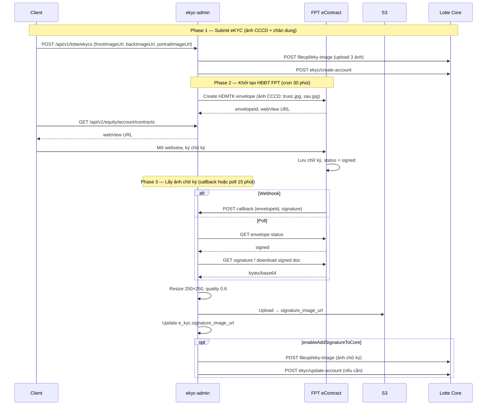

# eKYC: Luồng upload ảnh lên Lotte & khởi tạo HĐĐT với FPT

> **Status:** ✅ Live  
> **Last Updated:** 2026-03-02  
> **Nguồn:** ekyc-admin-prod.sh, EkycService (lotte-bridge), EKYC_SCHEMA, phân tích luồng

---

## 1. Tổng quan

Luồng eKYC TradeX gồm hai phần chính:

1. **Upload ảnh lên Lotte Core** — ảnh CCCD (trước/sau), chân dung, và (sau khi ký) ảnh chữ ký.
2. **Khởi tạo HĐĐT HDMTK với FPT eContract** — tạo envelope trên FPT, khách ký trên webview, ekyc-admin lấy ảnh chữ ký rồi gửi Lotte.

**Service xử lý:** `ekyc-admin` (Java Spring Boot). API submit eKYC (`POST /api/v1/lotte/ekycs`) được route qua Kafka tới ekyc-admin; lotte-bridge chỉ xử lý các API phụ trợ (danh sách ngân hàng, chi nhánh, kiểm tra CCCD, v.v.).

---

## 2. Upload ảnh lên Lotte Core

**Endpoint Lotte:** `POST {LOTTE_API}/tsol/apikey/fileupl/eky-image`

Có hai nhóm ảnh, ở hai thời điểm khác nhau.

### 2.1 Ảnh CCCD + chân dung — gửi khi submit eKYC

Khi khách hàng submit form eKYC (`POST /api/v1/lotte/ekycs`), request body chứa:

| Field | Ý nghĩa |
|-------|---------|
| `frontImageUrl` | Ảnh mặt trước CCCD/CMND |
| `backImageUrl` | Ảnh mặt sau CCCD/CMND |
| `portraitImageUrl` | Ảnh chân dung (selfie) |

**Luồng:**

1. Client gửi `POST /api/v1/lotte/ekycs` (body có 3 URL ảnh trên).
2. rest-proxy forward request (qua Kafka) tới **ekyc-admin**.
3. ekyc-admin gọi Lotte **uploadImageUrl** (`fileupl/eky-image`) để upload từng ảnh.
4. Sau đó gọi **createAccountUrl** (`tsol/apikey/tuxsvc/ekyc/create-account`) để tạo tài khoản tạm tại Lotte.

→ Upload ảnh CCCD + chân dung diễn ra **đồng bộ** ngay khi submit eKYC.

### 2.2 Ảnh chữ ký — gửi sau khi khách ký HĐĐT trên FPT

Ảnh chữ ký **không** có trong request submit eKYC. Client không gửi `signatureImageUrl`. Luồng:

1. Khách ký HĐĐT HDMTK trên FPT eContract (webview).
2. ekyc-admin lấy ảnh chữ ký từ FPT (webhook hoặc polling).
3. Resize 250×250, quality 0.6 → upload S3 → lưu `signature_image_url`.
4. Nếu `enableAddSignatureToCore = true`: gọi Lotte **uploadImageUrl** (ảnh chữ ký) rồi **updateAccountUrl** (`ekyc/update-account`) nếu cần.

→ Upload ảnh chữ ký lên Lotte là **bất đồng bộ**, có độ trễ tối đa theo chu kỳ job (ví dụ 15 phút nếu dùng polling).

**Chi tiết luồng chữ ký từ FPT:** xem [ekyc-signature-from-fpt-econtract.md](./ekyc-signature-from-fpt-econtract.md).

---

## 3. Khởi tạo HĐĐT với FPT eContract

**Host FPT:** `https://econtract.fpt.com/app`  
**Template HDMTK:** `flow_start_nhsv_create_econtract_from_template_integrate`  
**Client FPT:** `fpt_econtract_nhsv_integrate`

### 3.1 Các bước luồng

| Bước | Mô tả | Thực hiện bởi |
|------|--------|----------------|
| **1. Tạo envelope HDMTK** | ekyc-admin gọi FPT API tạo envelope, đính kèm ảnh CCCD (truoc.jpg, sau.jpg) từ bảng `e_kyc` | Cron `initiateFptEContractJob` (30 phút) |
| **2. Khách ký trên FPT** | Client gọi `GET /api/v1/equity/account/contracts` → nhận webView URL → mở iframe FPT, khách vẽ/viết chữ ký | Client (App/Web) |
| **3. FPT lưu chữ ký** | FPT cập nhật envelope, `recipientStatus` = "signed" | FPT eContract |
| **4. Lấy ảnh chữ ký** | ekyc-admin nhận qua callback FPT hoặc polling (GET envelope status → nếu signed thì download ảnh chữ ký) | ekyc-admin (webhook hoặc cron `eKycUpdateAccNumJob` 15 phút) |
| **5. Xử lý & gửi Lotte** | Resize 250×250, quality 0.6 → upload S3 → cập nhật `e_kyc.signature_image_url` → gọi Lotte uploadImageUrl + updateAccountUrl | ekyc-admin |

### 3.2 Config ekyc-admin liên quan (trích từ ekyc-admin-prod.sh)

| Config | Giá trị | Ý nghĩa |
|--------|---------|---------|
| `lotteConfig.uploadImageUrl` | `{rootUrl}/tsol/apikey/fileupl/eky-image` | Upload ảnh (CCCD, chân dung, chữ ký) lên Lotte |
| `lotteConfig.createAccountUrl` | `{rootUrl}/tsol/apikey/tuxsvc/ekyc/create-account` | Tạo tài khoản sau khi có ảnh CCCD + chân dung |
| `lotteConfig.updateAccountUrl` | `{rootUrl}/tsol/apikey/tuxsvc/ekyc/update-account` | Cập nhật tài khoản (ví dụ sau khi có chữ ký) |
| `enableAddSignatureToCore` | true | Bật gửi ảnh chữ ký sang Lotte |
| `resizeSignature.width` / `heigth` | 250 | Kích thước ảnh chữ ký sau resize (px) |
| `resizeSignature.quality` | 0.6 | Chất lượng nén ảnh chữ ký |
| `feignClient.fpt.eContract.host` | https://econtract.fpt.com/app | Host FPT eContract |
| `templateEContract.defaultFields.hdmtk.selector` | flow_start_nhsv_create_econtract_from_template_integrate | Flow tạo HDMTK |
| `cron.initiateFptEContractJob` | `0 */30 * * * ?` | Cron 30 phút — tạo envelope HDMTK trên FPT |
| `cron.eKycUpdateAccNumJob` | `0 */15 * * * ?` | Cron 15 phút — cập nhật số TK, sync chữ ký (nếu dùng polling) |

### 3.3 Điều kiện nghiệp vụ

| Config | Giá trị | Ý nghĩa |
|--------|---------|---------|
| `enableCallTllOpenAccount` | true | Cho phép gọi Lotte tạo tài khoản |
| `matchThresholdPercentToCallTllOpenAccount` | 80.0 | Ngưỡng face matching (%) tối thiểu để gọi Lotte create-account |

### 3.4 Chi tiết job initiateFptEContractJob

Job này **tạo envelope HĐMTK (Hợp đồng Mở Tài khoản)** trên FPT eContract cho các hồ sơ eKYC đủ điều kiện. Không có API HTTP cho client gọi — toàn bộ do cron trong ekyc-admin thực hiện.

#### Mục đích

- Lấy các bản ghi **e_kyc** đã được duyệt/đủ điều kiện (đã có ảnh CCCD, đã tạo tài khoản Lotte, chưa có hợp đồng FPT hoặc chưa gửi FPT).
- Với mỗi bản ghi (hoặc batch): gọi **FPT eContract API** để tạo một **envelope** HDMTK, đính kèm ảnh CCCD (mặt trước / mặt sau) và các field mặc định của template.
- FPT trả về **envelopeId** và thông tin **webView URL** → ekyc-admin lưu (bảng econtract / contract_id trên e_kyc). Sau đó khi khách gọi `GET /api/v1/equity/account/contracts`, BE trả về webView URL để mở màn ký trên FPT.

#### Cấu hình (ekyc-admin-prod.sh)

| Config | Giá trị | Ý nghĩa |
|--------|---------|---------|
| `cron.initiateFptEContractJob` | `0 */30 * * * ?` | Chạy tại giây 0, phút 0 và 30 mỗi giờ → **mỗi 30 phút** |
| `cron.initiateFptEContractJobJobActiveStatus` | true | Job được bật |
| `cron.initiateFptEContractJobIntervalMilliseconds` | 900000 | 900000 ms = 15 phút — thường dùng làm khoảng cách tối thiểu giữa hai lần gửi FPT cho cùng một e_kyc (tránh gọi trùng) |

#### Luồng xử lý (suy từ config)

1. **Kích hoạt:** Theo lịch cron (mỗi 30 phút).
2. **Lọc dữ liệu:** Query DB (bảng `e_kyc`, có thể kèm `econtract`) để lấy các hồ sơ thỏa điều kiện, ví dụ:
   - Đã có `front_image_url`, `back_image_url` (ảnh CCCD),
   - Trạng thái phù hợp (đã duyệt / đã tạo tài khoản Lotte),
   - Chưa có envelope FPT hoặc chưa gửi FPT trong khoảng `initiateFptEContractJobIntervalMilliseconds` (15 phút).
3. **Gọi FPT:** Với mỗi (hoặc batch) e_kyc:
   - Đăng nhập/xác thực FPT: `feignClient.fpt.eContract.loginInfo` (username, password, clientId, clientSecret).
   - Gọi API FPT tại host `https://econtract.fpt.com/app`, flow **`flow_start_nhsv_create_econtract_from_template_integrate`**.
   - Truyền:
     - **Ảnh CCCD:** nội dung từ `front_image_url` / `back_image_url` (FPT nhận dạng theo content-type `truoc.jpg`, `sau.jpg` trong template).
     - **Template HDMTK:** toàn bộ field trong `templateEContract.defaultFields.hdmtk` (selector, recipientId, datas.*).
4. **Nhận kết quả:** FPT trả envelopeId, URL webView (và có thể trạng thái) → ekyc-admin lưu vào DB (econtract / e_kyc.contract_id).
5. **Hậu quả:** Khách gọi `GET /api/v1/equity/account/contracts` sẽ nhận được webView URL tương ứng envelope này để mở iframe FPT và ký.

#### Template HDMTK gửi lên FPT (templateEContract.defaultFields.hdmtk)

| Field | Giá trị | Ghi chú |
|-------|---------|---------|
| `selector` | `flow_start_nhsv_create_econtract_from_template_integrate` | Tên flow FPT dùng để tạo envelope từ template |
| `payload` | PLHD | Mã/loại payload |
| `recipientId` | `p_002_r_001` | Bên nhận ký (khách hàng) trên FPT |
| `alias` | HDMTK | Loại hợp đồng |
| `photoFrontSideIDCardContentType` | truoc.jpg | Ảnh mặt trước CCCD |
| `photoBackSideIDCardContentType` | sau.jpg | Ảnh mặt sau CCCD |
| `country` | Việt Nam | Quốc gia |
| `type` | FCA | Loại tài khoản (FCA) |
| `syncType` | sync | Đồng bộ |

**datas** (nội dung điền vào hợp đồng):

| Field | Ví dụ / Ý nghĩa |
|-------|------------------|
| `dfvP_001` | Tên công ty: CÔNG TY TRÁCH NHIỆM HỮU HẠN CHỨNG KHOÁN NH VIỆT NAM |
| `dfvNhsvRepresentative` | Đại diện NHSV: Ông Kim Jong Seok |
| `dfvNhsvRepresentativePotition` | Chức vụ: Tổng Giám đốc |
| `dfvAccountTypeA` / B / C | Loại tài khoản (x = chọn) |
| `dfvDueDays` | 90 (ngày hiệu lực) |
| `dfvIssueOrganization_*` | Cơ quan cấp CCCD (Cục cảnh sát QLHC về TTXH, ĐKDL Cư trú...) |
| Các field khác | Số envelope mẫu, nơi nộp, email/phone recipient mặc định... |

*(Giá trị thực cho từng hồ sơ — tên khách, CCCD, v.v. — do ekyc-admin map từ bảng `e_kyc` và có thể override trong code; config trên là giá trị mặc định.)*

#### Lưu ý

- **Code chi tiết** (điều kiện query e_kyc, batch size, retry, mapping từ e_kyc sang payload FPT) nằm trong repo **ekyc-admin** (nhsv-dev), không có trong workspace TradeX Monitoring.
- **FPT eContract API** (path, method, body chuẩn) do FPT cung cấp; ekyc-admin gọi qua Feign client với host và flow đã nêu.

---

## 4. Sơ đồ luồng tổng hợp

---

## 5. Tóm tắt thời điểm upload ảnh

| Loại ảnh | Thời điểm | Cách gửi lên Lotte |
|----------|-----------|---------------------|
| Mặt trước CCCD | Khi submit eKYC | ekyc-admin gọi uploadImageUrl rồi create-account |
| Mặt sau CCCD | Khi submit eKYC | Cùng luồng trên |
| Chân dung | Khi submit eKYC | Cùng luồng trên |
| Chữ ký | Sau khi khách ký HĐĐT trên FPT | Job/webhook lấy từ FPT → resize → uploadImageUrl + updateAccountUrl |

---

## 6. Tài liệu liên quan

| Document | Nội dung |
|----------|----------|
| [ekyc-signature-from-fpt-econtract.md](./ekyc-signature-from-fpt-econtract.md) | Chi tiết lấy ảnh chữ ký từ FPT, config resize, cơ chế callback/poll |
| [ekyc-account-created-error-handling.md](./ekyc-account-created-error-handling.md) | Xử lý lỗi ACCOUNT_CREATED khi submit eKYC (CCCD đã có tài khoản) |

---

**Document Status:** ✅ Live  
**For:** PM, BA, Developers  
**Next Steps:** Xác minh trong repo ekyc-admin (nhsv-dev) cơ chế lấy chữ ký từ FPT là webhook hay polling.
