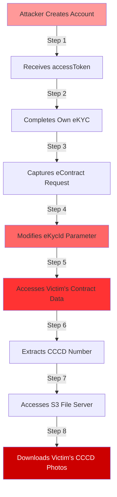

# IDOR Security Vulnerability - Remediation Plan

> [!CAUTION]
> **CRITICAL SECURITY VULNERABILITY DETECTED**
> 
> Severity: **CRITICAL**  
> Impact: **Complete PII Data Exposure**  
> Affected System: **NHSV Pro Android App - eKYC Module**  
> Date Reported: 23/12/2025

---

## Executive Summary

A critical Insecure Direct Object Reference (IDOR) vulnerability has been identified in the eKYC functionality that allows unauthorized access to all user PII data including:
- National ID (CCCD) numbers
- Contract numbers
- Phone numbers
- Email addresses
- CCCD photographs (via unauthenticated S3 access)

**Attack Vector**: Manipulating `eKycId` parameter in API requests allows access to other users' eContract data and identity documents.

**Business Impact**: 
- Complete breach of user privacy
- Regulatory compliance violations (GDPR, PDPA)
- Potential identity theft and fraud
- Severe reputational damage
- Legal liability

---

## Vulnerability Analysis

### Attack Chain



### Affected Components

1. **eKYC API Endpoint** - Missing authorization checks
2. **eContract Integration** - Trusts client-provided IDs
3. **S3 File Server** - No authentication required
4. **Mobile App** - Client-side authorization only

---

## Epic Breakdown

### Epic 1: Emergency Security Patch (P0 - CRITICAL)
**Priority**: P0 - Must be deployed immediately  
**Timeline**: 3-5 days  
**Team**: All hands on deck

#### Stories:

##### SECURITY-001: Implement Server-Side Authorization for eKYC Endpoints
**Priority**: P0  
**Story Points**: 8  
**Assignee**: Backend Lead + Security Engineer

**Description**:
Implement proper object-level authorization on all eKYC-related API endpoints to ensure users can only access their own data.

**Acceptance Criteria**:
- [ ] Add authorization middleware to verify `userId` from JWT matches the resource owner
- [ ] Implement check: `eKycRecord.userId === authenticatedUser.userId`
- [ ] Return 403 Forbidden if authorization fails
- [ ] Add audit logging for all authorization failures
- [ ] Block requests where `eKycId` doesn't belong to authenticated user
- [ ] Add rate limiting to prevent brute force attacks (max 10 requests/minute per user)

**Technical Implementation**:
```javascript
// Middleware example
async function authorizeEkycAccess(req, res, next) {
  const { eKycId } = req.params;
  const userId = req.user.id; // from JWT
  
  const ekycRecord = await EkycModel.findById(eKycId);
  
  if (!ekycRecord) {
    return res.status(404).json({ error: 'Resource not found' });
  }
  
  if (ekycRecord.userId !== userId) {
    // Log security incident
    await auditLog.logUnauthorizedAccess({
      userId,
      attemptedResource: eKycId,
      timestamp: new Date(),
      ip: req.ip
    });
    
    return res.status(403).json({ error: 'Access denied' });
  }
  
  next();
}
```

**Testing Requirements**:
- [ ] Unit tests for authorization middleware
- [ ] Integration tests attempting cross-user access
- [ ] Penetration test to verify fix
- [ ] Load test to ensure no performance degradation

**Dependencies**: None (highest priority)

---

##### SECURITY-002: Secure S3 File Server Access
**Priority**: P0  
**Story Points**: 5  
**Assignee**: Backend + DevOps

**Description**:
Implement authentication and authorization for S3 file server access to prevent unauthorized access to CCCD images.

**Acceptance Criteria**:
- [ ] Remove public access from S3 bucket
- [ ] Implement pre-signed URL generation with expiration (15 minutes)
- [ ] Add authorization check before generating pre-signed URLs
- [ ] Verify user owns the CCCD record before granting access
- [ ] Add watermarking to CCCD images with user ID
- [ ] Implement access logging for all file downloads

**Technical Implementation**:
```javascript
// Generate pre-signed URL only after authorization
async function getCccdImage(req, res) {
  const { cccdNumber } = req.params;
  const userId = req.user.id;
  
  // Verify ownership
  const ekycRecord = await EkycModel.findOne({ 
    userId, 
    cccdNumber 
  });
  
  if (!ekycRecord) {
    await auditLog.logUnauthorizedFileAccess({
      userId,
      attemptedCccd: cccdNumber,
      timestamp: new Date()
    });
    return res.status(403).json({ error: 'Access denied' });
  }
  
  // Generate pre-signed URL with 15-minute expiration
  const presignedUrl = await s3.getSignedUrl('getObject', {
    Bucket: 'cccd-images',
    Key: `${cccdNumber}.jpg`,
    Expires: 900 // 15 minutes
  });
  
  res.json({ url: presignedUrl });
}
```

**Testing Requirements**:
- [ ] Verify public access is blocked
- [ ] Test pre-signed URL expiration
- [ ] Test cross-user access attempts
- [ ] Verify watermarking is applied

**Dependencies**: None

---

##### SECURITY-003: Implement UUID-Based Resource Identifiers
**Priority**: P0  
**Story Points**: 13  
**Assignee**: Backend Team

**Description**:
Replace sequential integer IDs with UUIDs to prevent enumeration attacks.

**Acceptance Criteria**:
- [ ] Migrate `eKycId` from integer to UUID v4
- [ ] Update database schema with UUID column
- [ ] Create migration script with zero downtime
- [ ] Update all API endpoints to use UUID
- [ ] Maintain backward compatibility during transition period
- [ ] Update mobile app to handle UUID format
- [ ] Add database indexes for UUID lookups

**Migration Strategy**:
1. Add new UUID column to eKYC table
2. Generate UUIDs for all existing records
3. Update API to accept both formats (transition period)
4. Update mobile app to use UUIDs
5. Deprecate integer ID endpoints
6. Remove integer ID column after full migration

**Testing Requirements**:
- [ ] Test migration script on staging data
- [ ] Verify no data loss during migration
- [ ] Test API with both ID formats
- [ ] Performance test UUID lookups
- [ ] Test mobile app compatibility

**Dependencies**: SECURITY-001, SECURITY-002

---

### Epic 2: eContract Integration Security (P0 - CRITICAL)
**Priority**: P0  
**Timeline**: 5-7 days

#### Stories:

##### SECURITY-004: Secure eContract Third-Party Integration
**Priority**: P0  
**Story Points**: 8  
**Assignee**: Backend + Integration Team

**Description**:
Implement secure token exchange with eContract system to prevent unauthorized access.

**Acceptance Criteria**:
- [ ] Implement server-to-server token exchange (no client exposure)
- [ ] Generate unique session tokens per user request
- [ ] Add token expiration (30 minutes)
- [ ] Bind tokens to specific user ID and IP address
- [ ] Validate token ownership before displaying WebView
- [ ] Implement token revocation mechanism
- [ ] Add CSRF protection for WebView interactions

**Technical Implementation**:
```javascript
// Server-side token generation
async function generateEcontractToken(req, res) {
  const userId = req.user.id;
  const ekycId = req.params.ekycId;
  
  // Verify ownership
  const ekycRecord = await EkycModel.findOne({ 
    id: ekycId, 
    userId 
  });
  
  if (!ekycRecord) {
    return res.status(403).json({ error: 'Access denied' });
  }
  
  // Generate secure token bound to user
  const token = await econtractService.createSession({
    userId,
    ekycId,
    ipAddress: req.ip,
    expiresIn: 1800 // 30 minutes
  });
  
  // Store token mapping server-side
  await TokenMapping.create({
    token,
    userId,
    ekycId,
    ipAddress: req.ip,
    expiresAt: Date.now() + 1800000
  });
  
  res.json({ 
    url: `${ECONTRACT_URL}?token=${token}`,
    expiresIn: 1800
  });
}
```

**Testing Requirements**:
- [ ] Test token expiration
- [ ] Test IP binding validation
- [ ] Test cross-user token usage attempts
- [ ] Test CSRF protection
- [ ] Load test token generation

**Dependencies**: SECURITY-001

---

##### SECURITY-005: Implement Request Signing for eContract API
**Priority**: P0  
**Story Points**: 5  
**Assignee**: Backend

**Description**:
Add cryptographic request signing to prevent request tampering.

**Acceptance Criteria**:
- [ ] Implement HMAC-SHA256 request signing
- [ ] Include timestamp in signature to prevent replay attacks
- [ ] Validate signature on server side
- [ ] Reject requests with invalid signatures
- [ ] Implement signature key rotation mechanism
- [ ] Add monitoring for signature validation failures

**Testing Requirements**:
- [ ] Test signature validation
- [ ] Test replay attack prevention
- [ ] Test key rotation
- [ ] Performance test signing overhead

**Dependencies**: SECURITY-004

---

### Epic 3: Comprehensive Security Audit (P1 - HIGH)
**Priority**: P1  
**Timeline**: 7-10 days

#### Stories:

##### SECURITY-006: Complete API Security Audit
**Priority**: P1  
**Story Points**: 13  
**Assignee**: Security Team + Backend Lead

**Description**:
Conduct comprehensive security audit of all API endpoints to identify similar IDOR vulnerabilities.

**Acceptance Criteria**:
- [ ] Audit all API endpoints for authorization checks
- [ ] Create inventory of all endpoints with user-specific data
- [ ] Identify all endpoints using sequential IDs
- [ ] Document authorization model for each endpoint
- [ ] Create security test suite for all endpoints
- [ ] Generate security audit report
- [ ] Prioritize remediation of findings

**Audit Checklist**:
- [ ] User profile endpoints
- [ ] Transaction history endpoints
- [ ] Document upload/download endpoints
- [ ] Account management endpoints
- [ ] Payment endpoints
- [ ] Notification endpoints
- [ ] Settings endpoints

**Deliverables**:
- Security audit report (PDF)
- Vulnerability matrix (spreadsheet)
- Remediation roadmap
- Security test suite

**Dependencies**: None

---

##### SECURITY-007: Implement Automated Security Testing
**Priority**: P1  
**Story Points**: 8  
**Assignee**: QA + Security Engineer

**Description**:
Set up automated security testing in CI/CD pipeline to prevent future vulnerabilities.

**Acceptance Criteria**:
- [ ] Integrate OWASP ZAP or similar tool in CI/CD
- [ ] Create automated IDOR test cases
- [ ] Add authorization tests for all endpoints
- [ ] Implement pre-deployment security gate
- [ ] Set up security scanning for dependencies
- [ ] Configure alerts for security test failures
- [ ] Create security testing documentation

**Tools to Implement**:
- OWASP ZAP for dynamic testing
- SonarQube for static analysis
- npm audit / Snyk for dependency scanning
- Custom authorization test framework

**Testing Requirements**:
- [ ] Test all endpoints for IDOR vulnerabilities
- [ ] Test for SQL injection
- [ ] Test for XSS vulnerabilities
- [ ] Test for CSRF vulnerabilities
- [ ] Test authentication bypass attempts

**Dependencies**: SECURITY-006

---

##### SECURITY-008: Security Awareness Training
**Priority**: P1  
**Story Points**: 3  
**Assignee**: Security Team + HR

**Description**:
Conduct security training for development team on secure coding practices.

**Acceptance Criteria**:
- [ ] Create IDOR vulnerability training materials
- [ ] Conduct workshop on OWASP Top 10
- [ ] Create secure coding guidelines document
- [ ] Implement code review checklist for security
- [ ] Set up regular security training schedule (quarterly)
- [ ] Track training completion for all developers

**Training Topics**:
- IDOR vulnerabilities and prevention
- OWASP Top 10
- Secure authentication and authorization
- Input validation and sanitization
- Secure file handling
- API security best practices

**Dependencies**: None

---

### Epic 4: Monitoring & Incident Response (P1 - HIGH)
**Priority**: P1  
**Timeline**: 5-7 days

#### Stories:

##### SECURITY-009: Implement Security Monitoring & Alerting
**Priority**: P1  
**Story Points**: 8  
**Assignee**: DevOps + Security Engineer

**Description**:
Set up comprehensive security monitoring to detect and alert on suspicious activities.

**Acceptance Criteria**:
- [ ] Implement audit logging for all authorization failures
- [ ] Set up alerts for repeated authorization failures (>5 in 5 minutes)
- [ ] Monitor for sequential ID enumeration attempts
- [ ] Track unusual access patterns (accessing many records quickly)
- [ ] Implement SIEM integration (Splunk/ELK)
- [ ] Create security dashboard in Grafana
- [ ] Set up PagerDuty alerts for critical security events

**Metrics to Monitor**:
- Authorization failure rate
- Failed login attempts
- API error rate (403/401)
- Unusual access patterns
- File download frequency
- Token generation rate

**Alert Conditions**:
- More than 5 authorization failures in 5 minutes from same user
- More than 10 different eKycId access attempts in 1 minute
- Access to more than 20 CCCD images in 1 hour
- Token generation rate exceeds 100/minute

**Dependencies**: SECURITY-001, SECURITY-002

---

##### SECURITY-010: Incident Response Plan
**Priority**: P1  
**Story Points**: 5  
**Assignee**: Security Team + Management

**Description**:
Create and document incident response plan for security breaches.

**Acceptance Criteria**:
- [ ] Document incident response procedures
- [ ] Define incident severity levels
- [ ] Create communication templates for users
- [ ] Establish incident response team roles
- [ ] Create runbook for common security incidents
- [ ] Set up incident tracking system
- [ ] Conduct incident response drill

**Incident Response Procedures**:
1. **Detection**: Automated alerts or manual report
2. **Containment**: Disable affected endpoints/accounts
3. **Investigation**: Analyze logs, identify scope
4. **Eradication**: Deploy fixes, patch vulnerabilities
5. **Recovery**: Restore services, verify security
6. **Post-Incident**: Document lessons learned, update procedures

**Deliverables**:
- Incident response playbook
- Communication templates
- Escalation matrix
- Post-incident report template

**Dependencies**: SECURITY-009

---

##### SECURITY-011: Forensic Investigation of Existing Breach
**Priority**: P0  
**Story Points**: 8  
**Assignee**: Security Team + Legal

**Description**:
Investigate if the vulnerability has been exploited and identify affected users.

**Acceptance Criteria**:
- [ ] Analyze access logs for suspicious patterns
- [ ] Identify all instances of cross-user data access
- [ ] Create list of potentially affected users
- [ ] Determine scope and timeline of potential breach
- [ ] Document findings for legal/compliance team
- [ ] Prepare user notification if required
- [ ] Report to regulatory authorities if required (GDPR/PDPA)

**Investigation Steps**:
1. Analyze API access logs for last 6 months
2. Identify requests with mismatched userId and eKycId
3. Track S3 access logs for unauthorized downloads
4. Correlate suspicious activities
5. Determine data exposure scope
6. Assess legal notification requirements

**Legal Considerations**:
- GDPR breach notification (72 hours)
- PDPA compliance requirements
- User notification obligations
- Regulatory reporting

**Dependencies**: None (run in parallel with fixes)

---

### Epic 5: Long-Term Security Improvements (P2 - MEDIUM)
**Priority**: P2  
**Timeline**: 2-3 weeks

#### Stories:

##### SECURITY-012: Implement API Rate Limiting & Throttling
**Priority**: P2  
**Story Points**: 5  
**Assignee**: Backend + DevOps

**Description**:
Implement comprehensive rate limiting to prevent abuse and enumeration attacks.

**Acceptance Criteria**:
- [ ] Implement rate limiting per user (100 requests/minute)
- [ ] Implement rate limiting per IP (500 requests/minute)
- [ ] Add exponential backoff for repeated violations
- [ ] Implement CAPTCHA for suspicious activities
- [ ] Create rate limit monitoring dashboard
- [ ] Document rate limits in API documentation

**Rate Limit Tiers**:
- **Per User**: 100 requests/minute, 5000 requests/hour
- **Per IP**: 500 requests/minute, 20000 requests/hour
- **Sensitive Endpoints** (eKYC, files): 10 requests/minute

**Dependencies**: SECURITY-001

---

##### SECURITY-013: Implement Data Encryption at Rest
**Priority**: P2  
**Story Points**: 13  
**Assignee**: Backend + DevOps

**Description**:
Encrypt sensitive PII data at rest to add defense-in-depth.

**Acceptance Criteria**:
- [ ] Implement database encryption for PII fields
- [ ] Encrypt CCCD images in S3 with KMS
- [ ] Implement key rotation mechanism
- [ ] Update backup procedures for encrypted data
- [ ] Document encryption key management
- [ ] Test restore procedures with encrypted data

**Fields to Encrypt**:
- CCCD number
- Phone number
- Email address
- Contract number
- Full name
- Address

**Dependencies**: None

---

##### SECURITY-014: Implement Field-Level Access Control
**Priority**: P2  
**Story Points**: 8  
**Assignee**: Backend

**Description**:
Implement granular field-level access control for sensitive data.

**Acceptance Criteria**:
- [ ] Define access levels (user, support, admin)
- [ ] Implement field masking for support staff
- [ ] Add audit logging for sensitive field access
- [ ] Create access control policy engine
- [ ] Implement "need-to-know" principle
- [ ] Add UI indicators for sensitive data access

**Access Levels**:
- **User**: Full access to own data
- **Support**: Masked view (last 4 digits of CCCD)
- **Admin**: Full access with audit logging
- **System**: Automated processes only

**Dependencies**: SECURITY-001

---

## Implementation Timeline

```mermaid
gantt
    title Security Remediation Timeline
    dateFormat YYYY-MM-DD
    section P0 - Critical
    SECURITY-001: Authorization     :crit, s1, 2025-12-24, 3d
    SECURITY-002: S3 Security        :crit, s2, 2025-12-24, 2d
    SECURITY-003: UUID Migration     :crit, s3, 2025-12-27, 5d
    SECURITY-004: eContract Security :crit, s4, 2025-12-27, 4d
    SECURITY-005: Request Signing    :crit, s5, 2025-12-31, 2d
    SECURITY-011: Forensics          :crit, s11, 2025-12-24, 5d
    
    section P1 - High
    SECURITY-006: API Audit          :p1, s6, 2026-01-02, 7d
    SECURITY-007: Automated Testing  :p1, s7, 2026-01-06, 5d
    SECURITY-008: Training           :p1, s8, 2026-01-02, 3d
    SECURITY-009: Monitoring         :p1, s9, 2026-01-02, 5d
    SECURITY-010: Incident Response  :p1, s10, 2026-01-06, 3d
    
    section P2 - Medium
    SECURITY-012: Rate Limiting      :p2, s12, 2026-01-09, 3d
    SECURITY-013: Encryption         :p2, s13, 2026-01-13, 7d
    SECURITY-014: Access Control     :p2, s14, 2026-01-20, 5d
```

**Critical Path**: 
1. Deploy SECURITY-001, SECURITY-002 immediately (Days 1-3)
2. Deploy SECURITY-004, SECURITY-005 (Days 4-7)
3. Complete SECURITY-003 UUID migration (Days 4-10)
4. Run SECURITY-011 forensics in parallel (Days 1-5)

---

## Resource Allocation

### Emergency Response Team (Week 1)
- **Backend Lead**: Full-time on SECURITY-001, 003, 004
- **Backend Developer 1**: Full-time on SECURITY-002, 005
- **Backend Developer 2**: Full-time on SECURITY-003
- **DevOps Engineer**: Full-time on SECURITY-002, 009
- **Security Engineer**: Full-time on SECURITY-011, 006
- **QA Engineer**: Full-time on testing all fixes
- **Mobile Developer**: Part-time on UUID migration support

### Post-Emergency Team (Weeks 2-3)
- **Security Team**: SECURITY-006, 007, 008, 010
- **Backend Team**: SECURITY-012, 013, 014
- **DevOps**: SECURITY-009, monitoring setup

---

## Testing Strategy

### Pre-Deployment Testing Checklist

#### Unit Tests
- [ ] Authorization middleware tests
- [ ] UUID generation and validation tests
- [ ] Token generation and validation tests
- [ ] Signature verification tests

#### Integration Tests
- [ ] Cross-user access attempts (should fail)
- [ ] Valid user access (should succeed)
- [ ] Token expiration tests
- [ ] Pre-signed URL expiration tests

#### Security Tests
- [ ] IDOR vulnerability test (should be fixed)
- [ ] Enumeration attack test (should be blocked)
- [ ] Brute force test (should be rate-limited)
- [ ] Token replay attack (should fail)

#### Performance Tests
- [ ] Authorization check latency (<50ms)
- [ ] UUID lookup performance
- [ ] Rate limiting overhead
- [ ] Pre-signed URL generation time

#### Penetration Tests
- [ ] External pentest to verify fixes
- [ ] Red team exercise
- [ ] Bug bounty program launch

---

## Deployment Strategy

### Phase 1: Emergency Hotfix (Days 1-3)
**Deploy**: SECURITY-001, SECURITY-002

**Deployment Steps**:
1. Deploy to staging environment
2. Run full test suite
3. Conduct manual security testing
4. Deploy to production during maintenance window
5. Monitor for 24 hours
6. Rollback plan ready

**Rollback Criteria**:
- Authorization failures >5%
- API error rate >1%
- Performance degradation >20%

### Phase 2: Integration Security (Days 4-7)
**Deploy**: SECURITY-004, SECURITY-005

**Deployment Steps**:
1. Coordinate with eContract team
2. Deploy to staging and test integration
3. Gradual rollout (10% → 50% → 100%)
4. Monitor token generation and validation
5. Full deployment after 48 hours

### Phase 3: UUID Migration (Days 4-10)
**Deploy**: SECURITY-003

**Deployment Steps**:
1. Run migration script in maintenance window
2. Verify data integrity
3. Deploy API changes supporting both formats
4. Update mobile app (gradual rollout)
5. Monitor for 1 week
6. Deprecate old format

---

## Success Criteria

### Security Metrics
- [ ] Zero successful IDOR attacks in penetration testing
- [ ] 100% of API endpoints have authorization checks
- [ ] All sensitive files require authentication
- [ ] Authorization failure rate <0.1%
- [ ] No sequential IDs exposed in APIs

### Performance Metrics
- [ ] Authorization check latency <50ms (p95)
- [ ] API response time increase <10%
- [ ] Pre-signed URL generation <100ms
- [ ] Rate limiting overhead <5ms

### Compliance Metrics
- [ ] GDPR compliance verified
- [ ] PDPA compliance verified
- [ ] Security audit passed
- [ ] Penetration test passed

---

## Communication Plan

### Internal Communication
- **Daily Standups**: Security team + Engineering (15 min)
- **Status Updates**: Every 6 hours to management
- **Incident Reports**: Daily summary to executives
- **Post-Mortem**: After all P0 issues resolved

### External Communication (if breach confirmed)
- **User Notification**: Within 72 hours (GDPR requirement)
- **Regulatory Notification**: As required by law
- **Public Statement**: Coordinated with PR/Legal
- **Customer Support**: FAQ and support scripts

### User Notification Template (if needed)
```
Subject: Important Security Update - Action Required

Dear [User Name],

We are writing to inform you about a security update to our eKYC system.

What happened:
We identified and fixed a security vulnerability that could have allowed 
unauthorized access to user information.

What information was involved:
[List specific data types based on forensic investigation]

What we're doing:
- We have fixed the vulnerability
- We are conducting a thorough investigation
- We have enhanced our security measures
- We are offering [credit monitoring/identity protection services]

What you should do:
- Monitor your accounts for suspicious activity
- Change your password
- Enable two-factor authentication
- Contact us if you notice anything unusual

We sincerely apologize for this incident and are committed to protecting 
your information.

For questions: security@company.com | 1-800-XXX-XXXX
```

---

## Post-Remediation Actions

### Immediate (Week 1)
- [ ] Deploy all P0 fixes
- [ ] Complete forensic investigation
- [ ] Notify affected users (if applicable)
- [ ] File regulatory reports (if required)

### Short-term (Weeks 2-4)
- [ ] Complete all P1 security improvements
- [ ] Conduct external penetration test
- [ ] Update security policies and procedures
- [ ] Complete security training for all developers

### Long-term (Months 2-3)
- [ ] Implement all P2 improvements
- [ ] Launch bug bounty program
- [ ] Quarterly security audits
- [ ] Annual penetration testing

### Continuous
- [ ] Security monitoring and alerting
- [ ] Regular security training
- [ ] Code review with security focus
- [ ] Automated security testing in CI/CD

---

## Lessons Learned

### Root Causes
1. **Lack of server-side authorization**: Relied on client-side checks
2. **Sequential IDs**: Enabled enumeration attacks
3. **Public S3 access**: No authentication on file server
4. **Insufficient security testing**: IDOR not caught in QA
5. **No security training**: Developers unaware of IDOR risks

### Process Improvements
1. **Mandatory security review**: For all API changes
2. **Security champions**: Designate security lead per team
3. **Threat modeling**: For all new features
4. **Security testing**: Automated IDOR tests in CI/CD
5. **Regular training**: Quarterly security workshops

### Technical Improvements
1. **Authorization framework**: Centralized authorization logic
2. **Security libraries**: Reusable security components
3. **Secure defaults**: All new APIs require explicit authorization
4. **Monitoring**: Real-time security event detection
5. **Encryption**: Defense-in-depth for sensitive data

---

## Appendix

### A. OWASP IDOR Prevention Cheat Sheet
- Always verify user owns the requested resource
- Use UUIDs instead of sequential IDs
- Implement proper session management
- Use indirect reference maps
- Log all authorization failures

### B. Regulatory Requirements
- **GDPR**: 72-hour breach notification
- **PDPA**: Notification to authorities and users
- **PCI-DSS**: If payment data involved
- **SOC 2**: Incident response documentation

### C. Security Testing Checklist
- [ ] IDOR testing for all endpoints
- [ ] Authentication bypass attempts
- [ ] Authorization bypass attempts
- [ ] Session management testing
- [ ] Input validation testing
- [ ] File upload/download security

### D. Useful Resources
- [OWASP Top 10](https://owasp.org/www-project-top-ten/)
- [OWASP API Security Top 10](https://owasp.org/www-project-api-security/)
- [OWASP Testing Guide](https://owasp.org/www-project-web-security-testing-guide/)
- [CWE-639: IDOR](https://cwe.mitre.org/data/definitions/639.html)

---

## Document Control

**Version**: 1.0  
**Created**: 2026-01-20  
**Last Updated**: 2026-01-20  
**Owner**: Security Team  
**Classification**: CONFIDENTIAL - INTERNAL USE ONLY

**Review Schedule**: Daily during remediation, weekly after deployment

**Approval**:
- [ ] Security Lead
- [ ] Engineering Director
- [ ] CTO
- [ ] Legal/Compliance
