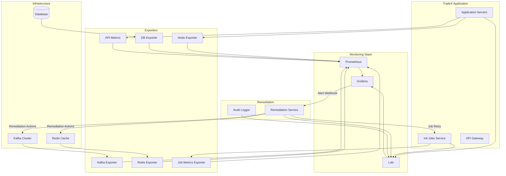

# TradeX Stability Monitor Tool - Epics & Stories Breakdown

## Overview

This document provides a comprehensive breakdown of the TradeX Stability Monitor Tool into epics and user stories, designed for integration with **Grafana** and the modern observability stack.

## Technology Stack Recommendation

### Monitoring & Visualization
- **Grafana** - Primary dashboard and visualization platform
- **Prometheus** - Metrics collection and time-series database
- **Loki** - Log aggregation and querying
- **Tempo** - Distributed tracing (optional, for API tracing)

### Data Collection & Instrumentation
- **Prometheus Exporters** - For Kafka, Redis, PostgreSQL/MySQL
- **Node Exporter** - For server metrics (CPU, RAM, Disk)
- **Custom Exporters** - For TradeX-specific metrics (jobs, APIs)

### Alerting & Notification
- **Grafana Alerting** - Native alerting engine (Grafana 8+)
- **AlertManager** - Advanced alert routing and deduplication

### Automation & Remediation
- **Custom Python/Go Services** - For automated remediation actions
- **Webhook Integration** - Trigger remediation from Grafana alerts

---

## Epic Breakdown

### Epic 1: Real-Time System Monitoring Infrastructure

**Goal**: Establish comprehensive real-time monitoring for all critical TradeX infrastructure components with 15-second granularity.

#### Story 1.1: Prometheus & Grafana Setup
**As a** DevOps engineer  
**I want to** set up Prometheus and Grafana infrastructure  
**So that** we have a foundation for metrics collection and visualization

**Acceptance Criteria**:
- [ ] Prometheus server deployed and configured
- [ ] Grafana instance deployed and connected to Prometheus
- [ ] Data retention configured (30 days minimum)
- [ ] High availability setup (optional, for production)
- [ ] Authentication and authorization configured

**Technical Tasks**:
- Install Prometheus with 15-second scrape interval
- Install Grafana (latest stable version)
- Configure Prometheus as Grafana data source
- Set up persistent storage for metrics
- Configure backup strategy

**Estimated Effort**: 3-5 days

---

#### Story 1.2: Kafka Cluster Monitoring
**As a** system administrator  
**I want to** monitor Kafka cluster health in real-time  
**So that** I can detect and resolve issues before they impact trading

**Acceptance Criteria**:
- [ ] Kafka metrics exposed to Prometheus (JMX Exporter)
- [ ] Grafana dashboard showing:
  - Broker status (up/down)
  - Topic partition count
  - Consumer lag by consumer group
  - Message throughput (messages/sec)
  - Disk usage per broker
- [ ] Metrics updated every 15 seconds
- [ ] Auto-refresh enabled on dashboard

**Technical Tasks**:
- Deploy Kafka JMX Exporter on each broker
- Configure Prometheus to scrape Kafka metrics
- Create Grafana dashboard with panels for:
  - Cluster overview
  - Topic metrics
  - Consumer lag (critical for AC #4.2)
  - Broker resource usage
- Set up dashboard variables for filtering by topic/consumer group

**Estimated Effort**: 5-8 days

---

#### Story 1.3: Redis Cache Monitoring
**As a** system administrator  
**I want to** monitor Redis cache performance and memory usage  
**So that** I can prevent cache-related outages

**Acceptance Criteria**:
- [ ] Redis metrics exposed to Prometheus
- [ ] Grafana dashboard showing:
  - Connection status
  - Memory usage (% and absolute)
  - Hit/miss ratio
  - Commands per second
  - Evicted keys
  - Connected clients
- [ ] Metrics updated every 15 seconds
- [ ] Memory threshold alerts configured (>90%)

**Technical Tasks**:
- Deploy Redis Exporter for Prometheus
- Configure Prometheus to scrape Redis metrics
- Create Grafana dashboard with:
  - Memory usage gauge with threshold markers
  - Cache performance metrics
  - Connection pool status
- Configure alert rules for high memory (AC #4.1)

**Estimated Effort**: 3-5 days

---

#### Story 1.4: Database Connection Monitoring
**As a** system administrator  
**I want to** monitor database connection health  
**So that** I can ensure database availability for trading operations

**Acceptance Criteria**:
- [ ] Database metrics exposed to Prometheus
- [ ] Grafana dashboard showing:
  - Connection pool status (active/idle/max)
  - Query performance (slow queries)
  - Database size and growth
  - Replication lag (if applicable)
  - Transaction rate
- [ ] Metrics updated every 15 seconds
- [ ] Connection threshold alerts

**Technical Tasks**:
- Deploy PostgreSQL/MySQL Exporter
- Configure Prometheus scraping
- Create Grafana dashboard with:
  - Connection pool visualization
  - Query performance panels
  - Database health indicators
- Set up alerts for connection pool exhaustion

**Estimated Effort**: 3-5 days

---

#### Story 1.5: Application Server Monitoring
**As a** system administrator  
**I want to** monitor application server resources (CPU, RAM, Disk)  
**So that** I can detect resource bottlenecks

**Acceptance Criteria**:
- [ ] Node Exporter deployed on all app servers
- [ ] Grafana dashboard showing per-server:
  - CPU usage (%)
  - Memory usage (% and absolute)
  - Disk usage (% and I/O)
  - Network I/O
  - System load average
- [ ] Metrics updated every 15 seconds
- [ ] Multi-server overview with drill-down capability

**Technical Tasks**:
- Deploy Node Exporter on all application servers
- Configure Prometheus service discovery or static targets
- Create Grafana dashboard with:
  - Server overview table
  - Resource usage graphs
  - Heatmaps for CPU/memory distribution
- Configure alerts for resource thresholds (CPU >80%, Memory >85%, Disk >90%)

**Estimated Effort**: 3-5 days

---

### Epic 2: Init Job Monitoring & Management

**Goal**: Provide comprehensive monitoring, alerting, and management capabilities for scheduled init jobs.

#### Story 2.1: Job Metrics Collection
**As a** developer  
**I want to** instrument init jobs to export metrics  
**So that** job execution can be monitored in Grafana

**Acceptance Criteria**:
- [ ] Custom Prometheus exporter for job metrics
- [ ] Metrics exposed:
  - Job status (OK, FAIL, RUNNING, WAITING)
  - Job start time
  - Job duration
  - Job last success timestamp
  - Job failure count
- [ ] Metrics for both jobs:
  - Market data retrieval (Lotte)
  - Vietstock rights & adjusted price

**Technical Tasks**:
- Create custom Python/Go exporter for job metrics
- Instrument job execution code to update metrics:
  - On job start: update status to RUNNING, record start time
  - On job completion: update status to OK/FAIL, record duration
  - On job failure: increment failure counter
- Expose metrics endpoint for Prometheus
- Configure Prometheus to scrape job metrics

**Estimated Effort**: 5-8 days

---

#### Story 2.2: Job Monitoring Dashboard
**As a** system administrator  
**I want to** view job status and execution history in Grafana  
**So that** I can quickly identify job issues

**Acceptance Criteria**:
- [ ] Grafana dashboard displaying:
  - Job status table (as shown in requirements)
  - Job duration trends
  - Job failure history
  - Job execution timeline
- [ ] Status indicators: ✓ OK, ✗ FAIL, ⟳ RUNNING, ⏸ WAITING
- [ ] Color-coded status (green/red/yellow/gray)
- [ ] Drill-down to job logs (via Loki integration)

**Technical Tasks**:
- Create Grafana dashboard with:
  - Table panel showing job name, status, start time, duration
  - Time-series graph of job durations
  - Stat panels for success/failure counts
- Configure panel transformations for status formatting
- Add links to Loki logs for detailed job execution logs
- Set up dashboard variables for date range filtering

**Estimated Effort**: 5-8 days

---

#### Story 2.3: Job Alerting Rules
**As a** system administrator  
**I want to** receive alerts for job failures and anomalies  
**So that** I can quickly address issues

**Acceptance Criteria**:
- [ ] Alert rules configured:
  - Job failed → Alert immediately
  - Job duration > 2x baseline → Warning alert
  - Job not started by scheduled time → Alert immediately
- [ ] Alerts sent via multiple channels (email, Slack, PagerDuty)
- [ ] Alert includes job name, status, duration, and link to dashboard

**Technical Tasks**:
- Configure Grafana alert rules:
  - Rule 1: `job_status == FAIL` → Critical alert
  - Rule 2: `job_duration > (avg_over_time(job_duration[7d]) * 2)` → Warning alert
  - Rule 3: `time() - job_last_start > scheduled_interval` → Critical alert
- Set up notification channels (email, Slack webhook)
- Configure alert message templates with context
- Test alert delivery and escalation

**Estimated Effort**: 3-5 days

---

#### Story 2.4: Job Retry Mechanism
**As a** system administrator  
**I want to** retry failed jobs from the Grafana UI  
**So that** I can recover from transient failures without manual intervention

**Acceptance Criteria**:
- [ ] Retry button/link in Grafana dashboard
- [ ] Retry triggers job re-execution
- [ ] Retry action logged to audit trail
- [ ] Retry status visible in dashboard

**Technical Tasks**:
- Create webhook endpoint for job retry requests
- Add "Retry" data link to Grafana dashboard panels
- Implement retry logic in job execution service
- Log retry actions to centralized logging (Loki)
- Update dashboard to show retry attempts

**Estimated Effort**: 5-8 days

---

#### Story 2.5: Job Execution Logs
**As a** developer  
**I want to** view detailed job execution logs  
**So that** I can debug job failures

**Acceptance Criteria**:
- [ ] Job logs aggregated in Loki
- [ ] Logs accessible from Grafana dashboard
- [ ] Logs include:
  - Timestamp
  - Job name
  - Log level (INFO, WARN, ERROR)
  - Message
  - Stack trace (for errors)
- [ ] Log filtering by job name, time range, log level

**Technical Tasks**:
- Deploy Loki for log aggregation
- Configure job services to send logs to Loki (via Promtail or direct API)
- Add Loki as data source in Grafana
- Create log panel in job dashboard with:
  - Log filtering by job name
  - Log level highlighting
  - Full-text search capability
- Add drill-down links from job status table to logs

**Estimated Effort**: 5-8 days

---

### Epic 3: API Performance Monitoring & Historical Analysis

**Goal**: Provide comprehensive API performance monitoring with historical analysis and reporting capabilities.

#### Story 3.1: API Metrics Instrumentation
**As a** developer  
**I want to** instrument TradeX APIs to collect performance metrics  
**So that** API latency and errors can be monitored

**Acceptance Criteria**:
- [ ] API metrics collected for all endpoints:
  - Request count
  - Response time (latency)
  - Error rate (4xx, 5xx)
  - Request size / Response size
- [ ] Metrics labeled by:
  - Endpoint path
  - HTTP method
  - Status code
  - API type (TradeX internal vs Lotte external)
- [ ] Metrics stored in Prometheus

**Technical Tasks**:
- Instrument API middleware/interceptor to record metrics:
  - Use Prometheus client library (Python, Java, Go)
  - Record histogram for response times
  - Record counter for request counts
  - Record counter for errors by status code
- Add labels for endpoint, method, status, api_type
- Expose metrics endpoint for Prometheus scraping
- Configure Prometheus to scrape API metrics

**Estimated Effort**: 5-8 days

---

#### Story 3.2: Real-Time API Performance Dashboard
**As a** developer  
**I want to** view real-time API performance in Grafana  
**So that** I can detect performance degradation immediately

**Acceptance Criteria**:
- [ ] Grafana dashboard showing:
  - Total request count (last 24h)
  - Success rate (%)
  - Error rate (%)
  - Average response time
  - Min/Max response time
  - P50, P95, P99 latency percentiles
- [ ] Separate panels for TradeX internal vs Lotte APIs
- [ ] Time-series graphs for latency and throughput
- [ ] Auto-refresh enabled

**Technical Tasks**:
- Create Grafana dashboard with:
  - Stat panels for summary metrics (as shown in requirements)
  - Time-series graphs for latency (P50, P95, P99)
  - Time-series graphs for request rate
  - Pie chart for status code distribution
- Configure dashboard variables for:
  - Time range selection
  - API endpoint filtering
  - API type filtering (TradeX/Lotte)
- Set up auto-refresh (15-30 seconds)

**Estimated Effort**: 5-8 days

---

#### Story 3.3: Historical API Analysis Dashboard
**As a** developer  
**I want to** analyze API performance trends over time  
**So that** I can identify patterns and optimize system efficiency

**Acceptance Criteria**:
- [ ] Dashboard displays API metrics from previous days
- [ ] Date range filtering (last 7 days, 30 days, custom)
- [ ] Endpoint-level drill-down
- [ ] Comparison view (day-over-day, week-over-week)
- [ ] Summary statistics per endpoint

**Technical Tasks**:
- Create historical analysis dashboard with:
  - Date range picker variable
  - Endpoint selector variable
  - Heatmap showing latency distribution over time
  - Table showing per-endpoint statistics (total requests, avg/min/max time)
  - Comparison graphs for trend analysis
- Configure long-term data retention in Prometheus (30+ days)
- Optimize queries for historical data

**Estimated Effort**: 5-8 days

---

#### Story 3.4: API Report Export
**As a** developer  
**I want to** export API performance reports to CSV/Excel  
**So that** I can share analysis with stakeholders

**Acceptance Criteria**:
- [ ] Export button in Grafana dashboard
- [ ] Export includes:
  - Date range
  - Endpoint name
  - Total requests
  - Success rate
  - Error rate
  - Avg/Min/Max response time
- [ ] Export formats: CSV, Excel
- [ ] Scheduled report generation (optional)

**Technical Tasks**:
- Option 1: Use Grafana's built-in CSV export from table panels
- Option 2: Create custom export service:
  - Query Prometheus for metrics data
  - Generate CSV/Excel file
  - Provide download link in Grafana (via data link)
- Add export button/link to dashboard
- Document export procedure

**Estimated Effort**: 3-5 days

---

#### Story 3.5: API Performance Alerts
**As a** developer  
**I want to** receive alerts for API performance degradation  
**So that** I can investigate and resolve issues proactively

**Acceptance Criteria**:
- [ ] Alert rules for:
  - Error rate > 5% (5 minutes)
  - P95 latency > 500ms (5 minutes)
  - Request rate drops > 50% (sudden traffic drop)
- [ ] Alerts include endpoint name, metric value, and dashboard link
- [ ] Alert routing by severity (warning vs critical)

**Technical Tasks**:
- Configure Grafana alert rules:
  - Rule 1: `rate(api_errors[5m]) / rate(api_requests[5m]) > 0.05`
  - Rule 2: `histogram_quantile(0.95, api_latency) > 0.5`
  - Rule 3: `rate(api_requests[5m]) < (rate(api_requests[1h] offset 1h) * 0.5)`
- Set up alert annotations with context
- Configure notification channels
- Test alert triggering and delivery

**Estimated Effort**: 3-5 days

---

### Epic 4: Automated Remediation

**Goal**: Implement automated remediation actions for common system issues to reduce manual intervention.

#### Story 4.1: High Redis Memory Auto-Remediation
**As a** system administrator  
**I want to** automatically free Redis memory when usage exceeds 90%  
**So that** Redis remains stable without manual intervention

**Acceptance Criteria**:
- [ ] Trigger: Redis memory > 90%
- [ ] Action: Execute memory cleanup script
- [ ] Validation: Verify memory < 80% after cleanup
- [ ] Alert: Notify if remediation fails
- [ ] Audit: Log all actions to audit trail

**Technical Tasks**:
- Create remediation service (Python/Go):
  - Monitor Redis memory metric from Prometheus
  - Trigger cleanup when memory > 90%
  - Execute cleanup actions:
    - Flush expired keys
    - Remove least-recently-used (LRU) keys if needed
    - Optionally: scale Redis cluster
  - Validate memory usage after cleanup
  - Send success/failure notification
- Configure Grafana alert to trigger remediation webhook
- Log all remediation actions to Loki
- Create dashboard panel showing remediation history
- Implement circuit breaker to prevent infinite loops

**Estimated Effort**: 8-13 days

---

#### Story 4.2: High Kafka Consumer Lag Auto-Remediation (TBD)
**As a** system administrator  
**I want to** automatically scale Kafka consumers when lag is high  
**So that** message processing keeps up with production

**Acceptance Criteria**:
- [ ] TBD - Requires further analysis
- [ ] Trigger threshold definition
- [ ] Scaling strategy (horizontal vs vertical)
- [ ] Validation criteria
- [ ] Rollback mechanism

**Technical Tasks**:
- TBD - To be defined in future sprint

**Estimated Effort**: TBD

---

#### Story 4.3: Failed Init Job Auto-Retry (TBD)
**As a** system administrator  
**I want to** automatically retry failed init jobs  
**So that** transient failures are recovered without manual intervention

**Acceptance Criteria**:
- [ ] TBD - Requires further analysis
- [ ] Retry strategy (immediate, exponential backoff)
- [ ] Max retry attempts
- [ ] Retry conditions (which failures to retry)
- [ ] Escalation after max retries

**Technical Tasks**:
- TBD - To be defined in future sprint

**Estimated Effort**: TBD

---

#### Story 4.4: Remediation Audit Trail
**As a** compliance officer  
**I want to** view a complete audit trail of all automated remediation actions  
**So that** I can ensure system changes are tracked and accountable

**Acceptance Criteria**:
- [ ] All remediation actions logged with:
  - Timestamp
  - Action type
  - Trigger condition
  - Action taken
  - Result (success/failure)
  - User/system that triggered action
- [ ] Audit logs stored in Loki
- [ ] Grafana dashboard for audit trail viewing
- [ ] Log retention policy (90+ days)

**Technical Tasks**:
- Ensure all remediation services log to Loki
- Create structured log format for audit events
- Create Grafana dashboard with:
  - Audit log table
  - Filtering by action type, result, time range
  - Statistics on remediation success rate
- Configure long-term log retention

**Estimated Effort**: 3-5 days

---

## Implementation Phases

### Phase 1: Foundation (Weeks 1-3)
- Epic 1: Real-Time System Monitoring Infrastructure
  - Stories 1.1, 1.2, 1.3, 1.4, 1.5
- **Deliverable**: Grafana dashboards for all infrastructure components

### Phase 2: Job Monitoring (Weeks 4-6)
- Epic 2: Init Job Monitoring & Management
  - Stories 2.1, 2.2, 2.3, 2.4, 2.5
- **Deliverable**: Complete job monitoring and alerting system

### Phase 3: API Monitoring (Weeks 7-9)
- Epic 3: API Performance Monitoring & Historical Analysis
  - Stories 3.1, 3.2, 3.3, 3.4, 3.5
- **Deliverable**: API performance dashboards and reporting

### Phase 4: Automation (Weeks 10-12)
- Epic 4: Automated Remediation
  - Stories 4.1, 4.4
  - Stories 4.2, 4.3 deferred to Phase 5
- **Deliverable**: Automated remediation for Redis memory

### Phase 5: Advanced Automation (Future)
- Epic 4: Automated Remediation (continued)
  - Stories 4.2, 4.3
- **Deliverable**: Complete automated remediation suite

---

## Architecture Diagram

---

## Technical Considerations

### Grafana Dashboard Organization
1. **Overview Dashboard** - High-level system health
2. **Infrastructure Dashboard** - Kafka, Redis, DB, Servers
3. **Job Monitoring Dashboard** - Init job status and history
4. **API Performance Dashboard** - Real-time API metrics
5. **API Historical Analysis Dashboard** - Trend analysis
6. **Remediation Dashboard** - Automated action tracking

### Data Retention Strategy
- **Prometheus**: 30 days high-resolution, 90 days downsampled
- **Loki**: 90 days for audit compliance
- **Long-term storage**: Consider Thanos or Cortex for extended retention

### Scalability Considerations
- Use Prometheus federation for multi-cluster monitoring
- Implement Grafana high availability for production
- Use Loki distributed mode for high log volume

### Security
- Enable Grafana authentication (OAuth, LDAP, or built-in)
- Restrict dashboard editing permissions
- Secure Prometheus and Loki endpoints
- Encrypt data in transit (TLS)

---

## Success Metrics

1. **Monitoring Coverage**: 100% of critical components monitored
2. **Alert Response Time**: < 5 minutes from issue to alert
3. **Dashboard Load Time**: < 2 seconds for all dashboards
4. **Remediation Success Rate**: > 95% for automated actions
5. **Mean Time to Detection (MTTD)**: < 1 minute for critical issues
6. **Mean Time to Resolution (MTTR)**: < 15 minutes for automated remediation

---

## Next Steps

1. **Review and Approval**: Stakeholder review of epics and stories
2. **Sprint Planning**: Assign stories to sprints based on phases
3. **Infrastructure Setup**: Provision Grafana, Prometheus, Loki
4. **Team Training**: Grafana and Prometheus training for dev team
5. **Pilot Implementation**: Start with Phase 1 (Foundation)
