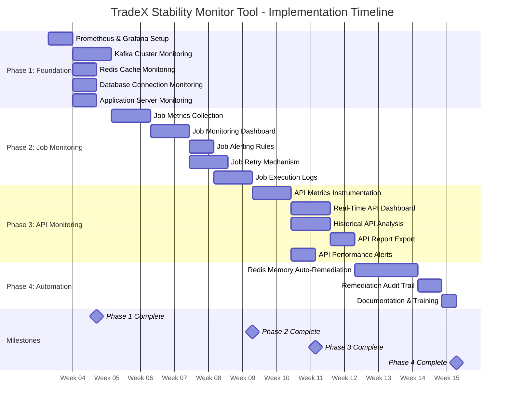

# Product Requirements Document (PRD)
## TradeX Stability Monitor Tool

**Version**: 1.0  
**Date**: January 19, 2026  
**Status**: Approved  
**Owner**: Product Team  
**Contributors**: Engineering, DevOps, Operations

---

## Executive Summary

The TradeX Stability Monitor Tool is a comprehensive monitoring and observability platform designed to enhance the stability and reliability of the TradeX trading platform. It provides real-time monitoring, early problem detection, automated remediation, and historical analysis for critical system components.

### Problem Statement

TradeX currently faces:
- Frequent system failures impacting trading operations
- Delayed job executions affecting market data freshness
- Lack of visibility into overall system health
- Manual intervention required for common issues
- No historical data for performance trend analysis

### Solution

A Grafana-based monitoring platform that provides:
- **Real-time monitoring** of infrastructure (Kafka, Redis, Database, Application Servers)
- **Job monitoring & management** with automated retry capabilities
- **API performance tracking** with historical analysis
- **Automated remediation** for common failure scenarios
- **Comprehensive alerting** via multiple channels

### Success Metrics

- **MTTD (Mean Time to Detection)**: < 1 minute for critical issues
- **MTTR (Mean Time to Resolution)**: < 15 minutes with automation
- **System Uptime**: 99.9% availability
- **Alert Accuracy**: > 90% true positive rate
- **Remediation Success**: > 95% automated resolution rate

---

## Product Overview

### Vision

Create a self-healing, highly observable trading platform where issues are detected and resolved automatically before impacting users.

### Goals

1. **Visibility**: Provide complete visibility into system health and performance
2. **Proactivity**: Detect issues before they impact trading operations
3. **Automation**: Reduce manual intervention through automated remediation
4. **Insights**: Enable data-driven optimization through historical analysis
5. **Reliability**: Achieve 99.9% platform availability

### Non-Goals (Out of Scope)

- Application Performance Monitoring (APM) with distributed tracing
- Business intelligence and analytics dashboards
- User behavior tracking and analytics
- Mobile application monitoring
- Third-party service monitoring beyond Lotte APIs

---

## User Personas

### 1. System Administrator (Primary)
**Name**: Sarah Chen  
**Role**: Senior System Administrator  
**Goals**:
- Monitor system health in real-time
- Receive alerts for critical issues
- Quickly identify and resolve problems
- Minimize system downtime

**Pain Points**:
- Too many false alerts
- Lack of visibility into root causes
- Manual remediation is time-consuming
- No historical data for trend analysis

**Use Cases**:
- Monitor infrastructure health during trading hours
- Respond to alerts and investigate issues
- Retry failed jobs from the dashboard
- Review remediation actions for compliance

---

### 2. Developer (Secondary)
**Name**: Michael Nguyen  
**Role**: Backend Developer  
**Goals**:
- Analyze API performance
- Identify performance bottlenecks
- Optimize slow endpoints
- Debug production issues

**Pain Points**:
- No visibility into API latency in production
- Difficult to correlate errors with code changes
- No historical data for performance comparison
- Manual log searching is inefficient

**Use Cases**:
- View API performance metrics after deployments
- Analyze historical trends to identify regressions
- Export API reports for stakeholder presentations
- Debug failed jobs using detailed logs

---

### 3. DevOps Engineer (Secondary)
**Name**: Alex Rodriguez  
**Role**: DevOps Engineer  
**Goals**:
- Maintain monitoring infrastructure
- Configure alerts and dashboards
- Ensure data retention compliance
- Optimize monitoring costs

**Pain Points**:
- Complex setup and configuration
- Lack of documentation
- Difficult to troubleshoot monitoring issues
- No backup and recovery procedures

**Use Cases**:
- Set up new exporters for services
- Configure alert rules and notification channels
- Manage data retention policies
- Perform system upgrades and maintenance

---

### 4. Compliance Officer (Tertiary)
**Name**: Linda Park  
**Role**: Compliance Officer  
**Goals**:
- Ensure audit trail for all system changes
- Verify automated actions are logged
- Generate compliance reports
- Meet regulatory requirements

**Pain Points**:
- No centralized audit trail
- Manual report generation
- Difficult to prove compliance
- Lack of long-term data retention

**Use Cases**:
- Review remediation audit trail
- Export compliance reports
- Verify log retention policies
- Audit system access and changes

---

## Functional Requirements

### FR-1: Real-Time System Monitoring

#### FR-1.1: Infrastructure Metrics Collection
**Priority**: P0 (Critical)

**Requirements**:
- Collect metrics every 15 seconds from all infrastructure components
- Monitor Kafka cluster (broker status, consumer lag, throughput, disk usage)
- Monitor Redis cache (memory usage, hit/miss ratio, connections, commands/sec)
- Monitor Database (connection pool, query performance, replication lag, transaction rate)
- Monitor Application Servers (CPU, RAM, Disk, Network I/O)

**Acceptance Criteria**:
- ✅ Metrics collected at 15-second intervals
- ✅ All components reporting to Prometheus
- ✅ Data retention: 30 days minimum
- ✅ Dashboard auto-refresh enabled

---

#### FR-1.2: Infrastructure Dashboard
**Priority**: P0 (Critical)

**Requirements**:
- Display real-time status of all infrastructure components
- Show key metrics with visual indicators (green/yellow/red)
- Provide drill-down capability for detailed analysis
- Support filtering by environment and server

**Acceptance Criteria**:
- ✅ Dashboard loads in < 2 seconds
- ✅ Status indicators update in real-time
- ✅ Color-coded alerts (green: healthy, yellow: warning, red: critical)
- ✅ Clickable panels for drill-down

**User Story**:
> As a system administrator, when I monitor the TradeX platform, I want to see real-time infrastructure health so that I can quickly identify issues.

---

### FR-2: Init Job Monitoring & Management

#### FR-2.1: Job Metrics Collection
**Priority**: P0 (Critical)

**Requirements**:
- Collect job execution metrics (status, start time, duration, failure count)
- Monitor market data retrieval job (from Lotte)
- Monitor Vietstock rights & adjusted price job
- Expose metrics via custom Prometheus exporter

**Acceptance Criteria**:
- ✅ Job metrics updated on every execution
- ✅ Metrics include: status, start_time, duration, last_success, failure_count
- ✅ Custom exporter running on port 9200
- ✅ Prometheus scraping job metrics

---

#### FR-2.2: Job Monitoring Dashboard
**Priority**: P0 (Critical)

**Requirements**:
- Display job status table with columns: Job Name, Status, Start Time, Duration, Last Run, Actions
- Show status indicators: ✓ OK, ✗ FAIL, ⟳ RUNNING, ⏸ WAITING
- Provide job duration trends graph
- Display job execution timeline

**Acceptance Criteria**:
- ✅ Table shows all monitored jobs
- ✅ Status icons clearly visible and color-coded
- ✅ Duration trends help identify performance degradation
- ✅ Timeline shows job execution patterns

**User Story**:
> As a system administrator, when I view the job dashboard, I want to see the status of all init jobs so that I can quickly identify failures.

---

#### FR-2.3: Job Alerting
**Priority**: P0 (Critical)

**Requirements**:
- Alert immediately when job fails
- Alert when job duration > 2x baseline average
- Alert when job not started by scheduled time
- Send alerts via email, Slack, and PagerDuty

**Acceptance Criteria**:
- ✅ Alerts trigger within 30 seconds of condition
- ✅ Alert includes job name, status, duration, dashboard link
- ✅ Alert routing by severity (critical vs warning)
- ✅ Alert deduplication to prevent spam

**User Story**:
> As a system administrator, when a job fails, I want to receive an immediate alert so that I can quickly address the issue.

---

#### FR-2.4: Job Retry Mechanism
**Priority**: P1 (High)

**Requirements**:
- Provide "Retry" button in job dashboard
- Trigger job re-execution via webhook
- Log retry actions to audit trail
- Display retry status in dashboard

**Acceptance Criteria**:
- ✅ Retry button visible for failed jobs
- ✅ Retry triggers job within 10 seconds
- ✅ Retry action logged with timestamp, user, result
- ✅ Dashboard updates to show retry in progress

**User Story**:
> As a system administrator, when a job fails, I want to retry it from the UI so that I can recover from transient failures without manual intervention.

---

#### FR-2.5: Job Execution Logs
**Priority**: P1 (High)

**Requirements**:
- Aggregate job logs in Loki
- Provide log viewer in Grafana dashboard
- Support filtering by job name, time range, log level
- Include stack traces for errors

**Acceptance Criteria**:
- ✅ Logs accessible from job dashboard
- ✅ Log filtering by job name, level, time range
- ✅ Full-text search capability
- ✅ Expandable entries for stack traces

**User Story**:
> As a developer, when I analyze job failures, I want to view detailed execution logs so that I can debug issues.

---

### FR-3: API Performance Monitoring

#### FR-3.1: API Metrics Instrumentation
**Priority**: P0 (Critical)

**Requirements**:
- Instrument all TradeX APIs to collect performance metrics
- Collect request count, response time, error rate, request/response size
- Label metrics by endpoint, method, status code, API type (TradeX/Lotte)
- Store metrics in Prometheus

**Acceptance Criteria**:
- ✅ All API endpoints instrumented
- ✅ Metrics include latency histograms (P50, P95, P99)
- ✅ Metrics labeled for filtering and aggregation
- ✅ Minimal performance overhead (< 1ms per request)

---

#### FR-3.2: Real-Time API Dashboard
**Priority**: P0 (Critical)

**Requirements**:
- Display total requests, success rate, error rate, avg/min/max response time
- Show P50, P95, P99 latency percentiles
- Separate panels for TradeX internal vs Lotte APIs
- Time-series graphs for latency and throughput

**Acceptance Criteria**:
- ✅ Dashboard shows summary statistics
- ✅ Latency percentiles visualized over time
- ✅ Auto-refresh every 30 seconds
- ✅ Filtering by endpoint and API type

**User Story**:
> As a developer, when I monitor API performance, I want to view real-time metrics so that I can detect performance degradation immediately.

---

#### FR-3.3: Historical API Analysis
**Priority**: P1 (High)

**Requirements**:
- Display API metrics from previous days
- Support date range filtering (last 7 days, 30 days, custom)
- Provide endpoint-level drill-down
- Show comparison view (day-over-day, week-over-week)

**Acceptance Criteria**:
- ✅ Historical data available for 30+ days
- ✅ Date range picker for custom analysis
- ✅ Per-endpoint statistics table
- ✅ Trend graphs for identifying patterns

**User Story**:
> As a developer, when I analyze API performance, I want to view historical data so that I can identify trends and improve system efficiency.

---

#### FR-3.4: API Report Export
**Priority**: P2 (Medium)

**Requirements**:
- Export API performance reports to CSV/Excel
- Include date range, endpoint, total requests, success/error rate, avg/min/max time
- Support scheduled report generation (optional)

**Acceptance Criteria**:
- ✅ Export button in dashboard
- ✅ CSV format supported
- ✅ Excel format supported (optional)
- ✅ Export includes all key metrics

---

#### FR-3.5: API Performance Alerts
**Priority**: P1 (High)

**Requirements**:
- Alert when error rate > 5% for 5 minutes
- Alert when P95 latency > 500ms for 5 minutes
- Alert when request rate drops > 50% (sudden traffic drop)
- Include endpoint name, metric value, dashboard link in alerts

**Acceptance Criteria**:
- ✅ Alert rules configured in Grafana
- ✅ Alerts sent via configured channels
- ✅ Alert includes actionable context
- ✅ Alert routing by severity

---

### FR-4: Automated Remediation

#### FR-4.1: High Redis Memory Auto-Remediation
**Priority**: P1 (High)

**Requirements**:
- Trigger: Redis memory > 90%
- Action: Execute memory cleanup script (flush expired keys, remove LRU keys)
- Validation: Verify memory < 80% after cleanup
- Alert: Notify if remediation fails
- Audit: Log all actions to audit trail

**Acceptance Criteria**:
- ✅ Remediation triggers automatically at 90% threshold
- ✅ Cleanup script executes within 30 seconds
- ✅ Memory validated after cleanup
- ✅ Success/failure notification sent
- ✅ All actions logged to Loki with timestamp, action, result

**User Story**:
> As a system administrator, when Redis memory is high, I want automatic cleanup so that Redis remains stable without manual intervention.

---

#### FR-4.2: High Kafka Consumer Lag Auto-Remediation
**Priority**: P2 (Medium) - **TBD**

**Requirements**:
- To be defined in future sprint
- Trigger threshold definition needed
- Scaling strategy (horizontal vs vertical) to be determined
- Validation criteria to be defined
- Rollback mechanism required

---

#### FR-4.3: Failed Init Job Auto-Retry
**Priority**: P2 (Medium) - **TBD**

**Requirements**:
- To be defined in future sprint
- Retry strategy (immediate, exponential backoff) to be determined
- Max retry attempts to be defined
- Retry conditions (which failures to retry) to be specified
- Escalation after max retries to be defined

---

#### FR-4.4: Remediation Audit Trail
**Priority**: P1 (High)

**Requirements**:
- Log all remediation actions with timestamp, action type, trigger, result, user/system
- Store audit logs in Loki with 90+ day retention
- Provide Grafana dashboard for audit trail viewing
- Support filtering by action type, result, time range

**Acceptance Criteria**:
- ✅ All remediation actions logged
- ✅ Logs include complete context
- ✅ Dashboard shows audit trail table
- ✅ 90-day retention policy configured

**User Story**:
> As a compliance officer, when I review system changes, I want to view a complete audit trail so that I can ensure accountability.

---

## Technical Requirements

### TR-1: Technology Stack

**Monitoring & Visualization**:
- Grafana 10.x (latest stable)
- Prometheus 2.48+ (time-series database)
- Loki 2.9+ (log aggregation)
- AlertManager (optional, for advanced routing)

**Data Collection**:
- Prometheus Exporters (Kafka JMX, Redis, PostgreSQL, Node)
- Custom exporters (Jobs, APIs) in Python or Go
- Promtail (log shipper)

**Automation**:
- Custom remediation services (Python/Go)
- Webhook integration with Grafana alerts

---

### TR-2: Infrastructure Requirements

**Monitoring Server**:
- CPU: 4+ cores
- RAM: 16GB+ (32GB recommended)
- Disk: 500GB+ SSD
- Network: 1Gbps
- OS: Ubuntu 22.04 LTS or CentOS 8+

**Application Servers** (for exporters):
- CPU: 2+ cores
- RAM: 4GB+
- Network: Access to monitoring server

---

### TR-3: Data Retention

- **Prometheus**: 30 days high-resolution, 90 days downsampled
- **Loki**: 90 days for compliance
- **Long-term storage**: Consider Thanos or Cortex for extended retention

---

### TR-4: Performance Requirements

- **Dashboard Load Time**: < 2 seconds
- **Metric Collection Interval**: 15 seconds
- **Alert Latency**: < 30 seconds from condition to notification
- **Query Response Time**: < 1 second for standard queries
- **System Overhead**: < 5% CPU/memory impact on monitored services

---

### TR-5: Security Requirements

- **Authentication**: Grafana OAuth, LDAP, or built-in auth
- **Authorization**: Role-based access control (RBAC)
- **Encryption**: TLS for all data in transit
- **Audit Logging**: All user actions logged
- **Data Privacy**: No PII in metrics or logs

---

### TR-6: Availability & Reliability

- **Monitoring System Uptime**: 99.9%
- **Data Durability**: No data loss during system failures
- **Backup**: Daily backups with 7-day retention
- **Disaster Recovery**: RTO < 4 hours, RPO < 1 hour

---

## Non-Functional Requirements

### NFR-1: Scalability
- Support monitoring of 100+ servers
- Handle 10,000+ metrics per second
- Scale horizontally with Prometheus federation

### NFR-2: Usability
- Intuitive dashboard design
- Minimal training required (< 2 hours)
- Mobile-responsive dashboards
- Accessible (WCAG 2.1 AA compliance)

### NFR-3: Maintainability
- Comprehensive documentation
- Automated deployment (Infrastructure as Code)
- Version-controlled configurations
- Upgrade path for all components

### NFR-4: Observability
- Monitor the monitoring system (meta-monitoring)
- Health checks for all exporters
- Self-healing capabilities where possible

---

## User Interface Requirements

### UI-1: Dashboard Design
- Dark theme (default)
- Color-coded status indicators (green/yellow/red)
- Consistent layout across dashboards
- Responsive design for mobile/tablet

### UI-2: Navigation
- Folder-based dashboard organization
- Search functionality for dashboards
- Breadcrumb navigation
- Quick links to related dashboards

### UI-3: Interaction
- Drill-down from summary to detail
- Time range picker (global and per-panel)
- Dashboard variables for filtering
- Export functionality (CSV, Excel, PDF)

---

## Integration Requirements

### INT-1: Alert Channels
- Email (SMTP)
- Slack (webhook)
- PagerDuty (API integration)
- Microsoft Teams (optional)

### INT-2: Authentication
- LDAP/Active Directory integration
- OAuth 2.0 support
- SSO (Single Sign-On) optional

### INT-3: Data Sources
- Prometheus (primary metrics)
- Loki (logs)
- External APIs (Lotte) via custom exporters

---

## Success Metrics & KPIs

### Operational Metrics
- **MTTD**: Mean Time to Detection < 1 minute
- **MTTR**: Mean Time to Resolution < 15 minutes
- **Alert Accuracy**: > 90% true positive rate
- **System Uptime**: 99.9% availability
- **Remediation Success**: > 95% automated resolution

### User Adoption Metrics
- **Daily Active Users**: 80% of operations team
- **Dashboard Usage**: > 100 views/day
- **Alert Response Time**: < 5 minutes average
- **User Satisfaction**: > 4.0/5.0 rating

### Business Impact Metrics
- **Incident Reduction**: 50% fewer manual interventions
- **Downtime Reduction**: 75% reduction in system downtime
- **Cost Savings**: $100K+ annual savings from automation
- **Time Savings**: 20+ hours/week saved on manual monitoring

---

## Implementation Timeline

### Phase 1: Foundation (Weeks 1-3)
**Duration**: 3 weeks  
**Team**: 2 Backend Developers, 1 DevOps Engineer

**Stories**:
- Story 1.1: Prometheus & Grafana Setup (5 points)
- Story 1.2: Kafka Cluster Monitoring (8 points)
- Story 1.3: Redis Cache Monitoring (5 points)
- Story 1.4: Database Connection Monitoring (5 points)
- Story 1.5: Application Server Monitoring (5 points)

**Deliverables**: Infrastructure dashboard, basic alerts  
**Total Points**: 28

---

### Phase 2: Job Monitoring (Weeks 4-6)
**Duration**: 3 weeks  
**Team**: 2 Backend Developers, 1 DevOps Engineer

**Stories**:
- Story 2.1: Job Metrics Collection (8 points)
- Story 2.2: Job Monitoring Dashboard (8 points)
- Story 2.3: Job Alerting Rules (5 points)
- Story 2.4: Job Retry Mechanism (8 points)
- Story 2.5: Job Execution Logs (8 points)

**Deliverables**: Complete job monitoring suite  
**Total Points**: 37

---

### Phase 3: API Monitoring (Weeks 7-9)
**Duration**: 3 weeks  
**Team**: 2 Backend Developers, 0.5 Frontend Developer

**Stories**:
- Story 3.1: API Metrics Instrumentation (8 points)
- Story 3.2: Real-Time API Performance Dashboard (8 points)
- Story 3.3: Historical API Analysis Dashboard (8 points)
- Story 3.4: API Report Export (5 points)
- Story 3.5: API Performance Alerts (5 points)

**Deliverables**: Complete API monitoring suite  
**Total Points**: 34

---

### Phase 4: Automation (Weeks 10-12)
**Duration**: 3 weeks  
**Team**: 2 Backend Developers, 1 DevOps Engineer

**Stories**:
- Story 4.1: High Redis Memory Auto-Remediation (13 points)
- Story 4.4: Remediation Audit Trail (5 points)
- Documentation and Training (3 days)

**Deliverables**: Automated remediation for Redis, complete documentation  
**Total Points**: 18

---

### Phase 5: Advanced Features (Future)
**Duration**: TBD  
**Status**: Deferred to future sprints

**Planned Features**:
- Kafka consumer lag remediation
- Job auto-retry mechanisms
- Predictive alerting with ML

**Deliverables**: TBD

---

## Risks & Mitigation

### Risk 1: Production Job Instrumentation
**Risk**: Code changes to production jobs may break existing functionality  
**Impact**: High  
**Probability**: Medium  
**Mitigation**: 
- Use feature flags for gradual rollout
- Extensive testing in staging
- Rollback plan ready

---

### Risk 2: Alert Fatigue
**Risk**: Too many false alerts reduce effectiveness  
**Impact**: Medium  
**Probability**: High  
**Mitigation**:
- Fine-tune alert thresholds during pilot
- Implement alert grouping and deduplication
- Regular review and optimization

---

### Risk 3: Prometheus Storage Capacity
**Risk**: Metrics storage exceeds disk capacity  
**Impact**: High  
**Probability**: Medium  
**Mitigation**:
- Monitor disk usage proactively
- Implement retention policies
- Plan for horizontal scaling

---

### Risk 4: Team Availability
**Risk**: Key team members unavailable during implementation  
**Impact**: Medium  
**Probability**: Medium  
**Mitigation**:
- Cross-train team members
- Document tribal knowledge
- Engage external consultants if needed

---

### Risk 5: Automated Remediation Data Loss
**Risk**: Automated cleanup causes unintended data loss  
**Impact**: High  
**Probability**: Low  
**Mitigation**:
- Implement dry-run mode for testing
- Extensive testing in staging
- Circuit breaker pattern to prevent runaway automation
- Manual approval for high-risk actions

---

## Dependencies

### Internal Dependencies
- DevOps team for infrastructure provisioning
- Backend team for API instrumentation
- Operations team for alert configuration
- Security team for authentication setup

### External Dependencies
- Lotte API availability for market data job monitoring
- Vietstock API availability for rights job monitoring
- SMTP server for email alerts
- Slack workspace for notifications

---

## Assumptions

1. Monitoring infrastructure will be deployed in the same data center as TradeX
2. Network latency between monitored services and Prometheus < 10ms
3. Team has basic knowledge of Prometheus and Grafana
4. Existing logging infrastructure can be integrated with Loki
5. Budget approved for monitoring infrastructure and licenses

---

## Out of Scope (Future Considerations)

1. **Application Performance Monitoring (APM)**: Distributed tracing with Tempo
2. **Business Analytics**: Trading volume, revenue dashboards
3. **User Behavior Tracking**: User journey analytics
4. **Mobile App Monitoring**: iOS/Android app performance
5. **Third-Party SaaS Monitoring**: Beyond Lotte APIs
6. **Predictive Analytics**: ML-based anomaly detection
7. **Capacity Planning**: Long-term resource forecasting

---

## Glossary

- **MTTD**: Mean Time to Detection - Average time to detect an issue
- **MTTR**: Mean Time to Resolution - Average time to resolve an issue
- **P50/P95/P99**: Latency percentiles (50th, 95th, 99th percentile)
- **SLA**: Service Level Agreement - Commitment to service availability
- **RTO**: Recovery Time Objective - Target time to restore service
- **RPO**: Recovery Point Objective - Acceptable data loss window
- **JMX**: Java Management Extensions - Java monitoring API
- **Exporter**: Service that exposes metrics in Prometheus format
- **Scrape**: Prometheus pulling metrics from exporters

---

## Approval

| Role | Name | Signature | Date |
|------|------|-----------|------|
| Product Owner | [Name] | _________ | ______ |
| Engineering Lead | [Name] | _________ | ______ |
| DevOps Lead | [Name] | _________ | ______ |
| Operations Manager | [Name] | _________ | ______ |
| Security Officer | [Name] | _________ | ______ |

---

## Appendices

### Appendix A: Dashboard Mockups
See [dashboard_mockups.md](file:///Users/ducnguyen/.gemini/antigravity/brain/f2fa44f8-f78f-49c3-bb40-935f31eed462/dashboard_mockups.md)

### Appendix B: Technical Setup Guide
See [setup_guide.md](file:///Users/ducnguyen/.gemini/antigravity/brain/f2fa44f8-f78f-49c3-bb40-935f31eed462/setup_guide.md)

### Appendix C: Sprint Breakdown
See [sprint_breakdown.md](file:///Users/ducnguyen/.gemini/antigravity/brain/f2fa44f8-f78f-49c3-bb40-935f31eed462/sprint_breakdown.md)

### Appendix D: Jira Stories
See [jira_stories.md](file:///Users/ducnguyen/.gemini/antigravity/brain/f2fa44f8-f78f-49c3-bb40-935f31eed462/jira_stories.md)

---

## Document History

| Version | Date | Author | Changes |
|---------|------|--------|---------|
| 1.0 | 2026-01-19 | Product Team | Initial PRD creation |

---

**End of Document**
