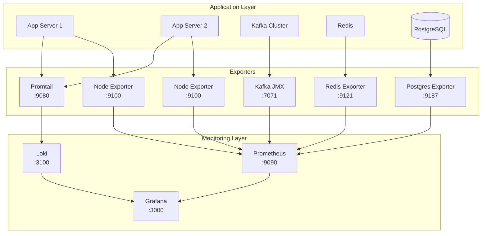

# TradeX Stability Monitor Tool - Technical Setup Guide

> [!IMPORTANT]
> This guide provides step-by-step instructions for setting up the complete Grafana monitoring stack for TradeX.

---

## Table of Contents

1. [Prerequisites](#prerequisites)
2. [Architecture Overview](#architecture-overview)
3. [Prometheus Installation](#prometheus-installation)
4. [Grafana Installation](#grafana-installation)
5. [Loki Installation](#loki-installation)
6. [Exporters Setup](#exporters-setup)
7. [Configuration](#configuration)
8. [Security & Authentication](#security--authentication)
9. [Backup & Recovery](#backup--recovery)
10. [Troubleshooting](#troubleshooting)

---

## Prerequisites

### System Requirements

**Monitoring Server**:
- OS: Ubuntu 22.04 LTS or CentOS 8+
- CPU: 4+ cores
- RAM: 16GB+ (32GB recommended for production)
- Disk: 500GB+ SSD (for metrics storage)
- Network: 1Gbps

**Application Servers** (for exporters):
- OS: Linux (Ubuntu/CentOS)
- CPU: 2+ cores
- RAM: 4GB+
- Network: Access to monitoring server

### Software Prerequisites

```bash
# Update system packages
sudo apt update && sudo apt upgrade -y

# Install required packages
sudo apt install -y wget curl tar vim net-tools

# Install Docker (optional, for containerized deployment)
curl -fsSL https://get.docker.com -o get-docker.sh
sudo sh get-docker.sh
sudo usermod -aG docker $USER
```

---

## Architecture Overview



**Port Summary**:
- Prometheus: 9090
- Grafana: 3000
- Loki: 3100
- Node Exporter: 9100
- Redis Exporter: 9121
- Postgres Exporter: 9187
- Kafka JMX Exporter: 7071
- Promtail: 9080

---

## Prometheus Installation

### Option 1: Binary Installation (Recommended for Production)

```bash
# Create prometheus user
sudo useradd --no-create-home --shell /bin/false prometheus

# Download Prometheus
cd /tmp
PROM_VERSION="2.48.0"
wget https://github.com/prometheus/prometheus/releases/download/v${PROM_VERSION}/prometheus-${PROM_VERSION}.linux-amd64.tar.gz

# Extract and install
tar -xvf prometheus-${PROM_VERSION}.linux-amd64.tar.gz
cd prometheus-${PROM_VERSION}.linux-amd64

sudo cp prometheus promtool /usr/local/bin/
sudo chown prometheus:prometheus /usr/local/bin/prometheus /usr/local/bin/promtool

# Create directories
sudo mkdir -p /etc/prometheus /var/lib/prometheus
sudo cp -r consoles console_libraries /etc/prometheus/
sudo chown -R prometheus:prometheus /etc/prometheus /var/lib/prometheus
```

### Prometheus Configuration

Create `/etc/prometheus/prometheus.yml`:

```yaml
global:
  scrape_interval: 15s  # Scrape every 15 seconds
  evaluation_interval: 15s
  external_labels:
    cluster: 'tradex-production'
    environment: 'prod'

# Alertmanager configuration (optional)
alerting:
  alertmanagers:
    - static_configs:
        - targets:
          # - 'localhost:9093'

# Load rules once and periodically evaluate them
rule_files:
  - "rules/*.yml"

# Scrape configurations
scrape_configs:
  # Prometheus self-monitoring
  - job_name: 'prometheus'
    static_configs:
      - targets: ['localhost:9090']

  # Node Exporter (Application Servers)
  - job_name: 'node-exporter'
    static_configs:
      - targets:
          - 'app-server-1:9100'
          - 'app-server-2:9100'
        labels:
          env: 'production'
          role: 'app-server'

  # Kafka JMX Exporter
  - job_name: 'kafka'
    static_configs:
      - targets:
          - 'kafka-broker-1:7071'
          - 'kafka-broker-2:7071'
          - 'kafka-broker-3:7071'
        labels:
          env: 'production'
          role: 'kafka-broker'

  # Redis Exporter
  - job_name: 'redis'
    static_configs:
      - targets:
          - 'redis-server:9121'
        labels:
          env: 'production'
          role: 'cache'

  # PostgreSQL Exporter
  - job_name: 'postgresql'
    static_configs:
      - targets:
          - 'db-server:9187'
        labels:
          env: 'production'
          role: 'database'

  # Custom Job Metrics Exporter
  - job_name: 'tradex-jobs'
    static_configs:
      - targets:
          - 'job-exporter:9200'
        labels:
          env: 'production'
          role: 'job-monitor'

  # Custom API Metrics
  - job_name: 'tradex-api'
    static_configs:
      - targets:
          - 'app-server-1:8080'
          - 'app-server-2:8080'
        labels:
          env: 'production'
          role: 'api'
    metrics_path: '/metrics'
```

### Create Systemd Service

Create `/etc/systemd/system/prometheus.service`:

```ini
[Unit]
Description=Prometheus
Wants=network-online.target
After=network-online.target

[Service]
User=prometheus
Group=prometheus
Type=simple
ExecStart=/usr/local/bin/prometheus \
  --config.file=/etc/prometheus/prometheus.yml \
  --storage.tsdb.path=/var/lib/prometheus/ \
  --storage.tsdb.retention.time=30d \
  --web.console.templates=/etc/prometheus/consoles \
  --web.console.libraries=/etc/prometheus/console_libraries \
  --web.listen-address=0.0.0.0:9090 \
  --web.enable-lifecycle

Restart=always
RestartSec=5

[Install]
WantedBy=multi-user.target
```

### Start Prometheus

```bash
sudo systemctl daemon-reload
sudo systemctl start prometheus
sudo systemctl enable prometheus
sudo systemctl status prometheus

# Verify Prometheus is running
curl http://localhost:9090/metrics
```

---

## Grafana Installation

### Option 1: APT Repository (Ubuntu/Debian)

```bash
# Add Grafana GPG key
sudo apt-get install -y software-properties-common
wget -q -O - https://packages.grafana.com/gpg.key | sudo apt-key add -

# Add Grafana repository
echo "deb https://packages.grafana.com/oss/deb stable main" | sudo tee /etc/apt/sources.list.d/grafana.list

# Install Grafana
sudo apt-get update
sudo apt-get install -y grafana

# Start Grafana
sudo systemctl daemon-reload
sudo systemctl start grafana-server
sudo systemctl enable grafana-server
sudo systemctl status grafana-server
```

### Option 2: Docker (Development/Testing)

```bash
docker run -d \
  --name=grafana \
  -p 3000:3000 \
  -v grafana-storage:/var/lib/grafana \
  -e "GF_SECURITY_ADMIN_PASSWORD=admin" \
  -e "GF_INSTALL_PLUGINS=grafana-piechart-panel" \
  grafana/grafana:latest
```

### Initial Grafana Configuration

Edit `/etc/grafana/grafana.ini`:

```ini
[server]
protocol = http
http_addr = 0.0.0.0
http_port = 3000
domain = monitoring.tradex.local
root_url = %(protocol)s://%(domain)s:%(http_port)s/

[security]
admin_user = admin
admin_password = <CHANGE_ME>
secret_key = <GENERATE_RANDOM_KEY>

[auth]
disable_login_form = false
disable_signout_menu = false

[auth.anonymous]
enabled = false

[alerting]
enabled = true
execute_alerts = true

[unified_alerting]
enabled = true

[smtp]
enabled = true
host = smtp.gmail.com:587
user = alerts@tradex.com
password = <SMTP_PASSWORD>
from_address = alerts@tradex.com
from_name = TradeX Monitoring
```

### Access Grafana

1. Open browser: `http://<server-ip>:3000`
2. Default credentials: `admin` / `admin`
3. Change password on first login

---

## Loki Installation

### Binary Installation

```bash
# Download Loki
cd /tmp
LOKI_VERSION="2.9.3"
wget https://github.com/grafana/loki/releases/download/v${LOKI_VERSION}/loki-linux-amd64.zip
unzip loki-linux-amd64.zip
sudo mv loki-linux-amd64 /usr/local/bin/loki

# Create loki user
sudo useradd --no-create-home --shell /bin/false loki

# Create directories
sudo mkdir -p /etc/loki /var/lib/loki
sudo chown -R loki:loki /etc/loki /var/lib/loki
```

### Loki Configuration

Create `/etc/loki/loki-config.yml`:

```yaml
auth_enabled: false

server:
  http_listen_port: 3100
  grpc_listen_port: 9096

common:
  path_prefix: /var/lib/loki
  storage:
    filesystem:
      chunks_directory: /var/lib/loki/chunks
      rules_directory: /var/lib/loki/rules
  replication_factor: 1
  ring:
    instance_addr: 127.0.0.1
    kvstore:
      store: inmemory

schema_config:
  configs:
    - from: 2020-10-24
      store: boltdb-shipper
      object_store: filesystem
      schema: v11
      index:
        prefix: index_
        period: 24h

storage_config:
  boltdb_shipper:
    active_index_directory: /var/lib/loki/boltdb-shipper-active
    cache_location: /var/lib/loki/boltdb-shipper-cache
    cache_ttl: 24h
    shared_store: filesystem
  filesystem:
    directory: /var/lib/loki/chunks

limits_config:
  retention_period: 90d
  enforce_metric_name: false
  reject_old_samples: true
  reject_old_samples_max_age: 168h

chunk_store_config:
  max_look_back_period: 0s

table_manager:
  retention_deletes_enabled: true
  retention_period: 90d

compactor:
  working_directory: /var/lib/loki/compactor
  shared_store: filesystem
  compaction_interval: 10m
  retention_enabled: true
  retention_delete_delay: 2h
  retention_delete_worker_count: 150
```

### Create Systemd Service for Loki

Create `/etc/systemd/system/loki.service`:

```ini
[Unit]
Description=Loki
After=network.target

[Service]
User=loki
Group=loki
Type=simple
ExecStart=/usr/local/bin/loki -config.file=/etc/loki/loki-config.yml
Restart=always
RestartSec=5

[Install]
WantedBy=multi-user.target
```

### Start Loki

```bash
sudo systemctl daemon-reload
sudo systemctl start loki
sudo systemctl enable loki
sudo systemctl status loki

# Verify Loki is running
curl http://localhost:3100/ready
```

---

## Exporters Setup

### 1. Node Exporter (Application Servers)

Install on each application server:

```bash
# Download Node Exporter
cd /tmp
NODE_EXP_VERSION="1.7.0"
wget https://github.com/prometheus/node_exporter/releases/download/v${NODE_EXP_VERSION}/node_exporter-${NODE_EXP_VERSION}.linux-amd64.tar.gz
tar -xvf node_exporter-${NODE_EXP_VERSION}.linux-amd64.tar.gz
sudo cp node_exporter-${NODE_EXP_VERSION}.linux-amd64/node_exporter /usr/local/bin/

# Create systemd service
sudo tee /etc/systemd/system/node_exporter.service > /dev/null <<EOF
[Unit]
Description=Node Exporter
After=network.target

[Service]
Type=simple
ExecStart=/usr/local/bin/node_exporter
Restart=always
RestartSec=5

[Install]
WantedBy=multi-user.target
EOF

# Start Node Exporter
sudo systemctl daemon-reload
sudo systemctl start node_exporter
sudo systemctl enable node_exporter
```

### 2. Redis Exporter

```bash
# Download Redis Exporter
cd /tmp
REDIS_EXP_VERSION="1.55.0"
wget https://github.com/oliver006/redis_exporter/releases/download/v${REDIS_EXP_VERSION}/redis_exporter-v${REDIS_EXP_VERSION}.linux-amd64.tar.gz
tar -xvf redis_exporter-v${REDIS_EXP_VERSION}.linux-amd64.tar.gz
sudo cp redis_exporter-v${REDIS_EXP_VERSION}.linux-amd64/redis_exporter /usr/local/bin/

# Create systemd service
sudo tee /etc/systemd/system/redis_exporter.service > /dev/null <<EOF
[Unit]
Description=Redis Exporter
After=network.target

[Service]
Type=simple
ExecStart=/usr/local/bin/redis_exporter \
  --redis.addr=redis://localhost:6379 \
  --redis.password=<REDIS_PASSWORD>
Restart=always
RestartSec=5

[Install]
WantedBy=multi-user.target
EOF

# Start Redis Exporter
sudo systemctl daemon-reload
sudo systemctl start redis_exporter
sudo systemctl enable redis_exporter
```

### 3. PostgreSQL Exporter

```bash
# Download Postgres Exporter
cd /tmp
PG_EXP_VERSION="0.15.0"
wget https://github.com/prometheus-community/postgres_exporter/releases/download/v${PG_EXP_VERSION}/postgres_exporter-${PG_EXP_VERSION}.linux-amd64.tar.gz
tar -xvf postgres_exporter-${PG_EXP_VERSION}.linux-amd64.tar.gz
sudo cp postgres_exporter-${PG_EXP_VERSION}.linux-amd64/postgres_exporter /usr/local/bin/

# Create environment file
sudo tee /etc/default/postgres_exporter > /dev/null <<EOF
DATA_SOURCE_NAME="postgresql://postgres_exporter:<PASSWORD>@localhost:5432/postgres?sslmode=disable"
EOF

# Create systemd service
sudo tee /etc/systemd/system/postgres_exporter.service > /dev/null <<EOF
[Unit]
Description=PostgreSQL Exporter
After=network.target

[Service]
Type=simple
EnvironmentFile=/etc/default/postgres_exporter
ExecStart=/usr/local/bin/postgres_exporter
Restart=always
RestartSec=5

[Install]
WantedBy=multi-user.target
EOF

# Start Postgres Exporter
sudo systemctl daemon-reload
sudo systemctl start postgres_exporter
sudo systemctl enable postgres_exporter
```

### 4. Kafka JMX Exporter

Download JMX Exporter JAR:

```bash
cd /opt/kafka
wget https://repo1.maven.org/maven2/io/prometheus/jmx/jmx_prometheus_javaagent/0.20.0/jmx_prometheus_javaagent-0.20.0.jar
```

Create `/opt/kafka/kafka-jmx-config.yml`:

```yaml
lowercaseOutputName: true
lowercaseOutputLabelNames: true
rules:
  - pattern: kafka.server<type=(.+), name=(.+)><>Value
    name: kafka_server_$1_$2
  - pattern: kafka.controller<type=(.+), name=(.+)><>Value
    name: kafka_controller_$1_$2
  - pattern: kafka.network<type=(.+), name=(.+)><>Value
    name: kafka_network_$1_$2
```

Add to Kafka startup script:

```bash
export KAFKA_OPTS="-javaagent:/opt/kafka/jmx_prometheus_javaagent-0.20.0.jar=7071:/opt/kafka/kafka-jmx-config.yml"
```

### 5. Promtail (Log Shipper)

```bash
# Download Promtail
cd /tmp
PROMTAIL_VERSION="2.9.3"
wget https://github.com/grafana/loki/releases/download/v${PROMTAIL_VERSION}/promtail-linux-amd64.zip
unzip promtail-linux-amd64.zip
sudo mv promtail-linux-amd64 /usr/local/bin/promtail
```

Create `/etc/promtail/promtail-config.yml`:

```yaml
server:
  http_listen_port: 9080
  grpc_listen_port: 0

positions:
  filename: /var/lib/promtail/positions.yaml

clients:
  - url: http://loki-server:3100/loki/api/v1/push

scrape_configs:
  # TradeX application logs
  - job_name: tradex-app
    static_configs:
      - targets:
          - localhost
        labels:
          job: tradex-app
          __path__: /var/log/tradex/*.log

  # Init job logs
  - job_name: tradex-jobs
    static_configs:
      - targets:
          - localhost
        labels:
          job: tradex-jobs
          __path__: /var/log/tradex/jobs/*.log

  # System logs
  - job_name: system
    static_configs:
      - targets:
          - localhost
        labels:
          job: syslog
          __path__: /var/log/syslog
```

Create systemd service:

```bash
sudo tee /etc/systemd/system/promtail.service > /dev/null <<EOF
[Unit]
Description=Promtail
After=network.target

[Service]
Type=simple
ExecStart=/usr/local/bin/promtail -config.file=/etc/promtail/promtail-config.yml
Restart=always
RestartSec=5

[Install]
WantedBy=multi-user.target
EOF

sudo systemctl daemon-reload
sudo systemctl start promtail
sudo systemctl enable promtail
```

---

## Configuration

### Add Prometheus Data Source in Grafana

1. Login to Grafana
2. Go to **Configuration** → **Data Sources**
3. Click **Add data source**
4. Select **Prometheus**
5. Configure:
   - **Name**: Prometheus
   - **URL**: `http://localhost:9090`
   - **Access**: Server (default)
6. Click **Save & Test**

### Add Loki Data Source in Grafana

1. Go to **Configuration** → **Data Sources**
2. Click **Add data source**
3. Select **Loki**
4. Configure:
   - **Name**: Loki
   - **URL**: `http://localhost:3100`
5. Click **Save & Test**

---

## Security & Authentication

### Enable HTTPS for Grafana

```bash
# Generate self-signed certificate (for testing)
sudo openssl req -x509 -nodes -days 365 -newkey rsa:2048 \
  -keyout /etc/grafana/grafana.key \
  -out /etc/grafana/grafana.crt

# Update grafana.ini
sudo vim /etc/grafana/grafana.ini
```

```ini
[server]
protocol = https
cert_file = /etc/grafana/grafana.crt
cert_key = /etc/grafana/grafana.key
```

### Configure Prometheus Basic Auth

Create password file:

```bash
sudo apt install apache2-utils
sudo htpasswd -c /etc/prometheus/.htpasswd admin
```

Update Prometheus systemd service:

```ini
ExecStart=/usr/local/bin/prometheus \
  --config.file=/etc/prometheus/prometheus.yml \
  --storage.tsdb.path=/var/lib/prometheus/ \
  --web.config.file=/etc/prometheus/web-config.yml
```

Create `/etc/prometheus/web-config.yml`:

```yaml
basic_auth_users:
  admin: $2y$10$...  # bcrypt hash from htpasswd
```

### Firewall Configuration

```bash
# Allow Grafana
sudo ufw allow 3000/tcp

# Allow Prometheus (restrict to internal network)
sudo ufw allow from 10.0.0.0/8 to any port 9090

# Allow exporters (restrict to Prometheus server)
sudo ufw allow from <prometheus-server-ip> to any port 9100
sudo ufw allow from <prometheus-server-ip> to any port 9121
sudo ufw allow from <prometheus-server-ip> to any port 9187
```

---

## Backup & Recovery

### Prometheus Backup

```bash
# Create backup script
sudo tee /usr/local/bin/prometheus-backup.sh > /dev/null <<'EOF'
#!/bin/bash
BACKUP_DIR="/backup/prometheus"
DATE=$(date +%Y%m%d_%H%M%S)
mkdir -p $BACKUP_DIR
tar -czf $BACKUP_DIR/prometheus-$DATE.tar.gz /var/lib/prometheus
find $BACKUP_DIR -name "prometheus-*.tar.gz" -mtime +7 -delete
EOF

sudo chmod +x /usr/local/bin/prometheus-backup.sh

# Add to crontab (daily at 2 AM)
echo "0 2 * * * /usr/local/bin/prometheus-backup.sh" | sudo crontab -
```

### Grafana Backup

```bash
# Backup Grafana database and dashboards
sudo tar -czf /backup/grafana-$(date +%Y%m%d).tar.gz \
  /var/lib/grafana \
  /etc/grafana
```

---

## Troubleshooting

### Prometheus Not Scraping Targets

```bash
# Check Prometheus targets
curl http://localhost:9090/api/v1/targets | jq

# Check exporter is running
curl http://<exporter-host>:<port>/metrics

# Check network connectivity
telnet <exporter-host> <port>

# Check Prometheus logs
sudo journalctl -u prometheus -f
```

### Grafana Dashboard Not Loading Data

1. Check data source connection: **Configuration** → **Data Sources** → **Test**
2. Check Prometheus query in dashboard panel
3. Verify time range is correct
4. Check browser console for errors

### Loki Not Receiving Logs

```bash
# Check Loki status
curl http://localhost:3100/ready

# Check Promtail logs
sudo journalctl -u promtail -f

# Verify log files exist and are readable
ls -la /var/log/tradex/

# Test Loki query
curl -G -s "http://localhost:3100/loki/api/v1/query" \
  --data-urlencode 'query={job="tradex-app"}' | jq
```

### High Memory Usage

```bash
# Check Prometheus memory usage
ps aux | grep prometheus

# Reduce retention period in prometheus.yml
--storage.tsdb.retention.time=15d

# Reduce scrape interval for high-cardinality metrics
scrape_interval: 30s
```

---

## Maintenance

### Regular Tasks

**Daily**:
- Monitor disk usage on monitoring server
- Check alert notifications are working

**Weekly**:
- Review dashboard performance
- Check for Grafana/Prometheus updates
- Verify backups are running

**Monthly**:
- Review and optimize alert rules
- Clean up old dashboards
- Update exporters to latest versions

### Upgrade Prometheus

```bash
# Stop Prometheus
sudo systemctl stop prometheus

# Backup data
sudo tar -czf /backup/prometheus-pre-upgrade.tar.gz /var/lib/prometheus

# Download new version
wget https://github.com/prometheus/prometheus/releases/download/v<NEW_VERSION>/prometheus-<NEW_VERSION>.linux-amd64.tar.gz

# Extract and replace binary
tar -xvf prometheus-<NEW_VERSION>.linux-amd64.tar.gz
sudo cp prometheus-<NEW_VERSION>.linux-amd64/prometheus /usr/local/bin/

# Start Prometheus
sudo systemctl start prometheus
```

---

## Next Steps

1. **Import Dashboards**: Import pre-built dashboards from [Grafana Dashboard Library](https://grafana.com/grafana/dashboards/)
2. **Configure Alerts**: Set up alert rules in Grafana
3. **Create Custom Dashboards**: Build TradeX-specific dashboards
4. **Set Up Notification Channels**: Configure Slack, email, PagerDuty
5. **Implement Custom Exporters**: Build job and API metrics exporters

---

## Useful Commands

```bash
# Reload Prometheus configuration
curl -X POST http://localhost:9090/-/reload

# Check Prometheus configuration
promtool check config /etc/prometheus/prometheus.yml

# Query Prometheus metrics
curl 'http://localhost:9090/api/v1/query?query=up'

# Check Grafana version
grafana-cli --version

# Reset Grafana admin password
grafana-cli admin reset-admin-password <new-password>
```

---

## Resources

- [Prometheus Documentation](https://prometheus.io/docs/)
- [Grafana Documentation](https://grafana.com/docs/)
- [Loki Documentation](https://grafana.com/docs/loki/)
- [Prometheus Exporters](https://prometheus.io/docs/instrumenting/exporters/)
- [Grafana Dashboard Examples](https://grafana.com/grafana/dashboards/)
