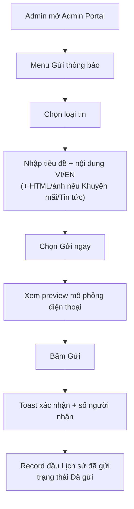
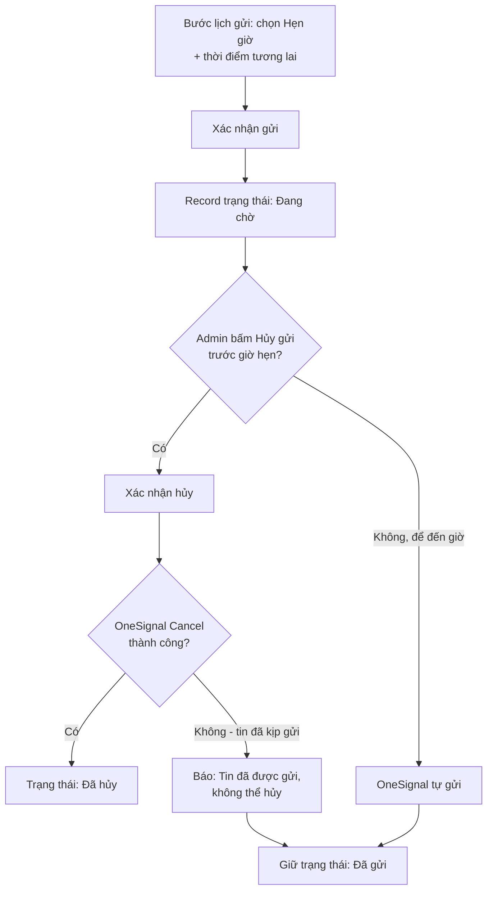
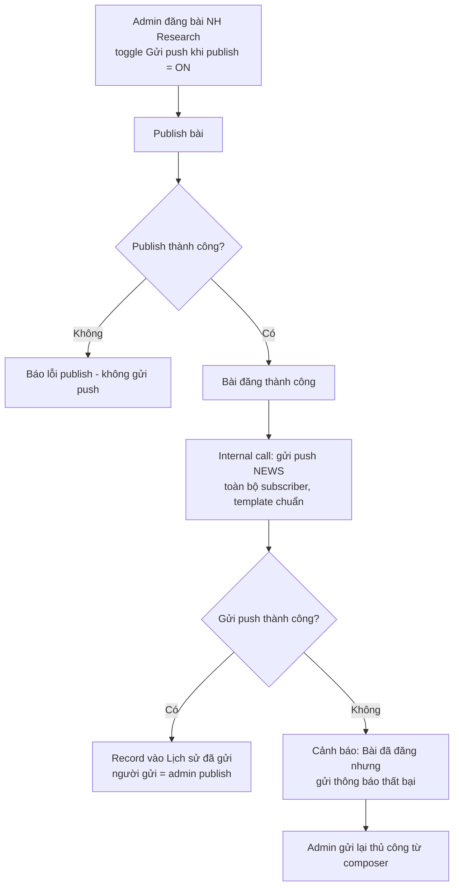
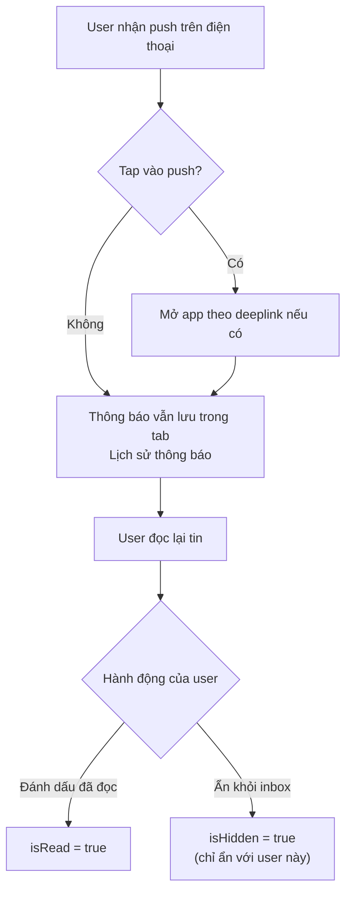
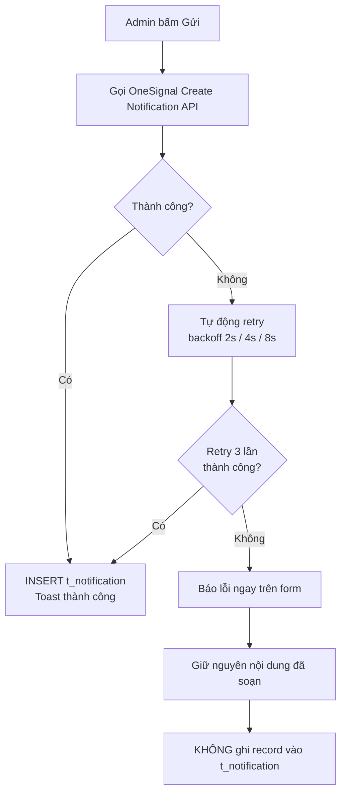

# PRD — Gửi thông báo từ Admin Portal (NHMTS-88)

**Product:** NHSV Pro · Admin Portal + Mobile App
**Jira:** NHMTS-88 (Epic NHMTS-74 — Notifications)
**PM:** Midu (Nguyễn Minh Đức)
**Status:** 📋 Draft
**Version:** 1.0 · 2026-07-09

---

## 1. Bối cảnh & Vấn đề

Marketing và vận hành NHSV thường xuyên cần gửi thông báo tới người dùng app NHSV Pro: chương trình khuyến mãi, tin tức sản phẩm, báo cáo thị trường, nhắc nhở nghiệp vụ. Hiện tại cách duy nhất là đăng nhập **OneSignal Dashboard** — một công cụ bên thứ ba, ngoài hệ thống NHSV.

Hậu quả của cách làm hiện tại:

- **Không có audit trail nội bộ** — không biết ai đã gửi gì, khi nào, cho bao nhiêu người; khi có khiếu nại không truy vết được.
- **Rủi ro thao tác** — OneSignal Dashboard là công cụ kỹ thuật, nhiều tuỳ chọn không liên quan, dễ gửi nhầm nội dung hoặc nhầm app.
- **Không lưu lịch sử cho user** — thông báo đã gửi không xuất hiện trong app; user bỏ lỡ push là mất luôn nội dung.
- **Phân quyền lỏng** — ai có tài khoản OneSignal là gửi được, không gắn với hệ thống phân quyền admin của NHSV.

---

## 2. Mục tiêu

| Mục tiêu | Chỉ số đo lường |
|---|---|
| Admin gửi được notification hoàn toàn trong Admin Portal, không cần OneSignal Dashboard | 100% notification thường xuyên (Promotion/News/Report/Reminder) gửi qua Admin Portal sau release |
| Mọi notification có audit trail | Mỗi bản ghi lưu người gửi, thời gian, nội dung, số người nhận ước tính |
| User xem lại được thông báo đã nhận trong app | Tab "Lịch sử thông báo" hiển thị đúng mọi notification đã gửi, kèm trạng thái đã đọc |
| Giảm lỗi gửi nhầm | Luồng 4 bước có preview bắt buộc trước khi gửi; 0 sự cố gửi nhầm nội dung sau release |

---

## 3. Đối tượng người dùng

**Primary:** Admin NHSV (marketing, vận hành, CSKH) — người soạn và gửi thông báo. Không phải người kỹ thuật, cần UI đơn giản: chọn loại tin → nhập nội dung → gửi.

**Secondary:** Người dùng app NHSV Pro — nhận push notification và xem lại lịch sử thông báo trong app.

---

## 4. Phạm vi Phase 1

### Trong scope

- Luồng soạn & gửi notification 4 bước trong Admin Portal (chọn loại → soạn nội dung → lịch gửi → xác nhận có preview)
- 5 loại thông báo: Khuyến mãi, Tin tức, Báo cáo ngày, Nhắc nhở, Mặc định — **mọi loại đều gắn được launch URL + nút CTA** (vd "Khám phá ngay"); riêng Khuyến mãi/Tin tức có thêm HTML content + ảnh banner để hiển thị dạng thẻ rich trong app (style tham chiếu inbox SSI iBoard)
- **Template song ngữ gợi ý sẵn theo loại tin** — chọn loại là form điền sẵn khung nội dung VI/EN, admin chỉ thay placeholder
- Gửi ngay hoặc hẹn giờ; **hủy được tin hẹn giờ chưa gửi** ngay trong Admin Portal
- Đối tượng nhận: **luôn là toàn bộ subscriber** — không có lựa chọn segment
- **Trigger tự động từ NH Research**: publish bài với toggle thông báo bật → tự gửi push Tin tức tới toàn bộ subscriber theo template chuẩn, không cần soạn tay
- Màn "Lịch sử đã gửi" cho admin: danh sách, bộ lọc theo loại/trạng thái (đã gửi / đang chờ / đã hủy), popup chi tiết
- Lưu campaign vào DB nội bộ kèm người gửi, người hủy (audit trail)
- Tab "Lịch sử thông báo" trên app: xem, đánh dấu đã đọc (từng tin / tất cả), ẩn tin khỏi inbox
- Nội dung song ngữ VI/EN; app hiển thị theo ngôn ngữ người dùng

### Ngoài scope (Phase 1)

- Chọn segment hoặc danh sách người nhận cụ thể — dời Phase 2 (API đã chừa sẵn contract `audienceType`; Event Calendar nhắc GDKHQ sẽ dùng nhánh danh-sách-người-nhận sau)
- Sửa nội dung notification đã tạo (muốn đổi nội dung tin hẹn giờ: hủy rồi tạo lại)
- Thu hồi tin **đã gửi** (push đã tới máy user — không thu hồi được)
- Action buttons, Collapse ID
- Thống kê delivered/open rate (cần webhook NHMTS-870/871 deploy mới có dữ liệu)

---

## 5. Luồng người dùng

### Luồng 1 — Admin gửi thông báo ngay (golden path)

Admin mở Admin Portal → menu "Gửi thông báo" → chọn loại tin (vd Khuyến mãi) → nhập tiêu đề + nội dung VI/EN, nội dung HTML + ảnh nếu cần → chọn "Gửi ngay" → xem preview mô phỏng trên điện thoại → bấm Gửi → toast xác nhận kèm số người nhận → record xuất hiện đầu danh sách "Lịch sử đã gửi" với trạng thái "Đã gửi".

### Luồng 2 — Admin hẹn giờ gửi & hủy tin hẹn giờ

Như luồng 1 nhưng ở bước lịch gửi chọn "Hẹn giờ" + thời điểm tương lai → sau khi xác nhận, record nằm trong lịch sử với trạng thái "Đang chờ"; đến giờ OneSignal tự gửi. Khi cần hủy: mở chi tiết tin đang chờ → bấm "Hủy gửi" → xác nhận → tin chuyển "Đã hủy", không gửi nữa. Trường hợp hủy sát giờ mà tin đã kịp đi: hệ thống báo "Tin đã được gửi, không thể hủy" — tin giữ trạng thái đã gửi.

### Luồng 2b — NH Research publish tự động gửi thông báo

Admin đăng bài NH Research với toggle "Gửi push notification khi publish" bật (mặc định) → bài đăng thành công thì hệ thống tự gửi push Tin tức tới toàn bộ subscriber theo template chuẩn (tiêu đề "Báo cáo mới từ NH Research" + tên bài + chuyên mục, kèm deeplink mở đúng tab). Tin tự động xuất hiện trong "Lịch sử đã gửi" như tin gửi tay, ghi nhận người publish là người gửi. Nếu gửi push thất bại: bài viết vẫn đăng bình thường, admin nhận cảnh báo và có thể gửi lại thủ công.

### Luồng 3 — User nhận và xem lại thông báo

User nhận push trên điện thoại → tap mở app (theo deeplink nếu có) → thông báo cũng nằm trong tab "Lịch sử thông báo" → user đọc lại, đánh dấu đã đọc hoặc ẩn khỏi danh sách. Tin bị ẩn chỉ ẩn với user đó, không ảnh hưởng user khác.

### Luồng 4 — Gửi thất bại

OneSignal lỗi (quá tải, sai cấu hình) → hệ thống tự thử lại 3 lần → vẫn lỗi thì báo cho admin ngay trên form, **nội dung đã soạn giữ nguyên** để thử lại — và **không** ghi record "ma" vào lịch sử.

---

## 6. Quyết định thiết kế chính (đã chốt)

| # | Quyết định | Lý do |
|---|---|---|
| 1 | Admin Portal BE (`nhsv-admin`) gọi thẳng OneSignal, không đi qua service notification trung gian | Nhanh, theo đúng pattern tích hợp bên thứ ba đã có sẵn trong nhsv-admin (1sms, VietStock). Trade-off đã đánh giá: OneSignal API key tồn tại ở 2 nơi — chấp nhận, có ghi chú vận hành khi rotate key |
| 2 | Phase 1 chỉ gửi "Tất cả" | Loại bỏ rủi ro user thấy nhầm thông báo không nhắm tới mình (hệ thống không biết danh sách người nhận của segment — chỉ OneSignal nắm) |
| 3 | API gửi thiết kế làm **nền chung** — có sẵn field `audienceType` phân loại đối tượng nhận (ALL/SEGMENT/USER_LIST) dù UI Phase 1 chỉ dùng ALL | 2 feature khác đang chờ cùng 1 notification service (NHSV Channel, Event Calendar) — tránh xây 3 API trùng nhau |
| 4 | Lưu trữ tách 2 lớp: nội dung campaign (1 bản ghi/lần gửi) và trạng thái đọc/ẩn theo từng tài khoản (tạo khi user tương tác lần đầu) | 1 lần gửi tới hàng nghìn user — không thể dùng chung 1 cột "đã đọc"; không fan-out hàng nghìn bản ghi lúc gửi |
| 5 | Ưu tiên (High/Normal) tự suy theo loại tin, admin không chỉnh tay | Giảm quyết định thừa cho admin, tránh lạm dụng High priority |
| 6 | Hủy tin hẹn giờ: hủy phía OneSignal thành công mới đánh dấu hủy trong hệ thống | Tránh trạng thái lệch nhau giữa NHSV và OneSignal (hệ thống ghi "đã hủy" nhưng tin vẫn đi) |
| 7 | NH Research trigger là lời gọi nội bộ trong cùng hệ thống admin — publish và gửi push tách bạch, push lỗi không chặn đăng bài | Đăng bài là việc chính, thông báo là phụ trợ; không để lỗi kênh phụ làm hỏng việc chính |
| 8 | Template song ngữ gợi ý sẵn theo loại tin (khung Title/Body VI+EN, quy tắc ≤40/≤110 ký tự, có call-to-action) | Nội dung push đồng nhất về giọng điệu, tránh bị cắt chữ trên lock screen, giảm thời gian soạn tin |

---

## 7. Yêu cầu phi chức năng

- **Audit:** mọi lần gửi lưu người gửi (tài khoản admin), thời gian, nội dung đầy đủ — phục vụ truy vết khiếu nại.
- **An toàn nội dung:** nội dung HTML được làm sạch (sanitize) trước khi lưu và trước khi app hiển thị — không cho phép script.
- **Chống gửi trùng:** thao tác bấm gửi 2 lần liên tiếp không tạo 2 notification.
- **Độ tin cậy:** lỗi OneSignal tự thử lại 3 lần trước khi báo thất bại.

---

## 8. Phụ thuộc & Rủi ro

| Phụ thuộc / Rủi ro | Ảnh hưởng | Hướng xử lý |
|---|---|---|
| Convention API admin của nhsv-admin khác chuẩn TradeX (Q4 trong spec) | FE không viết được API client trước khi chốt | BE Lead quyết trước khi estimate |
| Bảng notification theo schema webhook cũ có thể đã tồn tại ở DEV/UAT (Q3) | Quyết định tạo bảng mới hay migrate | Midu + BE xác nhận |
| 2 feature Phase sau (NHSV Channel, Event Calendar) dùng lại API | Nếu contract thay đổi sau khi 2 feature implement → breaking change | Contract `audienceType` chốt ngay từ Phase 1 |

---

## 9. Tài liệu liên quan

| Tài liệu | File |
|---|---|
| API Specification (BE) | `Admin_Notification_API_Spec.md` |
| FE Issue (Admin Portal) | `FE_Admin_Notification_Issue.md` |
| Demo UI (prototype đã duyệt luồng) | `Admin_Demo.html` |
| Spec liên quan — NHSV Channel push | `New feature in NHSV Pro/NHSV_Channel/Push_Notification/Push_Notification_Spec.md` |
| Spec liên quan — Event Calendar push | `New feature in NHSV Pro/Event_Calendar/Push_Notification/Push_Notification_Spec.md` |
| Task tracking | `Tracking/tasks.js` — `NHP-ADMIN-NOTIF`, `NHP-ADMIN-NOTIF-FE` |

---

Document Status: 📋 Draft | For: PM, BE Developer, FE Developer, QA | Next Steps: Midu review PRD + spec → BE Lead trả lời Q1–Q4 → tạo Jira subtask BE/FE dưới NHMTS-88
