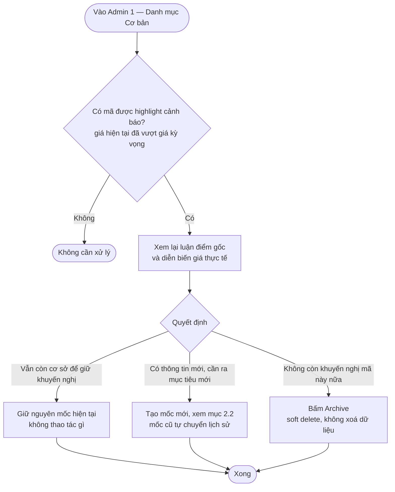
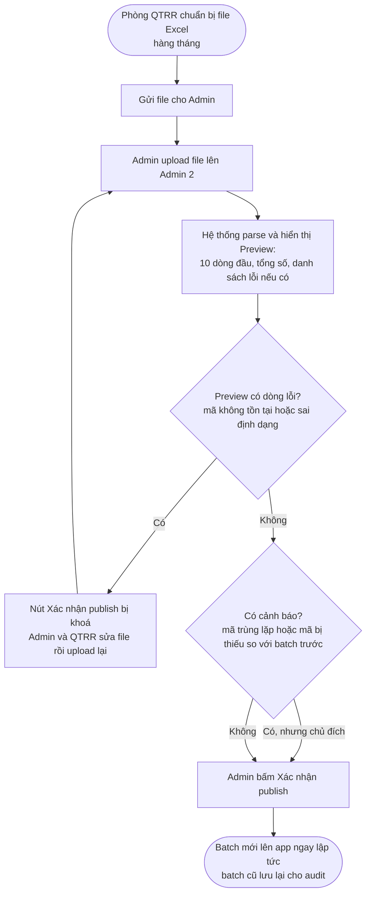

# Khuyến nghị (A-05) — Hướng dẫn quy trình nghiệp vụ

> Tài liệu này dành cho **Phòng Phân tích (PT)** và **Phòng Quản trị Rủi ro (QTRR)** — mô tả các bạn cần làm gì, khi nào, và trên màn hình nào của Admin Tool (`tnhsvpro.nhsv.vn/nhsv-admin`) để nội dung khuyến nghị lên đúng trên app NHSV Pro. Không có nội dung kỹ thuật (API/schema) — xem tổng quan tính năng tại [Overview & Journeys](./Overview_and_Journeys.md).

**Nguồn:** [PRD.md](./PRD.md) v1.3 · Cập nhật theo rà soát edge case 2026-07-23

---

## TL;DR

- **Phòng PT** quản lý Cơ bản (tạo mốc mới cho mã đã có → mốc cũ tự chuyển lịch sử; tự review mã đã đạt giá kỳ vọng vì hệ thống không tự archive) và Kỹ thuật hằng ngày (nhập nhiều mã theo batch, Lưu nháp trước rồi mới Publish theo ngày).
- **Phòng QTRR** upload file Excel Rating ~1 lần/tháng — hệ thống **chặn publish** nếu còn dòng lỗi (mã không tồn tại/sai định dạng), nhưng chỉ **cảnh báo, không chặn** nếu phát hiện mã trùng hoặc mã bị thiếu so với batch trước.
- **3 field đã bỏ khỏi form Admin** (không cần nhập nữa): Segment (nay tự động), Giá tại ngày khuyến nghị, Ngày hết hiệu lực.
- **Cần xác nhận trước release:** wording disclaimer pháp lý phải qua Legal duyệt (Q6).

---

## 1. Vai trò của bạn trong tính năng này

| Phòng ban | Phụ trách nội dung | Nơi thao tác |
|---|---|---|
| **Phòng Phân tích (PT)** | Danh mục Cơ bản (khuyến nghị dài hạn) + Kỹ thuật hằng ngày | Admin 1, Admin 3 |
| **Phòng Quản trị Rủi ro (QTRR)** | NHSV Rating (bảng đánh giá S/A/B/C/D) | Gửi file Excel cho Admin xử lý ở Admin 2 |

Cả 2 luồng đều có đặc điểm chung: **nội dung các bạn nhập/upload sẽ hiển thị trên app gần như ngay lập tức** (không cần chờ cache, không cần IT can thiệp) — vì vậy quy trình dưới đây có vài bước xác nhận/review để tránh đưa nhầm nội dung lên app.

---

## 2. Quy trình Phòng PT — Danh mục Cơ bản (Admin 1)

### 2.1 Tạo khuyến nghị mới cho 1 mã chưa từng khuyến nghị

1. Vào Admin 1 → "+ Thêm khuyến nghị".
2. Nhập: Mã CK, Giá kỳ vọng, Ngày khuyến nghị, Luận điểm (không bắt buộc).
3. Chọn report: **hoặc** tìm và link 1 bài NH Research đã publish có tag mã này, **hoặc** upload PDF riêng.
4. Lưu — mã lên app ngay ở trạng thái current.

> **Lưu ý các field đã bỏ (không cần nhập nữa):** Segment (Bluechip/Midcap) nay do hệ thống tự xác định theo mã; "Giá tại ngày khuyến nghị" và "Ngày hết hiệu lực" đã bỏ khỏi form — % tiềm năng luôn tính theo giá hiện tại real-time, và mã chỉ ngừng hiển thị khi chính các bạn bấm Archive.

### 2.2 Cập nhật khuyến nghị cho mã đã có (mốc mới)

Khi có thông tin mới cho 1 mã đã đang khuyến nghị (thường theo nhịp báo cáo tài chính quý) — bấm "+ Thêm khuyến nghị" **cho cùng mã đó**. Hệ thống tự động:
- Đưa mốc hiện tại thành **lịch sử** (vẫn xem lại được ở "Danh sách báo cáo gần nhất" trên app, không mất dữ liệu).
- Đặt mốc mới bạn vừa tạo làm **current** — hiển thị ngay trên card Home và list Cơ bản.

Các bạn **không cần** thao tác gì thêm để "đóng" mốc cũ — không có bước riêng nào cho việc đó.

### 2.3 Trách nhiệm mới (từ 2026-07-23): review mã đã đạt mục tiêu

Trước đây có đề xuất tự động ẩn/archive mã khi giá đã vượt giá kỳ vọng — **quyết định cuối cùng là KHÔNG tự động**. Thay vào đó, Admin 1 sẽ highlight cảnh báo các mã này để các bạn chủ động xử lý:

Trên app, user vẫn thấy mã đó bình thường kèm badge "Đã đạt mục tiêu" cho tới khi các bạn xử lý xong — đây không phải lỗi hệ thống, là chủ đích để tránh việc mã biến mất đột ngột khỏi app trong lúc PT đang cân nhắc.

### 2.4 Sửa / Archive

- **Sửa**: chỉ sửa được mốc **current** đang active (không sửa được mốc lịch sử).
- **Archive**: soft delete — mã hết hiển thị trên app nhưng dữ liệu không bị xoá, vẫn truy vết được.

---

## 3. Quy trình Phòng PT — Kỹ thuật hằng ngày (Admin 3)

Khác với Cơ bản (khuyến nghị theo mã, sống lâu dài), Kỹ thuật là nội dung ngắn hạn theo từng phiên giao dịch — quy trình có bước **Nháp** trước khi công bố:

1. Bấm "+ Thêm entry" → chọn **1 ngày áp dụng**.
2. Nhập **nhiều dòng mã** trong cùng 1 form (Vùng mua, Mục tiêu, Cắt lỗ, Upsize tuỳ chọn) — vừa soạn xong bao nhiêu mã cũng được, chưa hiển thị trên app.
3. Bấm "Lưu nháp" — toàn bộ mã vừa nhập ở trạng thái **Nháp**, các bạn có thể tiếp tục sửa/thêm dòng khác cho cùng ngày.
4. Khi đã soạn xong cho ngày đó, bấm **"Publish ngày [ngày đang chọn]"** — toàn bộ Nháp của ngày đó lên app **cùng lúc**.

**3 lưu ý quan trọng:**
- **1 mã chỉ có 1 entry/ngày.** Nếu thêm dòng với mã đã có entry cho ngày đang chọn, hệ thống chặn lại và yêu cầu sửa entry hiện có thay vì tạo mới.
- **Chỉ tạo được loại MUA** ở v1 (SELL/HOLD chưa mở, dù hệ thống đã có sẵn cho v2).
- **Nếu chọn ngày quá 14 ngày trước hiện tại**, hệ thống vẫn cho lưu nhưng cảnh báo: entry đó sẽ không hiển thị trên mobile (app chỉ hiển thị rolling 14 ngày gần nhất — Admin không bị giới hạn, vẫn xem/sửa được entry của bất kỳ ngày quá khứ nào để phục vụ audit).

**Xoá:** Kỹ thuật dùng **xoá cứng** (khác với Cơ bản) vì là dữ liệu ngắn hạn, không cần lưu vết lâu dài — áp dụng cho cả entry Nháp và đã Publish.

---

## 4. Quy trình Phòng QTRR — NHSV Rating (Admin 2)

Đây là luồng duy nhất dùng file Excel thay vì nhập tay từng mã — Phòng QTRR gửi file, Admin upload thay toàn bộ bảng rating hiện tại (~1 lần/tháng).

**Định dạng file bắt buộc:** 4 cột — `Mã`, `Cơ bản`, `Thị trường`, `NHSV Rating`. Giá trị hợp lệ cho các cột rating: `S`/`A`/`B`/`C`/`D` (không phân biệt hoa thường).

**Phân biệt quan trọng — lỗi (chặn) vs cảnh báo (không chặn):**

| Loại | Ví dụ | Có chặn publish không? |
|---|---|---|
| **Lỗi** | Mã không tồn tại trên hệ thống, sai định dạng rating | **Có** — phải sửa và upload lại file sạch 100%, không cho publish một phần |
| **Cảnh báo** | Mã trùng lặp trong file, mã có ở batch cũ nhưng thiếu trong file mới | **Không** — chỉ hiển thị để Phòng QTRR/Admin tự xác nhận đây có phải chủ đích hay không (ví dụ: cố tình bỏ mã khỏi danh mục ký quỹ tháng này) |

---

## 5. Trách nhiệm & thời gian mục tiêu (SLA)

| Việc cần làm | Ai | Mục tiêu thời gian |
|---|---|---|
| Tạo & publish khuyến nghị Cơ bản (mã mới hoặc mốc mới) | Phòng PT (qua Admin) | < 5 phút |
| Review mã đã đạt mục tiêu và quyết định xử lý | Phòng PT | Định kỳ, không có SLA cứng — nên kiểm tra thường xuyên vì badge hiển thị ngay trên app |
| Nhập + Publish Kỹ thuật hằng ngày (nhiều mã/ngày) | Phòng PT (qua Admin) | < 3 phút |
| Upload + Publish Rating Excel | Phòng QTRR (qua Admin) | < 5 phút |

---

## 6. Disclaimer pháp lý (bắt buộc trên mọi màn hình)

Nội dung dưới đây là **draft**, cần Legal duyệt chính thức trước khi release (xem mục 7, Q6):

- **Cơ bản & Kỹ thuật:** "Nội dung khuyến nghị do Phòng Phân tích NHSV cung cấp, chỉ mang tính chất tham khảo, không phải là lời chào mua/bán hoặc tư vấn đầu tư. NHSV không chịu trách nhiệm đối với quyết định giao dịch dựa trên thông tin này. Quý khách cần tự đánh giá và cân nhắc kỹ trước khi thực hiện giao dịch."
- **NHSV Rating:** "Rating do Phòng Quản trị Rủi ro NHSV xây dựng, cập nhật định kỳ hàng tháng, dùng cho mục đích quản lý danh mục ký quỹ, chỉ mang tính chất tham khảo và không phải là tư vấn đầu tư. NHSV không chịu trách nhiệm đối với quyết định giao dịch dựa trên thông tin này."

---

## 7. Câu hỏi cần Phòng PT / Phòng QTRR xác nhận

| # | Câu hỏi | Owner | Deadline |
|---|---|---|---|
| Q3 | Vietstock automation (v2) — kênh gửi dữ liệu Kỹ thuật hằng ngày là email/SFTP/API? Ai xử lý raw data trước khi vào hệ thống? | IT + Phòng PT | Trước v1 release |
| Q5 | Nếu Phòng QTRR đổi cấu trúc file Excel (thêm/đổi tên cột), hệ thống cần sửa code hay có thể config được? | PM + Phòng QTRR | Trước khi build Admin 2 |
| Q6 | Wording disclaimer ở mục 6 — Legal đã duyệt chưa? | PM + Legal | Trước release |

---

Document Status: 📋 Draft | For: Phòng Phân tích, Phòng QTRR | Next Steps: Xác nhận Q3/Q5 với IT, chờ Legal duyệt Q6 trước release
