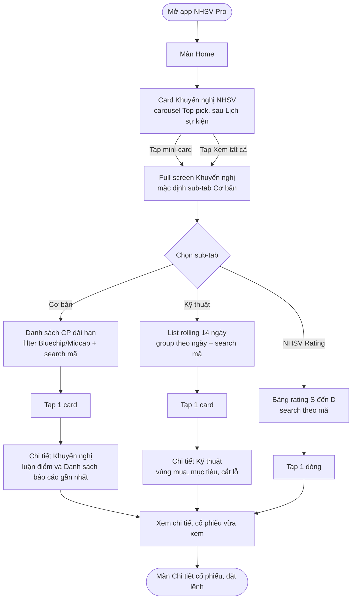
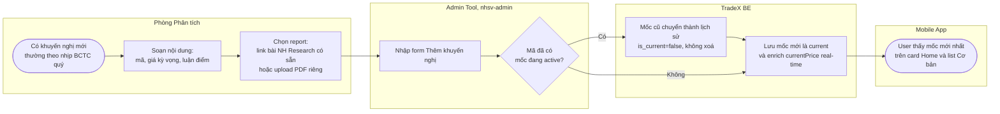
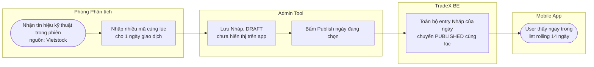
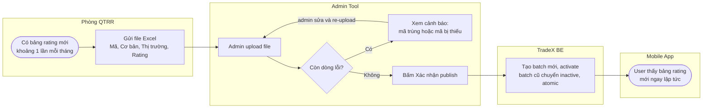

# Khuyến nghị (A-05) — Tổng quan & Hành trình

> Tài liệu này dành cho **PM review scope**. Không đi vào chi tiết kỹ thuật (schema, API, edge case) — xem [Feature Specification](../Specifications/Feature_Specification.md) cho phần đó, hoặc [Business Process Guide](./Business_Process_Guide.md) cho quy trình thao tác của Phòng PT/QTRR.

**Feature ID:** A-05 · **PM:** Midu (Nguyễn Minh Đức) · **Nguồn:** [PRD.md](./PRD.md) v1.3 (2026-07-23) · **Tracking:** `NHP-KHUYENNGHI` trong `Tracking/tasks.js`

---

## TL;DR

- **Khuyến nghị (A-05)** gộp 3 luồng nội dung tư vấn (Danh mục Cơ bản, Kỹ thuật hằng ngày, NHSV Rating) vào **1 entry point mới ngay trên màn Home** — không còn nằm trong NHSV Channel như thiết kế ban đầu.
- User: Home → tap card → full-screen 3 sub-tab (Cơ bản → Kỹ thuật → Rating) → chi tiết → đặt lệnh. Business: Phòng PT/QTRR nhập liệu qua Admin Tool, hệ thống tự enrich giá real-time và tự lưu lịch sử, gần như không cần IT can thiệp.
- **Trong scope v1:** card Home, đủ 3 sub-tab, badge trạng thái động (đã đạt mục tiêu/cắt lỗ), disclaimer pháp lý. **Ngoài scope:** alert giá, so sánh nhiều mã, automation Vietstock (để v2).
- **3 việc cần Midu chốt trước GA:** wording disclaimer (Q6, chờ Legal), sequencing với A-06 NH Research (Q9), có bắt buộc đăng nhập lại không (Q11).

---

## 1. Tổng quan

### 1.1 Vấn đề đang giải quyết

Phòng Phân tích (PT) và Phòng Quản trị Rủi ro (QTRR) sản xuất đều đặn 3 loại nội dung khuyến nghị giá trị cho nhà đầu tư — danh mục cổ phiếu khuyến nghị dài hạn, bảng rating cổ phiếu (dùng cho margin), và khuyến nghị kỹ thuật ngắn hạn — nhưng hiện chỉ phân phối qua email/website, **không có trên NHSV Pro**.

Hệ quả: khách hàng không thấy giá trị tư vấn của NHSV ngay trong app khi đang trading, hai phòng nghiệp vụ không tận dụng được kênh phân phối in-app, và NHSV thua thiệt so với các CTCK đối thủ (SSI, KBSV, VNDIRECT, TCBS, MBS) — tất cả đều đã có tính năng tương đương trên mobile app.

**Quyết định vị trí (v1.2):** Khuyến nghị không nằm trong tab con của NHSV Channel như thiết kế ban đầu, mà tách thành **1 khu vực riêng ngay trên màn Home** — vì đây là nội dung cạnh tranh trực tiếp với đối thủ, cần vị trí nổi bật hơn là bị "chìm" sau 3 tab khác.

### 1.2 Mục tiêu

| Mục tiêu | Chỉ số đo lường |
|---|---|
| Đưa giá trị tư vấn NHSV đến user ngay khi đang trading | % user active mở Khuyến nghị ≥ 1 lần/tuần sau release |
| Giảm thời gian Phòng PT publish khuyến nghị mới | < 5 phút (Danh mục/Kỹ thuật), < 30 phút (Rating) từ lúc có nội dung → user thấy trên app |
| Tăng tin cậy & trust của NHSV | NPS survey sau 60 ngày release |
| Chuẩn bị nền tảng automation Vietstock (v2) | Field `dataSource` sẵn sàng từ v1, không cần migration khi build v2 |

### 1.3 Đối tượng người dùng

| Nhóm | Đặc điểm | Dùng chủ yếu |
|---|---|---|
| **Primary** — Investor dài hạn | Giá trị danh mục > 100M VNĐ, đã có nhiều tài khoản môi giới, hay so sánh giữa các CTCK | Cơ bản + Rating |
| **Secondary** — Day trader / swing trader | Cần tham khảo vùng mua/cắt lỗ trong phiên | Kỹ thuật hằng ngày |
| **Tertiary** — Nhà đầu tư mới | Chưa có kinh nghiệm phân tích riêng | Rating (S/A/B/C/D) như bộ lọc đầu vào |

### 1.4 Phạm vi (Scope)

**✅ Trong scope (v1)**
- Card Home entry point (carousel Top pick) + full-screen Khuyến nghị với 3 sub-tab: Cơ bản → Kỹ thuật → Rating
- Cơ bản: danh sách + chi tiết + nhiều mốc/lịch sử theo mã + report (PDF hoặc link bài NH Research)
- Kỹ thuật: rolling 14 ngày gần nhất, chỉ loại MUA
- NHSV Rating: bảng đánh giá + search theo mã, cập nhật qua Excel hàng tháng
- Search theo mã CK cho cả 3 sub-tab, disclaimer pháp lý bắt buộc trên mọi màn hình
- Admin: CRUD Cơ bản (có mốc/lịch sử), Excel upload Rating, CRUD Kỹ thuật (Draft → Publish)

**❌ Ngoài scope (v1)**
- Auto pipeline từ Vietstock (schema sẵn sàng, để v2)
- Track record / accuracy rate của từng khuyến nghị, Alert khi giá đạt target/cắt lỗ
- So sánh nhiều mã, Portfolio P&L theo khuyến nghị, Approval workflow nhiều bước
- Khuyến nghị kỹ thuật loại SELL/HOLD (schema sẵn, chưa mở dùng)
- Personalization card Home theo từng user
- Xử lý riêng khi mã bị hủy niêm yết/đình chỉ giao dịch, hoặc điều chỉnh giá tự động theo GDKHQ (chia tách/cổ tức) — chấp nhận rủi ro hiếm gặp, Phòng PT tự xử lý thủ công

---

## 2. Hành trình của User

Người dùng vào Khuyến nghị qua 1 điểm chạm duy nhất trên Home, sau đó rẽ nhánh theo nhu cầu (đầu tư dài hạn / giao dịch ngắn hạn / tra cứu rating), và luôn kết thúc bằng việc chuyển sang màn đặt lệnh cho mã cổ phiếu vừa xem.

**Ghi chú theo persona:**
- Investor dài hạn: thường dừng ở **Cơ bản**, đọc luận điểm + báo cáo trước khi qua đặt lệnh; hay ghé **Rating** để cross-check.
- Day trader: vào thẳng **Kỹ thuật**, xem lại vài phiên gần nhất nếu bỏ lỡ, ít khi đọc Cơ bản.
- NĐT mới: dùng **Rating** như bộ lọc đầu vào trước khi tìm hiểu sâu ở Cơ bản.

Cả 2 nhánh Cơ bản/Kỹ thuật đều hiển thị badge trạng thái động (đã đạt mục tiêu / đã chạm cắt lỗ) ngay trên card — đây là điểm khác biệt so với v1.1, giúp user nhận biết ngay khuyến nghị còn "sống" hay đã tới điểm chốt mà không cần vào chi tiết.

---

## 3. Hành trình Business (liên phòng ban)

Ba luồng nội dung có 3 chủ sở hữu nghiệp vụ khác nhau, cùng đổ về 1 hệ thống lưu trữ và 1 điểm hiển thị trên app. Sơ đồ dưới theo dạng swimlane (mỗi khối = 1 bên tham gia).

### 3.1 Flow A — Phòng Phân tích: Danh mục Cơ bản (mốc mới)

Điểm nghiệp vụ quan trọng: khi tạo mốc mới cho 1 mã đã có, Phòng PT **không cần thao tác gì thêm** để "đóng" mốc cũ — hệ thống tự chuyển mốc cũ thành lịch sử. Ngược lại, khi 1 mã đã đạt giá kỳ vọng (% tiềm năng ≤ 0), hệ thống **không tự động archive** — Phòng PT phải chủ động vào Admin xem danh sách được highlight cảnh báo và quyết định giữ nguyên / ra mốc mới / Archive.

### 3.2 Flow B — Phòng Phân tích: Kỹ thuật hằng ngày

Tách "soạn" và "công bố" thành 2 bước để Phòng PT có thể nhập nhiều mã trong lúc phiên đang diễn ra mà không làm user thấy danh sách nửa vời.

### 3.3 Flow C — Phòng QTRR: NHSV Rating (Excel hàng tháng)

Điểm nghiệp vụ quan trọng: nếu file còn **bất kỳ dòng lỗi nào** (mã không tồn tại/sai định dạng), nút "Xác nhận publish" bị khoá — hệ thống không cho publish một phần. Cảnh báo mã trùng lặp hoặc mã bị thiếu so với batch trước chỉ là **warning**, admin vẫn có thể publish nếu xác nhận đó là chủ đích (ví dụ Phòng QTRR cố tình bỏ mã khỏi danh mục ký quỹ).

---

## 4. Mô tả tính năng (tóm tắt theo sub-tab)

| Sub-tab | Nội dung | Nguồn | Ai nhập liệu | Tần suất |
|---|---|---|---|---|
| **① Cơ bản** | Danh sách CP khuyến nghị mua dài hạn: giá kỳ vọng, % tiềm năng, luận điểm, report | Phòng Phân tích + market feed (giá real-time) | Admin nhập tay từng mã | Theo nhịp BCTC quý |
| **② Kỹ thuật** | Khuyến nghị ngắn hạn: vùng mua, cắt lỗ, mục tiêu, upsize (chỉ loại MUA) | Vietstock → Phòng PT xử lý thủ công | Admin nhập batch nhiều mã/ngày | ~Hàng ngày (mỗi phiên) |
| **③ NHSV Rating** | Bảng đánh giá S/A/B/C/D (Cơ bản, Thị trường, Tổng), dùng cho margin | Phòng QTRR | Admin upload file Excel, replace toàn batch | ~1 lần/tháng |

Chi tiết trường dữ liệu, công thức tính, và ràng buộc hệ thống → xem [Feature Specification](../Specifications/Feature_Specification.md).

---

## 5. Luồng xử lý (tóm tắt mức business)

Ở mức tổng quan, dữ liệu đi theo 1 đường chung cho cả 3 sub-tab:

**Nguồn nội dung (Phòng PT / QTRR) → Admin Tool (nhập tay hoặc upload) → TradeX lưu & enrich giá real-time → Mobile App đọc và hiển thị ngay, không cần chờ cache.**

Khác biệt giữa 3 sub-tab nằm ở *cách nhập liệu* (nhập tay từng mã / nhập batch theo ngày / upload Excel thay toàn bộ) và *cách xử lý dữ liệu cũ* (giữ lịch sử theo mốc / xoá cứng vì dữ liệu ngắn hạn / giữ batch cũ cho audit). Luồng gọi API, mô hình dữ liệu, và cách xử lý từng edge case (giá null, mã trùng, mã hết hiệu lực…) được trình bày đầy đủ trong Feature Specification dành cho Dev.

---

## 6. Câu hỏi cần Midu quyết định (business-impact)

| # | Câu hỏi | Ảnh hưởng | Deadline |
|---|---|---|---|
| Q6 | Wording disclaimer pháp lý — Legal duyệt chưa? Có cần số GP/SBV? | Compliance — blocker release | Trước release |
| Q9 | A-06 (Stock Tag Enrichment) phải xong trước khi Admin link bài NH Research được — nếu chưa, tạm dùng nhánh Upload PDF | Sequencing 2 feature | Trước ADM-01 |
| Q11 | Tạm mở toàn bộ API mobile không cần đăng nhập — giữ vĩnh viễn (tăng conversion) hay bắt buộc login lại trước GA (bảo vệ nội dung premium)? | Quyết định chiến lược phân phối nội dung + bảo mật | Trước GA |
| Q7 | Card Home cần refresh theo tần suất nào? | Performance màn Home | Trước MOB-Home-01 |
| Q8 | "Danh sách báo cáo gần nhất" giới hạn hiển thị bao nhiêu mốc? | UX + pagination | Trước MOB-04 |
| Q4 | Rating: tap mã → thẳng stock detail hay có màn rating detail riêng? | UX + estimate scope | Trước MOB-04 |

Các câu hỏi mang tính kỹ thuật hơn (Q3 Vietstock timeline, Q5 Excel format handling) nằm trong Feature Specification vì cần input trực tiếp từ IT/Phòng QTRR.

---

## 7. Checklist review scope

- [ ] 3 persona (đầu tư dài hạn / day trader / NĐT mới) đã được cover đủ bởi 3 sub-tab chưa?
- [ ] Vị trí entry point trên Home (sau Lịch sự kiện) còn đúng ưu tiên hiển thị không?
- [ ] Danh sách Ngoài scope (mục 1.4) có điểm nào cần đẩy vào v1 không?
- [ ] Q6/Q9/Q11 đã có hướng xử lý trước khi giao IT estimate chi tiết chưa?

---

Document Status: 📋 Draft | For: PM (Midu) | Next Steps: Review scope theo checklist mục 7, chốt Q6/Q9/Q11 trước khi giao Feature Specification cho Dev estimate
