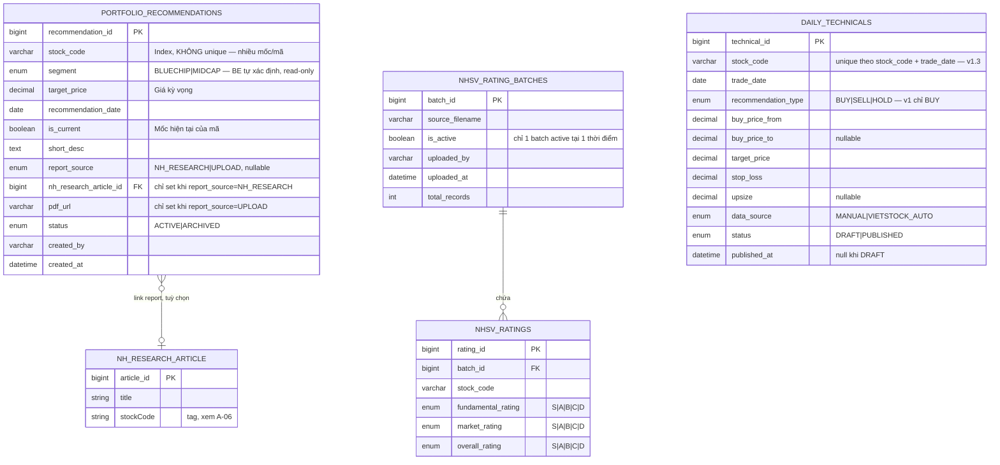
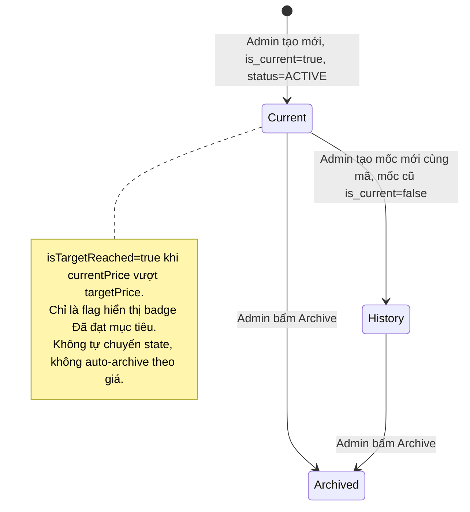
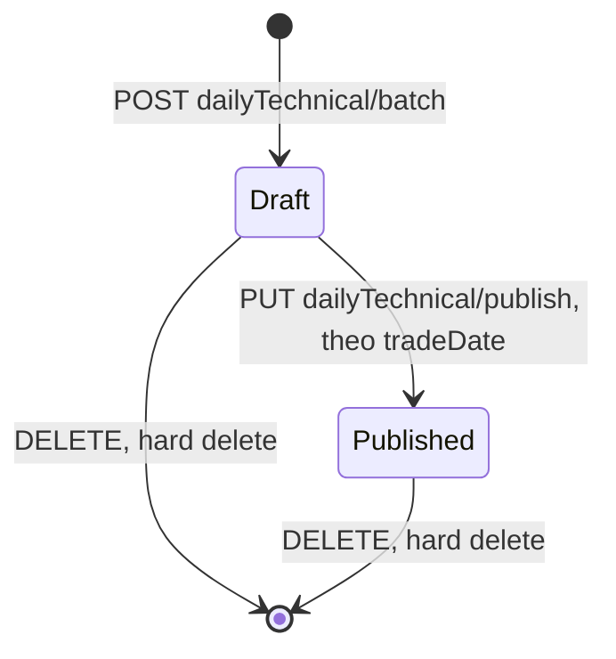
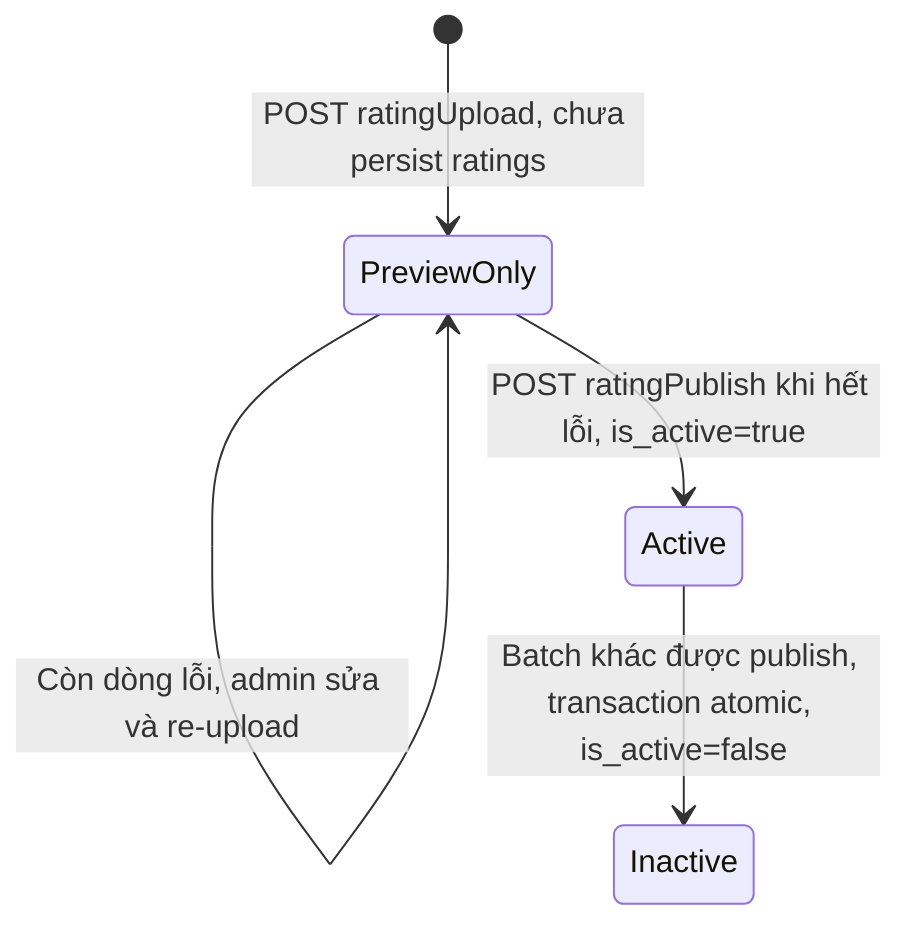
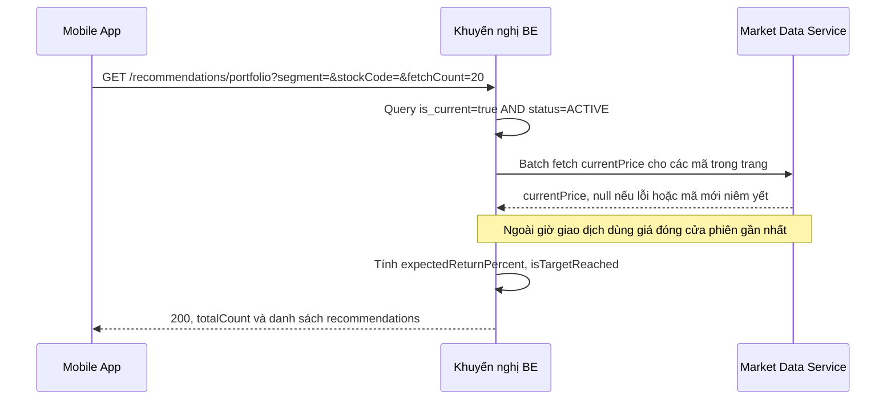
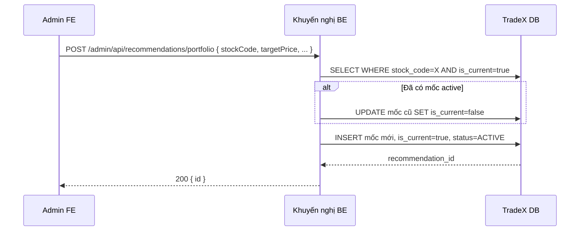
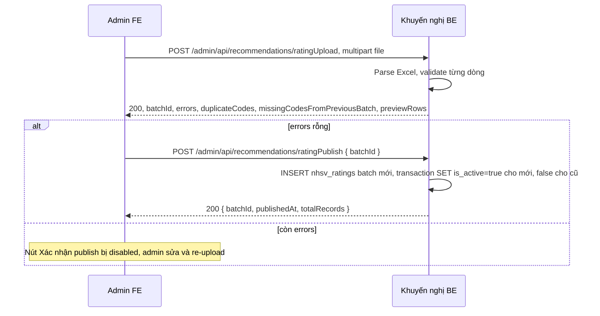
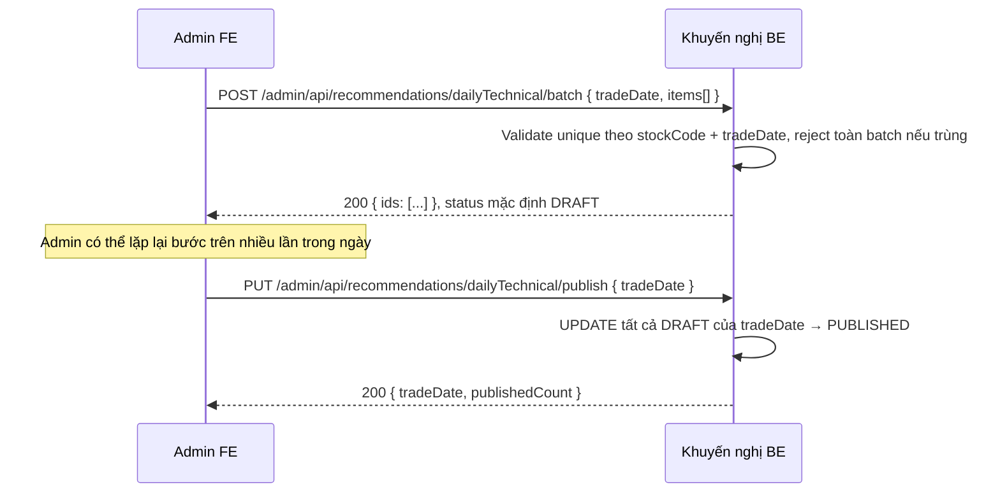

# Khuyến nghị (A-05) — Feature Specification

> Tài liệu này dành cho **Dev (BE/Mobile FE/Admin FE)** đánh giá khả thi & estimate. Bối cảnh sản phẩm, user journey, business journey → xem [Overview & Journeys](../Planning/Overview_and_Journeys.md). Quy trình vận hành của Phòng PT/QTRR → xem [Business Process Guide](../Planning/Business_Process_Guide.md).

**Feature ID:** A-05 · **Nguồn:** [PRD.md](../Planning/PRD.md) v1.3 (2026-07-23), đối chiếu với [Archive/Spec.html](../Archive/Spec.html) mục 4–6 · **Admin URL:** `tnhsvpro.nhsv.vn/nhsv-admin`

---

## TL;DR

- **TradeX-native**, không đi qua Lotte/Core. Điểm tích hợp ngoài duy nhất: enrich `currentPrice` qua market-data service nội bộ (áp dụng cho cả Cơ bản và Kỹ thuật).
- **4 bảng chính:** `portfolio_recommendations` (append-only theo mốc, giữ lịch sử), `daily_technicals` (unique theo mã + ngày), `nhsv_rating_batches`/`nhsv_ratings` (batch atomic swap active/inactive).
- **6 API mobile** (tạm thời không cần đăng nhập) + **~9 API admin** — chi tiết field, request/response ở mục 4–5; 4 sequence diagram cho luồng chính ở mục 6.
- **18 edge case kỹ thuật** đã rà soát và có xử lý cụ thể (mục 7) — đáng chú ý: `currentPrice null` không phải lỗi 500, `UNIQUE(stockCode, tradeDate)` chặn trùng, publish Rating bị chặn toàn bộ nếu còn dòng lỗi.
- **Blocker estimate:** Q5 (format Excel), Q9 (sequencing A-06) — Excel upload cần POC trước khi commit estimate theo sprint.

---

## 1. Kiến trúc & Integration type

**TradeX-native** (nội bộ, không đi qua Lotte/Core). Toàn bộ API dưới đây không cần map field Lotte, không cần auto-populate `sourceIp`/`deviceUniqueId`/`lang_code` kiểu Order API. Điểm tích hợp ngoài duy nhất là **enrich `currentPrice`** qua service market-data nội bộ (không phải Lotte) — áp dụng cho Cơ bản (list/detail/topPicks) và Kỹ thuật (để tính badge trạng thái động `isTargetReached`/`isStopLossReached`).

```
Admin (nhsv-admin) ──POST/PUT/DELETE──> Khuyến nghị BE ──> TradeX DB (MySQL)
                                              │
                                              ├──> Market Data Service (enrich currentPrice)
                                              └──> NH Research service (lookup article theo stockCode, khi link report)

Mobile App ──GET──> Khuyến nghị BE (đọc trực tiếp, không cache layer riêng)
```

**Auth (v1.3 — tạm thời):** Toàn bộ 6 API mobile không yêu cầu đăng nhập (Bearer token optional). Quyết định tạm thời, cần revisit trước GA (xem Q11, mục 11). API admin (`/admin/api/*`) không đổi — vẫn bắt buộc Admin session.

---

## 2. Data Model



> `portfolio_recommendations` là **append-only theo mốc**: 1 mã có thể có nhiều row theo thời gian, chỉ 1 row `is_current=true`. Đây không phải quan hệ FK trong ERD trên mà là 1 rule ở tầng ứng dụng — xem State Diagram mục 3.1.

Field đã bỏ khỏi v1 nhưng **vẫn giữ trong schema** (không migrate xoá cột, chỉ không dùng): `recommended_price` (giá tại ngày khuyến nghị — bỏ từ v1.2), `expiry_date` (ngày hết hiệu lực Cơ bản — bỏ từ v1.3, luôn NULL).

### 2.1 Trường tự động điền (client KHÔNG cần truyền)

| Field | API áp dụng | Nguồn |
|---|---|---|
| `createdBy` | `POST portfolio`, `POST dailyTechnical/batch` | Admin session (null nếu `dataSource=VIETSTOCK_AUTO`) |
| `isCurrent` | `POST portfolio` | Hệ thống — row mới luôn `true`, tự set `false` cho row current trước đó cùng mã |
| `segment` | `POST/PUT portfolio` | Hệ thống — BE xác định theo index membership của mã, không nhận từ request body |
| `uploadedBy` | `POST ratingUpload` | Admin session |
| `status` (portfolio) | `POST portfolio` | Luôn khởi tạo `ACTIVE`; chỉ chuyển `ARCHIVED` khi admin Archive tay |
| `batch.isActive` | `POST ratingPublish` | Hệ thống — `true` cho batch mới, `false` cho batch cũ, cùng 1 transaction |
| `status` (dailyTechnical) | `POST dailyTechnical/batch` | Luôn khởi tạo `DRAFT`; chỉ đổi `PUBLISHED` qua `PUT .../publish` |

---

## 3. Lifecycle (State Diagrams)

### 3.1 Portfolio Recommendation (Cơ bản) — theo mã



### 3.2 Daily Technical (Kỹ thuật)



### 3.3 Rating Batch



---

## 4. API Reference — Mobile App

Base URL: `/api/v1` · Auth: **(v1.3, tạm thời)** không bắt buộc đăng nhập cho cả 6 endpoint dưới đây.

### 4.1 `GET /recommendations/portfolio/topPicks`
Preview cho card Home — nhẹ, ≤ 6 mã.

| Param | Type | Note |
|---|---|---|
| `limit` | int? | Default 6, max 6 |

Response item: `stockCode`, `expectedReturnPercent` (number?), `segment`.
Nguồn: `WHERE is_current=true AND status='ACTIVE'`, `ORDER BY expectedReturnPercent DESC, recommendationDate DESC` (tie-break theo ngày KN gần nhất — v1.3).

### 4.2 `GET /recommendations/portfolio`
List Cơ bản, phân trang cursor.

| Param | Type | Note |
|---|---|---|
| `segment` | string? | `BLUECHIP` \| `MIDCAP`, null = tất cả |
| `stockCode` | string? | Search LIKE |
| `fetchCount` | int? | Default 20 |
| `lastRecommendationId` | string? | Cursor phân trang |

Response wrapper: `{ totalCount, recommendations: [...] }`. Mỗi item: `recommendationId`, `stockCode`, `segment`, `targetPrice`, `currentPrice` (number?, null nếu enrichment lỗi/mã mới niêm yết), `expectedReturnPercent` (number?, null nếu currentPrice null), `isTargetReached` (bool, true khi currentPrice ≥ targetPrice), `recommendationDate`, `hasPdf`.

Filter cố định: chỉ trả `is_current=true AND status='ACTIVE'`. `currentPrice`/`expectedReturnPercent` null → HTTP vẫn 200, không phải lỗi 500.

### 4.3 `GET /recommendations/portfolio/{recommendationId}`
Chi tiết 1 khuyến nghị. Thêm so với list: `shortDesc`, `pdfUrl/pdfFilename/pdfSizeBytes`, `reportHistory[]` (mỗi item: `recommendedDate`, `title`, `reportUrl`, `source`, `reportAvailable` — bool, false nếu bài NH Research gốc đã unpublish/xoá → FE hiển thị "No data", API vẫn 200). Error 404 `OBJECT_NOT_FOUND` chỉ khi bản thân `recommendationId` không tồn tại.

### 4.4 `GET /recommendations/rating`
Bảng NHSV Rating, không phân trang (dataset bounded).

| Param | Type | Note |
|---|---|---|
| `stockCode` | string? | Search LIKE |
| `sortBy` | string? | `OVERALL`\|`FUNDAMENTAL`\|`MARKET`, default OVERALL DESC |

Response: `batchUpdatedAt`, `ratings[]` (`stockCode`, `fundamentalRating`, `marketRating`, `overallRating`), `totalCount`.

### 4.5 `GET /recommendations/dailyTechnical`
Rolling 14 ngày gần nhất.

| Param | Type | Note |
|---|---|---|
| `fromDate` | date? | Default `CURDATE()-13` |
| `toDate` | date? | Default `CURDATE()` — mobile v1 không truyền, luôn dùng default |
| `stockCode` | string? | Search |

Response item: `technicalId`, `stockCode`, `tradeDate`, `recommendationType` ("BUY" duy nhất ở v1), `buyPriceFrom`, `buyPriceTo` (null = 1 mức giá), `targetPrice`, `stopLoss`, `upsize` (null → ẩn ô), `currentPrice` (number?, enrich như Cơ bản), `isTargetReached` (bool), `isStopLossReached` (bool), `hasPdf`.

Empty: `{"fromDate":"...","toDate":"...","technicals":[],"totalCount":0}` — **HTTP 200**, không phải 404. Chỉ trả `status='PUBLISHED'`.

### 4.6 `GET /recommendations/dailyTechnical/{id}`
Chi tiết — thêm `shortDesc`, `pdfUrl`.

---

## 5. API Reference — Admin

Base URL: `/admin/api` · Auth: Admin session (không đổi).

### 5.1 Portfolio (Cơ bản)

**`POST /recommendations/portfolio`** — tạo mốc mới.
Request: `stockCode` (required), `targetPrice` (required), `recommendationDate` (required), `shortDesc?`, `reportSource?` (`NH_RESEARCH`\|`UPLOAD`), `nhResearchArticleId?` (required nếu reportSource=NH_RESEARCH), `pdfUrl/pdfFilename/pdfSizeBytes?` (required nếu reportSource=UPLOAD).
**Không nhận** `segment` (BE tự xác định), **không nhận** `expiryDate` (bỏ từ v1.3).
Response: `{ id }` — TradeX-native mutation convention, HTTP 200 (không phải 201).
Business rule: nếu `stockCode` đã có row `is_current=true` → BE tự set `false` cho row đó rồi INSERT row mới `is_current=true`, cùng transaction — client không cần gọi API riêng nào khác.

**`PUT /recommendations/portfolio/{id}`** — sửa mốc current. Cùng field như POST (trừ stockCode).

**`DELETE /recommendations/portfolio/{id}`** — soft delete, `status → ARCHIVED`. Response `{ deleted: true }`.

**`GET /admin/api/nhResearch/articles?stockCode={code}`** — tìm bài NH Research đã tag mã này để link (reuse response shape từ A-04 Spec mục 8.3). Dependency: cần A-06 (Stock Tag Enrichment) build xong (xem Q9) — nếu chưa, admin chỉ dùng nhánh Upload PDF.

### 5.2 NHSV Rating (Excel)

**`POST /recommendations/ratingUpload`** (multipart) — Request: `file` (required, .xlsx/.xls).
Response (200 — preview): `batchId`, `totalRecords`, `validRecords`, `errors[]?` (mỗi item kèm số dòng), `duplicateCodes[]` (v1.3, warning), `missingCodesFromPreviousBatch[]` (v1.3, warning), `previewRows` (10 dòng đầu).
Error 400 `INVALID_PARAMETER` nếu không phải Excel hoặc thiếu cột bắt buộc. `duplicateCodes`/`missingCodesFromPreviousBatch` **chỉ là warning**, không tự chặn publish.

**`POST /recommendations/ratingPublish`** — Request: `{ batchId }`.
Response: `{ batchId, publishedAt, totalRecords }`.
**Chặn publish khi còn lỗi (v1.3):** nếu batch còn dòng trong `errors[]` → 400 `VALIDATION_ERRORS_PRESENT`, không cho publish một phần. Idempotent theo `batchId`.

### 5.3 Daily Technical (Kỹ thuật)

**`GET /recommendations/dailyTechnical`** (admin variant) — Request: `tradeDate` (required, bất kỳ ngày nào), `status?` (`DRAFT`\|`PUBLISHED`, null = cả 2), `stockCode?`.
Response: `{ tradeDate, totalCount, technicals[] }` (thêm field `status` so với mobile). Ngày không có entry (kể cả DRAFT) → `{"tradeDate":"...","totalCount":0,"technicals":[]}`, **HTTP 200**, không 404 — áp dụng cho mọi ngày kể cả quá khứ chưa từng nhập liệu.

**`POST /recommendations/dailyTechnical/batch`** — Request: `tradeDate` (required), `items[]` (required, ≥1 — mỗi item: `stockCode`, `recommendationType?` default "BUY", `buyPriceFrom`, `buyPriceTo?`, `targetPrice`, `stopLoss`, `upsize?`, `shortDesc?`, `pdfUrl/pdfFilename/pdfSizeBytes?`).
Response: `{ ids: [...] }` — **bulk mutation, trả array** (deviation có chủ đích so với `{id}` đơn của mutation thường — ghi rõ để BE/FE không nhầm).
Error 400 `INVALID_PARAMETER`: `items` rỗng, thiếu field required, hoặc `recommendationType` khác "BUY" → reject toàn bộ batch. Error 400 `DUPLICATE_ENTRY_FOR_DATE` (v1.3): ràng buộc `UNIQUE(stockCode, tradeDate)` — nếu `items` chứa mã đã có entry cho `tradeDate` (hoặc trùng nhau trong cùng batch) → reject toàn bộ, kèm danh sách mã trùng.

**`PUT /recommendations/dailyTechnical/publish`** — Request: `{ tradeDate }`. Response: `{ tradeDate, publishedCount }`. Idempotent — gọi lại khi hết DRAFT → `publishedCount: 0`, không lỗi.

**`PUT /recommendations/dailyTechnical/{id}`** — sửa 1 entry (dùng được cho cả DRAFT và PUBLISHED). Field optional, chỉ gửi field cần sửa.

**`DELETE /recommendations/dailyTechnical/{id}`** — hard delete. Response `{ deleted: true }`.

---

## 6. Sequence Diagrams — Luồng xử lý chính

### 6.1 Mobile load Cơ bản (price enrichment)



### 6.2 Admin tạo mốc mới cho mã đã có



### 6.3 QTRR Excel upload → preview → publish



### 6.4 Kỹ thuật — Draft → Publish



---

## 7. Business Rules / Edge Cases (kỹ thuật)

Nguồn: rà soát edge case 2026-07-23 (18 case, đã chốt 17, 1 không còn áp dụng) — toàn bộ đã merge vào PRD v1.3.

| # | Case | Xử lý kỹ thuật |
|---|---|---|
| 1 | `currentPrice > targetPrice` (đã đạt mục tiêu) | Vẫn trả 200 bình thường, `expectedReturnPercent` âm, `isTargetReached=true`. Không tự đổi `status`/archive. |
| 2 | Mốc bị archive-do-expiry vs bị thay thế | Đã bỏ hẳn `expiryDate` cho Cơ bản — không cần status `EXPIRED` riêng, chỉ còn `ACTIVE`/`ARCHIVED`. |
| 3 | Mã bị hủy niêm yết/đình chỉ giao dịch | **Không xử lý riêng** — chấp nhận rủi ro hiển thị giá cũ/lỗi hiếm gặp (Out of scope v1). |
| 4 | Chia tách/cổ tức (GDKHQ) | **Không tự động điều chỉnh** targetPrice — Phòng PT tự sửa thủ công nếu cần (Out of scope v1). |
| 5 | `currentPrice = null/0` | Trả 200 với `currentPrice: null`, `expectedReturnPercent: null`, `isTargetReached: false` — không phải lỗi 500/NaN. |
| 6 | Segment thay đổi (Midcap→Bluechip) | BE tự động xác định theo index membership mỗi lần serve response — không lưu tay, không lệch. |
| 7 | Giá chạm Cắt lỗ/Mục tiêu trong phiên (Kỹ thuật) | Vào scope v1 — enrich `currentPrice` cho `dailyTechnical`, tính `isTargetReached`/`isStopLossReached` real-time. |
| 8 | Nhiều entry cùng mã/cùng ngày (Kỹ thuật) | `UNIQUE(stock_code, trade_date)` — reject `DUPLICATE_ENTRY_FOR_DATE` nếu trùng. |
| 9 | Admin backdate entry quá 14 ngày | Không chặn lưu, chỉ cảnh báo FE "sẽ không hiển thị trên mobile". Query mobile luôn window 14 ngày theo `trade_date`. |
| 10 | Cuối tuần/lễ không có phiên (group ngày) | App tự bỏ qua Thứ 7/CN theo lịch cố định (giờ VN) — không phụ thuộc có/không có data. Ngày lễ khác vẫn hiển thị header rỗng nếu không có data. |
| 11 | Mã có ở batch cũ nhưng thiếu ở batch mới | Preview trả `missingCodesFromPreviousBatch[]` — warning, không chặn. |
| 12 | Mã trùng lặp trong file Excel | Preview trả `duplicateCodes[]` — warning, không chặn. |
| 13 | Mã trong Excel không tồn tại trên hệ thống | Vào `errors[]` — **chặn publish toàn bộ** cho tới khi sửa hết. |
| 14 | Tie % tiềm năng trong topPicks | `ORDER BY expectedReturnPercent DESC, recommendationDate DESC`. |
| 15 | Bài NH Research bị unpublish/xóa sau khi link | `reportHistory[].reportAvailable=false`, `reportUrl=null` → FE hiển thị "No data", API vẫn 200. |
| 16 | PDF cache in-session khi admin sửa report giữa session | Trade-off chấp nhận được — giữ nguyên theo NFR gốc. |
| 17 | Auth — 6 API mobile có cần Bearer token? | **Tạm thời KHÔNG** yêu cầu — quyết định tạm, cần revisit trước GA (Q11). |
| 18 | Thời điểm chạy scheduled job auto-archive theo expiry | Không còn áp dụng — job BE-11 đã gỡ khỏi Work Breakdown (case 2). |

---

## 8. Yêu cầu phi chức năng (NFR)

| Hạng mục | Yêu cầu |
|---|---|
| Hiệu năng API list | Danh mục/Rating/Kỹ thuật load < 2 giây ở mạng 4G |
| Home preview API (`topPicks`) | < 1 giây — API riêng, nhẹ (≤ 6 records) |
| Price enrichment | < 500ms cho 1 batch 20 records |
| PDF load | Trang đầu < 3 giây (~3 MB) — cache in-session |
| Search debounce | Client-side 250ms cho cả 3 sub-tab |
| Excel parsing | File 500 mã < 3 giây ở admin BE |
| Error handling | Mọi lỗi API → UI rõ ràng (empty/error state + retry) |
| Offline | Hiển thị cache nếu có; không cache → thông báo mất kết nối |
| Storage PDF | Tái dùng pipeline upload PDF từ A-04 (`/admin/api/upload/pdf`) |
| Accessibility | WCAG AA: contrast ≥ 4.5:1, rating badge có chữ + màu (không color-only) |
| Số liệu | `font-variant-numeric: tabular-nums` cho mọi cột giá/% · locale VN: `.` nghìn, `,` thập phân |

---

## 9. Dependencies

| Phụ thuộc | Loại | Ghi chú |
|---|---|---|
| A-02 — Event Calendar (Home layout) | Trước | Card Khuyến nghị cần đúng vị trí (sau Lịch sự kiện) |
| A-04 — NH Research | Đồng thời | Tái dùng PDF viewer + `/upload/pdf`; reuse filter theo `stockCode` (A-06) |
| A-06 — Stock Tag Enrichment | Blocker cho 1 nhánh | Cần xong trước khi Admin link bài NH Research (Q9) — nếu chưa, dùng nhánh Upload PDF |
| X-01 — Admin Tool infra | Cùng sprint | nhsv-admin platform để add 3 sub-page mới |
| Market data service | Có sẵn | BE enrich currentPrice — cần confirm latency với IT |
| Stock detail screen | Có sẵn | Tap mã CK → navigate (deep link) |

---

## 10. Estimate sơ bộ

| Layer | Stories | Estimate |
|---|---|---|
| Backend | ~14 stories (bao gồm mốc/lịch sử Cơ bản, link NH Research, topPicks API) | ~3-4 sprint |
| Mobile FE | ~10 stories (card Home, list 14 ngày, badge động) | ~2-3 sprint |
| Admin FE | ~7 stories (chọn link NH Research vs upload, cảnh báo Excel) | ~2 sprint |
| QA | 6 stories | ~1 sprint |

Blocker lớn nhất cho estimate chi tiết: Q5 (Excel format QTRR), Q6 (Legal duyệt disclaimer), Q9 (sequencing A-06). Excel upload flow là phần unique và phức tạp nhất — cần POC trước khi commit estimate chi tiết theo sprint.

---

## 11. Open Questions ảnh hưởng estimate

| # | Câu hỏi | Owner | Deadline |
|---|---|---|---|
| Q3 | Vietstock automation (v2) — timeline, kênh (email/SFTP/API), ai xử lý raw data? | IT + Phòng PT | Trước v1 release |
| Q4 | Rating: tap mã → thẳng stock detail hay có màn rating detail riêng? | PM | Trước MOB-04 |
| Q5 | Excel format Rating đổi cấu trúc — BE handle bằng config hay phải sửa code? | PM + Phòng QTRR | Trước BE-07 |
| Q7 | Card Home cache/refresh theo tần suất nào? | PM + IT | Trước MOB-Home-01 |
| Q8 | Giới hạn số mốc/report hiển thị ở "Danh sách báo cáo gần nhất"? | PM | Trước MOB-04 |
| Q9 | A-06 (Stock Tag Enrichment) có xong trước ADM-01 không? | PM + IT | Trước ADM-01 |
| Q11 | Giữ vĩnh viễn API mobile không cần login, hay bắt buộc lại trước GA? | PM + IT | Trước GA |

---

## 12. Tiêu chí release (kỹ thuật)

- Price enrichment latency < 500ms ở staging
- Excel parsing 500 mã < 3 giây
- PDF viewer tái dùng được từ A-04 (không build mới)
- Schema có field `dataSource` sẵn sàng cho automation v2 (không cần migration)
- `GET .../topPicks` load < 1 giây; `GET .../dailyTechnical` trả đúng dữ liệu group theo 14 ngày
- Tất cả business rules ở mục 7 có test case tương ứng (đặc biệt case 5, 8, 13 — validate input/constraint)

---

Document Status: 📋 Draft | For: BE, Mobile FE, Admin FE, QA | Next Steps: POC Excel upload flow (BE-07), confirm Q5/Q9 trước khi chốt estimate theo sprint
