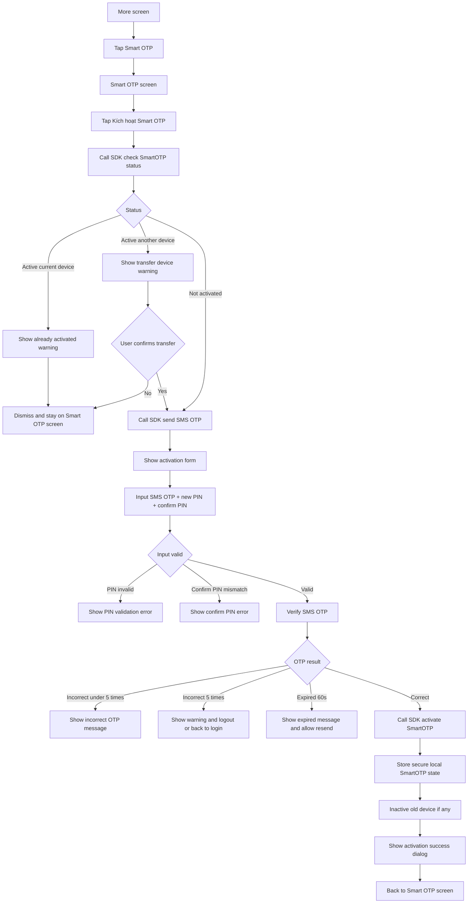

# FE Issue 01 - Kích Hoạt SmartOTP

## Reference

- Logic source: `Smart OTP - multi channels/Quy_trinh_S_OTP.md`
- Smart OTP menu design: [Figma - Smart OTP](https://www.figma.com/design/7KYJfVHawWie4n8v12JtXm/NHSV-Pro?node-id=40008664-236501&t=oC0STJTkSr41WfqM-11)

## Objective

Build the **Kích hoạt Smart OTP** flow on NHSV Pro app.

The app is the place where user registers the current MTS device as the SmartOTP generator. This phase does **not** support login to NHSV Pro app by SmartOTP yet. The generated SmartOTP will be used by WTS/HTS.

## SDK Integration Note

SmartOTP is integrated by SDK, not by direct REST API calls from FE.

Because NHSV does not have the SDK source code yet, FE implementation depends on partner-provided SDK contract:

- SDK method names.
- Input parameters.
- Response payloads.
- Error codes.
- Retry/timeout behavior.
- Whether SMS OTP sending/verifying and SmartOTP activation are fully handled inside SDK or exposed as separate SDK methods.

## Entry Point

Access rule:

- User must be logged in to access this function.
- Before login, app must not expose `Kích hoạt Smart OTP`. Only `Lấy mã Smart OTP` is available before login.

Access Smart OTP screen:

1. User opens app and logs in by the current login method.
2. User navigates to `More`.
3. User taps `Smart OTP`.
4. Display `Smart OTP` screen with 4 main functions:
   - `Kích hoạt Smart OTP`
   - `Lấy mã Smart OTP`
   - `Đổi PIN Smart OTP`
   - `Reset PIN Smart OTP`

This issue handles only `Kích hoạt Smart OTP`.

## Developer Flow

User taps `Kích hoạt Smart OTP`.

Call SDK method to check SmartOTP status by `accountNumber` and `deviceId`.

If account already activated SmartOTP on the current device:

- Display warning dialog: `Quý khách đã đăng ký S-OTP trên thiết bị này.`
- Click `Got it` to dismiss dialog and stay on Smart OTP screen.

If account already activated SmartOTP on another device:

- Display warning dialog: `Quý khách đã đăng ký S-OTP trên thiết bị khác, quý khách có chắc chắn chuyển kích hoạt S-OTP trên thiết bị mới này không?`
- Click `Cancel` to dismiss dialog and stay on Smart OTP screen.
- Click `Confirm` to continue activation flow on the current device.

If account has not activated SmartOTP:

- Navigate to SmartOTP activation input screen.
- Call SDK method to send SMS OTP to the registered phone number.
- Display OTP input, new SmartOTP PIN input, and confirm SmartOTP PIN input.
- OTP is 6 digits.
- SmartOTP PIN is 6 digits.
- Confirm PIN must match new PIN.

Authentication:

- If user inputs the correct SMS OTP and valid PIN:
  - Call SDK method to activate SmartOTP for the current device.
  - Store SmartOTP local state/secret securely if required by SDK design.
  - If account was active on another device, inactive the previous device.
  - Display success dialog: `Quý khách kích hoạt thành công xác thực S-OTP.`
  - Click `Confirm` to navigate back to Smart OTP screen.

- If user inputs incorrect SMS OTP:
  - Display incorrect OTP message.
  - Allow user to retry if incorrect count is less than 5.

- If user inputs incorrect SMS OTP 5 times:
  - Display warning dialog: `Quý khách đã nhập sai mã xác thực 5 lần. Vui lòng đăng nhập lại để tiếp tục sử dụng dịch vụ.`
  - Click `Got it` to logout or navigate user to login screen.

- If SMS OTP expires after 60 seconds:
  - Display expired OTP message.
  - Enable `Resend OTP` action.

Validation:

- If PIN is not 6 digits, disable submit or display validation error.
- If confirm PIN does not match new PIN, display validation error.
- Do not call activation SDK method until OTP, new PIN, and confirm PIN are valid.

## Flowchart

## SDK And State Dependencies

| Item | Purpose |
| --- | --- |
| Check SmartOTP status SDK method | Check not activated / active current device / active another device |
| Send SMS OTP SDK method | Send OTP to registered phone number |
| Verify SMS OTP SDK method | Verify OTP and enforce 5 incorrect attempts |
| Activate SmartOTP SDK method | Bind account with current device |
| Secure local storage | Store SmartOTP secret/state if app generates SmartOTP locally |
| Device ID | Identify current MTS device |

## Error Cases

| Case | FE behavior |
| --- | --- |
| Already active on current device | Show already activated warning |
| Already active on another device | Show transfer device confirmation |
| User cancels transfer | Stay on Smart OTP screen |
| SMS OTP incorrect under 5 times | Show incorrect OTP message and allow retry |
| SMS OTP incorrect 5 times | Show warning and logout/back to login |
| SMS OTP expired after 60 seconds | Show expired message and allow resend |
| PIN not 6 digits | Show validation error |
| Confirm PIN mismatch | Show validation error |
| Activate SDK method failed | Show SDK error and keep user on activation screen |

## Acceptance Criteria

- User can access Smart OTP from `More`.
- Smart OTP screen displays 4 main functions from Figma.
- Tapping `Kích hoạt Smart OTP` checks current activation status first.
- App handles current-device active, other-device active, and not-activated states.
- App supports SMS OTP input, PIN creation, confirm PIN, resend OTP, and 5 incorrect OTP attempts.
- Successful activation binds SmartOTP to the current device and returns user to Smart OTP screen.

