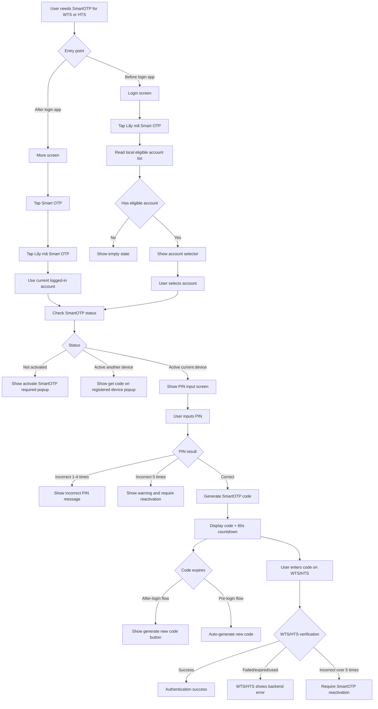

# FE Issue 02 - Lấy Mã SmartOTP

## Reference

- Logic source: `Smart OTP - multi channels/Quy_trinh_S_OTP.md`
- Smart OTP menu design: [Figma - Smart OTP](https://www.figma.com/design/7KYJfVHawWie4n8v12JtXm/NHSV-Pro?node-id=40008664-236501&t=oC0STJTkSr41WfqM-11)

## Objective

Build the **Lấy mã Smart OTP** flow on NHSV Pro app.

The user gets a SmartOTP code from the activated MTS device, then enters this code on WTS/HTS for authentication.

## SDK Integration Note

SmartOTP generation and local SmartOTP operations are integrated by SDK, not by direct REST API calls from FE.

Because NHSV does not have the SDK source code yet, FE implementation depends on partner-provided SDK contract:

- SDK method to check SmartOTP status.
- SDK method to verify/unlock SmartOTP PIN.
- SDK method to generate SmartOTP code.
- SDK behavior for countdown, auto-regenerate, one-time-use, and incorrect PIN counter.
- SDK error codes for not activated, active another device, PIN incorrect, locked, expired, and need reactivation.

## Entry Point

There are two entry points.

Access rule:

- Before login: only `Lấy mã Smart OTP` is available.
- Before login: app must not expose `Kích hoạt Smart OTP`, `Đổi PIN Smart OTP`, or `Reset PIN Smart OTP`.
- After login: user can access the full Smart OTP screen from `More`.

Entry point A - after user logged in app:

1. User opens `More`.
2. User taps `Smart OTP`.
3. Display Smart OTP screen with 4 functions.
4. User taps `Lấy mã Smart OTP`.

Entry point B - before user logged in app:

1. User opens app login screen.
2. User taps `Lấy mã Smart OTP`.
3. App displays account selector.
4. User can only select account from local eligible account list.
5. User cannot input account manually.

Eligible account means:

- Account has logged in on this device before.
- Account has activated SmartOTP successfully on this device.

## Developer Flow

User taps `Lấy mã Smart OTP`.

If user is already logged in:

- Use current logged-in account.
- Call SDK method to check SmartOTP status by `accountNumber` and `deviceId`.

If user is not logged in:

- Read local eligible account list.
- If no eligible account, display empty state and guide user to login and activate SmartOTP first.
- If there are eligible accounts, display account selector.
- After user selects account, call SDK method to check SmartOTP status by `accountNumber` and `deviceId`.

Status handling:

- If account has not activated SmartOTP:
  - Display popup: `Vui lòng kích hoạt S-OTP để sử dụng chức năng này.`

- If account activated SmartOTP on another device:
  - Display popup: `Vui lòng lấy mã S-OTP trên thiết bị mà quý khách đã đăng ký.`

- If account activated SmartOTP on current device:
  - Navigate to PIN input screen.
  - User inputs SmartOTP PIN.

PIN authentication:

- If user inputs the correct PIN:
  - Navigate to SmartOTP code screen.
  - Generate and display SmartOTP code.
  - Display countdown 60 seconds.
  - User enters this code on WTS/HTS.
  - User can click `Cancel` to close the flow.

- If user inputs incorrect PIN:
  - Display message: `Mã Pin không đúng.`
  - If incorrect count is 1-4 times, display remaining/incorrect count based on SDK/local rule.

- If user inputs incorrect PIN 5 times or more:
  - Display warning: `Quý khách đã nhập sai mã Pin 5 lần, Vui lòng đăng nhập lại bằng thẻ OTP và kích hoạt lại S-OTP.`
  - Stop generating SmartOTP.
  - User needs reactivation.

Code refresh behavior:

- After-login flow: when SmartOTP expires after 60 seconds, display button to generate a new SmartOTP code.
- Pre-login flow: when SmartOTP expires after 60 seconds, app auto-generates a new SmartOTP code.
- Each generated SmartOTP code can be used for one authentication only.

## WTS/HTS Behavior To Align

This part is not owned by NHSV Pro app FE, but must be aligned with WTS/HTS and backend.

When user selects SmartOTP on WTS/HTS:

- WTS/HTS displays SmartOTP input screen.
- If account has not activated SmartOTP and client is not MTS, display: `TK chưa được kích hoạt sử dụng Smart OTP. Vui lòng chọn phương thức đăng nhập khác.`
- User can click `Cancel` to stop SmartOTP login flow.
- HTS may support `Chỉ xem` login mode according to partner logic. If not included in this phase, add it to HTS backlog.
- If user inputs incorrect SmartOTP more than 5 times, backend requires SmartOTP reactivation.

## Flowchart

## SDK And State Dependencies

| Item | Purpose |
| --- | --- |
| Check SmartOTP status SDK method | Check whether account/device can generate SmartOTP |
| Local eligible account list | Support pre-login account selector |
| Secure local SmartOTP state | Unlock secret and generate SmartOTP after correct PIN |
| Generate SmartOTP SDK method | Generate SmartOTP code after correct PIN |
| Verify SmartOTP backend/SDK dependency | WTS/HTS/backend verify user input; exact integration point needs partner confirmation |
| Incorrect PIN counter | Track PIN failure threshold |

## Error Cases

| Case | FE behavior |
| --- | --- |
| No eligible account before login | Show empty state and guide user to login/activate first |
| Account not activated | Show activate SmartOTP required popup |
| Account active on another device | Show get code on registered device popup |
| PIN incorrect 1-4 times | Show incorrect PIN message |
| PIN incorrect 5 times | Show warning and require reactivation |
| Code expired after 60 seconds | Refresh based on after-login/pre-login rule |
| User clicks Cancel | Close flow and return to previous screen |
| WTS/HTS verification failed | WTS/HTS shows backend error, app does not mark success |

## Acceptance Criteria

- User can access `Lấy mã Smart OTP` from Smart OTP screen after login.
- User can access `Lấy mã Smart OTP` from login screen before login.
- Pre-login flow only allows account selection from eligible local accounts.
- App handles not-activated, active-another-device, and active-current-device states.
- Correct PIN displays SmartOTP code with 60-second countdown.
- Incorrect PIN threshold follows partner logic.
- Code refresh behavior follows partner logic for both after-login and pre-login flows.

