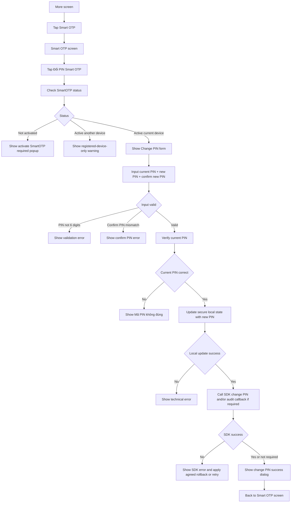

# FE Issue 04 - Đổi PIN SmartOTP

## Reference

- Logic source: `Smart OTP - multi channels/Quy_trinh_S_OTP.md`
- Smart OTP menu design: [Figma - Smart OTP](https://www.figma.com/design/7KYJfVHawWie4n8v12JtXm/NHSV-Pro?node-id=40008664-236501&t=oC0STJTkSr41WfqM-11)

## Objective

Build the **Đổi PIN Smart OTP** flow on NHSV Pro app.

This flow is used when user still remembers the current SmartOTP PIN and wants to change it.

## SDK Integration Note

SmartOTP PIN verification/change is integrated by SDK, not by direct REST API calls from FE.

Because NHSV does not have the SDK source code yet, FE implementation depends on partner-provided SDK contract:

- SDK method to check SmartOTP status.
- SDK method to verify current SmartOTP PIN.
- SDK method to change SmartOTP PIN.
- SDK behavior for local secret re-encryption and rollback.
- SDK error codes for PIN incorrect, locked, not activated, active another device, and change PIN failed.

## Entry Point

Access rule:

- User must be logged in to access this function.
- Before login, app must not expose `Đổi PIN Smart OTP`.
- Before login, only `Lấy mã Smart OTP` is available.

1. User opens `More`.
2. User taps `Smart OTP`.
3. Display Smart OTP screen with 4 functions.
4. User taps `Đổi PIN Smart OTP`.

This issue handles only `Đổi PIN Smart OTP`.

## Developer Flow

User taps `Đổi PIN Smart OTP`.

Call SDK method to check SmartOTP status by `accountNumber` and `deviceId`.

If account has not activated SmartOTP:

- Display popup: `Vui lòng kích hoạt S-OTP để sử dụng chức năng này.`
- Do not show change PIN form.

If account activated SmartOTP on another device:

- Display warning: user can only change PIN on the registered SmartOTP device.
- Do not show change PIN form.

If account activated SmartOTP on current device:

- Navigate to Change PIN screen.
- Display 3 input fields:
  - Current SmartOTP PIN
  - New SmartOTP PIN
  - Confirm new SmartOTP PIN

Validation:

- All PIN values must be 6 digits.
- New PIN and confirm new PIN must match.
- Submit button is disabled until the input is valid.

Authentication:

- If user inputs correct current PIN:
  - Update/re-encrypt SmartOTP local state with new PIN.
  - Call SDK change PIN method and/or audit callback if required by SDK contract.
  - Display success dialog: `Thay đổi mã PIN SmartOTP thành công.`
  - Click `Got it` to return to Smart OTP screen.

- If user inputs incorrect current PIN:
  - Display message: `Mã PIN không đúng.`
  - Keep user on Change PIN screen.

If local secure storage update failed:

- Display technical error.
- Do not show success message.

If SDK change PIN/audit failed:

- Display SDK error.
- Final rollback/retry behavior needs to be aligned with partner because PIN may already have been updated locally.

## Flowchart

## SDK And State Dependencies

| Item | Purpose |
| --- | --- |
| Check SmartOTP status SDK method | Confirm account/device can change PIN |
| Verify current PIN SDK method | Verify current SmartOTP PIN |
| Change PIN SDK method | Save new SmartOTP PIN and update local secret/state |
| Secure local storage | Store SDK-managed SmartOTP local state if exposed to app |

## Error Cases

| Case | FE behavior |
| --- | --- |
| Account not activated | Show activate required popup |
| Active on another device | Show registered-device-only warning |
| Current PIN incorrect | Show incorrect PIN message |
| New PIN not 6 digits | Show validation error |
| Confirm PIN mismatch | Show validation error |
| Local update failed | Show technical error, no success dialog |
| SDK change PIN failed | Show SDK error and follow agreed rollback/retry behavior |

## Acceptance Criteria

- User can access Change PIN from Smart OTP screen.
- User cannot access Change PIN before login.
- App checks SmartOTP status before showing form.
- User cannot change PIN if account is not activated or active on another device.
- Form validates 6-digit PIN and confirm PIN match.
- Correct current PIN changes PIN successfully.
- Incorrect current PIN does not change PIN.
- New PIN can be used to get SmartOTP code after success.

