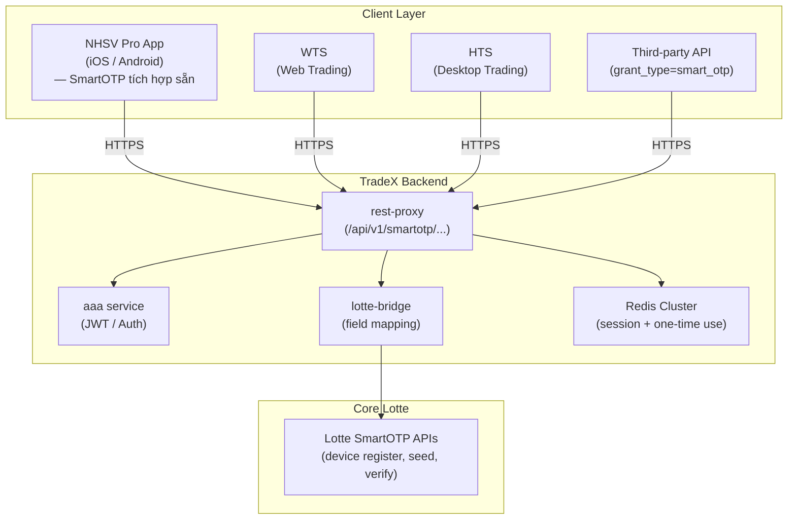
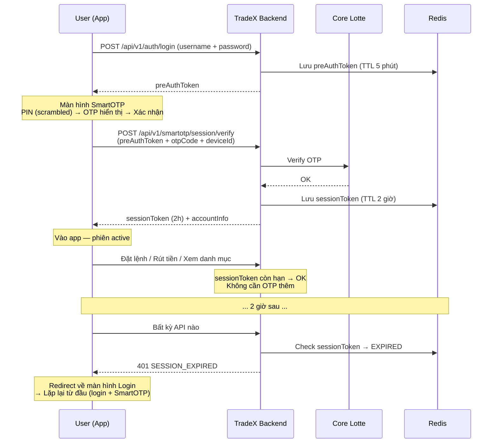

# PRD: Hệ thống SmartOTP Đồng bộ Đa kênh

| Phiên bản | Ngày | Người cập nhật | Thay đổi |
|-----------|------|----------------|---------|
| 1.0 | 2026-04-06 | [Tên bạn] | Bản khởi tạo |
| 1.1 | 2026-04-06 | [Tên bạn] | Xác nhận kiến trúc in-app, Lotte integration, mandatory enrollment UX, bổ sung Luồng E–H |
| 1.2 | 2026-04-06 | [Tên bạn] | Chuyển sang mô hình session-level auth (post-login), session sync 2h, migration flow, VPS UX reference |
| 1.3 | 2026-04-06 | [Tên bạn] | Post-login SmartOTP bắt buộc mỗi phiên, session sync 2h, migration theo app version, VPS UX (scrambled keypad, OTP display screen), Luồng I, FR-007 |

---

## Mục lục

1. [Tổng quan sản phẩm](#1-tổng-quan-sản-phẩm)
2. [Kiến trúc hệ thống](#2-kiến-trúc-hệ-thống)
3. [Phạm vi và mục tiêu](#3-phạm-vi-và-mục-tiêu)
4. [UX Mandatory Enrollment Strategy](#4-ux-mandatory-enrollment-strategy)
5. [Luồng người dùng](#5-luồng-người-dùng)
6. [Yêu cầu chức năng chi tiết](#6-yêu-cầu-chức-năng-chi-tiết)
7. [Yêu cầu đồng bộ đa kênh](#7-yêu-cầu-đồng-bộ-đa-kênh)
8. [Yêu cầu phi chức năng](#8-yêu-cầu-phi-chức-năng)
9. [Lotte API Mapping](#9-lotte-api-mapping)
10. [Success Metrics](#10-success-metrics)
11. [Acceptance Criteria](#11-acceptance-criteria)
12. [Rủi ro và giả định](#12-rủi-ro-và-giả-định)
13. [Phụ lục: Tham khảo SSI và TCBS](#13-phụ-lục-tham-khảo-ssi-và-tcbs)

---

## 1. Tổng quan sản phẩm

SmartOTP là hệ thống xác thực hai yếu tố (2FA) thông minh, tập trung, **tích hợp trực tiếp vào ứng dụng NHSV Pro** (iOS/Android). Người dùng sinh mã OTP dạng TOTP ngay trong app — không cần cài app riêng — và dùng mã đó để đăng nhập cũng như xác thực giao dịch trên mọi kênh: WTS, HTS, App di động, API bên thứ ba.

**Điểm khác biệt so với OTP SMS thông thường:**

- OTP được sinh offline từ thiết bị đã đăng ký (TOTP – RFC 6238), không phụ thuộc mạng di động.
- Mỗi mã OTP chỉ dùng một lần duy nhất trên toàn hệ thống (one-time use, đồng bộ qua Redis).
- Xác thực bằng sinh trắc học (Face ID / vân tay) hoặc PIN ngay trong NHSV Pro app.
- Tích hợp với **Core Lotte** — secretKey (TOTP seed) được Lotte tạo và quản lý; TradeX chỉ lưu trạng thái thiết bị.
- Đăng ký **bắt buộc** cho tất cả người dùng.

**Mô hình xác thực theo phiên làm việc (Session-level Auth):**

SmartOTP xác thực **tại thời điểm đăng nhập**, bảo vệ toàn bộ phiên làm việc — không yêu cầu OTP lại cho từng giao dịch trong phiên:

```
Đăng nhập (username/password)
        ↓
Xác thực SmartOTP bắt buộc (PIN → OTP → Xác nhận)
        ↓
Phiên làm việc active — TTL 2 giờ
        ↓
Giao dịch tự do trong 2 giờ — không cần OTP thêm
        ↓
Hết 2 giờ → Phiên hết hạn → Đăng nhập lại → SmartOTP lại
```

Mô hình này tham khảo từ VPS Securities và được thiết kế cho NHSV Pro: bảo mật cao, ma sát thấp trong phiên giao dịch.

---

## 2. Kiến trúc hệ thống

### 2.1 Kiến trúc tổng thể



### 2.2 Luồng dữ liệu bảo mật (secretKey)

```
Lotte tạo TOTP seed
        │
        ▼
lotte-bridge nhận seed qua TLS 1.3
        │
        ▼
rest-proxy trả seed về NHSV Pro app (encrypted response)
        │
        ▼
App lưu seed vào Keychain (iOS) / Keystore (Android)
        │
TradeX backend KHÔNG lưu raw seed
— chỉ lưu: deviceId, userId, isActive, registeredAt
```

> **Lưu ý bảo mật:** TradeX không bao giờ lưu TOTP seed sau khi đã truyền về app. Mọi OTP verification đều gọi lại Lotte để validate — không tự tính toán trên TradeX backend.

### 2.3 Post-login OTP Display Screen (Tham khảo VPS)

Sau khi đăng nhập thành công, user **bắt buộc** đi qua màn hình SmartOTP trước khi vào app. Thiết kế tham khảo VPS:

**Bước 1 — Màn hình nhập PIN (Scrambled Keypad):**
```
┌─────────────────────────────┐
│  Nhập mã PIN SmartOTP       │
│                             │
│  ℹ Để bảo vệ giao dịch,    │
│    NHSV Pro áp dụng xác     │
│    thực 2 lớp.              │
│                             │
│     ● ● ○ ○ ○ ○            │
│  [Quên mã PIN SmartOTP?]    │
│                             │
│  "Vị trí các số thay đổi   │
│   ngẫu nhiên để bảo vệ PIN" │
│                             │
│  [5][2][9]                  │
│  [1][7][4]    ← Ngẫu nhiên  │
│  [8][0][3]                  │
│     [6] [⌫]                 │
└─────────────────────────────┘
```

**Bước 2 — Màn hình hiển thị OTP:**
```
┌─────────────────────────────┐
│  Lấy mã SmartOTP            │
│                             │
│       ╭──────────╮          │
│       │    15    │  ← timer │
│       │   giây   │  tròn    │
│       ╰──────────╯          │
│                             │
│      2 4 9 6 3 9            │
│      TKCK: ***272           │
│                             │
│        [Xác nhận]           │
│                             │
│  🔔 Lưu ý                   │
│  Mã OTP chỉ có hiệu lực với │
│  một phiên đăng nhập.       │
│  Không chia sẻ OTP cho ai!  │
└─────────────────────────────┘
```

**Quy tắc UX của màn hình này:**
- Không có nút "Bỏ qua" hoặc "Để sau".
- Không có nút back (hoặc back sẽ đăng xuất hoàn toàn).
- Nếu OTP cycle hết (30s), mã tự cập nhật — user không cần làm gì.
- Nút [Xác nhận] kích hoạt khi user chủ động bấm (không auto-submit).
- Hiển thị số TKCK (che một phần) để user xác nhận đúng tài khoản.

### 2.4 Session Lifecycle (Phiên làm việc 2 giờ)



**Cấu trúc sessionToken (JWT payload):**

```json
{
  "userId": "string",
  "accountNumber": "string",
  "smartOTPVerifiedAt": "2026-04-06T08:00:00Z",
  "sessionId": "uuid",
  "iat": 1234567890,
  "exp": 1234575090
}
```

> `exp - iat = 7200` (2 giờ). Không có refresh token cho session — hết hạn phải login + SmartOTP lại.

---

## 3. Phạm vi và mục tiêu

### 3.1 Mục tiêu kinh doanh

- Tăng cường bảo mật, loại bỏ rủi ro OTP SMS (SIM swap, intercept, phụ thuộc mạng).
- Trải nghiệm đồng nhất: một thiết bị xác thực cho mọi kênh.
- 100% giao dịch tài chính (đặt lệnh, rút tiền, chuyển khoản) được bảo vệ bằng TOTP.
- Tuân thủ chuẩn bảo mật ngành chứng khoán (tham khảo SSI, TCBS).

### 3.2 Phạm vi MVP

**Bắt buộc:**

- SmartOTP module trong NHSV Pro app (iOS/Android): đăng ký thiết bị, sinh OTP TOTP, PIN management, sinh trắc học.
- API backend: device register/unregister, session initiate, session verify.
- Tích hợp Core Lotte cho toàn bộ luồng SmartOTP.
- Cơ chế one-time use qua Redis.
- Mandatory enrollment gate (Luồng F).
- Tích hợp WTS, HTS, App.
- **SMS OTP** (phạm vi giới hạn — xem mục 3.3).

**Không bắt buộc giai đoạn đầu:**

- WebSocket real-time push (thay bằng polling nếu cần, nâng cấp sau).
- Third-party API OAuth (Luồng G — nâng cấp sau go-live).

### 3.3 Phạm vi SMS OTP trong MVP

SMS OTP được đưa vào MVP **với phạm vi giới hạn** — chỉ dùng cho:

| Trường hợp | Dùng SMS OTP |
|-----------|-------------|
| Xác minh danh tính khi đăng ký SmartOTP lần đầu | ✅ |
| Reset PIN (Luồng D — Quên mã PIN) | ✅ |
| Recovery khi mất thiết bị (Luồng E) | ✅ |
| 2FA cho giao dịch hàng ngày | ❌ Chỉ dùng SmartOTP TOTP |
| Đăng nhập thay thế SmartOTP | ❌ Không cho phép |

---

## 4. UX Mandatory Enrollment Strategy

### 4.1 Nguyên tắc

SmartOTP là **bắt buộc** — không có ngoại lệ. Mọi giao dịch tài chính phải xác thực qua SmartOTP.

### 4.2 Strategy theo nhóm người dùng

#### Nhóm A — Người dùng mới (sau ngày go-live)

SmartOTP enrollment là bước trong **onboarding flow bắt buộc**:

```
Đăng ký tài khoản
        │
        ▼
Xác minh số điện thoại (SMS OTP)
        │
        ▼
Tạo mật khẩu
        │
        ▼
[BƯỚC BẮT BUỘC] Màn hình SmartOTP Setup
— không có nút "Bỏ qua" hay "Để sau"
— progress bar: Bước 3/3
        │
        ▼
Tạo PIN 6 số → (Tuỳ chọn) Đăng ký sinh trắc học
        │
        ▼
Vào app (enrollment hoàn tất)
```

#### Nhóm B — Người dùng hiện tại (migration)

Migration theo **phiên bản app** — diễn ra theo 3 giai đoạn:

**Phase 0 — Chuẩn bị (trước go-live 2 tuần):**
- Thông báo đến toàn bộ user qua push notification + email: "NHSV Pro sắp ra mắt SmartOTP — xác thực bảo mật hơn, không cần SMS."
- Hướng dẫn sẵn: video, FAQ, CS hotline sẵn sàng.

**Phase 1 — Release app version mới (Tuần 0):**

```
User cập nhật app lên version mới
        │
        ▼
Lần đăng nhập đầu tiên sau update:
        │
        ├── SmartOTP chưa đăng ký
        │         │
        │         ▼
        │   Hard gate: Màn hình SmartOTP Setup bắt buộc
        │   (không thể bỏ qua — đây là phiên cài đặt)
        │         │
        │         ▼
        │   Hoàn thành enrollment (Luồng A)
        │         │
        │         ▼
        │   Vào app (phiên này: chưa áp dụng post-login verify)
        │
        └── Phiên tiếp theo trở đi:
                  │
                  ▼
            Login → SmartOTP verify bắt buộc → Session 2h
```

> **Lý do tách 2 phiên:** Enrollment (cài đặt PIN, lưu seed) và Authentication (dùng SmartOTP để vào app) là 2 hành động khác nhau. Phiên đầu tiên sau update là phiên cài đặt — cần trải nghiệm nhẹ nhàng. Phiên thứ 2 trở đi mới áp dụng model mới đầy đủ.

**Phase 2 — Enforcement (Tuần 4 sau Phase 1):**

| Nhóm user | Trạng thái | Behavior |
|-----------|-----------|---------|
| Đã update app + đã đăng ký SmartOTP | ✅ | SmartOTP verify mỗi login — bình thường |
| Đã update app + chưa đăng ký SmartOTP | ⚠️ | Hard gate enrollment — không vào app |
| Chưa update app (version cũ) | ❌ | Bị chặn, hiện màn hình "Vui lòng cập nhật ứng dụng" |

**Timeline tham khảo:**

```
Tuần -2: Thông báo user
Tuần  0: Release app version mới — Phase 1 bắt đầu
Tuần  1: Theo dõi tỷ lệ enrollment, hỗ trợ CS
Tuần  4: Phase 2 enforcement — block app cũ
Tuần  8: Đánh giá success metrics
```

Áp dụng cơ chế **Soft Gate → Hard Gate với grace period 30 ngày** cho users đã update nhưng chưa enroll:

| Thời điểm | Behavior |
|-----------|---------|
| Lần đăng nhập đầu sau go-live | Modal toàn màn hình "Kích hoạt SmartOTP ngay" — có nút "Để sau" (dismiss lần 1) |
| Lần 2–3 | Modal hiện lại với số lần còn lại, banner đếm ngược trên home |
| Lần 4+ hoặc sau 30 ngày | Hard gate — không vào được app cho đến khi hoàn thành enrollment |

**Banner đếm ngược** hiển thị liên tục trên home screen khi chưa đăng ký:
> "Còn **[X] ngày** để kích hoạt SmartOTP bắt buộc trước [date]. [Kích hoạt ngay →]"

#### Nhóm C — Feature gate (luôn áp dụng, mọi nhóm)

Khi user chưa đăng ký SmartOTP mà truy cập tính năng giao dịch:

```
User tap [Đặt lệnh] / [Rút tiền] / [Chuyển khoản]
        │
        ▼
Check SmartOTP enrolled?
        │
    [Chưa] ──────────────────────────────────────────→ Redirect màn hình SmartOTP Setup
                                                        (không có nút quay lại về giao dịch)
        │
      [Rồi]
        │
        ▼
Tiếp tục flow giao dịch bình thường
```

### 4.3 Copy / Messaging

| Điểm tiếp xúc | Copy đề xuất |
|---|---|
| Modal lần 1 (existing user) | "Bảo vệ tài khoản của bạn tốt hơn. Kích hoạt SmartOTP — không cần chờ SMS, xác thực an toàn hơn trong 2 phút." |
| Hard gate screen | "Kích hoạt SmartOTP để tiếp tục sử dụng NHSV Pro. Chỉ mất 2 phút." |
| Banner đếm ngược | "Còn [X] ngày — Kích hoạt SmartOTP trước [date] để tránh gián đoạn giao dịch." |
| Feature gate | "Tính năng này yêu cầu SmartOTP. Kích hoạt ngay để tiếp tục." |
| Onboarding step title | "Thiết lập SmartOTP — Bảo vệ mọi giao dịch của bạn" |

### 4.4 Điều kiện bỏ qua enrollment check

Chỉ các màn hình sau được phép truy cập khi chưa đăng ký SmartOTP:
- Màn hình login / đăng ký tài khoản
- Màn hình SmartOTP Setup (bản thân)
- Màn hình thông tin / FAQ về SmartOTP
- Màn hình xem thị trường (read-only, không giao dịch)

---

## 5. Luồng người dùng

### Luồng A: Đăng ký SmartOTP lần đầu (trong NHSV Pro app)

1. User mở NHSV Pro app → Đăng nhập tài khoản.
2. (New user) Màn hình SmartOTP Setup hiện tự động sau bước tạo mật khẩu.
3. App yêu cầu xác minh danh tính bằng SMS OTP gửi về số điện thoại đã đăng ký.
4. User nhập SMS OTP → Hệ thống gọi Lotte API đăng ký thiết bị → Nhận `deviceId` + `secretKey` (TOTP seed).
5. App lưu seed vào Keychain/Keystore.
6. User tạo mã PIN 6 số (lưu cục bộ dạng hash, không gửi server).
7. (Tuỳ chọn) Đăng ký sinh trắc học (Face ID / vân tay).
8. App hiển thị OTP đầu tiên (chu kỳ 30s) → Đăng ký hoàn tất.

### Luồng B: Đăng nhập WTS bằng SmartOTP

1. User truy cập WTS, nhập username/password → WTS gọi TradeX login API → nhận `preAuthToken`.
2. WTS hiển thị màn hình "Nhập mã SmartOTP" (6 số).
3. User mở NHSV Pro app → Mở tab SmartOTP (xác thực bằng Face ID / PIN với scrambled keypad).
4. Đọc mã OTP hiện tại + countdown → nhập vào WTS → bấm [Xác nhận].
5. Server verify OTP qua Lotte, đổi `preAuthToken` → `sessionToken` (2h).
6. WTS nhận sessionToken → đăng nhập thành công, session active 2h.
7. Nếu mã đã dùng ở kênh khác → thông báo lỗi kèm kênh đã dùng và thời điểm.
8. Sau 2h session hết hạn → WTS redirect về trang login.

### Luồng C: Giao dịch trên App trong phiên active

> **Thay đổi v1.3:** Trong phiên 2h đã xác thực SmartOTP, user giao dịch tự do — không cần OTP thêm.

1. User đã đăng nhập + SmartOTP verified → session active (còn trong 2h).
2. User đặt lệnh mua/bán → Màn hình xác nhận → Bấm [Xác nhận].
3. App kiểm tra sessionToken → còn hạn → **không yêu cầu SmartOTP**.
4. Giao dịch được thực hiện trực tiếp.

**Khi session hết hạn trong khi đang dùng app:**

```
User bấm [Đặt lệnh]
        │
        ▼
App detect: sessionToken EXPIRED
        │
        ▼
Thông báo: "Phiên làm việc đã hết hạn. Vui lòng đăng nhập lại."
        │
        ▼
Redirect về màn hình Login → Luồng I (post-login SmartOTP)
```

### Luồng D: Quên mã PIN trên app SmartOTP

1. User mở app → Nhấn "Quên mã PIN".
2. Hệ thống yêu cầu xác minh SĐT đã đăng ký.
3. Server gửi SMS OTP đến SĐT đó (gọi Lotte SMS API).
4. User nhập SMS OTP → Xác thực thành công → Được phép tạo PIN mới.
5. User tạo và xác nhận PIN mới (lưu cục bộ, server ghi log sự kiện).

### Luồng E: Mất thiết bị / Vô hiệu hóa từ xa

1. User liên hệ tổng đài NHSV hoặc dùng WTS (đã đăng nhập session khác).
2. CS / User xác minh danh tính qua SMS OTP + câu hỏi bảo mật.
3. Hệ thống gọi API `DELETE /api/v1/smartotp/device` → Lotte vô hiệu hóa thiết bị cũ.
4. User nhận thông báo: "Thiết bị SmartOTP của bạn đã bị vô hiệu hóa."
5. User đăng nhập lại → Hard gate SmartOTP Setup → Đăng ký thiết bị mới (Luồng A).

### Luồng F: Mandatory Enrollment (Existing User — Migration)

1. User đăng nhập NHSV Pro sau ngày go-live → SmartOTP chưa đăng ký.
2. **Lần 1–3:** Modal "Kích hoạt SmartOTP ngay" → User có thể dismiss (có nút "Để sau").
3. **Lần 4+ hoặc sau 30 ngày:** Hard gate — màn hình SmartOTP Setup toàn phần, không có nút thoát.
4. User hoàn thành enrollment → Vào app.
5. Banner đếm ngược hiển thị liên tục trong 30 ngày grace period.

### Luồng I: Post-login SmartOTP Session Activation (Luồng chính)

Đây là luồng diễn ra **mỗi lần đăng nhập** kể từ phiên thứ 2 sau khi enrollment (Phase 1).

1. User nhập username/password → Hệ thống xác thực credentials.
2. Nếu hợp lệ → Server tạo `preAuthToken` (TTL = 5 phút), trả về app.
3. App **tự động chuyển** sang màn hình SmartOTP — không có tùy chọn bỏ qua.
4. **Màn hình 1 — Nhập PIN (Scrambled keypad):**
   - Bàn phím số với vị trí ngẫu nhiên mỗi lần hiển thị.
   - Caption: *"Vị trí các số thay đổi ngẫu nhiên để bảo vệ PIN SmartOTP"*
   - Nút "Quên mã PIN?" → Luồng D.
   - Có thể thay PIN bằng Face ID / vân tay nếu đã đăng ký.
5. **Màn hình 2 — Hiển thị OTP:**
   - Circular countdown timer (30s).
   - Mã OTP 6 số (ký tự cách đều, dễ đọc).
   - Số TKCK (che một phần: `***272`).
   - Nút [Xác nhận] — user bấm chủ động.
   - Ghi chú: *"Mã OTP chỉ có hiệu lực với một phiên đăng nhập. Không chia sẻ OTP cho bất kỳ ai!"*
   - Link đồng bộ thời gian nếu clock lệch.
6. User bấm [Xác nhận] → App gọi `POST /api/v1/smartotp/session/verify`.
7. Server verify OTP qua Lotte:
   - Hợp lệ → Tạo `sessionToken` (JWT, TTL = 2h), trả về app.
   - Không hợp lệ → Hiển thị lỗi + cho phép thử lại (tối đa 5 lần).
8. App lưu sessionToken → Vào home screen app.
9. Toàn bộ giao dịch trong 2h sử dụng sessionToken — không cần SmartOTP thêm.

**Xử lý `preAuthToken` hết hạn (5 phút):**
- Nếu user mở màn hình SmartOTP nhưng không xác nhận trong 5 phút → `preAuthToken` expired.
- App hiển thị: *"Phiên xác thực đã hết hạn. Vui lòng đăng nhập lại."* → Redirect về login.

### Luồng G: Third-party API Integration

> **Phạm vi:** Nâng cấp sau go-live MVP.

1. Đối tác gọi `POST /api/v1/oauth/token` với `grant_type=smart_otp`.
2. Payload: `client_id`, `client_secret`, `smart_otp` (mã 6 số), `device_id` (tuỳ chọn).
3. TradeX verify SmartOTP qua Lotte → Cấp `access_token` + `refresh_token`.
4. Đối tác dùng token để gọi các API TradeX.

### Luồng H: CS Reset SmartOTP cho User

1. CS nhận yêu cầu reset từ user (qua tổng đài hoặc ticket).
2. CS xác minh danh tính user theo quy trình nội bộ.
3. CS dùng CS Portal → Tìm user → Bấm "Reset SmartOTP".
4. Hệ thống gọi `DELETE /api/v1/smartotp/device` → Vô hiệu hóa thiết bị.
5. Gửi thông báo đến user qua email/SĐT: hướng dẫn đăng ký lại.
6. User đăng nhập → Hard gate SmartOTP Setup → Đăng ký thiết bị mới.

---

## 6. Yêu cầu chức năng chi tiết

### FR-001: Đăng ký & quản lý thiết bị (Device Registration)

| FR | API / Chức năng | Mô tả | Ghi chú |
|----|----------------|-------|---------|
| FR-001.1 | `POST /api/v1/smartotp/device/register` | Đăng ký thiết bị mới. Payload: `userId`, `deviceName`, `deviceType`, `phoneOtp` (SMS xác minh). Response: `deviceId`, `secretKey` (TOTP seed từ Lotte), `activationCode`. | Mỗi user chỉ 1 device active. Đăng ký mới → device cũ bị vô hiệu hóa tự động. |
| FR-001.2 | `DELETE /api/v1/smartotp/device` | Hủy đăng ký thiết bị hiện tại. | Yêu cầu xác thực lại (mật khẩu hoặc SMS OTP). |
| FR-001.3 | `GET /api/v1/smartotp/device` | Trả về thông tin thiết bị đang active: `deviceId`, `deviceName`, `registeredAt`, `lastUsedAt`, `isActive`. | Dùng để hiển thị trên Settings screen. |
| FR-001.4 | App side | App lưu `secretKey` an toàn (Keychain/Keystore), sinh OTP theo TOTP RFC 6238, chu kỳ 30s. Certificate pinning bắt buộc. | Bắt buộc. |

### FR-002: Quản lý mã PIN và sinh trắc học

| FR | Chức năng | Mô tả | Xử lý backend |
|----|-----------|-------|--------------|
| FR-002.1 | Tạo PIN lần đầu | Sau khi kích hoạt, yêu cầu tạo PIN 6 số. PIN lưu cục bộ dạng hash, không gửi server. | Server chỉ lưu trạng thái `pinSetup: true`. |
| FR-002.2 | Đổi mã PIN | Nhập PIN cũ → PIN mới → Xác nhận. App kiểm tra cục bộ. | Ghi log sự kiện. |
| FR-002.3 | Quên mã PIN | Nhấn "Quên PIN" → SMS OTP về SĐT đăng ký → Nhập OTP → Tạo PIN mới. | Server xác minh SĐT khớp với user + device đang active. |
| FR-002.4 | Xác thực sinh trắc học | Đăng ký Face ID/vân tay thay thế PIN khi mở SmartOTP. Dữ liệu sinh trắc học lưu trên thiết bị. | Server chỉ ghi nhận sự kiện bật/tắt. |
| FR-002.5 | Khóa PIN | Sai PIN 5 lần liên tiếp → Khóa SmartOTP 30 phút hoặc yêu cầu reset PIN qua SMS. | Server ghi nhận số lần sai, có thể gửi cảnh báo qua email. |
| FR-002.6 | Scrambled Keypad | Bàn phím nhập PIN hiển thị số theo thứ tự ngẫu nhiên mỗi lần. Caption bắt buộc: *"Vị trí các số thay đổi ngẫu nhiên để bảo vệ PIN SmartOTP"*. | Chỉ áp dụng cho PIN entry của SmartOTP, không phải bàn phím giao dịch thông thường. |

### FR-003: Khởi tạo phiên xác thực (Pre-Auth Token)

**API:** `POST /api/v1/smartotp/session`

Được gọi **tự động bởi login flow** — không phải client gọi trực tiếp.

```json
// Request (internal — sau khi login credentials hợp lệ)
{
  "userId": "string",
  "purpose": "LOGIN",
  "channel": "WTS | HTS | APP | API",
  "riskContext": {
    "ip": "string",
    "userAgent": "string"
  }
}

// Response
{
  "sessionId": "uuid",
  "expiresInSeconds": 300,
  "otpRequired": true
}
```

- Server lưu `sessionId` vào Redis với TTL = **300s** (5 phút), kèm `userId`, `channel`, `status = PENDING`.
- API **không** trả mã OTP — mã OTP do app sinh ra độc lập từ seed đã lưu.
- Nếu `preAuthToken` không được verify trong 5 phút → tự động hủy; user phải đăng nhập lại.

### FR-004: Xác thực OTP — Kích hoạt Session 2h (Verify)

**API:** `POST /api/v1/smartotp/session/verify`

```json
// Request
{
  "sessionId": "uuid",
  "otpCode": "123456",
  "deviceId": "uuid"
}

// Response — Thành công
{
  "success": true,
  "sessionToken": "eyJhbGci...",
  "expiresIn": 7200,
  "expiresAt": "2026-04-06T10:00:00Z",
  "usedOnChannel": "APP",
  "accountNumber": "***272"
}

// Response — OTP đã dùng
{
  "success": false,
  "code": "SMARTOTP_ALREADY_USED",
  "message": "Mã OTP đã được sử dụng trên kênh HTS",
  "params": [
    { "code": "USED_ON_CHANNEL", "param": "HTS" },
    { "code": "USED_AT", "param": "2026-04-06T09:59:30Z" }
  ]
}
```

**Cơ chế xác thực (backend):**

1. Lấy `userId` từ `sessionId` trong Redis; kiểm tra status = PENDING.
2. Gọi Lotte API xác thực `otpCode` với `deviceId` đã đăng ký.
3. Kiểm tra Redis key `otp:used:{userId}:{otpCode}` — nếu tồn tại → `SMARTOTP_ALREADY_USED`.
4. Nếu hợp lệ → tạo key `otp:used:{userId}:{otpCode}` TTL = 90s.
5. Cập nhật session `status = VERIFIED`.
6. Tạo `sessionToken` (JWT RS256): `userId`, `accountNumber`, `smartOTPVerifiedAt`, TTL = **7200s (2h)**.
7. Ghi audit log: userId, channel, deviceId, IP, timestamp.

> **Thay đổi v1.3:** `expiresIn` đổi từ 28800 (8h) → **7200 (2h)** để đồng bộ với app session. Không có refresh token.

### FR-005: Đồng bộ trạng thái real-time

**Polling (MVP):** Các kênh polling `GET /api/v1/smartotp/session/{sessionId}/status` mỗi 2–3 giây.

**WebSocket (nâng cấp):** Events khi triển khai:

| Event | Payload | Khi nào gửi |
|-------|---------|------------|
| `otp:verified` | `{ sessionId, usedOnChannel, usedAt }` | Ngay khi verify thành công — gửi đến tất cả client theo dõi sessionId |
| `otp:expired` | `{ sessionId }` | Khi session hết hạn chưa verify |

### FR-006: Mandatory Enrollment Gate

| FR | Điều kiện | Hành vi |
|----|-----------|---------|
| FR-006.1 | New user — chưa đăng ký SmartOTP | Màn hình SmartOTP Setup hiện trong onboarding, không có nút bỏ qua |
| FR-006.2 | Existing user — dismiss < 3 lần và trong grace period | Hiện modal sau login với nút "Để sau" |
| FR-006.3 | Existing user — dismiss ≥ 3 hoặc quá grace period | Hard gate — chặn vào app cho đến khi hoàn thành enrollment |
| FR-006.4 | Mọi user — truy cập tính năng giao dịch khi chưa đăng ký | Redirect đến màn hình SmartOTP Setup |
| FR-006.5 | Banner đếm ngược | Hiển thị trên home screen trong suốt grace period |

### FR-007: Session-Sync SmartOTP Gate

| FR | Điều kiện | Hành vi |
|----|-----------|---------|
| FR-007.1 | Mỗi lần đăng nhập (kể từ phiên thứ 2 sau enrollment) | Bắt buộc qua màn hình SmartOTP verify trước khi vào app; không có nút bỏ qua |
| FR-007.2 | `preAuthToken` tồn tại, chưa verify | Màn hình SmartOTP hiển thị; countdown 5 phút |
| FR-007.3 | `preAuthToken` hết hạn (5 phút không verify) | App hiển thị thông báo hết hạn → redirect về login |
| FR-007.4 | `sessionToken` còn hạn (trong 2h) | Tất cả API request được phép; không cần SmartOTP thêm |
| FR-007.5 | `sessionToken` hết hạn (2h đã qua) | API trả 401 `SESSION_EXPIRED`; app redirect về login |
| FR-007.6 | OTP sai tối đa 5 lần trong 1 preAuth session | Khóa preAuthToken; thông báo user; yêu cầu đăng nhập lại |
| FR-007.7 | Session đang active trên kênh khác | Một user có thể có session trên nhiều kênh đồng thời (App + WTS), mỗi kênh verify SmartOTP riêng |

---

## 7. Yêu cầu đồng bộ đa kênh

### 7.1 Nguyên tắc

- Tất cả kênh (WTS, HTS, App, API) dùng **cùng một endpoint verify** — không có endpoint riêng per kênh.
- `accessToken` sinh ra từ verify được chấp nhận trên tất cả kênh (SSO).
- Mã OTP 6 số là duy nhất toàn hệ thống, chỉ dùng **một lần**.
- Kênh phát hiện OTP đã dùng phải thông báo **tên kênh + thời điểm** để user biết.

### 7.2 Xử lý "đăng nhập web và giao dịch app cùng lúc"

- Đăng nhập WTS: tiêu tốn OTP `123456` → tạo access token web.
- Giao dịch App: nếu app đã có access token còn hạn → không cần OTP. Nếu cần OTP → dùng mã mới từ chu kỳ 30s tiếp theo.
- Không thể dùng lại OTP `123456` đã dùng cho WTS.

### 7.3 Third-party API (nâng cấp sau MVP)

- **Endpoint:** `POST /api/v1/oauth/token`
- **Grant type:** `smart_otp`
- **Request:** `client_id`, `client_secret`, `smart_otp`, `device_id`
- **Response:** `access_token`, `refresh_token`, `expires_in`

---

## 8. Yêu cầu phi chức năng

| Mục | Yêu cầu |
|-----|---------|
| **Hiệu năng** | `verify` API ≤ 150ms (P99); `session initiate` ≤ 100ms (P99) |
| **Session TTL** | preAuthToken = 5 phút; sessionToken = 2 giờ; không có refresh token |
| **Tính sẵn sàng** | SmartOTP backend: 99.99% uptime; Redis cluster/sentinel bắt buộc |
| **Bảo mật** | Mã OTP không ghi log; JWT ký RS256; TLS 1.3 cho mọi API; Certificate pinning trên app; Jailbreak/root detection |
| **Rate limiting** | Mỗi user: tối đa 10 initiate/phút, 20 verify/phút (điều chỉnh cho giờ cao điểm ATO 9:00–9:15) |
| **Audit log** | Ghi mọi lần initiate, verify (thành công/thất bại), kèm channel, IP, deviceId, timestamp |
| **Tuân thủ** | TOTP RFC 6238; thời gian hiệu lực OTP: 30s; tolerance ±1 bước (90s window) |
| **Clock sync** | App hiển thị cảnh báo nếu clock lệch > 60s so với server time |
| **Monitoring** | Alert khi OTP error rate > 5% trong 5 phút; Alert khi verify latency P99 > 200ms |
| **Rollback** | Nếu SmartOTP service down → tạm thời fallback SMS OTP (cần cờ cấu hình, áp dụng cẩn thận) |

---

## 9. Lotte API Mapping

> **Lưu ý:** Tên field Lotte bên dưới là ước tính dựa trên pattern API Lotte hiện có — cần xác nhận với tài liệu Lotte API chính thức trước khi implement.

### 9.1 Device Register

| TradeX Field | Lotte Field | Ghi chú |
|---|---|---|
| `userId` | `user_id` | Từ JWT |
| `deviceName` | `device_nm` | Tên thiết bị |
| `deviceType` | `device_tp` | `IOS` / `AND` |
| `phoneOtp` | `sms_otp` | OTP SMS xác minh |
| *(Response)* `deviceId` | `device_id` | ID thiết bị từ Lotte |
| *(Response)* `secretKey` | `seed_key` | TOTP seed — chỉ truyền về app, không lưu TradeX |

### 9.2 Session Verify

| TradeX Field | Lotte Field | Ghi chú |
|---|---|---|
| `otpCode` | `otp_no` | Mã 6 số |
| `deviceId` | `device_id` | |
| `userId` | `user_id` | Từ sessionId trong Redis |
| *(Response)* `success` | `error_code == "0000"` | Lotte trả `"0000"` = thành công |
| *(Error)* `SMARTOTP_ALREADY_USED` | `error_code: "OTPXXXX"` | Cần xác nhận error code Lotte |

### 9.3 Error Code Mapping

| Lotte error_code | TradeX code | Message (vi) |
|---|---|---|
| `0000` | — (success) | |
| `OTP001` | `SMARTOTP_INVALID` | Mã OTP không hợp lệ |
| `OTP002` | `SMARTOTP_ALREADY_USED` | Mã OTP đã được sử dụng |
| `OTP003` | `SMARTOTP_EXPIRED` | Mã OTP đã hết hạn |
| `OTP004` | `SMARTOTP_DEVICE_NOT_FOUND` | Thiết bị SmartOTP chưa đăng ký |
| `OTP005` | `SMARTOTP_MAX_ATTEMPTS` | Vượt quá số lần thử cho phép |

> Cập nhật bảng này sau khi có tài liệu Lotte SmartOTP API chính thức.

---

## 10. Success Metrics

| Metric | Target | Đo lường |
|--------|--------|---------|
| Tỷ lệ enrollment trong 30 ngày sau go-live | ≥ 80% active users | Analytics event `smartotp_enrolled` |
| Tỷ lệ enrollment sau 60 ngày | ≥ 95% active users | Analytics |
| Tỷ lệ giao dịch dùng SmartOTP (vs SMS fallback) | ≥ 95% | Log channel per verify |
| OTP error rate (sai mã / hết hạn) | ≤ 2% | Verify API log |
| Verify API latency P99 | ≤ 150ms | APM monitoring |
| CS tickets liên quan SmartOTP | Giảm ≥ 30% so với SMS OTP sau 90 ngày | Ticket system |
| User drop-off trong enrollment flow | ≤ 15% | Analytics funnel |

---

## 11. Acceptance Criteria

### AC-001: Device Registration

- [ ] User đăng ký thành công thiết bị mới sau xác minh SMS OTP.
- [ ] Sau khi đăng ký thiết bị mới, thiết bị cũ tự động bị vô hiệu hóa.
- [ ] `secretKey` được truyền về app qua HTTPS, không xuất hiện trong log.
- [ ] `GET /api/v1/smartotp/device` trả đúng thông tin thiết bị đang active.

### AC-002: PIN & Biometric

- [ ] User tạo PIN 6 số sau khi đăng ký thiết bị; PIN không gửi lên server.
- [ ] Sai PIN 5 lần liên tiếp → app bị khóa, hiển thị thông báo 30 phút.
- [ ] User reset PIN thành công qua SMS OTP khi quên mã.
- [ ] Face ID / vân tay hoạt động thay thế PIN để mở SmartOTP.

### AC-003: Session Initiate

- [ ] `POST /api/v1/smartotp/session` trả `sessionId` trong ≤ 100ms (P99).
- [ ] Session hết hạn đúng sau 300s; sau đó `verify` trả lỗi `SESSION_EXPIRED`.

### AC-004: OTP Verify

- [ ] OTP hợp lệ → server trả `accessToken` JWT, `verify` hoàn thành trong ≤ 150ms (P99).
- [ ] OTP đã dùng ở kênh khác → server trả `SMARTOTP_ALREADY_USED` kèm channel + thời điểm.
- [ ] OTP sai → server trả `SMARTOTP_INVALID`; không lộ thông tin về lý do sai.
- [ ] OTP hết hạn (> 90s) → server trả `SMARTOTP_EXPIRED`.

### AC-005: Mandatory Enrollment

- [ ] New user không thể vào app nếu chưa hoàn thành SmartOTP setup trong onboarding.
- [ ] Existing user thấy modal sau login khi chưa đăng ký; có thể dismiss tối đa 3 lần.
- [ ] Sau lần dismiss thứ 4 (hoặc 30 ngày): hard gate, không vào được app.
- [ ] Banner đếm ngược hiển thị đúng số ngày còn lại trên home screen.
- [ ] Khi user chưa đăng ký cố truy cập đặt lệnh → redirect đến SmartOTP Setup.

### AC-006: Same-device UX

- [ ] Khi đặt lệnh trên App trong phiên active (< 2h), giao dịch thực hiện trực tiếp — không yêu cầu SmartOTP.
- [ ] Khi sessionToken hết hạn, app hiển thị thông báo rõ ràng và redirect về login.

### AC-007: Post-login Session SmartOTP (Luồng I)

- [ ] Sau khi đăng nhập credentials thành công, app tự động hiển thị màn hình SmartOTP — không thể bỏ qua hoặc back về home.
- [ ] Màn hình nhập PIN hiển thị scrambled keypad với vị trí số ngẫu nhiên mỗi lần render.
- [ ] Caption *"Vị trí các số thay đổi ngẫu nhiên để bảo vệ PIN SmartOTP"* hiển thị dưới keypad.
- [ ] Sau PIN/biometric hợp lệ, màn hình OTP hiển thị: mã 6 số, circular countdown timer 30s, số TKCK che một phần, nút [Xác nhận].
- [ ] User bấm [Xác nhận] → app gọi verify API → nhận sessionToken (2h).
- [ ] `preAuthToken` hết hạn sau 5 phút không verify → app thông báo và redirect về login.
- [ ] Session 2h: toàn bộ API trong app hoạt động bình thường, không pop-up SmartOTP thêm.
- [ ] Sau đúng 2h: sessionToken hết hạn → API trả 401 → app redirect về login → user phải SmartOTP lại.

### AC-008: Migration theo App Version

- [ ] User update app mới → lần đăng nhập đầu tiên → màn hình enrollment SmartOTP bắt buộc.
- [ ] Phiên đầu sau enrollment: user vào app bình thường (chưa cần SmartOTP verify per login).
- [ ] Phiên thứ 2 trở đi: mỗi login đều phải qua SmartOTP verify (Luồng I).
- [ ] User dùng app version cũ sau Phase 2: thấy màn hình "Vui lòng cập nhật ứng dụng", không thể vào app.

---

## 12. Rủi ro và giả định

### Rủi ro

| Rủi ro | Mức độ | Biện pháp giảm thiểu |
|--------|--------|----------------------|
| User mất thiết bị → không vào được tài khoản | Cao | Luồng E: remote deactivation + đăng ký lại qua tổng đài/CS Portal |
| Clock lệch thiết bị → OTP không hợp lệ | Trung bình | Hiển thị cảnh báo clock drift trong app; link đồng bộ thời gian; tolerance ±1 bước |
| Lotte SmartOTP API downtime → chặn toàn bộ đăng nhập | **Rất cao** | Circuit breaker; SMS OTP fallback (emergency, cần cờ cấu hình); alert tức thì |
| Session 2h ngắn → user hay bị đăng xuất giờ cao điểm | Trung bình | Thông báo rõ thời gian còn lại; "Phiên hết hạn lúc 10:00" hiện trên app |
| User không quen TOTP → tỷ lệ enrollment thấp | Trung bình | Mandatory enrollment + phased migration + CS support |
| Drop-off trong enrollment flow | Trung bình | Đo funnel analytics, cải thiện UX qua A/B test |
| App version cũ không hỗ trợ SmartOTP → block user | Thấp | Thông báo sớm 2 tuần; CS sẵn sàng hỗ trợ update |

### Giả định

- Core Lotte có SmartOTP API đủ chức năng: device register, seed generation, OTP verify.
- WTS và HTS có thể tích hợp thêm bước SmartOTP vào luồng đăng nhập hiện tại.
- App NHSV Pro (iOS/Android) hỗ trợ Keychain/Keystore cho lưu trữ seed an toàn.
- Lotte error codes SmartOTP sẽ được cung cấp trong tài liệu API Lotte chính thức.
- CS Portal có khả năng gọi API TradeX để reset SmartOTP cho user.

---

## 13. Phụ lục: Tham khảo SSI và TCBS

| Tính năng | SSI | TCBS | Áp dụng cho NHSV Pro |
|-----------|-----|------|----------------------|
| Loại OTP chính | SmartOTP (TOTP) + SMS/Email | iOTP (TOTP), không SMS | SmartOTP TOTP là chính ✅ |
| Kiến trúc app | Standalone app | Standalone app | **In-app NHSV Pro** (khác biệt — UX tốt hơn) |
| Đăng ký thiết bị | 1 thiết bị/tài khoản | 1 thiết bị/tài khoản | ✅ Áp dụng |
| Enrollment | Bắt buộc | Bắt buộc | ✅ Bắt buộc với grace period |
| Xác thực offline | Có (TOTP) | Có (TOTP) | ✅ Áp dụng |
| Thời gian OTP | 30s | 30s | ✅ 30s, tolerance ±1 bước |
| Access token TTL | 8 giờ | Không rõ | ✅ 8 giờ |
| Sinh trắc học | Face ID / vân tay | Face ID / vân tay | ✅ Bổ sung |
| Quên PIN | Gửi SMS OTP | Gửi SMS OTP | ✅ SMS OTP giới hạn |
| Đồng bộ one-time use | Có | Có | ✅ Bắt buộc (Redis) |
| API third-party | FastConnect | Chưa rõ | ✅ Nâng cấp sau MVP |

---

**Document Status:** 📋 DRAFT — Cần review với dev team trước khi finalize  
**For:** Product team, Backend dev, Mobile dev, QA  
**Next Steps:**
1. Xác nhận Lotte SmartOTP API fields với tài liệu chính thức
2. Review mandatory enrollment UX với design team
3. Sign-off từ stakeholders → chuyển sang IN_REVIEW
