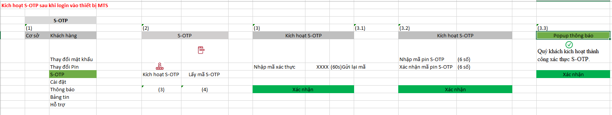
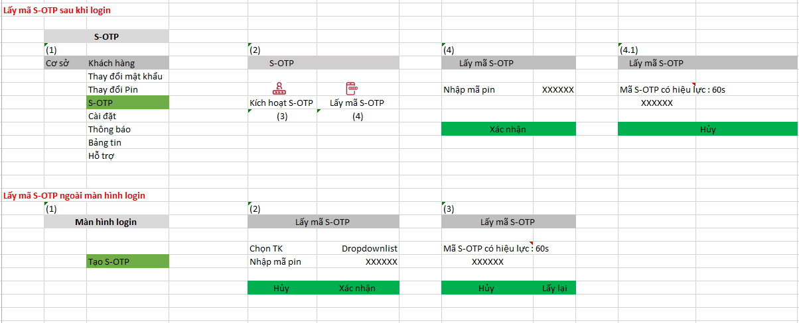
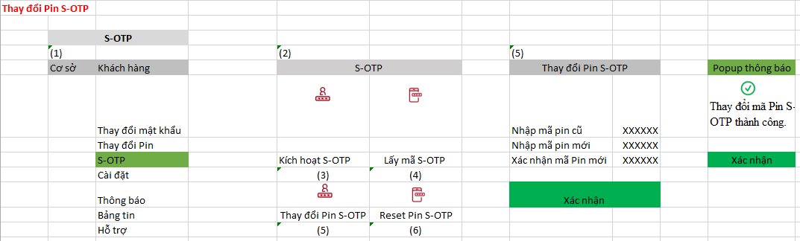
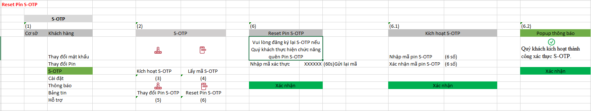

**QUY TRÌNH SMART-OTP  **

# **Mục lục**

[**I.** **Sơ đồ luồng quy trình thực hiện** [3](#_Toc100937244)](#_Toc100937244)

[**1.** **Login và kích hoạt S-OTP** [3](#_Toc100937245)](#_Toc100937245)

[**2.** **Tạo S-OTP** [4](#_Toc100937246)](#_Toc100937246)

[**3.** **Thay đổi Pin S-OTP** [5](#_Toc100937247)](#_Toc100937247)

[**4.** **Reset Pin S-OTP** [5](#_Toc100937248)](#_Toc100937248)

[**II.** **Luồng quy trình thực hiện** [6](#_Toc100937249)](#_Toc100937249)

[**1.** **Quy trình login** [6](#_Toc100937250)](#_Toc100937250)

[**2.** **Đăng nhập S-OTP** [6](#_Toc100937251)](#_Toc100937251)

[**3.** **Kích hoạt S-OTP (Sau khi login vào hệ thống)** [8](#_Toc100937252)](#_Toc100937252)

[**4.** **Lấy mã S_OTP** [9](#_Toc100937253)](#_Toc100937253)

[**5.** **Thay đổi Pin S-OTP** [11](#_Toc100937254)](#_Toc100937254)

[**6.** **Reset Pin S-OTP** [11](#_Toc100937255)](#_Toc100937255)

[**7.** **Kích hoạt lại S_OTP** [11](#_Toc100937256)](#_Toc100937256)

**  **

1.  **Sơ đồ luồng quy trình thực hiện**

<!-- -->

1.  **Login và kích hoạt S-OTP**

2.  **Tạo S-OTP**

    

3.  **Thay đổi Pin S-OTP**

4.  **Reset Pin S-OTP**

 **  **

2.  **Luồng quy trình thực hiện**

<!-- -->

1.  **Quy trình login**

- Hiển thị tùy chọn ID, nhập mật khẩu, OTP chọn đầu vào (Smart OTP, passcard-otp cũ) -\> Click “Đăng nhập”

- Nếu chọn thẻ OTP -\> tiếp tục quy trình OTP như hiện tại (Nhập đúng số OTP trên thẻ, nếu đúng login thành công vào hệ thống, nếu nhập sai OTP quá 5 lần thì sẽ khóa lại thẻ OTP)

- Nếu chọn S-OTP:

<!-- -->

- Nếu S-OTP chưa được kích hoạt và máy khách không phải là MTS, hiển thị thông báo lỗi “TK chưa được kích hoạt sử dụng Smart OTP.Vui lòng chọn phương thức đăng nhập khác” và kết thúc quá trình đăng nhập.

- Nếu S-OTP chưa được kích hoạt và máy khách là MTS -\> Thông báo cho khách hàng “Bạn chưa kích hoạt sử dụng Smart OTP. Bạn có muốn kích hoạt Smart-OTP trên thiết bị này không ?”

<!-- -->

- Nếu được kích hoạt, tiến hành đăng nhập S-OTP (Tham khảo phần đăng nhập bên dưới)

- Nếu không: dừng lại tại màn hình login

2.  **Đăng nhập S-OTP**

    1.  **Nếu máy khách là MTS và S-OTP đã được kích hoạt với thiết bị**

- Hiển thị đầu vào là mã Pin S-OTP, người dùng có thể hủy bỏ quá trình đăng nhập tại đây

- Kiểm tra mã PIN 6 số:

<!-- -->

- Nếu nhập sai mã Pin quá 5 lần, popup thông báo “Quý khách đã nhập sai mã pin 5 lần.Vui lòng kích hoạt lại S-OTP để tiếp tục sử dụng dịch vụ.”

- Nếu đúng mã Pin thì hiển thị màn hình giá trị S-OTP với giá trị S-OTP được duy trì trong 60 giây (Sau 60 giây hệ thống auto tạo một số S-OTP mới để xác thực quá trình login).

<!-- -->

- Tại màn hình nhập mã Pin 6 số, user có thể chọn chế độ “Chỉ xem” để đăng nhập vào hệ thống (Không được thực hiện nghiệp vụ gì trong chế độ này)

- Click nút “Xác nhận” -\> Quá trình đăng nhập thành công

  1.  **Nếu máy khách là MTS và S-OTP không được kích hoạt với thiết bị**

- Hiển thị thông báo: “Smart OTP không được kích hoạt trên thiết bị này. Bạn có muốn tiếp tục đăng nhập với S-OTP không ?

<!-- -->

- Nếu có chuyển sang màn hình nhập S-OTP.(S-OTP được sinh trên thiết bị kích hoạt S-OTP). Nhập mã S-OTP:

<!-- -->

- Nếu đúng, nhấn “Xác nhận”, login thành công vào hệ thống, kết thúc quá trình đăng nhập.

- Nếu nhập sai S-OTP quá 5 lần.Hệ thống thông báo cho khách hàng: “Quý khách đã nhập sai mã S-OTP 5 lần.Vui lòng kích hoạt lại S-OTP để tiếp tục sử dụng dịch vụ.”” -\> Kết thúc quá trình login.

<!-- -->

- Nếu không thì kết thúc quá trình login tại đây.

- Tại bước nhập S-OTP người dùng có thể hủy bỏ quá trình đăng nhập tại đây (Nhấn “Hủy”) hoặc login vào hệ thống với chế độ chỉ xem (Nhấn “Chỉ xem”)

  1.  **Khách hàng login qua kênh WTS/HTS**

- Chọn đăng nhập với S-OTP, nhấn “Xác nhận” chuyển sang màn hình nhập S-OTP (S-OTP được sinh trên thiết bị kích hoạt S-OTP). Nhập mã S-OTP:

<!-- -->

- Nếu đúng, nhấn “Xác nhận”, login thành công vào hệ thống, kết thúc quá trình đăng nhập.

- Nếu nhập sai S-OTP quá 5 lần, hệ thống thông báo cho khách hàng “ Quý khách đã nhập sai mã pin 5 lần.Vui lòng kích hoạt lại S-OTP để tiếp tục sử dụng dịch vụ.” -\> Kết thúc quá trình đăng nhập.

<!-- -->

- Tại bước nhập S-OTP người dùng có thể hủy bỏ quá trình đăng nhập tại đây (Nhấn “Hủy”) (Kênh đăng nhập HTS/WTS) hoặc login vào hệ thống với chế độ chỉ xem (Nhấn “Chỉ xem”) (Kênh đăng nhập HTS)

3.  **Kích hoạt S-OTP (Sau khi login vào hệ thống)**

- Kích hoạt S-OTP: Ở tab Khách hàng: Sau tab Thay đổi PIN

  - Sau khi login, nếu khách hàng chưa kích hoạt S-OTP-\>Popup thông báo “Quý khách chưa đăng ký Smart-OTP, quý khách có muốn kích hoạt chế độ S-OTP hay không ?

<!-- -->

- Có: Đi đến màn hình kích hoạt OTP

- Không: Thực hiện các nghiệp vụ khác

  1.  Đầu vào kích hoạt S-OTP :

<!-- -->

- Nhập mã xác thực OTP 6 số được gửi qua SMS về số điện thoại đã đăng ký.Nếu nhập đúng mã xác thực, khách hàng nhấn tiếp “Xác nhận” (Nếu nhập sai mã xác nhận 5 lần, thông báo cho khách hàng: “Quý khách đã nhập sai mã xác thực 5 lần.Vui lòng đăng nhập lại để tiếp tục sử dụng dịch vụ” và logout khỏi hệ thống). Mã xác thực tồn tại trong 60 giây, nếu hết thời gian hiệu lực, thì nhấn gửi lại mã xác thực khác.

- Nhập khởi tạo mã pin S-OTP (6 số)

- Xác nhận mã pin S-OTP (6 số)

  1.  Popup thông báo “Quý khách kích hoạt thành công xác thực S-OTP” -\> Nhấn “ Xác nhận” để kết thúc quá trình kích hoạt S-OTP và quay trở lại màn hình S-OTP.

  2.  Lưu trữ thông tin thiết bị kích hoạt S-OTP là duy nhất.

<!-- -->

- Nếu thiết bị đã kích hoạt S-OTP thì sau lần kích hoạt – click vào “Kích hoạt S-OTP” hiển thị popup thông báo: “Quý khách đã đăng ký S-OTP trên thiết bị này.”

  1.  Cho phép kích hoạt S-OTP trên thiết bị MTS khác, sau khi kích hoạt S-OTP trên thiết bị khác, thì inactive S-OTP trên thiết bị kích hoạt S-OTP trước đó.

- Nhấn kích hoạt S-OTP: Thông báo: “Quý khách đã đăng ký S-OTP trên thiết bị khác, quý khách có chắc chắn chuyển kích hoạt S-OTP trên thiết bị mới này không ?”

<!-- -->

- Nếu có : Tiếp tục quy trình kích hoạt như hiện tại

- Nếu không: Cho phép quay lại màn hình thao tác trước đó.

4.  **Lấy mã S-OTP**

- **Tài khoản chưa kích hoạt S-OTP**

  - Chọn “Lấy mã S-OTP” bên ngoài màn hình đăng nhập hoặc chọn mục chức năng “Lấy mã S-OTP” sau khi đăng nhập thì popup thông báo : “Vui lòng kích hoạt S-OTP để sử dụng chức năng này”

- **Tài khoản đã kích hoạt S-OTP và thiết bị kích hoạt là máy MTS đang đăng nhập**

  - Chọn “Lấy mã S-OTP” sau khi đăng nhập thành công, nhập mã Pin:

<!-- -->

- Nếu nhập mã Pin đúng thì nhấn “Xác nhận” chuyển sang màn hình lấy mã S-OTP: Mã S-OTP có hiệu lực trong 60s nếu quá thời gian 60s thì nhấn nút tạo S-OTP để hệ thống sinh ra số S-OTP mới (S-OTP đếm ngược). Mỗi số S-OTP được tạo sẽ có hiệu lực đối với 1 lần đăng nhập duy nhất. Sau khi lấy thành công mã S-OTP thì click “Hủy” để hoàn tất quá trình lấy S-OTP.

- Nếu nhập mã Pin sai thì thông báo “Mã Pin không đúng” và cho phép quay trở lại màn hình thực hiện trước đó. Nếu nhập sai mã PIN 1-4 lần, thì hiển thị thông báo : “Bạn đã nhập sai mã PIN 1-4 lần”. Nếu mã pin sai \>= 5 lần thì popup thông báo: “Quý khách đã nhập sai mã Pin 5 lần, Vui lòng đăng nhập lại bằng thẻ OTP và kích hoạt lại S-OTP”

<!-- -->

- Chọn “Lấy mã S-OTP” bên ngoài màn hình đăng nhập:

<!-- -->

- Chuyển sang màn hình chọn tài khoản-chỉ cho chọn không cho nhập (Lấy danh sách các tài khoản đã login và kích hoạt S-OTP thành công trên thiết bị), chọn tài khoản sau đó nhập mã pin của tài khoản cần tạo S-OTP

- Nếu nhập mã Pin đúng thì nhấn “Xác nhận” chuyển sang màn hình lấy mã S-OTP: Mã S-OTP có hiệu lực trong 60s nếu quá thời gian 60s thì hệ thống tự sinh S-OTP (S-OTP đếm ngược). Mỗi số S-OTP được tạo sẽ có hiệu lực đối với 1 lần đăng nhập duy nhất. Sau khi lấy thành công mã S-OTP thì click “Hủy” để hoàn tất quá trình lấy S-OTP.

- Nếu nhập mã Pin sai thì thông báo “Mã Pin không đúng” và cho phép quay trở lại màn hình thực hiện trước đó. Nếu mã pin sai \> 5 lần thì popup thông báo: “Quý khách đã nhập sai mã Pin 5 lần, Vui lòng đăng nhập lại bằng thẻ OTP và kích hoạt lại S-OTP”

<!-- -->

- **Tài khoản đã kích hoạt S-OTP và thiết bị đăng nhập không phải là thiết bị kích hoạt S-OTP**

  - Chọn “Lấy mã S-OTP” bên ngoài màn hình đăng nhập hoặc chọn mục chức năng “Lấy mã S-OTP” popup thông báo: “Vui lòng lấy mã S-OTP triên thiết bị mà quý khách đã đăng ký”

5.  **Thay đổi Pin S-OTP**

- Trường hợp khách hàng muốn thay đổi mã Pin S-OTP, hệ thống hỗ trợ chức năng thay đổi mã Pin S-OTP

- Thay đổi Pin S-OTP: Ở tab Khách hàng: Sau tab Thay đổi PIN chọn S-OTP/Thay đổi Pin S-OTP

<!-- -->

- Nhập mã Pin S-OTP cũ (6 số)

- Nhập mã Pin S-OTP mới (6 số)

- Xác nhận mã Pin S-OTP mới (6 số)

- Nhấn “Xác nhận” thông báo thay đổi mã Pin S-OTP thành công.

6.  **Reset Pin S-OTP**

- Trường hợp khách hàng quên mã Pin S-OTP, hệ thống hỗ trợ chức năng Reset mã Pin S-OTP

- Reset mã Pin S-OTP: Ở tab Khách hàng: Sau tab Thay đổi PIN chọn S-OTP/Reset Pin S-OTP

<!-- -->

- Thông báo cho khách hàng: Vui lòng đăng ký lại S-OTP nếu Quý khách thực hiện chức năng Reset Pin S-OTP.

- Tham khảo quy trình “Kích hoạt S-OTP”

7.  **Kích hoạt lại S_OTP**

- Trường hợp khách hàng xóa app đi cài lại, sẽ phải re-activate trên thiết bị đó (Mỗi lần xóa đi cài lại app, app sinh ra 1 mã thiết bị mới). Tham khảo quy trình kích hoạt S-OTP tại bước 3.

- TH khách hàng login thiết bị MTS khác, cho phép kích hoạt lại S-OTP trên thiết bị mới (Quy trình kích hoạt – tham khảo quy trình mục 3), sau khi kích hoạt S-OTP trên thiết bị mới, xóa kích hoạt S-OTP trên thiết bị kích hoạt trước đó.

- Tại một thời điểm, một tài khoản chỉ được kích hoạt S-OTP trên một thiết bị MTS.
