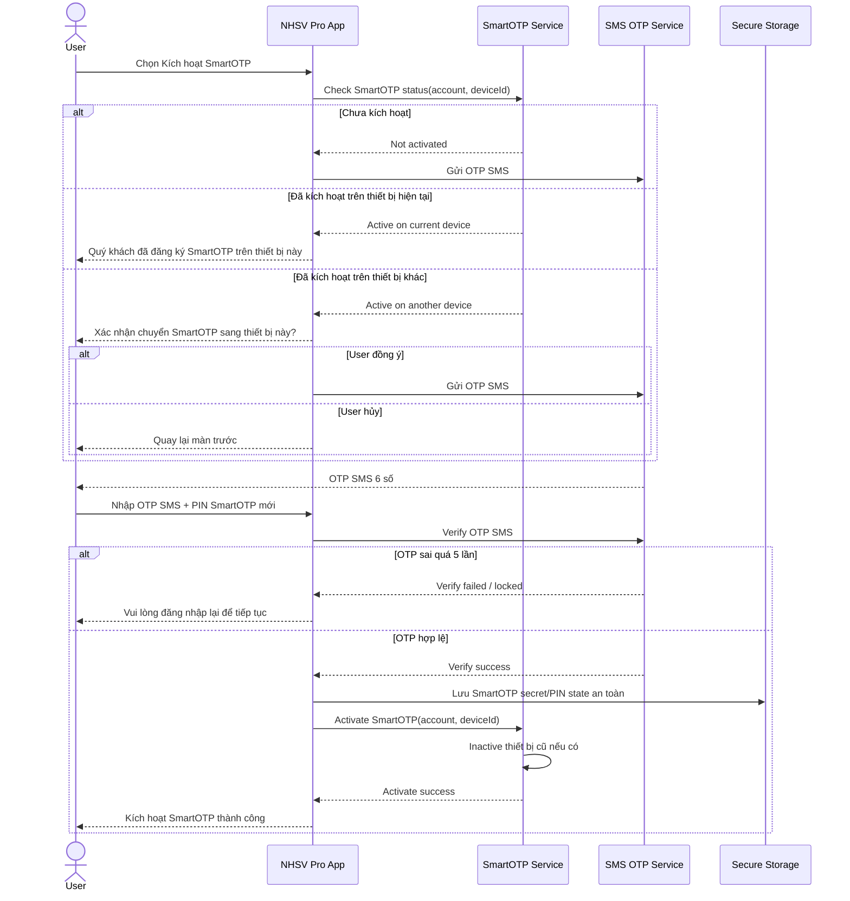
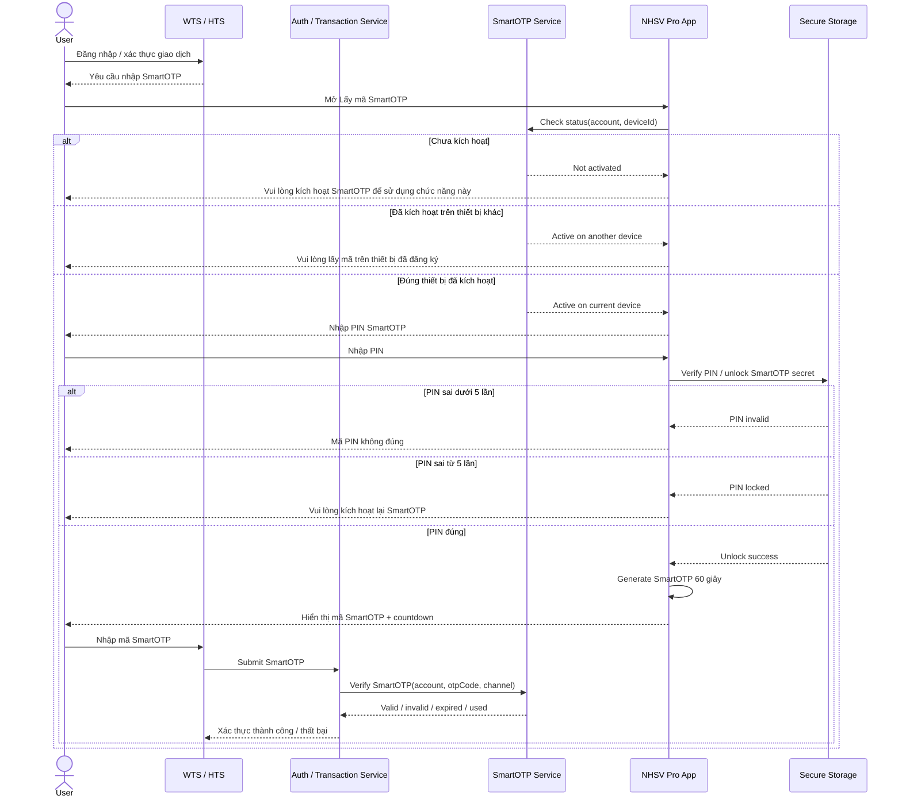
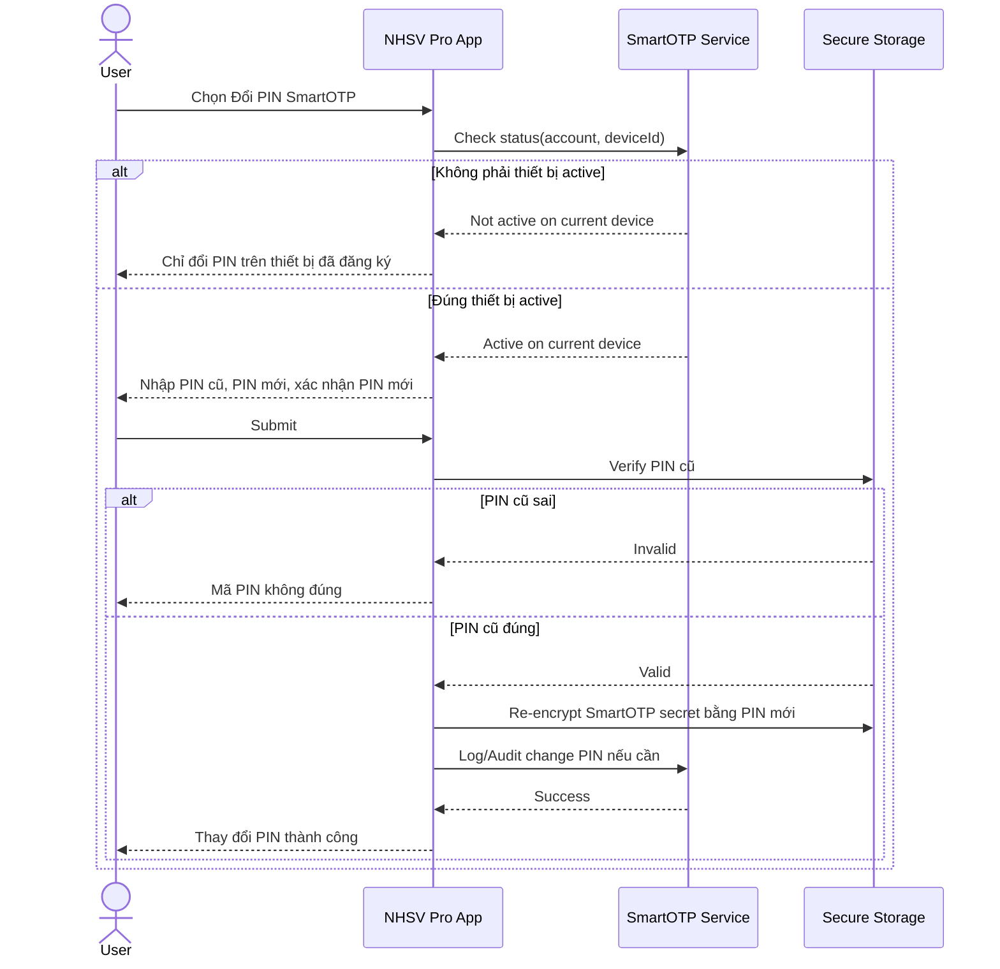
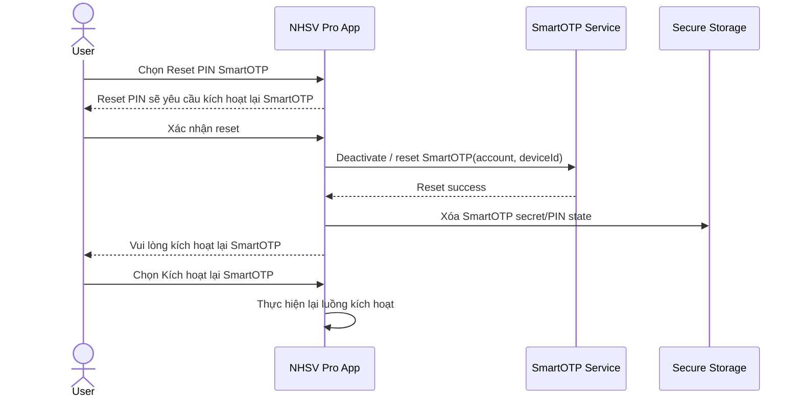

# SmartOTP For WTS/HTS Authentication - Scope Analysis

## 1. Mục Tiêu Phase 1

Phase này triển khai SmartOTP trên app NHSV Pro với vai trò:

- App NHSV Pro là nơi **kích hoạt SmartOTP**.
- App NHSV Pro là **thiết bị sinh mã SmartOTP**.
- Mã SmartOTP được dùng để xác thực trên các kênh **WTS/HTS**.
- Một tài khoản chỉ được active SmartOTP trên **một thiết bị MTS** tại một thời điểm.

Phase này **chưa triển khai đăng nhập NHSV Pro bằng SmartOTP**. Phần đó đưa vào backlog sau.

## 2. Phạm Vi

### 2.1 In Scope

| Nhóm | Nội dung |
| --- | --- |
| Kích hoạt SmartOTP | User kích hoạt SmartOTP trên app NHSV Pro bằng OTP SMS và tạo PIN SmartOTP |
| Device binding | Ràng buộc SmartOTP theo tài khoản và thiết bị MTS |
| Lấy mã SmartOTP | User nhập PIN trên app để lấy mã SmartOTP dùng cho WTS/HTS |
| Change PIN | User đổi PIN SmartOTP trên đúng thiết bị đã kích hoạt |
| Reset PIN | User reset PIN, sau đó phải kích hoạt lại SmartOTP |
| Re-activate | User chuyển SmartOTP sang thiết bị MTS mới, thiết bị cũ bị inactive |
| WTS/HTS verify | WTS/HTS nhập mã SmartOTP, backend xác thực mã |

### 2.2 Out Of Scope / Backlog

| Backlog | Ghi chú |
| --- | --- |
| Đăng nhập NHSV Pro bằng SmartOTP | Login app bằng PIN/SmartOTP sẽ làm sau |
| Chế độ "Chỉ xem" khi login app bằng SmartOTP | Phụ thuộc luồng login app SmartOTP |
| Popup kích hoạt trong màn login app | Phase này nên ưu tiên entry point trong menu/tài khoản |
| Auto-fill SmartOTP vào login app | Không cần cho phase WTS/HTS |

## 3. Các Trạng Thái SmartOTP

| Trạng thái | Ý nghĩa | Hành vi app |
| --- | --- | --- |
| Not Activated | Tài khoản chưa kích hoạt SmartOTP | Cho phép kích hoạt |
| Active On Current Device | Tài khoản đã kích hoạt trên thiết bị hiện tại | Cho phép lấy mã, đổi PIN, reset PIN |
| Active On Another Device | Tài khoản đã kích hoạt trên thiết bị khác | Không cho lấy mã; cho phép chuyển kích hoạt nếu user xác nhận |
| Locked / Need Reactivation | Sai PIN hoặc sai SmartOTP quá giới hạn | Yêu cầu kích hoạt lại |
| Reset | User reset PIN hoặc hệ thống hủy binding | Yêu cầu kích hoạt lại |

## 4. Luồng Kích Hoạt SmartOTP

### 4.1 Mô Tả

User đã login vào app NHSV Pro bằng phương thức hiện tại. Trong menu tài khoản, user chọn kích hoạt SmartOTP.

Các bước chính:

1. App kiểm tra trạng thái SmartOTP của tài khoản và thiết bị.
2. Nếu chưa kích hoạt, app gửi OTP SMS để xác thực chủ tài khoản.
3. Nếu đã kích hoạt trên thiết bị hiện tại, app báo đã đăng ký.
4. Nếu đã kích hoạt trên thiết bị khác, app hỏi user có muốn chuyển kích hoạt sang thiết bị hiện tại không.
5. User nhập OTP SMS, tạo PIN SmartOTP 6 số và xác nhận PIN.
6. Backend bind tài khoản với deviceId hiện tại.
7. App lưu thông tin SmartOTP local bằng secure storage.

### 4.2 Sequence Diagram

## 5. Luồng Lấy Mã SmartOTP Cho WTS/HTS

### 5.1 Mô Tả

User cần đăng nhập hoặc xác thực giao dịch trên WTS/HTS. WTS/HTS yêu cầu nhập mã SmartOTP. User mở app NHSV Pro trên thiết bị đã đăng ký để lấy mã.

Các bước chính:

1. User chọn "Lấy mã SmartOTP" trên app.
2. App kiểm tra tài khoản đã active SmartOTP và thiết bị hiện tại có đúng là thiết bị đã đăng ký không.
3. Nếu đúng thiết bị, user nhập PIN SmartOTP.
4. App sinh mã SmartOTP có hiệu lực 60 giây.
5. User nhập mã này trên WTS/HTS.
6. Backend xác thực mã SmartOTP và trả kết quả cho WTS/HTS.

### 5.2 Sequence Diagram

## 6. Luồng Đổi PIN SmartOTP

### 6.1 Mô Tả

User chỉ đổi được PIN trên thiết bị đang active SmartOTP.

Các bước chính:

1. User vào menu đổi PIN SmartOTP.
2. App kiểm tra thiết bị hiện tại có active SmartOTP không.
3. User nhập PIN cũ, PIN mới và xác nhận PIN mới.
4. Nếu PIN cũ đúng, app cập nhật PIN bảo vệ SmartOTP local.
5. Backend có thể ghi nhận audit event nếu cần.

### 6.2 Sequence Diagram

## 7. Luồng Reset PIN / Kích Hoạt Lại

### 7.1 Mô Tả

Theo tài liệu hiện tại, reset PIN không phải chỉ tạo PIN mới. Sau khi reset, user cần kích hoạt lại SmartOTP.

Các trường hợp cần kích hoạt lại:

- User quên PIN SmartOTP.
- User nhập sai PIN quá 5 lần.
- User xóa app và cài lại, app sinh deviceId mới.
- User muốn chuyển SmartOTP sang thiết bị MTS khác.

### 7.2 Sequence Diagram

## 8. API / Contract Cần Chốt Với Backend

### 8.1 API Tối Thiểu Cho App NHSV Pro

| API | Mục đích | Ghi chú |
| --- | --- | --- |
| Check SmartOTP Status | Kiểm tra trạng thái account + device | Trả về not active / active current device / active other device / locked |
| Send Activation OTP | Gửi OTP SMS để kích hoạt | Có TTL 60 giây |
| Verify Activation OTP | Verify OTP SMS | Sai 5 lần thì khóa flow hoặc logout |
| Activate SmartOTP | Bind account với device hiện tại | Nếu chuyển thiết bị thì inactive thiết bị cũ |
| Get/Sync SmartOTP Seed | Cấp seed/secret hoặc dữ liệu cần để app generate mã | Cần thiết kế bảo mật kỹ |
| Reset SmartOTP | Hủy binding/reset PIN state | Dẫn user về kích hoạt lại |
| Audit Change PIN | Ghi nhận đổi PIN nếu BE cần audit | PIN không nên gửi plaintext lên server |

### 8.2 API Tối Thiểu Cho WTS/HTS

| API | Mục đích | Ghi chú |
| --- | --- | --- |
| Verify SmartOTP | WTS/HTS gửi mã SmartOTP để backend xác thực | Cần check expired, used, wrong count |
| Get SmartOTP Requirement | WTS/HTS biết tài khoản có cần SmartOTP không | Phục vụ UI login/transaction |

## 9. Quy Tắc Bảo Mật Cần Chốt

| Chủ đề | Cần quyết định |
| --- | --- |
| Cơ chế sinh mã | TOTP offline trên app hay server-issued OTP |
| One-time-use | Backend phải enforce mỗi mã chỉ dùng một lần |
| TTL | Theo tài liệu: 60 giây |
| PIN SmartOTP | Nên verify local, không gửi PIN plaintext lên backend |
| Secret storage | Dùng Keychain/Keystore hoặc secure storage tương đương |
| Device binding | Cần định nghĩa deviceId ổn định, chống clone ở mức phù hợp |
| Wrong attempt counter | PIN sai có thể local; SmartOTP sai nên server-side |
| Reinstall app | Coi là device mới, cần kích hoạt lại |
| Multi-device | Một tài khoản chỉ active trên một thiết bị MTS |

## 10. Backlog Sau Phase 1

| Backlog item | Nội dung |
| --- | --- |
| SmartOTP Login On NHSV Pro | Cho phép login app bằng SmartOTP |
| View-only Mode | Hỗ trợ đăng nhập chỉ xem khi dùng SmartOTP |
| SmartOTP Login Prompt | Popup hỏi kích hoạt trong login flow app |
| App Login Error Handling | Xử lý case thiết bị hiện tại không phải thiết bị active |
| SmartOTP Transaction In App | Nếu sau này app cũng dùng SmartOTP để xác thực giao dịch nội app |

## 11. Kết Luận

Phase 1 nên được định nghĩa là **SmartOTP for WTS/HTS Authentication**.

App NHSV Pro trong phase này không phải kênh tiêu thụ SmartOTP cho login app, mà là:

1. Kênh đăng ký SmartOTP.
2. Thiết bị sinh mã SmartOTP.
3. Nơi quản lý PIN, reset, chuyển thiết bị.

WTS/HTS và backend là nơi tiêu thụ mã SmartOTP để xác thực đăng nhập hoặc giao dịch.
