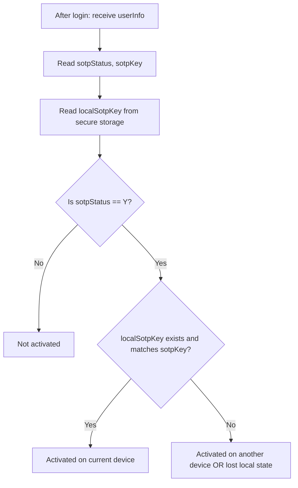
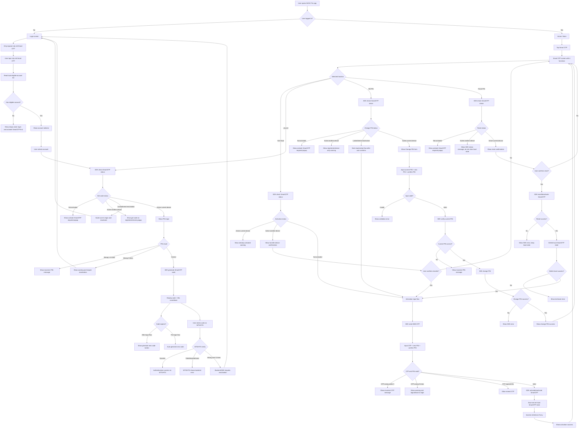

# FE Overview - SmartOTP End-To-End Flow

## Reference

- Logic source: `Smart OTP - multi channels/Quy_trinh_S_OTP.md`
- Scope analysis: `Smart OTP - multi channels/SmartOTP_WTS_HTS_Scope_Analysis.md`
- Smart OTP menu design: [Figma - Smart OTP](https://www.figma.com/design/7KYJfVHawWie4n8v12JtXm/NHSV-Pro?node-id=40008664-236501&t=oC0STJTkSr41WfqM-11)

## Purpose

This document gives FE developers the full SmartOTP flow before reading each detailed issue.

Phase 1 goal:

- NHSV Pro app is the SmartOTP registration and code generation device.
- WTS/HTS consumes the generated SmartOTP code.
- NHSV Pro app login by SmartOTP is not included in this phase.

## Core Rules

- SmartOTP is integrated by SDK, not direct REST API calls from FE.
- NHSV does not have SDK source code yet, so SDK method names, payloads, error codes, and storage behavior must be confirmed with partner.
- One account can activate SmartOTP on only one MTS device at a time.
- FE must detect SmartOTP activation status using `sotpStatus` / `sotpKey` returned by TradeX `login` / `verifyOTP` (when available) and compare with `localSotpKey` in secure storage to infer **active on this device vs another device**.
- Before login, user can only use `Lấy mã Smart OTP`.
- After login, user can access full Smart OTP screen from `More`.
- `Kích hoạt Smart OTP`, `Đổi PIN Smart OTP`, `Reset PIN Smart OTP`, and `Kích hoạt lại SmartOTP` require user to be logged in.
- Reset PIN does not create a new PIN directly. After reset success, app navigates directly to activation flow.

## Status Detection Rule (New Requirement)

TradeX login response provides 2 fields (mapped from Lotte):

- `userInfo.sotpStatus` (example: `"Y"` / `"N"`)
- `userInfo.sotpKey` (server key)

FE secure storage provides:

- `localSotpKey` (stored on device after successful activation on this device)

Decision:

| Condition | Interpretation |
| --- | --- |
| `sotpStatus !== "Y"` | Not activated |
| `sotpStatus === "Y"` AND `localSotpKey === sotpKey` | Activated on current device |
| `sotpStatus === "Y"` AND `localSotpKey` missing OR mismatch | Activated on another device (or this device lost local state) |

### Detection Flow Diagram

## Smart OTP Screen

Access after login:

1. User logs in by the current supported method.
2. User opens `More`.
3. User taps `Smart OTP`.
4. App displays Smart OTP screen with 4 main functions:
   - `Kích hoạt Smart OTP`
   - `Lấy mã Smart OTP`
   - `Đổi PIN Smart OTP`
   - `Reset PIN Smart OTP`

Figma also shows `Authenticate via biometric`, but it is not part of the 4 SmartOTP issues unless product confirms separate scope.

## Issue Map

| Issue | Function | Login required | Main purpose |
| --- | --- | --- | --- |
| `01_FE_Issue_Kich_Hoat_SmartOTP.md` | Kích hoạt Smart OTP | Yes | Register current MTS device |
| `02_FE_Issue_Lay_Ma_SmartOTP.md` | Lấy mã Smart OTP | No for get-code entry, Yes for More menu entry | Generate SmartOTP code for WTS/HTS |
| `03_FE_Issue_Reset_PIN_SmartOTP.md` | Reset PIN Smart OTP | Yes | Reset/deactivate current SmartOTP and navigate to activation |
| `04_FE_Issue_Change_PIN_SmartOTP.md` | Đổi PIN Smart OTP | Yes | Change SmartOTP PIN on active device |
| `05_FE_Issue_Kich_Hoat_Lai_SmartOTP.md` | Kích hoạt lại SmartOTP | Yes | Re-register after reset, locked, reinstall, or device transfer |

## End-To-End Flowchart

## SDK Contract Checklist

Ask partner to provide SDK contract before FE implementation:

- Check SmartOTP status:
  - Inputs: account, device ID, channel/context.
  - Outputs: not activated, active current device, active another device, locked, reset, need reactivation.
- Activation/reactivation:
  - Send SMS OTP.
  - Verify SMS OTP.
  - Activate/reactivate current device.
  - Inactive old device.
- Generate SmartOTP:
  - Verify/unlock PIN.
  - Generate code.
  - Countdown behavior.
  - Auto-regenerate behavior.
  - One-time-use behavior.
- PIN management:
  - Change PIN.
  - Reset/deactivate.
  - Incorrect PIN counter.
- Errors:
  - OTP incorrect.
  - OTP expired.
  - PIN incorrect.
  - Locked/need reactivation.
  - Active on another device.
  - SDK timeout/network/internal failure.
- Local storage:
  - Whether SDK fully owns secure storage.
  - Whether app must store eligible account list.
  - Whether app must clear local data after reset.

## Global Error Rules

| Case | Global behavior |
| --- | --- |
| Before login and user wants SmartOTP function other than get-code | Do not expose the function |
| Not activated | Show activate SmartOTP required message |
| Active on another device | Show registered-device or transfer warning depending on flow |
| OTP SMS expires after 60 seconds | Allow resend OTP |
| OTP SMS incorrect 5 times | Show warning and logout/back to login |
| PIN incorrect 1-4 times | Show incorrect PIN message |
| PIN incorrect 5 times | Require login with current method and SmartOTP reactivation |
| Reset success | Navigate directly to activation flow |
| Reinstall app | Treat as new device and require reactivation |
| SDK failure | Show SDK error and do not mark flow as success |

## Detailed Issues

Read these issue files for implementation detail:

1. `01_FE_Issue_Kich_Hoat_SmartOTP.md`
2. `02_FE_Issue_Lay_Ma_SmartOTP.md`
3. `03_FE_Issue_Reset_PIN_SmartOTP.md`
4. `04_FE_Issue_Change_PIN_SmartOTP.md`
5. `05_FE_Issue_Kich_Hoat_Lai_SmartOTP.md`

---

Document Status: 📋 | For: PM/Dev | Next Steps: Review nội dung, cập nhật status trên Tracking/tasks.js
