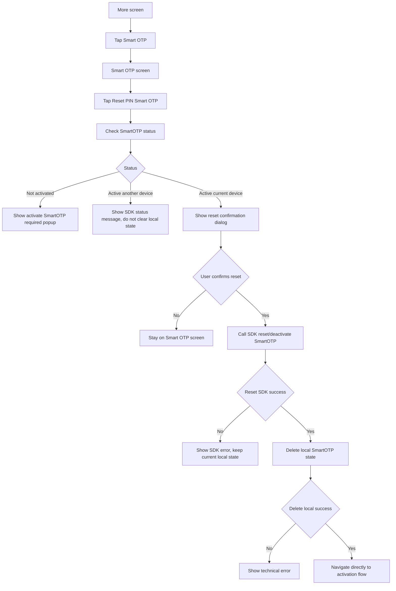

# FE Issue 03 - Reset PIN SmartOTP

## Reference

- Logic source: `Smart OTP - multi channels/Quy_trinh_S_OTP.md`
- Smart OTP menu design: [Figma - Smart OTP](https://www.figma.com/design/7KYJfVHawWie4n8v12JtXm/NHSV-Pro?node-id=40008664-236501&t=oC0STJTkSr41WfqM-11)

## Objective

Build the **Reset PIN Smart OTP** flow on NHSV Pro app.

Reset PIN does not create a new PIN directly. After reset, user must activate SmartOTP again.

## SDK Integration Note

SmartOTP reset is integrated by SDK, not by direct REST API calls from FE.

Because NHSV does not have the SDK source code yet, FE implementation depends on partner-provided SDK contract:

- SDK method to check SmartOTP status.
- SDK method to reset/deactivate SmartOTP.
- SDK method behavior for clearing local secret/PIN state.
- SDK error codes for not activated, active another device, reset failed, and need reactivation.

## Entry Point

Access rule:

- User must be logged in to access this function.
- Before login, app must not expose `Reset PIN Smart OTP`.
- Before login, only `Lấy mã Smart OTP` is available.

1. User opens `More`.
2. User taps `Smart OTP`.
3. Display Smart OTP screen with 4 functions.
4. User taps `Reset PIN Smart OTP`.

This issue handles only `Reset PIN Smart OTP`.

## Developer Flow

User taps `Reset PIN Smart OTP`.

Call SDK method to check SmartOTP status by `accountNumber` and `deviceId` if needed.

If account has not activated SmartOTP:

- Display popup: `Vui lòng kích hoạt S-OTP để sử dụng chức năng này.`
- Do not show reset confirmation.

If account activated SmartOTP on another device:

- Display popup based on SDK response.
- Do not delete local state for another device/account.
- User should be guided to use or reactivate on the registered device depending on final SDK/partner rule.

If account activated SmartOTP on current device:

- Display confirmation dialog: `Vui lòng đăng ký lại S-OTP nếu Quý khách thực hiện chức năng Reset Pin S-OTP.`
- Click `Cancel` to dismiss dialog and stay on Smart OTP screen.
- Click `Confirm` to call reset/deactivate SmartOTP SDK method.

After reset SDK method success:

- Delete local SmartOTP secret/PIN state for this account and device.
- Navigate directly to the SmartOTP activation flow.
- Do not display an extra "need reactivation" dialog after reset success.

If reset SDK method failed:

- Display SDK error message.
- Do not delete local SmartOTP state if SDK reset did not succeed.

## Flowchart

## SDK And State Dependencies

| Item | Purpose |
| --- | --- |
| Check SmartOTP status SDK method | Confirm account/device state before reset |
| Reset SmartOTP SDK method | Deactivate/reset current SmartOTP binding |
| Secure local storage | Delete local SmartOTP secret/PIN state after reset success |

## Error Cases

| Case | FE behavior |
| --- | --- |
| Account not activated | Show activate required popup |
| Active on another device | Show SDK status message, do not delete local state |
| User cancels reset | Do not call reset SDK method |
| Reset SDK method failed | Show SDK error and keep local state |
| Delete local state failed | Show technical error |
| User tries to exit activation after reset | Keep SmartOTP status as not active/need reactivation |
| User tries to get code after reset without activation | Require SmartOTP activation |
| User tries to change PIN after reset without activation | Require SmartOTP activation |

## Acceptance Criteria

- User can access Reset PIN from Smart OTP screen.
- User cannot access Reset PIN before login.
- User sees a confirmation that reset requires SmartOTP reactivation.
- Cancel does not call reset SDK method.
- Reset success clears local SmartOTP state and navigates directly to activation flow.
- Reset failure does not clear local state.
- No extra "need reactivation" dialog is shown after reset success.

---

Document Status: 📋 | For: PM/Dev | Next Steps: Review nội dung, cập nhật status trên Tracking/tasks.js
