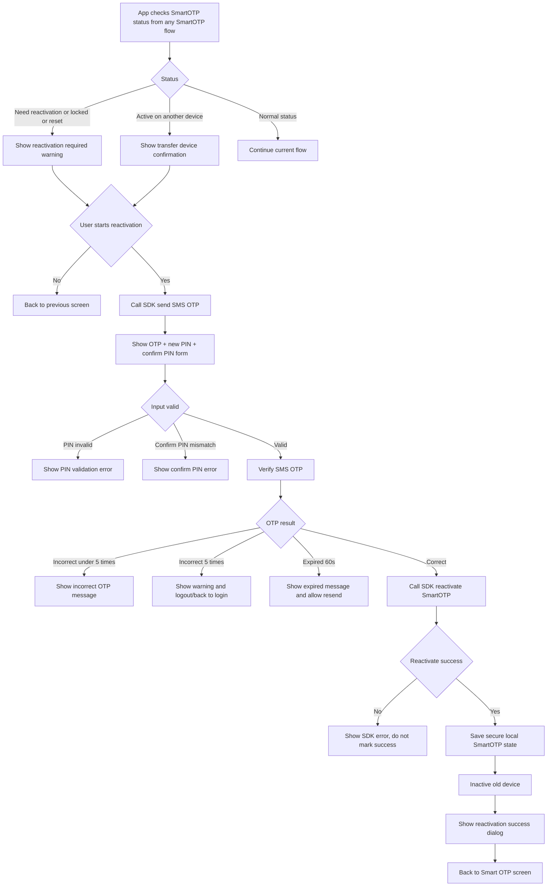

# FE Issue 05 - Kích Hoạt Lại SmartOTP

## Reference

- Logic source: `Smart OTP - multi channels/Quy_trinh_S_OTP.md`
- Smart OTP menu design: [Figma - Smart OTP](https://www.figma.com/design/7KYJfVHawWie4n8v12JtXm/NHSV-Pro?node-id=40008664-236501&t=oC0STJTkSr41WfqM-11)

## Objective

Build the **Kích hoạt lại SmartOTP** behavior.

This is not a separate main function on the Smart OTP menu. It is triggered from other flows when user needs to register SmartOTP again.

## SDK Integration Note

SmartOTP reactivation is integrated by SDK, not by direct REST API calls from FE.

Because NHSV does not have the SDK source code yet, FE implementation depends on partner-provided SDK contract:

- SDK method to check SmartOTP status.
- SDK method to send/verify SMS OTP for reactivation.
- SDK method to reactivate/activate SmartOTP on current device.
- SDK behavior for inactivating old device.
- SDK error codes for locked, reset, need reactivation, active another device, OTP expired, OTP incorrect, and reactivation failed.

## Trigger Cases

Trigger reactivation when:

- User deleted and reinstalled app. The app generates a new device ID.
- User wants to move SmartOTP from old MTS device to current MTS device.
- User reset SmartOTP PIN.
- User input incorrect PIN 5 times.
- User input incorrect SmartOTP more than 5 times on WTS/HTS and backend/SDK requires reactivation.

## Entry Points

Access rule:

- Reactivation requires user to be logged in.
- Before login, app only allows `Lấy mã Smart OTP`.
- If pre-login `Lấy mã Smart OTP` detects locked/need reactivation state, app should show the reactivation-required message and guide user to login by the current supported method first.

Reactivation can start from:

- `Kích hoạt Smart OTP` when SDK returns active on another device.
- `Reset PIN Smart OTP` after reset success.
- `Lấy mã Smart OTP` when account/device status is locked or requires reactivation.
- `Đổi PIN Smart OTP` when account/device status is locked or requires reactivation.

## Developer Flow

When app receives SmartOTP status from SDK:

If SDK returns `needReactivation`, `locked`, `reset`, or equivalent:

- Display warning: `Vui lòng kích hoạt lại SmartOTP để tiếp tục sử dụng dịch vụ.`
- Click `Cancel` to go back to previous screen.
- Click `Kích hoạt lại` to start activation flow.

If SDK returns account active on another device:

- Display confirmation dialog: `Quý khách đã đăng ký S-OTP trên thiết bị khác, quý khách có chắc chắn chuyển kích hoạt S-OTP trên thiết bị mới này không?`
- Click `Cancel` to stay on current screen.
- Click `Confirm` to start activation flow on current device.

Reactivation input:

- Call SDK method to send SMS OTP to registered phone number.
- Display SMS OTP input, new SmartOTP PIN input, and confirm SmartOTP PIN input.
- OTP is valid for 60 seconds.
- PIN must be 6 digits.
- Confirm PIN must match new PIN.

Authentication:

- If user inputs correct SMS OTP:
  - Call SDK method to reactivate/activate SmartOTP on current device.
  - Save new local SmartOTP state securely.
  - Inactive old device.
  - Display success dialog: `Kích hoạt lại SmartOTP thành công.`
  - Click `Confirm` to navigate back to Smart OTP screen.

- If user inputs incorrect SMS OTP:
  - Display incorrect OTP message.
  - Allow retry if incorrect count is less than 5.

- If user inputs incorrect SMS OTP 5 times:
  - Display warning: `Quý khách đã nhập sai mã xác thực 5 lần. Vui lòng đăng nhập lại để tiếp tục sử dụng dịch vụ.`
  - Click `Got it` to logout or navigate user to login screen.

- If SMS OTP expires after 60 seconds:
  - Display expired OTP message.
  - Enable `Resend OTP`.

Important rule:

- At any time, one account can activate SmartOTP on only one MTS device.
- After reactivation on current device succeeds, old device must not be able to generate SmartOTP anymore.

## Flowchart

## SDK And State Dependencies

| Item | Purpose |
| --- | --- |
| Check SmartOTP status SDK method | Detect need reactivation / locked / reset / active another device |
| Send SMS OTP SDK method | Send OTP for reactivation |
| Verify SMS OTP SDK method | Verify OTP and enforce 5 incorrect attempts |
| Reactivate or Activate SmartOTP SDK method | Bind current device and inactive old device |
| Secure local storage | Replace old local SmartOTP state with new state |
| Device ID | Treat reinstall as new device |

## Error Cases

| Case | FE behavior |
| --- | --- |
| User cancels reactivation | Return to previous screen, no SDK activation |
| User cancels device transfer | Keep old device active |
| SMS OTP incorrect under 5 times | Show incorrect OTP message |
| SMS OTP incorrect 5 times | Show warning and logout/back to login |
| SMS OTP expired after 60 seconds | Show expired message and allow resend |
| PIN invalid | Show validation error |
| Confirm PIN mismatch | Show validation error |
| Reactivate SDK method failed | Show SDK error, do not update local success state |
| Local state save failed | Show technical error |

## Acceptance Criteria

- Reactivation can be triggered from activation, reset PIN, get code, or change PIN flows.
- Reactivation cannot be completed before login; pre-login users must login first.
- User sees clear warning before transferring SmartOTP to the current device.
- User can cancel reactivation without changing active device.
- Reactivation uses SMS OTP, new PIN, and confirm PIN.
- Successful reactivation makes current device the only active SmartOTP device.
- Old device cannot generate valid SmartOTP after reactivation.
- Reinstall app is treated as a new device and requires reactivation.

---

Document Status: 📋 | For: PM/Dev | Next Steps: Review nội dung, cập nhật status trên Tracking/tasks.js
