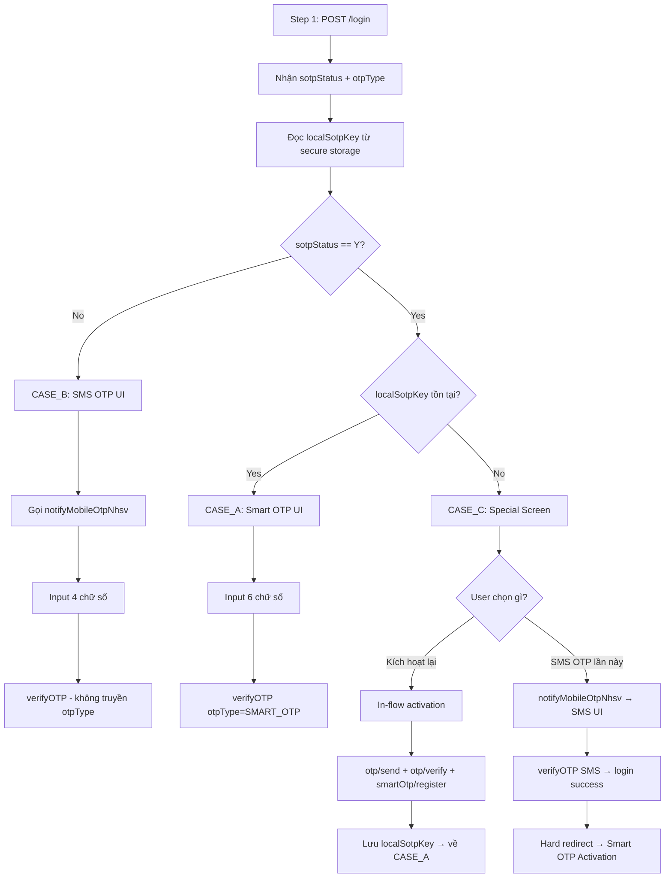

# FE Issue 08 — Smart OTP Login Integration

## Reference

- Design spec: [`docs/superpowers/specs/2026-06-04-smart-otp-login-design.md`](../../docs/superpowers/specs/2026-06-04-smart-otp-login-design.md)
- PRD: [`Smart OTP - multi channels/Issues/06_PRD_Login_SmartOTP.md`](../Planning/06_PRD_Login_SmartOTP.md)
- BE Task: [`Smart OTP - multi channels/Issues/07_BE_Task_Login_SmartOTP.md`](./07_BE_Task_Login_SmartOTP.md)
- FE Overview: [`Smart OTP - multi channels/Issues/00_FE_Overview_SmartOTP_End_To_End_Flow.md`](./00_FE_Overview_SmartOTP_End_To_End_Flow.md)

## Objective

Mở rộng màn hình OTP trong luồng đăng nhập NHSV Pro để hỗ trợ Smart OTP. FE phân nhánh UI dựa trên `otpType` từ server + local `sotpKey` từ secure storage — 3 cases khác nhau với UX riêng biệt.

## Dependency

Task này **phụ thuộc vào BE Task 07** hoàn thành trước (BE cần expose `sotpStatus` + `otpType` trong login response).

Confirm với BE trước khi bắt đầu:
- `sotp_stat` enum chính xác từ Lotte (`"Y"` / `"N"`?)
- Temp token từ Step 1 có gọi được `/otp/send` + `/smartOtp/register`? (ảnh hưởng Case C PRIMARY)

---

## Background — Login Flow Hiện Tại

```
[1] POST /rest/api/v1/login  →  temp accessToken
[2] POST /rest/api/v1/notifyMobileOtpNhsv  →  gửi SMS OTP cho user
[3] User nhập OTP → POST /rest/api/v1/login/sec/verifyOTP  →  final token
```

Sau task này, Step 2 chỉ được gọi khi `otpType = "SMS_OTP"`. Với Smart OTP, Step 2 bị bỏ qua hoàn toàn.

---

## 3 Cases

### Case Decision Logic

Sau khi nhận response từ Step 1 (`/rest/api/v1/login`):

```
sotpStatus == "N"
  → CASE_B: SMS OTP flow (giữ nguyên hiện tại)

sotpStatus == "Y" AND local sotpKey tồn tại
  → CASE_A: Smart OTP flow

sotpStatus == "Y" AND KHÔNG có local sotpKey
  → CASE_C: Special screen (cài lại app / đổi máy)
```

### Flow Diagram



---

## Developer Flow

### Step 1: Types & Secure Storage

**Thêm `sotpStatus` + `otpType` vào login Step 1 response type** (tìm file interface login hiện tại):

```typescript
interface LoginStep1Response {
  accessToken: string;
  otpIndex?: string;
  userLevel?: string;
  registerMobileOtp?: boolean;
  sotpStatus?: 'Y' | 'N';
  otpType?: 'SMART_OTP' | 'SMS_OTP';
}
```

**Tạo `src/utils/smartOtpStorage.ts`** — wrapper secure storage cho `localSotpKey`:

```typescript
import * as Keychain from 'react-native-keychain';  // confirm thư viện secure storage đang dùng

const SERVICE = 'nhsv_sotp_key';

export async function saveSotpKey(key: string): Promise<void> {
  await Keychain.setGenericPassword('sotpKey', key, { service: SERVICE });
}

export async function getSotpKey(): Promise<string | null> {
  const result = await Keychain.getGenericPassword({ service: SERVICE });
  return result === false ? null : result.password;
}

export async function clearSotpKey(): Promise<void> {
  await Keychain.resetGenericPassword({ service: SERVICE });
}
```

> Confirm thư viện secure storage đang dùng trong project trước khi code (`react-native-keychain`, `expo-secure-store`, hay khác).

---

### Step 2: Case Decision Hook

**Tạo `src/hooks/useSmartOtpLoginBranch.ts`**:

```typescript
import { useCallback } from 'react';
import { getSotpKey } from '../utils/smartOtpStorage';

export type OtpLoginCase = 'CASE_A' | 'CASE_B' | 'CASE_C';

export function useSmartOtpLoginBranch() {
  const determineCase = useCallback(async (
    sotpStatus?: 'Y' | 'N',
    otpType?: 'SMART_OTP' | 'SMS_OTP',
  ): Promise<OtpLoginCase> => {
    if (sotpStatus !== 'Y' || otpType !== 'SMART_OTP') return 'CASE_B';
    const localKey = await getSotpKey();
    return localKey ? 'CASE_A' : 'CASE_C';
  }, []);

  return { determineCase };
}
```

---

### Step 3: Login Saga — Branch `notifyMobileOtpNhsv`

Tìm nơi gọi `notifyMobileOtpNhsv` sau Step 1 login (file saga trong `src/reduxs/sagas/`):

```typescript
// Sau khi nhận loginStep1Response
const { sotpStatus, otpType } = loginStep1Response;
const { determineCase } = useSmartOtpLoginBranch();  // hoặc gọi trực tiếp
const loginCase = await determineCase(sotpStatus, otpType);

if (loginCase === 'CASE_B') {
  // Giữ nguyên: gọi notifyMobileOtpNhsv như hiện tại
  yield call(api.notifyMobileOtpNhsv, /* params hiện tại */);
}
// CASE_A và CASE_C: không gọi notifyMobileOtpNhsv

yield put(loginActions.setOtpCase(loginCase));
yield put(loginActions.setSotpStatus(sotpStatus));
// Navigate tới OTP screen như hiện tại
```

---

### Step 4: OTP Screen — Branch UI

Trong OTP Screen, đọc `otpCase` từ Redux state:

**CASE_A — Smart OTP UI:**

```tsx
if (otpCase === 'CASE_A') {
  return (
    <View>
      <Text>Mở app → nhập PIN → lấy mã 6 chữ số</Text>
      <OtpInput
        length={6}
        placeholder="------"
        onSubmit={(code) => dispatch(loginActions.submitSmartOtp(code))}
      />
      <TouchableOpacity onPress={handleCantGetCode}>
        <Text style={styles.link}>Không lấy được mã?</Text>
      </TouchableOpacity>
    </View>
  );
}
```

"Không lấy được mã?" → xóa local key rồi switch sang CASE_C:
```typescript
const handleCantGetCode = async () => {
  await clearSotpKey();
  dispatch(loginActions.setOtpCase('CASE_C'));
};
```

**CASE_B — Giữ nguyên UI hiện tại**, không sửa gì.

**CASE_C — Điều kiện render màn hình đặc biệt:**
```tsx
if (otpCase === 'CASE_C') {
  return <SmartOtpReinstallScreen />;
}
```

---

### Step 5: CASE_C — `SmartOtpReinstallScreen`

**Tạo `src/screens/Login/SmartOtpReinstallScreen.tsx`:**

```tsx
export function SmartOtpReinstallScreen() {
  const dispatch = useDispatch();

  return (
    <View style={styles.container}>
      <Text style={styles.title}>Thiết bị này chưa có Smart OTP</Text>
      <Text style={styles.body}>
        Smart OTP của bạn chưa được thiết lập trên thiết bị này.
        Kích hoạt lại để tiếp tục.
      </Text>

      {/* PRIMARY */}
      <TouchableOpacity
        style={styles.primaryButton}
        onPress={() => dispatch(loginActions.startSmartOtpReactivation())}
      >
        <Text style={styles.primaryText}>Kích hoạt lại Smart OTP</Text>
      </TouchableOpacity>

      {/* SECONDARY */}
      <TouchableOpacity
        style={styles.secondaryButton}
        onPress={() => dispatch(loginActions.requestSmsFallback())}
      >
        <Text style={styles.secondaryText}>Đăng nhập bằng SMS OTP lần này</Text>
      </TouchableOpacity>
    </View>
  );
}
```

---

### Step 6: CASE_C Sagas

**Nhánh PRIMARY — Kích hoạt lại Smart OTP trong flow:**

```typescript
function* handleSmartOtpReactivation() {
  try {
    // [1] Gửi activation OTP
    yield call(api.post, '/rest/api/v1/otp/send', { txType: 'SMART_OTP' });

    // [2] Navigate sang màn nhập SMS OTP + tạo PIN mới
    yield put(loginActions.navigateToSmartOtpActivation());

    // [3] Sau activation thành công (action từ activation screen):
    //     - api nhận sotpKey từ /smartOtp/register response
    //     - Lưu local key
    //     - Chuyển về CASE_A để user nhập mã Smart OTP
  } catch (error) {
    yield put(loginActions.setLoginError(error.message));
  }
}

function* handleActivationComplete(
  action: { payload: { sotpKey: string } }
) {
  yield call(saveSotpKey, action.payload.sotpKey);
  yield put(loginActions.setOtpCase('CASE_A'));
}
```

**Nhánh SECONDARY — SMS Fallback:**

```typescript
function* handleSmsFallback() {
  try {
    // Gọi notifyMobileOtpNhsv như Case B
    yield call(api.notifyMobileOtpNhsv, /* params */);
    yield put(loginActions.setOtpCase('CASE_B'));
  } catch (error) {
    yield put(loginActions.setLoginError(error.message));
  }
}
```

**Hard redirect sau khi login thành công từ CASE_C SECONDARY:**

```typescript
function* handleVerifyOtpSuccess(response: LoginFinalResponse) {
  const prevOtpCase: OtpLoginCase = yield select(s => s.login.otpCase);

  if (prevOtpCase === 'CASE_C') {
    // User vừa login SMS sau Case C → bắt buộc re-activate, không vào home
    yield call(navigateToSmartOtpActivation);
    return;
  }

  yield put(loginActions.loginSuccess(response));
  yield call(navigateToHome);
}
```

---

### Step 7: verifyOTP — Truyền `otpType`

```typescript
// CASE_A
yield call(api.post, '/rest/api/v1/login/sec/verifyOTP', {
  otpValue: action.payload.code,   // 6 chữ số
  otpType: 'SMART_OTP',
});

// CASE_B (backward compat — không truyền otpType)
yield call(api.post, '/rest/api/v1/login/sec/verifyOTP', {
  otpValue: action.payload.code,   // 4 chữ số
});
```

---

### Step 8: Phase 1 Soft Gate — Banner sau login (CASE_B)

Trong Home Screen, sau khi login thành công:

```tsx
const sotpStatus = useSelector(s => s.login.sotpStatus);
const [bannerDismissed, setBannerDismissed] = useState(false);

{sotpStatus === 'N' && !bannerDismissed && (
  <View style={styles.banner}>
    <Text>Kích hoạt Smart OTP để bảo mật hơn</Text>
    <TouchableOpacity onPress={() => navigation.navigate('SmartOtpActivation')}>
      <Text>Kích hoạt ngay</Text>
    </TouchableOpacity>
    <TouchableOpacity onPress={() => setBannerDismissed(true)}>
      <Text>Bỏ qua</Text>
    </TouchableOpacity>
  </View>
)}
```

`sotpStatus` cần được lưu vào Redux state sau login Step 1 thành công.

---

## API Summary

| API | Khi nào gọi | Notes |
|---|---|---|
| `POST /rest/api/v1/login` | Tất cả cases — Step 1 | Response mới có `sotpStatus`, `otpType` |
| `POST /rest/api/v1/notifyMobileOtpNhsv` | **Chỉ** CASE_B và CASE_C SECONDARY | Không gọi với CASE_A |
| `POST /rest/api/v1/login/sec/verifyOTP` | Tất cả cases — Step 2 | Thêm `otpType: "SMART_OTP"` với CASE_A |
| `POST /rest/api/v1/otp/send` | CASE_C PRIMARY — bước 1 kích hoạt | `body: { txType: "SMART_OTP" }` |
| `POST /rest/api/v1/otp/verify` | CASE_C PRIMARY — bước 2 xác minh | Không đổi |
| `POST /rest/api/v1/smartOtp/register` | CASE_C PRIMARY — bước 3 đăng ký | Response trả `sotpKey` → lưu local |

---

## QA Scenarios

| ID | Scenario | Expected |
|---|---|---|
| QA-01 | Login — user đã kích hoạt Smart OTP, đúng thiết bị | CASE_A UI, không call `notifyMobileOtpNhsv`, nhập 6 chữ số |
| QA-02 | Login — user chưa kích hoạt Smart OTP | CASE_B UI, call `notifyMobileOtpNhsv`, nhập 4 chữ số, banner sau login |
| QA-03 | Login — user đã kích hoạt, cài lại app (không có local key) | CASE_C special screen, 2 options |
| QA-04 | CASE_C PRIMARY — kích hoạt lại trong flow | SMS OTP + PIN mới → local key lưu → CASE_A → login thành công |
| QA-05 | CASE_C SECONDARY — SMS fallback | SMS OTP → login → hard redirect sang activation (không vào home) |
| QA-06 | CASE_A — nhập mã Smart OTP sai | Error "Mã không đúng" |
| QA-07 | CASE_A — mã Smart OTP hết hạn 60s | Error "Mã đã hết hạn", lấy mã mới |
| QA-08 | CASE_A — "Không lấy được mã?" | Xóa local key, chuyển sang CASE_C |
| QA-09 | Backward compat — không truyền `otpType` | Login thành công như cũ |
| QA-10 | Phase 1 banner — dismiss trong phiên | Banner ẩn, vẫn thấy lần login sau |

---

**Document Status:** Ready for FE development
**For:** FE Developer, FE Lead, QA
**Next Steps:** Confirm secure storage library + dependency BE Task 07 done → start implementation
