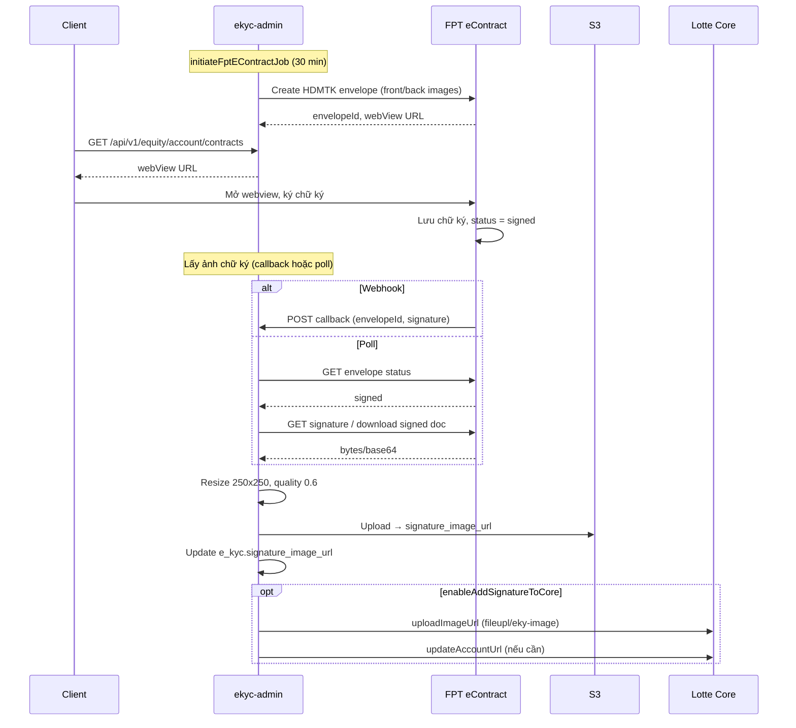

# eKYC: Luồng lấy ảnh chữ ký từ FPT eContract

**Mục đích:** Mô tả chi tiết cách ekyc-admin lấy ảnh chữ ký khách hàng từ FPT eContract và sử dụng trong luồng mở tài khoản.

**Nguồn:** Config ekyc-admin-prod.sh, EKYC_SCHEMA, API Addons. **Code ekyc-admin** (repo nhsv-dev) chưa có trong workspace — cần xác minh thêm tại repo đó.

---

## 1. Tổng quan

**Customer Signature Image** (ảnh chữ ký khách hàng) không được client upload trực tiếp trong form eKYC. Thay vào đó:

- Khách ký HĐĐT HDMTK trên **FPT eContract** (webview).
- **ekyc-admin** lấy ảnh chữ ký từ FPT sau khi hợp đồng được ký.
- Ảnh được resize, lưu, rồi gửi sang Lotte Core.

---

## 2. Config ekyc-admin liên quan đến chữ ký

### 2.1 Xử lý ảnh chữ ký

| Config | Giá trị | Ý nghĩa |
|--------|---------|---------|
| `resizeSignature.width` | 250 | Chiều rộng ảnh sau resize (px) |
| `resizeSignature.heigth` | 250 | Chiều cao ảnh sau resize (px) |
| `resizeSignature.quality` | 0.6 | Chất lượng nén (0–1) |
| `enableAddSignatureToCore` | true | Có gửi ảnh chữ ký sang Lotte hay không |

→ ekyc-admin **nhận ảnh chữ ký dạng dữ liệu** (bytes/base64), resize rồi mới lưu/gửi Lotte.

### 2.2 FPT eContract

| Config | Giá trị |
|--------|---------|
| Host | `https://econtract.fpt.com/app` |
| Template HDMTK | `flow_start_nhsv_create_econtract_from_template_integrate` |
| Client | `fpt_econtract_nhsv_integrate` |

### 2.3 Cron job

| Job | Cron | Chức năng (suy từ config) |
|-----|------|---------------------------|
| `eKycUpdateAccNumJob` | `0 */15 * * * ?` (15 phút) | Cập nhật số TK, có thể kèm sync chữ ký từ FPT |
| `initiateFptEContractJob` | `0 */30 * * * ?` (30 phút) | Tạo HDMTK trên FPT |

---

## 3. Luồng chi tiết (suy từ config + thông lệ tích hợp eContract)

### 3.1 Không có ảnh chữ ký lúc submit eKYC

```
Client → POST /api/v1/lotte/ekycs
         Body: frontImageUrl, backImageUrl, portraitImageUrl
         (KHÔNG có signatureImageUrl)
```

eKYC được submit, Lotte có thể tạo tài khoản tạm hoặc chờ bổ sung chữ ký sau.

### 3.2 Tạo và ký HĐĐT trên FPT

1. **initiateFptEContractJob** (cron 30 phút):
   - ekyc-admin gọi FPT: `flow_start_nhsv_create_econtract_from_template_integrate`
   - Truyền ảnh CMND (truoc.jpg, sau.jpg) từ `e_kyc`
   - FPT tạo envelope HDMTK
2. **Client**:
   - `GET /api/v1/equity/account/contracts` → webView URL (iframe FPT)
   - Mở webview, ký trên FPT (vẽ/viết chữ ký)
3. FPT lưu chữ ký trong envelope, `recipientStatus` → `"signed"`.

### 3.3 Các cách ekyc-admin có thể lấy ảnh chữ ký từ FPT

Có 3 kịch bản phổ biến. Cần xem code ekyc-admin để biết cách thực tế.

#### Cơ chế A: Webhook/callback của FPT

```
FPT eContract (envelope signed)
    → POST {callback_url} (đăng ký khi tạo envelope)
    → Payload: envelopeId, status, signatureImageUrl hoặc signatureBase64
    → ekyc-admin nhận, lưu DB, gửi Lotte
```

- FPT gọi URL callback khi envelope chuyển sang trạng thái đã ký.
- Payload thường có `envelopeId`, `status`, và dữ liệu chữ ký (URL hoặc base64).

#### Cơ chế B: Polling API FPT

```
eKycUpdateAccNumJob (mỗi 15 phút):
    1. Query danh sách envelope chưa xử lý
    2. Gọi FPT API: GET envelope status
    3. Nếu recipientStatus = "signed":
       - Gọi FPT API: download signed document hoặc get signature image
       - Nhận bytes/base64 → resize (250x250, quality 0.6)
       - Upload lên S3 → lưu signature_image_url
       - enableAddSignatureToCore → gửi Lotte update-account / uploadImageUrl
```

- ekyc-admin chủ động hỏi FPT theo chu kỳ.
- Khi phát hiện `signed`, gọi API tải tài liệu đã ký hoặc ảnh chữ ký.

#### Cơ chế C: Download PDF đã ký và trích xuất

```
1. FPT API: download signed PDF
2. ekyc-admin: parse PDF, extract signature image từ trang đã ký
3. Resize, lưu, gửi Lotte
```

- Phức tạp hơn, phụ thuộc cấu trúc PDF và khả năng FPT cung cấp API download.

### 3.4 Xử lý sau khi có ảnh chữ ký

```
Ảnh chữ ký (từ FPT)
    → resize 250x250, quality 0.6
    → Upload S3 → signature_image_url
    → Cập nhật e_kyc.signature_image_url
    → enableAddSignatureToCore = true
        → Gọi Lotte uploadImageUrl (fileupl/eky-image)
        → Gọi Lotte updateAccountUrl (nếu cần)
```

---

## 4. Sơ đồ luồng tổng hợp



---

## 5. Cần xác minh trong ekyc-admin (repo nhsv-dev)

| Câu hỏi | Gợi ý tìm kiếm trong code |
|---------|----------------------------|
| FPT có gọi callback không? | `callback`, `webhook`, `FptEContract`, `signed` |
| Job nào lấy chữ ký? | `eKycUpdateAccNumJob`, `resizeSignature`, `signature_image` |
| Feign client FPT dùng API gì? | `FptEcontractClient`, `getEnvelope`, `downloadSigned` |
| Cách lưu ảnh chữ ký? | `signature_image_url`, `uploadImage`, S3 |

---

## 6. Tham chiếu

- Config: `environment_configuration_prod/ekyc-admin/ekyc-admin-prod.sh`
- API contracts: `GET /api/v1/equity/account/contracts` — TradeX API Addons.yaml
- Lotte upload ảnh: `uploadImageUrl: .../fileupl/eky-image`
- DB: `e_kyc.signature_image_url` — EKYC_SCHEMA.html
