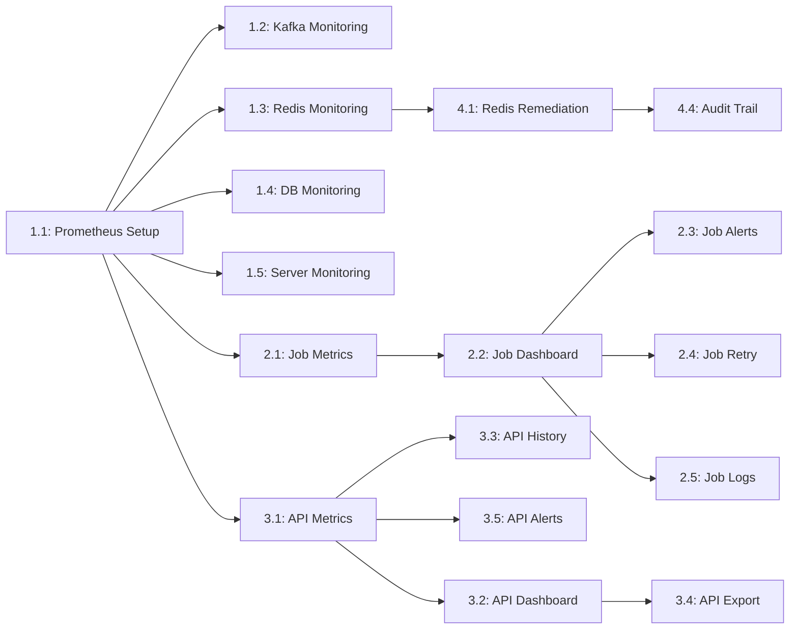

# TradeX Stability Monitor Tool - Sprint Breakdown

> [!IMPORTANT]
> This sprint plan assumes a 2-week sprint cycle with a team velocity of 20-25 story points per sprint (2-3 developers).

---

## Team Composition Assumptions

- **Backend Developers**: 2 (for metrics collection, exporters, remediation services)
- **DevOps Engineer**: 1 (for infrastructure setup, Prometheus/Grafana configuration)
- **Frontend Developer**: 0.5 (for dashboard creation, shared with other projects)

**Team Velocity**: 20-25 points/sprint

---

## Phase 1: Foundation (Sprints 1-3)

### Sprint 1: Infrastructure Setup & Kafka Monitoring
**Sprint Goal**: Establish monitoring infrastructure and implement Kafka monitoring

**Total Points**: 13

| Story ID | Story Name | Points | Assignee | Dependencies |
|----------|------------|--------|----------|--------------|
| 1.1 | Prometheus & Grafana Setup | 5 | DevOps | None |
| 1.2 | Kafka Cluster Monitoring | 8 | Backend + DevOps | 1.1 |

**Key Deliverables**:
- Working Prometheus + Grafana installation
- Kafka metrics flowing to Prometheus
- First Grafana dashboard (Kafka cluster)

**Risks & Mitigation**:
- **Risk**: Infrastructure provisioning delays
- **Mitigation**: Pre-provision VMs/containers before sprint starts

---

### Sprint 2: Redis, Database & Server Monitoring
**Sprint Goal**: Complete infrastructure monitoring coverage

**Total Points**: 15

| Story ID | Story Name | Points | Assignee | Dependencies |
|----------|------------|--------|----------|--------------|
| 1.3 | Redis Cache Monitoring | 5 | Backend + DevOps | 1.1 |
| 1.4 | Database Connection Monitoring | 5 | Backend + DevOps | 1.1 |
| 1.5 | Application Server Monitoring | 5 | DevOps | 1.1 |

**Key Deliverables**:
- Redis, Database, and Server dashboards
- Basic alerting for resource thresholds
- Complete infrastructure monitoring baseline

**Risks & Mitigation**:
- **Risk**: Database exporter compatibility issues
- **Mitigation**: Test exporters in dev environment before sprint

---

### Sprint 3: Job Metrics Collection & Dashboard
**Sprint Goal**: Implement job monitoring foundation

**Total Points**: 16

| Story ID | Story Name | Points | Assignee | Dependencies |
|----------|------------|--------|----------|--------------|
| 2.1 | Job Metrics Collection | 8 | Backend | 1.1 |
| 2.2 | Job Monitoring Dashboard | 8 | Backend + Frontend | 2.1 |

**Key Deliverables**:
- Custom job metrics exporter
- Job monitoring dashboard with status table
- Real-time job status visibility

**Risks & Mitigation**:
- **Risk**: Job instrumentation requires code changes to production jobs
- **Mitigation**: Implement feature flags for gradual rollout

---

## Phase 2: Job Monitoring & Management (Sprints 4-6)

### Sprint 4: Job Alerting & Retry Mechanism
**Sprint Goal**: Add job alerting and self-service retry capability

**Total Points**: 13

| Story ID | Story Name | Points | Assignee | Dependencies |
|----------|------------|--------|----------|--------------|
| 2.3 | Job Alerting Rules | 5 | Backend + DevOps | 2.1, 2.2 |
| 2.4 | Job Retry Mechanism | 8 | Backend | 2.2 |

**Key Deliverables**:
- Alert rules for job failures and anomalies
- Retry webhook endpoint
- Retry button in Grafana dashboard

**Risks & Mitigation**:
- **Risk**: Alert fatigue from too many notifications
- **Mitigation**: Fine-tune alert thresholds during sprint, implement alert grouping

---

### Sprint 5: Job Logs & API Instrumentation
**Sprint Goal**: Complete job monitoring with logs and start API monitoring

**Total Points**: 16

| Story ID | Story Name | Points | Assignee | Dependencies |
|----------|------------|--------|----------|--------------|
| 2.5 | Job Execution Logs | 8 | Backend + DevOps | 2.2 |
| 3.1 | API Metrics Instrumentation | 8 | Backend | 1.1 |

**Key Deliverables**:
- Loki deployment and log aggregation
- Job logs accessible from Grafana
- API metrics collection started

**Risks & Mitigation**:
- **Risk**: High log volume overwhelming Loki
- **Mitigation**: Implement log sampling and retention policies upfront

---

### Sprint 6: Real-Time & Historical API Dashboards
**Sprint Goal**: Deliver comprehensive API performance monitoring

**Total Points**: 16

| Story ID | Story Name | Points | Assignee | Dependencies |
|----------|------------|--------|----------|--------------|
| 3.2 | Real-Time API Performance Dashboard | 8 | Frontend + Backend | 3.1 |
| 3.3 | Historical API Analysis Dashboard | 8 | Frontend + Backend | 3.1 |

**Key Deliverables**:
- Real-time API dashboard with latency percentiles
- Historical analysis dashboard with trend views
- API performance baseline established

**Risks & Mitigation**:
- **Risk**: Dashboard performance issues with high cardinality metrics
- **Mitigation**: Use dashboard variables to limit query scope, implement metric aggregation

---

## Phase 3: API Reporting & Automation (Sprints 7-9)

### Sprint 7: API Reporting & Alerts
**Sprint Goal**: Complete API monitoring with reporting and alerting

**Total Points**: 10

| Story ID | Story Name | Points | Assignee | Dependencies |
|----------|------------|--------|----------|--------------|
| 3.4 | API Report Export | 5 | Frontend + Backend | 3.2, 3.3 |
| 3.5 | API Performance Alerts | 5 | Backend + DevOps | 3.1 |

**Key Deliverables**:
- CSV/Excel export functionality
- API performance alert rules
- Complete API monitoring suite

**Risks & Mitigation**:
- **Risk**: Export functionality limited by Grafana capabilities
- **Mitigation**: Build custom export service if needed

---

### Sprint 8: Redis Auto-Remediation
**Sprint Goal**: Implement automated Redis memory management

**Total Points**: 13

| Story ID | Story Name | Points | Assignee | Dependencies |
|----------|------------|--------|----------|--------------|
| 4.1 | High Redis Memory Auto-Remediation | 13 | Backend + DevOps | 1.3 |

**Key Deliverables**:
- Redis memory remediation service
- Automated cleanup triggered by alerts
- Remediation validation and rollback

**Risks & Mitigation**:
- **Risk**: Automated cleanup causes data loss
- **Mitigation**: Implement dry-run mode, extensive testing in staging, circuit breaker pattern

---

### Sprint 9: Remediation Audit Trail & Documentation
**Sprint Goal**: Complete remediation audit trail and project documentation

**Total Points**: 5

| Story ID | Story Name | Points | Assignee | Dependencies |
|----------|------------|--------|----------|--------------|
| 4.4 | Remediation Audit Trail | 5 | Backend + DevOps | 4.1 |

**Key Deliverables**:
- Audit trail dashboard
- Complete system documentation
- Runbook for operations team

**Risks & Mitigation**:
- **Risk**: Insufficient documentation for handoff
- **Mitigation**: Allocate time for documentation throughout sprints, not just at the end

---

## Future Sprints (Phase 4+)

### Sprint 10+: Advanced Automation (TBD)
**Stories**:
- 4.2: High Kafka Consumer Lag Auto-Remediation (TBD points)
- 4.3: Failed Init Job Auto-Retry (TBD points)

**Note**: These stories require further analysis and will be planned in future sprints.

---

## Sprint Velocity Tracking

| Sprint | Planned Points | Stories | Phase |
|--------|----------------|---------|-------|
| Sprint 1 | 13 | 2 | Foundation |
| Sprint 2 | 15 | 3 | Foundation |
| Sprint 3 | 16 | 2 | Foundation |
| Sprint 4 | 13 | 2 | Job Monitoring |
| Sprint 5 | 16 | 2 | Job Monitoring |
| Sprint 6 | 16 | 2 | Job Monitoring |
| Sprint 7 | 10 | 2 | API & Automation |
| Sprint 8 | 13 | 1 | API & Automation |
| Sprint 9 | 5 | 1 | API & Automation |
| **Total** | **117** | **17** | **3 Phases** |

**Timeline**: 18 weeks (4.5 months) for core functionality

---

## Cross-Sprint Dependencies

---

## Definition of Done (DoD)

Each story is considered "Done" when:

- [ ] Code implemented and peer-reviewed
- [ ] Unit tests written and passing (where applicable)
- [ ] Integration tests passing in staging environment
- [ ] Dashboard/exporter deployed to staging
- [ ] Metrics/logs flowing correctly
- [ ] Documentation updated (README, runbooks)
- [ ] Demo completed in sprint review
- [ ] Product Owner acceptance

---

## Sprint Ceremonies

### Sprint Planning (Day 1)
- Review sprint goal and stories
- Break down stories into tasks
- Assign stories to team members
- Identify dependencies and risks

### Daily Standup (Daily, 15 min)
- What did I complete yesterday?
- What will I work on today?
- Any blockers or dependencies?

### Sprint Review (Last Day, 1 hour)
- Demo completed stories
- Show dashboards and metrics
- Gather stakeholder feedback

### Sprint Retrospective (Last Day, 1 hour)
- What went well?
- What could be improved?
- Action items for next sprint

---

## Risk Management

### High-Priority Risks

| Risk | Impact | Probability | Mitigation |
|------|--------|-------------|------------|
| Production job instrumentation breaks existing functionality | High | Medium | Feature flags, gradual rollout, extensive testing |
| Prometheus storage capacity exceeded | High | Medium | Monitor disk usage, implement retention policies, plan for scaling |
| Alert fatigue from too many notifications | Medium | High | Fine-tune thresholds, implement alert grouping and deduplication |
| Team member unavailability | Medium | Medium | Cross-train team members, document tribal knowledge |
| Grafana performance issues with high-cardinality metrics | Medium | Medium | Use metric aggregation, limit dashboard query scope |

---

## Success Metrics (Per Sprint)

- **Sprint Velocity**: Actual vs planned story points
- **Dashboard Load Time**: < 2 seconds
- **Alert Accuracy**: > 90% (true positives)
- **Test Coverage**: > 80% for backend services
- **Documentation Completeness**: 100% of stories documented

---

## Post-Sprint 9 Roadmap

1. **Optimization Phase** (Sprint 10-11)
   - Performance tuning of dashboards
   - Alert threshold optimization
   - Cost optimization for storage

2. **Advanced Automation** (Sprint 12+)
   - Kafka consumer lag remediation
   - Job auto-retry mechanisms
   - Predictive alerting with ML

3. **Continuous Improvement**
   - User feedback incorporation
   - New metric additions
   - Dashboard enhancements

---

Document Status: 📋 | For: PM/Dev | Next Steps: Review nội dung, cập nhật status trên Tracking/tasks.js
