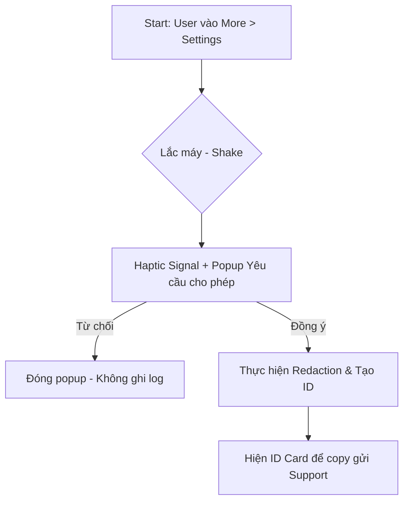
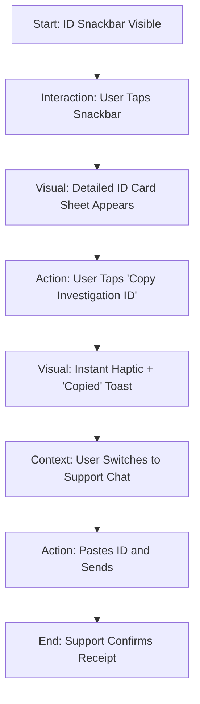

# UX Design Specification tradex-monitoring

**Author:** Ducnguyen
**Date:** 2026-01-23

---

## Executive Summary

### Project Vision
To provide a secure, high-fidelity capture mechanism that bridges the gap between user-reported issues and engineering reproduction, specifically tailored for the high-stakes Fintech trading environment.

### Target Users
*   **Active Traders:** Demand zero performance lag and absolute privacy.
*   **Customer Support:** Require high-speed lookup and clear status visibility.
*   **Product Engineers:** Depend on precise, chronologically accurate navigation and API sequences.

### Key Design Challenges
*   **Interface Non-Intrusion:** Designing triggers (Shake/Long-press) and notifications (Snackbar) that coexist with a dense trading UI.
*   **Trust Visibility:** Communicating on-device redaction and encryption to skeptical users via visual cues.
*   **Circular Buffer Management:** Ensuring the UX doesn't break if the 2MB local ceiling is reached during an active report.

### Design Opportunities
*   **Concierge Feedback:** Transforming "6-digit IDs" into premium-feeling support artifacts.
*   **Privacy-First Animations:** Reinforcing security through micro-interactions during the "redact-and-upload" phase.

## Core User Experience

### Defining Experience
The core experience is defined by the "Silent Watchdog" metaphor—an invisible layer of protection that activates only when needed, transforming a frustrating bug into a streamlined resolution event.

### Platform Strategy
Native mobile execution leveraging on-device haptics and motion sensors (accelerometers) on both iOS and Android. UI components (Snackbars) must use high-priority z-index but low-screen-real-estate footprint.

### Effortless Interactions
*   **Zero-Input Capture:** Automated log gathering upon gesture trigger.
*   **Automatic Sanitization:** Instant redaction of PII/Fintech data without user intervention.
*   **Self-Purging Buffer:** Seamless management of local storage within a strict 2MB ceiling.

### Critical Success Moments
*   **The Recognition:** Immediate haptic and visual confirmation that a crash or logic error was successfully "caught."
*   **The Receipt:** Presentation of the 6-digit Investigation ID, providing the user with a tangible asset to track their resolution.

### Experience Principles
*   **Unobtrusive Vigilance:** Active but invisible until triggered.
*   **Transparent Security:** Clearly communicating privacy at the moment of capture.
*   **Zero Latency Impact:** Ensuring capture never interferes with trading speed.

## Desired Emotional Response

### Primary Emotional Goals
*   **Unshakeable Trust:** Feeling that the system is a guardian of privacy, not a surveillance tool.
*   **Informed Relief:** The psychological comfort of knowing a complex, non-crash error is finally "trapped" and solvable.

### Emotional Journey Mapping
*   **Initial Discovery:** Cautious empowerment during the settings toggle.
*   **Active Capture (The Shake):** Satisfying tactile "capture" sensation (Surprise -> Action).
*   **Post-Capture:** Reassurance through visual transparency (The Redaction Shield).
*   **Support Hand-off:** Pride in providing high-quality diagnostic data (The Concierge Receipt).

### Micro-Emotions
*   **Security Affirmation:** The subtle "Shield" icon appearing during upload.
*   **Precision Confidence:** High-fidelity haptic pulses that mimic the "weight" of the data being captured.

### Design Implications
*   **Trust** → **UI Approach:** Use a "Redaction Progress" animation to show PII being removed in real-time.
*   **Confidence** → **UI Approach:** Use "Fintech-Blue" or "Audit-Green" color palettes for capture success to evoke professional bank-grade security.
*   **Simplicity** → **UI Approach:** Ensure the 6-digit ID is large and easy to read/tap-to-copy, reducing friction in high-stress support chats.

### Emotional Design Principles
*   **Privacy by Default:** Always assume the user is skeptical; prove the protection visually.
*   **Tactile Feedback:** Use haptics to Bridge the gap between digital "logs" and physical "evidence."
*   **Calm Professionalism:** Avoid loud or jarring "Success" colors; use muted, authoritative bank-grade tones.

## UX Pattern Analysis & Inspiration

### Inspiring Products Analysis
*   **Apple TestFlight:** Provides a "System-Internal" aesthetic that reduces anxiety about experimental features and establishes a professional tone.
*   **Signal Messenger:** Uses visible encryption markers (locks, shield icons) to turn complete technical security into simple emotional trust.
*   **Instabug:** Validates the "Shake-to-Report" gesture as a natural human response to UI frustration.

### Transferable UX Patterns
*   **OS-Level Styling:** Using modals and snackbars that mimic the native iOS/Android system UI to imply authority and stability.
*   **Data Masking Visualization:** Showing "******" for redacted fields, even in the summary, to prove privacy is active.
*   **2FA-Style Hand-offs:** Treat the 6-digit Investigation ID like a secure 2FA code (Large, Mono-spaced, Tap-to-copy).

### Anti-Patterns to Avoid
*   **Technical Information Overload:** Showing stack traces or raw headers to non-technical traders.
*   **Opaque Communication:** Uploading data in the background without a clear "Success" state or an opt-out cancel button.
*   **Gesture Overlap:** Mapping the "Shake" to an action that could be confused with a "Cancel Trade" or other destructive gesture.

### Design Inspiration Strategy
*   **Adopt:** The "System-Internal" visual language from TestFlight to establish a specialized, professional tone.
*   **Adapt:** Signal’s "Shield" indicators during the data-sanitization phase to visually satisfy the user's need for privacy.
*   **Avoid:** Raw data display; every "Log" shown to the user must be a high-level, human-readable summary.

## Design System Foundation

### 1.1 Design System Choice
**Platform Native (iOS SwiftUI/Android Jetpack Compose) with "Diagnostic" Extension.**

### Rationale for Selection
*   **Authority & Trust:** Using native system components (like standard iOS Snackbars) creates the psychological feeling of a "System Update" rather than a non-standard app feature. 
*   **Development Speed:** Leveraging system components (SF Symbols, Material Design 3) allows for rapid UI construction without reinventing fundamental accessibility or layout patterns.
*   **Monospace Differentiation:** By introducing a monospace typeface (e.g., SF Mono) for diagnostic data, we create a clear visual distinction between "Trading Data" and "Diagnostic Log Data."

### Implementation Approach
*   **iOS:** Use `SF Symbols 5+` for all visual markers (Shield, Lock, Shake). Use standard system Modal Sheets for the 6-digit ID presentation.
*   **Android:** Use `Material 3` with `Jetpack Compose`. Leverage system-level snackbars and native motion APIs for the shake gesture.

### Customization Strategy
*   **The "Audit" Palette:** Introduce a specialized sub-palette of "Audit Green" (#2E7D32) and "Secure Blue" (#1565C0) to color-code capture success and encryption states.
*   **Console Typography:** Use system monospaced fonts for FR1-FR11 output summaries, ensuring they look technically precise to both traders and support staff.

## 2. Core User Experience

### 2.1 Defining Experience: "Shake to Solve"
The centerpiece of the UX. A physical interaction that converts UI frustration into diagnostic evidence. It must feel like a "Physical Capture" of a digital glitch.

### 2.2 User Mental Model
Moving from "Manual Evidence Collection" to "Automated Flight Recording." The user treats the app like a transparent mechanism that can be "paused and inspected" upon a physical trigger.

### 2.3 Success Criteria
*   **The Instant Snap:** Visual and haptic confirmation of capture within 100ms.
*   **Visual Privacy Proof:** Clear UI feedback confirming that "Fintech-Secrets" are masked.
*   **Frictionless Export:** 1-tap copy of the 6-digit Investigation ID.

### 2.4 Novel UX Patterns
**The "Redaction Shield" Animation:** A novel visual pattern where the log blob is shown being passed through a "filter" or "shredder" that leaves only the safe diagnostic data. This fulfills the "Transparent Security" principle.

### 2.5 Experience Mechanics (Luồng Mới)
1.  **Entry:** Người dùng truy cập vào mục **More** -> **Settings**.
2.  **Initiation:** Lắc nhẹ thiết bị (Shake) khi đang ở trong màn hình Settings.
3.  **The Consent Popup (Xác nhận):** Một hộp thoại đơn giản hiện lên ngay lập tức:
    *   **Tiêu đề:** "Gửi báo cáo hỗ trợ?"
    *   **Nội dung:** "Chúng tôi sẽ thu thập các bước di chuyển gần đây và dữ liệu kỹ thuật để giúp kỹ sư sửa lỗi. Mọi thông tin cá nhân đều đã được ẩn đi."
    *   **Nút bấm:** [Hủy] | [Gửi & Xem ID]
4.  **Feedback:** Nếu bấm [Gửi], thiết bị rung nhẹ (Haptic) và hiện **Investigation ID Card**.

## Visual Design Foundation

### Color System
*   **Primary Theme:** "Deep Security" Slate and High-Contrast Emerald.
*   **Semantic Mapping:**
    *   **Success/Active:** Audit Green (#2E7D32) — Represents a secure, redacted state.
    *   **Action/Interaction:** Secure Blue (#1565C0) — Used for primary CTAs like "Copy ID."
    *   **Background:** Deep Slate (#0F172A) — Provides a professional, non-distracting foundation.
*   **Contrast:** WCAG 2.1 AA compliance (Minimum 4.5:1 ratio for all readable text).

### Typography System
*   **Headings & Navigation:** `Inter` (or System Sans) — Clean, professional, and rapid-glance legible.
*   **Diagnostic Data:** `SF Mono` / `Roboto Mono` — Monospaced font for all Log Strings and Investigation IDs to signify technical "Evidence."
*   **Type Scale:**
    *   **H1 (Bold):** 24px (Investigation ID Card)
    *   **Body (Regular):** 16px (Descriptions & Messages)
    *   **Caption (Mono):** 12px (Log Timestamps & Redacted Keys)

### Spacing & Layout Foundation
*   **8px Soft Grid:** All margins, padding, and component heights are multiples of 8px.
*   **Component Density:** High density for "Diagnostic Tables," but spacious hit targets (min 44px) for all primary actions (Toggle, Copy, Shake-Dismiss).
*   **Layout Principles:**
    *   **Z-Index Hierarchy:** Logging Snackbars must float at the top level with a `z-index: 9999`.
    *   **Non-Blocking Overlays:** Use translucent backgrounds for snackbars to maintain some context of the underlying trade data.

### Accessibility Considerations
*   **Color Blindness:** Use icons (Shield, Warning) alongside color cues for status.
*   **Haptic Feedback:** Mandatory haptic confirmation on all capture events as an alternative to visual-only indicators.
*   **VoiceOver Support:** All logging events must be announced to screen readers if the user is in an accessibility-enabled state.

## Design Direction Decision

### Design Directions Explored
*   **Mission Control:** A system-native approach focusing on OS-level authority and trust.
*   **Cyber Shield:** A high-visibility security theme emphasizing the "Redaction Layer" through glows and pulses.
*   **Minimalist Watchdog:** A compact, non-blocking execution optimized for professional traders who need zero distractions.

### Chosen Direction
**Direction 1 (Mission Control) with Direction 2's "Shield" micro-animations.**

### Design Rationale
We chose the **Mission Control** aesthetic because it leverages the user's existing trust in the mobile OS (Apple/Google). By adding **Cyber Shield's** redaction micro-animations, we provide visual proof of privacy without the jarring screen pulses of Direction 2.

### Implementation Approach
*   **Foundational Layer:** Use standard HIG (iOS) and Material 3 (Android) layout structures.
*   **Interaction Layer:** 800ms "Redaction Shield" animation upon successful capture before showing the ID card.
*   **Export Layer:** High-contrast Secure Blue (Crayola-style) buttons for the "Copy Investigation ID" action.

## User Journey Flows

### Journey 1: The Support-Guided Report (Xác nhận rõ ràng)
Người dùng gặp sự cố và được nhân viên hỗ trợ hướng dẫn vào mục Cài đặt để gửi log.

### Journey 2: The Support Hand-off
Designing the high-speed transfer of diagnostic data to the support team.

### Journey Patterns
*   **The Impact Snackbar:** A native-style notification that uses depth (shadows) and system-authority styling to stand out from the app's trading data.
*   **Tap-to-Copy:** Standardizing the 6-digit ID as a mono-spaced, high-legibility string that copies instantly upon a single tap.

### Flow Optimization Principles
*   **0-Input Redaction:** Removing all manual user steps for privacy. The "Shield" provides the feeling of protection without requiring the user to do anything.
*   **Frictionless Export:** Ensuring the ID is ready for the support conversation with zero typing.

## Component Strategy

### Design System Components
*   **iOS (SwiftUI):** `NavigationStack`, `Sheet`, `HStack`, `VStack`, `Label`, `Button`, `Toggle`, `TextEditor`.
*   **Android (Compose):** `Scaffold`, `ModalBottomSheet`, `Row`, `Column`, `Icon`, `TextButton`, `Snackbar`, `TextField`.

### Custom Components

### 🛡️ The Impact Snackbar
*   **Purpose:** To provide immediate, high-authority feedback upon capture.
*   **Usage:** Automatically appears at the top of the viewport after a physical shake is detected.
*   **Anatomy:** [Icon (Shield/Success)] + [Mono Title: Capture ID] + [Body: Redacting...] + [Progress Pulse Indicator].
*   **States:** Default (Invisible), Active (Animating), Success (Checkmark), Error (Warning).
*   **Interaction Behavior:** Non-blocking; tapping expands into the full "Investigation ID Card" Sheet; swiping up dismisses.

### 💳 The Investigation ID Card
*   **Purpose:** To serve as the "Receipt" or "Flight Record" asset for the user to share with support.
*   **Usage:** Displayed as a system Modal Sheet (iOS) or Bottom Sheet (Android) upon tapping the Snackbar.
*   **Anatomy:** [Header: Private Flight Record] + [Investigation ID: 123-456 (Mono)] + [Body: 50 Nav Events / Redacted API Traffic] + [Action: Copy to Clipboard].
*   **Accessibility:** ARIA live region for status updates; Large touch target (min 64px height) for the Copy button.
*   **Interaction Behavior:** Tapping the ID string or the CTA button copies the 6-digit code and shows a confirmation toast.

### 🔄 The Shield Animation Overlay
*   **Purpose:** To provide visual proof of data sanitization (Redaction).
*   **Usage:** Overlays the "Log Blob" icon within the Snackbar during the 1-second sanitization phase.
*   **Anatomy:** A translucent, glowing "Scanning Beam" that passes over redacted fields.

### Component Implementation Strategy
*   **Foundation:** Inherit all baseline tokens (spacing, corner radius) from the native HIG/Material system.
*   **Diagnostic Layers:** Use a specific "Monospace Overlay" class for diagnostic text components.
*   **The "Audit" Success Token:** Apply `#2E7D32` (Audit Green) specifically to the Success states of custom components to unify the "Safety" feeling.

### Implementation Roadmap

**Phase 1 - Core Components:**
*   **The Impact Snackbar** - needed for Journey 1 (Magic Moment).
*   **The Investigation ID Card** - needed for Journey 2 (The Hand-off).

**Phase 2 - Supporting Components:**
*   **The Shield Animation Overlay** - enhances the "Trust" emotional goal.
*   **Monospace Type Scale** - supports the "Diagnostic" mental model.

## UX Consistency Patterns

### Feedback Patterns
*   **Success (Redacted):** Use Audit Green (#2E7D32) and a "Checkmark Shield" icon. Accompanied by a crisp, high-pitch haptic "tink."
*   **Progress (Redacting):** Use a subtle, pulsing animation on the Snackbar's border. No vibration during progress to avoid "noise."
*   **Error (No Logs):** Use a standard System Warning icon and a "Low-Thud" haptic pulse. Provide a clear "Retry" button.

### Modal & Overlay Patterns
*   **The "Contextual Tray":** All detailed logs (Investigation ID Card) must open in a Bottom Sheet (75% height). This allows the user to see the top-most trading chart or ticker while they copy their ID.
*   **Non-Blocking Snackbars:** Snackbars must be floating (not pinned to edges) and have a 20% Background Blur (Glassmorphism) to maintain visual continuity with the underlying app.

### Haptic Signatures
*   **Trigger Signature:** A unique "Heartbeat" pulse (Short-Long) upon successful Gesture Detection.
*   **Completion Signature:** A single, sharp "Impact" pulse upon successful ID generation and clipboard copy.

### Button Hierarchy
*   **Primary Action:** Secure Blue (#1565C0) - Used for "Copy ID" or "Report Issue."
*   **Secondary Action:** Outline Ghost - Used for "Dismiss" or "View Log Summary."
*   **Destructive Action:** System Red - Used for "Clear Buffer" or "Disable Monitoring."

### Empty & Loading States
*   **Empty Buffer:** Display a 🛡️ "Watchdog Active" icon with a subtitle: "No issues detected in the last session."
*   **Loading Logs:** Use a "Monospace Spinner" (ASCII-style | / - \) to maintain the technical diagnostic tone.

## Responsive Design & Accessibility

### Responsive Strategy
*   **Core Principle:** "Non-Blocking Density."
*   **Mobile Adaptation:** Use standard system Snackbars and Bottom Sheets. The "Redaction Shield" animation should stay within the top safe area.
*   **Tablet Adaptation:** Use a Modal Dialog (Width: 400px) instead of a full-width bottom sheet to preserve lateral context for trading charts.
*   **Breakpoint:** Single breakpoint at 768px to pivot from Bottom Sheet to Modal Dialog.

### Accessibility Strategy
*   **Compliance Target:** WCAG 2.1 Level AA.
*   **Assistive Interactions:**
    *   **Motion Sensors:** Provide a "Trigger Button" in the Settings menu as an alternative to the Shake gesture for users with limited mobility.
    *   **Screen Readers:** Use UIAccessibilityAnnouncement (iOS) and AnnounceProperty (Android) for capture completion.
    *   **Contrast Audit:** Force high-contrast borders on the Investigation ID card if the system accessibility flag is on.

### Testing Strategy
*   **Device Matrix:** iPhone 13 mini (small screen) up to iPad Pro 12.9 (large screen).
*   **A11y Tools:** Use Accessibility Inspector (XCode) and TalkBack (Android) for voice validation.
*   **Motion Testing:** Test the "Shake" sensitivity across diverse user populations to prevent false positives during intense trading gestures.

### Implementation Guidelines
*   **Relative Units:** Use dynamic types (iOS) and sp (Android) for all typography.
*   **Semantic Roles:** Map the Investigation ID to a "Selectable Content" role.
*   **Focus Management:** Move the screen focus to the Bottom Sheet immediately upon expansion to allow for keyboard/voice-over navigation.

## App Store & Play Store Compliance (CHÍNH SÁCH)

### ⚖️ Google & Apple Guidelines
Để tránh việc ứng dụng bị từ chối, thiết kế áp dụng các nguyên tắc sau:

*   **Prominent Disclosure (Minh bạch):** Việc thu thập log không được diễn ra âm thầm. Popup xác nhận xuất hiện ngay sau khi lắc máy là chứng minh về sự minh bạch đối với cả người dùng và đội ngũ xét duyệt ứng dụng.
*   **Explicit Consent (Sự đồng ý):** Người dùng phải chủ động bấm "Cho phép và Gửi" thì dữ liệu mới được xử lý.
*   **Data Minimization:** Giải thích rõ trong popup rằng thông tin cá nhân (PII) đã được tự động loại bỏ (Redactor Engine).
*   **User Control:** Người dùng có thể thoát ra bất cứ lúc nào bằng nút "Bỏ qua" mà không bị ép buộc gửi dữ liệu.

### 📝 Nội dung Popup (Giao diện đơn giản)
*   **Heading:** Hỗ trợ kỹ thuật.
*   **Body:** "Chúng tôi cần xem các bước thao tác gần đây để tìm nguyên nhân lỗi. Dữ liệu nhạy cảm như mật khẩu hay số dư sẽ được ẩn hoàn toàn trước khi gửi đi."
*   **Primary CTA (Màu xanh/đen):** "Cho phép và Gửi"
*   **Secondary CTA (Màu xám/văn bản):** "Bỏ qua"
