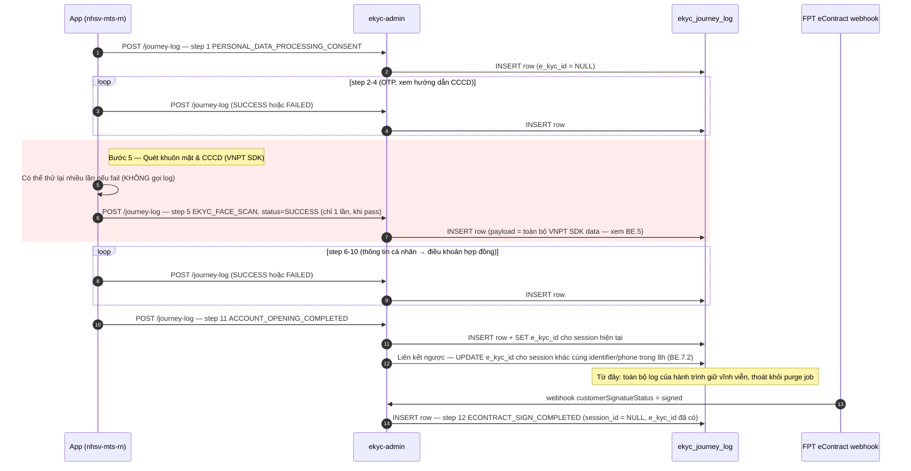
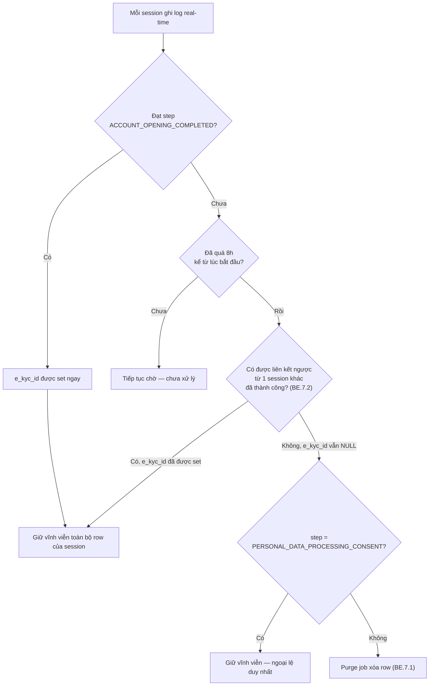
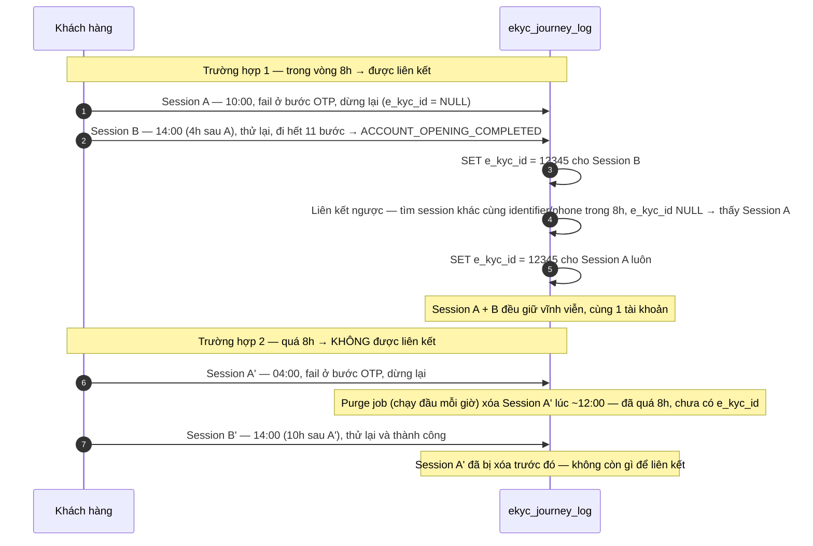

# Tech Spec: eKYC Scope 1 — Nhật ký Hành trình Mở tài khoản (Journey Log)

**For:** FE Dev (nhsv-mts-rn) + BE Dev (ekyc-admin) — 1 tài liệu kỹ thuật duy nhất, thay thế `Specifications/BE_Spec.md` + `Issues/BE_Issue.md` + `Issues/FE_Issue.md` (gộp 2026-07-20, theo yêu cầu PO giảm phân mảnh — cả FE và BE cùng đọc 1 file)
**Service:** `ekyc-admin` (Java / JHipster) | **App:** NHSV Pro (`nhsv-mts-rn`)
**Version:** 4.0 | **Date:** 2026-07-20
**PRD liên quan:** `Planning/PRD.md` (mục 4 — Yêu cầu nghiệp vụ; PRD chỉ nêu "làm gì" ở mức business, tài liệu này nêu "làm thế nào" ở mức kỹ thuật)

---

## 0. Bối cảnh & User Story

Khi có tranh chấp, audit compliance, hoặc điều tra gian lận về một tài khoản mở qua eKYC, hiện không có cách nào tái dựng lại chính xác những gì khách hàng đã thấy/xác nhận ở từng bước trong hành trình — nhiều dữ liệu này chỉ tồn tại tạm thời trên App (qua VNPT SDK hoặc local state) và không được gửi lên hệ thống nào (`CustomEKycService.java:211` xóa record cũ khi user retry).

> As a compliance/audit officer, tôi muốn có một bản ghi đầy đủ, theo từng bước, của mọi hành trình mở tài khoản thành công — bao gồm cả kết quả xác thực khuôn mặt/CCCD (VNPT) và các field chỉ tồn tại ở local state App (occupation, tax code, toàn văn điều khoản đã đồng ý) — để có thể tái dựng chính xác những gì khách hàng đã thấy/xác nhận nếu có tranh chấp hoặc audit từ cơ quan quản lý.

**Trước 2026-07-20**, đây là 2 luồng độc lập: **01 Biometric Attempt Log** (ghi mọi lần thử xác thực khuôn mặt/CCCD kể cả fail, append-only, giữ vĩnh viễn) và **07 Compliance Journey Log** (ghi 11 bước hành trình, chỉ giữ nếu thành công). PRD v4.0 (mục 4) chốt lại: **gộp thành 1 luồng duy nhất** — vì mục tiêu thật sự là bằng chứng hành trình mở tài khoản, không phải phân tích/thống kê thất bại biometric. **Thay đổi cốt lõi:** bước xác thực khuôn mặt/CCCD (VNPT) giờ **chỉ ghi log khi thành công** — đảo ngược quyết định append-only đã chốt trước đó cho 01; đây là đánh đổi PM đã chấp nhận (PRD mục 4.3).

---

## 1. Kiến trúc tổng quan

```
App (nhsv-mts-rn) → mỗi khi khách hoàn tất 1 trong 11 bước đầu (xem Section 2)
       │
       ▼
POST /api/v1/ekycs/journey-log   (service: ekyc-admin)
       │  body: { sessionId, phoneNo?, identifierId?, step, status, payload }
       ▼
Ghi real-time, 1 row / 1 lần gọi, vào bảng ekyc_journey_log
       │
       ├─ Step EKYC_FACE_SCAN: App CHỈ gọi khi VNPT xác thực thành công — không gọi cho các lần thử fail (PRD mục 4.2)
       │
       ├─ Khi step = ACCOUNT_OPENING_COMPLETED:
       │     1. session hiện tại được giữ vĩnh viễn từ đây (set e_kyc_id)
       │     2. liên kết ngược mọi session trước đó (retry fail, cùng identifier_id/phone_no,
       │        trong vòng 8h) về cùng e_kyc_id — xem BE.7
       │
       ▼
Scheduled job (mỗi giờ) → xóa toàn bộ row của session nào
   quá 8h (EKYC_SESSION_ID_EXPIRE_TIME, xem ekyc-admin Constants.java:235)
   vẫn chưa có e_kyc_id (chưa thành công, và chưa được liên kết ngược)

─────────────────────────────────────────────────────────────

FPT eContract webhook → EContractCustomServiceImpl.getEContractStatus()
   (đã tồn tại — service nhận callback ký hợp đồng từ FPT)
       │  khi customerSignatueStatus chuyển "signed"
       ▼
Backend TỰ ghi thêm 1 row step = ECONTRACT_SIGN_COMPLETED
   (khóa liên kết: e_kyc_id, không qua App, không qua endpoint trên)

─────────────────────────────────────────────────────────────

Khi cần tra soát (compliance/audit) → chạy export tool (BE.8)
   → query DB theo sessionId/identifierId/eKycId → sinh file HTML tĩnh
```

**Vì sao 2 cơ chế ghi khác nhau trong cùng 1 bảng:**

| | 11 step đầu (App-facing) | `ECONTRACT_SIGN_COMPLETED` |
|---|---|---|
| Ai ghi | App gọi API | Backend tự ghi |
| Vì sao | Data chỉ tồn tại ở local state App (form chưa submit) hoặc SDK VNPT (chưa qua API nghiệp vụ nào) | Nguồn dữ liệu là webhook FPT — single source of truth, không phụ thuộc App còn mở hay không, thiết bị nào |
| Khóa liên kết | `sessionId` (App generate) + `identifier_id`/`phone_no` (để liên kết chéo session) | `e_kyc_id` (đã có ổn định từ lúc `ACCOUNT_OPENING_COMPLETED`, không phụ thuộc session/device) |

### 1.1 Sequence Diagram — 1 hành trình từ đầu tới cuối



---

## 2. Danh sách 12 step

> Step `EKYC_FACE_SCAN` (VNPT xác thực khuôn mặt/CCCD) là step **duy nhất** áp dụng quy tắc "chỉ ghi khi thành công" (PRD mục 4.2) — 11 step còn lại vẫn ghi cả khi thất bại (`status: FAILED`).

| # | `step` | Ai ghi | Ghi log khi nào | Ghi chú |
|---|---|---|---|---|
| 1 | `PERSONAL_DATA_PROCESSING_CONSENT` | App | Khách tick checkbox | Đồng ý xử lý dữ liệu cá nhân — màn hình đầu tiên, ngay sau khi nhập SĐT, trước khi gửi OTP. **Giữ vĩnh viễn**, không bị purge dù session bỏ dở (ngoại lệ duy nhất — xem BE.7) |
| 2 | `EKYC_SEND_OTP` | App | Thành công hoặc thất bại | Gửi OTP xác thực SĐT |
| 3 | `EKYC_VERIFY_OTP` | App | Thành công hoặc thất bại | Xác thực OTP |
| 4 | `GO_TO_ID_CARD_GUIDE` | App | Khách xem xong hướng dẫn | Khách xem hướng dẫn chụp CCCD; nhập SĐT/email/nationality/occupation |
| 5 | `EKYC_FACE_SCAN` | App | **CHỈ khi VNPT xác thực thành công** | Toàn bộ kết quả VNPT SDK (OCR, liveness, face-compare) — kể cả base64 ảnh. Payload chi tiết + gotcha field mapping: xem BE.5. Các lần thử fail của riêng bước này **không được gửi/lưu** |
| 6 | `PERSONAL_INFORMATION` | App | Thành công hoặc thất bại | Thông tin cá nhân xác nhận (birth_dt, address, FATCA...) |
| 7 | `ACCOUNT_INFORMATION` | App | Thành công hoặc thất bại | Loại tài khoản, chi nhánh, margin/derivative flags |
| 8 | `BANK_INFORMATION` | App | Thành công hoặc thất bại | Tài khoản ngân hàng nhận tiền |
| 9 | `INVESTMENT_INFORMATION` | App | Thành công hoặc thất bại | Mục tiêu đầu tư, khẩu vị rủi ro |
| 10 | `TERMS_AND_CONDITIONS_CONFIRMATION` | App | Khách tick đồng ý | Đồng ý điều khoản hợp đồng — gửi kèm toàn văn nội dung điều khoản |
| 11 | `ACCOUNT_OPENING_COMPLETED` | App | Hồ sơ được xác nhận đã nhận | **Mốc chốt "thành công"** — session được giữ vĩnh viễn kể từ đây, kích hoạt liên kết ngược (BE.7). Không phụ thuộc việc ký hợp đồng hay nhân viên duyệt hồ sơ sau đó |
| 12 | `ECONTRACT_SIGN_COMPLETED` | **Backend** (webhook FPT) | Khi FPT xác nhận ký xong | Xem BE.6 |

> Các API query thuần túy của luồng eKYC cũ (bank list, branch list, partner validate, econtract URL polling) **không** log riêng ở tầng này — không phải hành động compliance-relevant của khách hàng, chỉ là dữ liệu hỗ trợ màn hình.
>
> **Payload cho `PERSONAL_DATA_PROCESSING_CONSENT`**: `{ isAgree: true, phoneNo }` là đủ — không cần gửi toàn văn/version điều khoản (khác với step `TERMS_AND_CONDITIONS_CONFIRMATION`).

---

## 3. Quy tắc nghiệp vụ chung (FE + BE đều cần biết)

- **Mốc "thành công" là khi hồ sơ mở tài khoản được hệ thống xác nhận đã nhận** — **không phải** khi khách ký hợp đồng, và **không phải** khi nhân viên duyệt hồ sơ lần cuối. Nếu sau đó hồ sơ bị nhân viên từ chối, log hành trình **vẫn được coi là thành công** theo định nghĩa này và giữ lại vĩnh viễn.
- **Bước xác thực khuôn mặt/CCCD (VNPT) chỉ ghi log khi verification thành công** — các lần thử thất bại của riêng bước này (ảnh mờ, không xác thực được khuôn mặt...) **không được lưu lại dưới bất kỳ hình thức nào**. Đây là đảo ngược có chủ đích so với thiết kế cũ (từng giữ mọi lần thử kể cả fail, vĩnh viễn) — đánh đổi đã được PM chấp nhận (PRD mục 4.3): mất khả năng phân tích khách "kẹt" ở bước nào trong xác thực biometric, đổi lấy đơn giản hóa lưu trữ và giảm rủi ro PDPD.
- **Hành trình không đạt mốc "thành công" trong vòng 8 giờ kể từ lúc bắt đầu** → toàn bộ log của hành trình đó bị xóa hoàn toàn — **trừ** khi hành trình đó đã được liên kết (xem BE.7), và **trừ** bước đồng ý xử lý dữ liệu cá nhân (luôn giữ vĩnh viễn dù hành trình bỏ dở).
- **Liên kết ngược khi thành công:** ngay khi 1 hành trình đạt mốc "thành công", hệ thống tìm mọi hành trình khác của cùng khách hàng (cùng CCCD hoặc cùng SĐT) phát sinh trong vòng 8 giờ trước đó mà chưa được liên kết với tài khoản nào — liên kết toàn bộ về cùng tài khoản vừa mở thành công, để chúng không bị job xóa tự động loại bỏ.
- **Việc ghi log không được làm chậm hoặc chặn luồng chính mở tài khoản của khách** — đây là instrumentation nền, khách hàng không nhìn thấy và không bị ảnh hưởng nếu việc ghi log gặp lỗi.
- **Không kiểm tra tính hợp lệ nội dung nghiệp vụ của dữ liệu App gửi lên** — hệ thống chỉ lưu lại đúng nguyên trạng những gì App gửi, không đánh giá đúng/sai của từng field bên trong (kể cả payload của bước xác thực khuôn mặt/CCCD — BE không parse, không validate field VNPT).

---
---

# Phần FE — App (nhsv-mts-rn)

## FE.1 Yêu cầu chức năng

App gọi API `POST /api/v1/ekycs/journey-log` ngay khi khách hoàn tất mỗi bước dưới đây. Mọi lần gọi dùng chung 1 `sessionId` do App tự sinh khi khách bắt đầu hành trình, giữ nguyên xuyên suốt tới bước cuối.

1. **Đồng ý xử lý dữ liệu cá nhân** — màn hình đầu tiên của luồng eKYC, ngay sau khi khách nhập SĐT, **trước khi App gửi OTP**. Hiển thị checkbox "Tôi đã đọc và đồng ý với nội dung Điều khoản và điều kiện xử lý dữ liệu cá nhân của Công ty TNHH Chứng khoán NH Việt Nam". Đây là consent **hoàn toàn khác** với bước 10 (điều khoản hợp đồng mở TK) — không gộp, không dùng lại state của bước 10. Yêu cầu này xuất phát từ PDPD (Nghị định 13/2023 về bảo vệ dữ liệu cá nhân — giải thích chi tiết ở PRD mục 6): phải xin đồng ý **trước khi** thu thập bất kỳ dữ liệu CCCD/sinh trắc học nào.
2. **Gửi OTP xác thực SĐT** — ngay sau khi App gửi OTP thành công. Log cả khi thất bại (`status: FAILED`).
3. **Xác thực OTP** — ngay sau khi khách nhập mã OTP. Log cả khi thất bại.
4. **Xem hướng dẫn chụp CCCD** — sau khi khách đã nhập SĐT, email, quốc tịch, nghề nghiệp và xem xong hướng dẫn — gửi kèm toàn bộ các field này.
5. **Quét khuôn mặt & CCCD — CHỈ gọi log khi VNPT xác thực thành công.** Khác với các bước còn lại (2, 3, 6-11), bước này **không log khi thất bại** — khách có thể phải quét lại nhiều lần trước khi đạt yêu cầu (ảnh mờ, không xác thực được khuôn mặt...), nhưng App **không gọi API log** cho bất kỳ lần thử thất bại nào của riêng bước này. Chỉ khi VNPT trả kết quả **thành công**, App mới gọi log 1 lần, gửi kèm **toàn bộ** dữ liệu SDK VNPT trả về (OCR, liveness, face compare, fraud detection) bao gồm cả ảnh (base64), không lọc bớt field nào. Payload chi tiết: xem BE.5.
6. **Xác nhận thông tin cá nhân** — sau khi khách xác nhận ngày sinh, địa chỉ, thông tin FATCA... Log cả khi thất bại.
7. **Thông tin tài khoản** — loại tài khoản, chi nhánh, các cờ margin/phái sinh khách chọn. Log cả khi thất bại.
8. **Thông tin ngân hàng** — tài khoản ngân hàng nhận tiền khách khai. Log cả khi thất bại.
9. **Thông tin đầu tư** — mục tiêu đầu tư, khẩu vị rủi ro khách chọn. Log cả khi thất bại.
10. **Xác nhận điều khoản hợp đồng** — ngay khi khách tick "Tôi đã đọc và đồng ý" — gửi kèm **toàn văn** nội dung điều khoản khách đã đọc, không chỉ trạng thái đồng ý.
11. **Hoàn tất mở tài khoản** — mốc cuối cùng của hành trình, đánh dấu hành trình đã thành công. Đây là bước gửi hồ sơ hoàn chỉnh — chưa phải bước ký hợp đồng.

**Không cần App xử lý gì thêm cho bước ký hợp đồng điện tử** — bước này (`ECONTRACT_SIGN_COMPLETED`) do BE tự ghi nhận qua webhook FPT khi khách ký xong, độc lập với phiên làm việc của App.

## FE.2 Business rule riêng bước 1 & bước 5

**Bước 1 — đồng ý xử lý dữ liệu cá nhân:**
- Checkbox **chưa tick** → nút "Tiếp theo" phải ở trạng thái **disabled** (xem mockup PM cung cấp). Chỉ enable khi khách đã tick.
- Khác với các bước còn lại (chỉ log, không chặn luồng), bước này **là điều kiện chặn** để qua màn kế — nhưng việc **gọi log** vẫn áp dụng đúng rule chung: gọi ngay sau khi khách tick + bấm "Tiếp theo", không block chờ log trả response trước khi chuyển màn.
- Payload chỉ cần ghi nhận việc khách đã tick — `{ isAgree: true, phoneNo }` là đủ, **không cần** gửi kèm toàn văn/version nội dung điều khoản (khác với bước 10 — 2 bước có yêu cầu payload khác nhau, không áp dụng chung 1 rule).
- **Bằng chứng consent này được BE giữ vĩnh viễn**, không bị xóa dù hành trình sau đó bỏ dở — App không cần xử lý gì thêm cho việc này, chỉ cần đảm bảo gọi log đúng 1 lần khi khách tick.

**Bước 5 — quét khuôn mặt & CCCD:**
- **Không gọi API log cho các lần thử thất bại** — nếu VNPT trả kết quả không đạt (OCR lỗi, liveness fail, face compare không khớp...), App xử lý theo luồng UX hiện tại (cho khách thử lại), **không** gọi `journey-log` cho lần thử đó.
- Chỉ khi VNPT xác thực **thành công**, App gọi `journey-log` đúng 1 lần cho bước này, gửi kèm toàn bộ dữ liệu SDK đã nhận được (không chỉ của lần thử cuối — nếu SDK có tích lũy dữ liệu qua nhiều lần thử, gửi dữ liệu của lần thử thành công).
- Ảnh CCCD (base64) và toàn bộ log key SDK (OCR, liveness, face compare) đều gửi kèm, nguyên văn — không tự lọc/rút gọn field.

## FE.3 Business rule chung

- **Không chặn luồng chính:** việc gọi log không được làm chậm hoặc chặn luồng chính mở tài khoản — không hiển thị loading chờ log hoàn tất, không rollback bước hiện tại nếu request log thất bại.
- **Log cả khi bước thất bại (trừ bước 5):** nếu 1 bước thất bại (khách nhập sai, hệ thống trả lỗi...), App vẫn phải gọi log cho bước đó với `status: FAILED` — mục tiêu là ghi lại toàn cảnh, kể cả chỗ khách bị chặn lại. Ngoại lệ duy nhất là bước 5.
- **Retry khi mất kết nối mạng giữa chừng:** áp dụng cho **tất cả các bước** — nếu request log thất bại do mất kết nối mạng (không phải do BE trả lỗi nghiệp vụ), App phải **tự động retry** gửi lại log đó sau đó (không bỏ qua vĩnh viễn), để không mất dữ liệu compliance/audit. Retry chạy nền, không hiển thị gì cho khách, không chặn khách tiếp tục luồng chính. Chi tiết cơ chế retry (số lần, thời điểm) do FE Lead quyết định khi implement, miễn đảm bảo log cuối cùng vẫn tới được BE.

## FE.4 Acceptance Criteria

- [ ] App sinh 1 `sessionId` duy nhất khi bắt đầu hành trình mở tài khoản, dùng xuyên suốt cho tới bước cuối cùng (không đổi giữa chừng).
- [ ] Các bước 1-4, 6-11 gọi log đúng thời điểm ngay sau khi bước đó hoàn tất (thành công hoặc thất bại).
- [ ] Bước 5 (quét khuôn mặt & CCCD): **không** gọi log cho bất kỳ lần thử thất bại nào — verify bằng cách để 1 khách thử fail 2-3 lần trước khi pass, tra log chỉ thấy đúng 1 lần gọi cho bước này (lần pass).
- [ ] Bước 5 khi thành công: gửi kèm đầy đủ ảnh (base64) và toàn bộ dữ liệu SDK trả về, không cắt bớt field.
- [ ] Màn hình đồng ý xử lý dữ liệu cá nhân: nút "Tiếp theo" ở trạng thái disabled khi checkbox chưa tick; enable ngay khi khách tick.
- [ ] Khách tick checkbox đồng ý xử lý dữ liệu cá nhân → App gọi log step `PERSONAL_DATA_PROCESSING_CONSENT` — verify được bằng cách tra thấy đúng 1 row cho step này, `status = SUCCESS`.
- [ ] Bước Xác nhận điều khoản hợp đồng (bước 10) gửi kèm toàn văn nội dung điều khoản khách đã đọc, không chỉ cờ đồng ý.
- [ ] Việc gọi log không gây chậm trễ hoặc gián đoạn cảm nhận được cho khách hàng ở bất kỳ bước nào.
- [ ] QA verify được: sau khi 1 khách mở tài khoản thành công, tra được đầy đủ log của cả 11 bước App-facing tương ứng đúng `sessionId`, đúng thứ tự thời gian.
- [ ] App không còn gọi `POST /ekycs/attempt-log` ở bất kỳ đâu trong code — verify bằng code review/grep, API này đã bị xóa khỏi BE.

## FE.5 Cần confirm thêm

- [ ] FE Lead xác nhận effort thực tế cần sửa bao nhiêu màn hình (BE ước tính ~10-11 màn, đã tính cả màn hình mới PDPD consent).
- [ ] PDPD/compliance xác nhận việc gửi ảnh sinh trắc học (base64) qua log có cần thêm biện pháp bảo vệ gì ở tầng App (ví dụ: chỉ gửi qua kết nối đã xác thực) hay không — xem giải thích PDPD ở PRD mục 6.
- [ ] Xác nhận link/văn bản chính xác của "Điều khoản và điều kiện xử lý dữ liệu cá nhân" để App hiển thị đúng trên màn hình (chỉ cần cho UI hiển thị — payload log không cần gửi kèm).

---
---

# Phần BE — Service ekyc-admin

## BE.1 Yêu cầu chức năng

1. **Ghi lại từng bước của hành trình mở tài khoản** — mỗi khi khách hoàn tất 1 trong 11 bước đầu (danh sách đầy đủ ở Section 2), hệ thống nhận và lưu lại **toàn bộ** thông tin khách đã thấy/nhập tại đúng bước đó, kể cả khi bước đó thất bại — không tóm tắt, không lọc field.
2. **Riêng bước xác thực khuôn mặt/CCCD (VNPT) — chỉ nhận log khi thành công.** Đây là bước duy nhất trong 11 bước áp dụng quy tắc này. Khi thành công, lưu đầy đủ dữ liệu VNPT trả về, không lọc bớt field, bao gồm các tín hiệu chống gian lận.
3. **Tự động ghi nhận thời điểm khách ký hợp đồng điện tử** — bước cuối, hệ thống tự ghi nhận ngay khi đối tác FPT xác nhận khách đã ký xong, không cần App gửi gì, không phụ thuộc khách có đang mở app hay không.
4. **Chỉ giữ lại log của hành trình mở tài khoản thành công** — xem Section 3 (Quy tắc nghiệp vụ chung) cho định nghĩa "thành công".
5. **Liên kết các lần thử trước đó khi tài khoản mở thành công** — nếu khách từng thất bại rồi thử lại và thành công (trong vòng 8 giờ), hệ thống tự động liên kết các hành trình thất bại trước đó về cùng tài khoản.
6. **Công cụ tra soát nội bộ cho compliance/audit** (không blocking go-live) — khi cần tra một hành trình cụ thể, dev có công cụ tra theo mã hành trình/CCCD/mã tài khoản, xuất ra 1 file xem được nội bộ — không phải màn hình sống, không public (xem BE.8).

## BE.2 DB Schema & Migration

### BE.2.1 Bảng: `ekyc_journey_log`

```sql
CREATE TABLE ekyc_journey_log (
  id              BIGINT AUTO_INCREMENT PRIMARY KEY,

  session_id      VARCHAR(64)  NOT NULL COMMENT 'Định danh 1 hành trình — App generate khi bắt đầu, gửi kèm 11 step đầu. NULL cho step ECONTRACT_SIGN_COMPLETED (dùng e_kyc_id).',
  phone_no        VARCHAR(20)           COMMENT 'Khóa phụ trước khi có eKycId, và để liên kết chéo session khi retry (BE.7)',
  identifier_id   VARCHAR(20)           COMMENT 'Số CCCD — có từ step EKYC_FACE_SCAN trở đi. Dùng để liên kết chéo session khi retry',
  e_kyc_id        BIGINT                COMMENT 'FK → e_kyc.id. NULL cho tới khi hành trình (session này hoặc session liên quan) đạt ACCOUNT_OPENING_COMPLETED. Set = KHÔNG BỊ PURGE (xem BE.7).',

  step            VARCHAR(50)  NOT NULL COMMENT 'Enum theo 12 step — xem Section 2',
  status          VARCHAR(20)  NOT NULL COMMENT 'SUCCESS / FAILED',
  payload         LONGTEXT     NOT NULL COMMENT 'Toàn bộ field App/webhook gửi cho step này — giữ nguyên, kể cả base64 ảnh. Không parse thành cột riêng.',

  created_at      DATETIME     NOT NULL COMMENT 'Timestamp ghi log — real-time, không buffer',

  INDEX idx_journey_session    (session_id),
  INDEX idx_journey_identifier (identifier_id),
  INDEX idx_journey_phone      (phone_no),
  INDEX idx_journey_ekyc       (e_kyc_id),
  INDEX idx_journey_step       (step),
  INDEX idx_journey_created    (created_at)
) ENGINE=InnoDB DEFAULT CHARSET=utf8mb4
  COMMENT='Nhật ký hành trình mở tài khoản — 1 luồng duy nhất, thay thế ekyc_attempt_log + ekyc_journey_log cũ. Hành trình không đạt ACCOUNT_OPENING_COMPLETED (trực tiếp hoặc qua liên kết ngược) trong 8h bị xóa (xem BE.7).';
```

### BE.2.2 Liquibase Changeset

**File:** `src/main/resources/config/liquibase/changelog/20260715000001_add_ekyc_journey_log.xml`

Sinh 1:1 từ schema SQL ở BE.2.1 (cùng tên/kiểu cột) + 6 index đã khai báo ở đó. Không cần liệt kê lại XML.

> **Nếu changeset `20260524000001_add_ekyc_attempt_log.xml` (bảng `ekyc_attempt_log` cũ) đã chạy trên môi trường nào** (dev/staging) trước khi merge này — cần thêm changeset `DROP TABLE ekyc_attempt_log` tương ứng. Nếu chưa từng chạy ở môi trường nào, bỏ qua changeset đó, chỉ cần changeset tạo `ekyc_journey_log`.

---

## BE.3 Entity & Enum

**File:** `domain/EKycJourneyLog.java`

```java
@Entity
@Table(name = "ekyc_journey_log")
public class EKycJourneyLog implements Serializable {

    @Id
    @GeneratedValue(strategy = GenerationType.IDENTITY)
    private Long id;

    @Column(name = "session_id")
    private String sessionId;

    @Column(name = "phone_no")
    private String phoneNo;

    @Column(name = "identifier_id")
    private String identifierId;

    @Column(name = "e_kyc_id")
    private Long eKycId;

    @Column(name = "step", nullable = false)
    private String step;   // enum JourneyStepEnum — xem Section 2

    @Column(name = "status", nullable = false)
    private String status; // SUCCESS / FAILED

    @Lob
    @Column(name = "payload", nullable = false)
    private String payload; // JSON nguyên văn — không parse thành cột riêng

    @Column(name = "created_at", nullable = false)
    private ZonedDateTime createdAt;

    // getters/setters omitted for brevity
}
```

**Enum `JourneyStepEnum`** (package `constant`):

```java
public enum JourneyStepEnum {
    PERSONAL_DATA_PROCESSING_CONSENT,
    EKYC_SEND_OTP,
    EKYC_VERIFY_OTP,
    GO_TO_ID_CARD_GUIDE,
    EKYC_FACE_SCAN,               // chỉ ghi khi VNPT thành công — xem Section 2, BE.5
    PERSONAL_INFORMATION,
    ACCOUNT_INFORMATION,
    BANK_INFORMATION,
    INVESTMENT_INFORMATION,
    TERMS_AND_CONDITIONS_CONFIRMATION,
    ACCOUNT_OPENING_COMPLETED,   // mốc chốt retention
    ECONTRACT_SIGN_COMPLETED    // backend-only, xem BE.6
}
```

---

## BE.4 API Contract — 11 step App-facing

**`POST /api/v1/ekycs/journey-log`** — service `ekyc-admin`, integration type **TradeX-native** (theo `tradex-api-conventions.md` Response Format Standards).

```typescript
// Request
{
  sessionId: string,           // bắt buộc — App generate 1 lần/hành trình, gửi kèm mọi step
  phoneNo?: string,             // bắt buộc từ step PERSONAL_DATA_PROCESSING_CONSENT trở đi
  identifierId?: string,        // có từ step EKYC_FACE_SCAN trở đi
  step: string,                  // bắt buộc — 1 trong 11 step Section 2 (trừ ECONTRACT_SIGN_COMPLETED)
  status: "SUCCESS" | "FAILED",
  payload: object                // bắt buộc — toàn bộ field màn hình đó, giữ nguyên (kể cả base64 ảnh)
}

// Response 200
{ id: number }
```

**Validation:**
- `sessionId`, `step`, `status`, `payload` bắt buộc → thiếu field nào trả `400 INVALID_PARAMETER` theo chuẩn `tradex-api-conventions.md`.
- `step` phải thuộc `JourneyStepEnum` (11 giá trị App-facing) → sai giá trị trả `400` với `code: INVALID_VALUE`.
- Không validate business rule của payload (nội dung form) — theo triết lý "Light Validation at TradeX" trong `tradex-api-conventions.md`.
- **`EKYC_FACE_SCAN` không có validation riêng ở BE cho việc "chỉ gọi khi thành công"** — đây là quy tắc phía App, BE không có cách nào phân biệt "App gọi cho lần fail" với "App gọi cho lần thành công" nếu App không tuân thủ. Contract test / code review phía App là nơi đảm bảo rule này, không phải BE.

---

## BE.5 Payload Reference — `EKYC_FACE_SCAN` (dữ liệu VNPT SDK)

> Khác với thiết kế `ekyc_attempt_log` cũ (parse ~90 field VNPT vào cột riêng để phục vụ Admin API search), giờ **BE không parse gì** — App gửi nguyên khối JSON, BE lưu thẳng vào `payload` (LONGTEXT). Phần dưới đây là **tài liệu tham chiếu** cho App khi build payload, và cho Dev/Compliance khi đọc lại payload qua export tool (BE.8) — không phải mapping DB column.

### BE.5.1 Payload đề xuất

```json
{
  "vnptRawData": "<base64 gốc — LOG_OCR, giống hệt dữ liệu App gửi cho /lotte/ekycs>",
  "sdkRawLogs": {
    "livenessCardFront": { "...": "toàn bộ nội dung LOG_LIVENESS_CARD_FRONT SDK trả về" },
    "livenessCardRear":  { "...": "toàn bộ nội dung LOG_LIVENESS_CARD_REAR" },
    "livenessFace":      { "...": "toàn bộ nội dung LOG_LIVENESS_FACE" },
    "maskFace":          { "...": "toàn bộ nội dung LOG_MASK_FACE" },
    "compare":           { "...": "toàn bộ nội dung LOG_COMPARE" },
    "pathImageFront":    "...",
    "pathImageBack":     "..."
  },
  "mrz": {
    "line1": "IDVNM030207010063<<<<<<<<<<<<<<<",
    "line2": "0301230M3001158VNM<<<<<<<<<<<<<<4",
    "line3": "NGUYEN<<VAN<A<<<<<<<<<<<<<<<<<",
    "overallProb": 0.97,
    "crossCheck": "PASS",
    "checks": { "id": "MATCH", "dob": "MATCH", "gender": "MATCH", "expiry": "MATCH" }
  },
  "imageFrontBase64": "data:image/jpeg;base64,/9j/...",
  "imageBackBase64":  "data:image/jpeg;base64,/9j/..."
}
```

**Nguyên tắc:** gửi **toàn bộ** những gì SDK VNPT trả về, không tự lọc/rút gọn field (kể cả field App không dùng tới trong nghiệp vụ hiện tại) — mục tiêu là audit đầy đủ. `mrz.crossCheck`/`checks.*` do App tự tính khi so khớp MRZ với OCR, gửi kèm kết quả.

> Trước đây BE tự tính sẵn `vnpt_qr_match_summary` (PASS/FAIL từ `match_qr.*`) để phục vụ Admin API search — API đó đã bỏ (Scope 2), nên không cần tính sẵn nữa. Nếu compliance cần kiểm tra QR match khi audit, đọc trực tiếp `match_qr.*` trong `vnptRawData` qua export tool.

### BE.5.2 Field Reference — `vnptRawData` (LOG_OCR)

> Bảng dưới đối chiếu field JSON gốc VNPT trả về với ý nghĩa, đã verify với sample thực tế production (2026-07-08) — giữ lại để App/Dev không lặp lại các lỗi mapping đã từng phát hiện.

| VNPT JSON field (gốc) | Ý nghĩa | Gotcha đã phát hiện |
|---|---|---|
| `object.id` | Số CCCD hiện tại | Field đúng là `id`, **không phải** `object.citizenId` (không tồn tại) |
| `object.citizen_id` | Số CMND cũ | `"-"` nếu khách chưa từng có CMND |
| `object.citizen_id_prob` | Confidence của `citizen_id` (CMND cũ) | **Không phải** confidence của `id` (CCCD) — confidence của `id` nằm ở mảng `object.id_probs` theo từng ký tự |
| `object.mrz_valid_score` | Điểm MRZ hợp lệ | Thang **0–100** (sample thực tế trả `100`), không phải 0–10 |
| `object.dupplication_warning` | CCCD bị dùng trùng | Giữ nguyên chính tả "dupplication" theo VNPT (lỗi chính tả gốc) |
| `object.match_front_back.match_sex` | Khớp giới tính 2 mặt thẻ | Field đúng là `match_sex`, **không có** `match_valid_date` |
| `object.dict_qr.SoCCCD` | Số CCCD giải mã từ QR/chip | **Không phải** `object.citizenIdChip` (không tồn tại) — dùng đối chiếu với `object.id` (OCR mặt thẻ), lệch nhau là dấu hiệu nghi ngờ |
| `object.match_qr.*` | Đối chiếu QR/chip vs OCR mặt thẻ (4 field con) | Tách biệt hoàn toàn với `match_front_back` |
| `object.mrz` | Mảng MRZ | **3 phần tử** (2 dòng dữ liệu + 1 dòng họ tên) — CCCD gắn chip (TD1), không phải 2 như tài liệu SDK cũ |
| `object.nationality` | Quốc tịch | |
| `object.tampering.is_legal` | CCCD hợp lệ hay bị chỉnh sửa | `"Y"` = hợp lệ, `"N"` = bị chỉnh sửa |
| `object.new_post_code` / `post_code` | Địa chỉ dạng cấu trúc lồng nhau `[city, district, ward]` | Chỉ cần khi tra cứu sâu — ưu tiên field song song `recent_location`/`origin_location` (string phẳng) nếu chỉ cần hiển thị |

### BE.5.3 Field Reference — `sdkRawLogs` (7 log key còn lại)

| Log key | Field cần chú ý | Gotcha đã phát hiện |
|---|---|---|
| `livenessCardFront` / `livenessCardRear` | `fake_liveness_prob`, `fake_print_photo_prob`, `face_swapping` | 3 field này nằm ở **card liveness** (front/rear riêng), **không có** trong `livenessFace` — spec bản đầu (trước 2026-07-08) từng giả định sai vị trí này |
| `livenessFace` | `liveness_prob`, `multiple_faces_details` | `liveness_prob` là xác suất liveness **thật** của khuôn mặt — khác ý nghĩa với `fake_liveness_prob` của 2 mặt thẻ dù tên gốc giống nhau ("liveness prob") |
| `compare` | `prob`, `match_warning`, `multiple_faces_details` | `prob` trả về thang **0–100** (không phải 0–1) — khớp với `matchingRate` App đã tính sẵn cho `/lotte/ekycs`, nên **dùng lại giá trị đó** thay vì tính lại để tránh 2 nguồn lệch nhau |
| `livenessFace` + `compare` | `multiple_faces_details` | Cả 2 log key đều có cờ phát hiện nhiều khuôn mặt (dấu hiệu gian lận) — độc lập nhau, có thể chỉ 1 trong 2 phát hiện được |

**6 VNPT log ID** (`ocrLogId`, `cardLivenessLogId`, `cardRearLogId`, `faceLivenessLogId`, `compareLogId`, `faceMaskLogId`) — App đã có sẵn các ID này trong luồng `/lotte/ekycs` hiện tại (field `logID` trong mỗi log key) — nên gửi kèm trong payload (VD: thêm vào từng block của `sdkRawLogs`, đã có sẵn) để tra soát chéo với VNPT khi có tranh chấp/audit.

### BE.5.4 Sample thực tế (đã ẩn danh) — cho App/Dev tham khảo

> Nguồn: dev gửi 2 bộ log thật từ production (2026-07-02), review 2026-07-08. Tên, số CCCD, ngày sinh, địa chỉ, ảnh path, chữ ký số, payload base64 đã thay bằng giá trị giả — cấu trúc field, kiểu dữ liệu và các field ít gặp (`match_qr`, `dict_qr`, `face_swapping`, `multiple_faces`) giữ nguyên 100% so với bản gốc.

```json
{
  "logID": "<vnpt-log-id>",
  "statusCode": 200,
  "imgs": { "img_front": "<bucket-path>/front.jpg", "img_back": "<bucket-path>/back.jpg" },
  "object": {
    "card_type": "CĂN CƯỚC",
    "id": "001099999999",
    "id_probs": [1.0, "... (12 phần tử, theo từng ký tự)"],
    "citizen_id": "-",
    "citizen_id_prob": 0,

    "name": "NGUYEN VAN A", "name_prob": 1,
    "gender": "Nam", "birth_day": "01/01/1990", "nationality": "Việt Nam",
    "issue_date": "18/12/2024", "issue_place": "BỘ CÔNG AN", "expiry_date": "01/01/2039",

    "mrz": [
      "IDVNM0099999999001099999999<<4",
      "9001011M3901011VNM<<<<<<<<<<<4",
      "NGUYEN<<VAN<A<<<<<<<<<<<<<<<<<"
    ],
    "mrz_prob": 0.994, "mrz_valid_score": 100,

    "tampering": { "is_legal": "yes", "warning": [] },
    "id_fake_warning": "no", "id_fake_prob": 0,
    "dupplication_warning": false, "dob_fake_warning": false,
    "address_fake_warning": false, "issuedate_fake_warning": false,

    "checking_result_front": {
      "recaptured_result": "0", "recaptured_prob": 0.106,
      "edited_result": "0", "edited_prob": 0.151,
      "check_photocopied_result": "0", "check_photocopied_prob": 0
    },
    "checking_result_back": "(cùng cấu trúc checking_result_front, giá trị riêng cho mặt sau)",

    "quality_front": { "blur_score": 0.208, "luminance_score": 0.675, "resolution": [440, 704] },
    "quality_back": "(cùng cấu trúc quality_front, giá trị riêng cho mặt sau)",

    "match_front_back": { "match_id": "yes", "match_name": "yes", "match_bod": "yes", "match_sex": "yes" },
    "match_qr": { "match_id_qr": "yes", "match_name_qr": "yes", "match_issue_date_qr": "yes", "match_bod_qr": "yes" },
    "dict_qr": { "SoCCCD": "001099999999", "SoCMND": "-", "name": "Nguyễn Văn A", "gender": "Nam" },

    "new_post_code": "[ { type, city:[code,name,flag], district, ward, detail }, ... ]",
    "recent_location": "<đã ẩn danh>"
  }
}
```

```json
{
  "livenessCardFront": {
    "logID": "<vnpt-log-id>", "statusCode": 200,
    "object": {
      "liveness": "success",
      "fake_liveness": false, "fake_liveness_prob": 0.106,
      "fake_print_photo": false, "fake_print_photo_prob": 0,
      "face_swapping": false, "face_swapping_prob": 0.036
    }
  },
  "livenessCardRear": "(cùng cấu trúc livenessCardFront, giá trị riêng cho mặt sau)",
  "livenessFace": {
    "logID": "<vnpt-log-id>", "statusCode": 200,
    "object": {
      "liveness": "success", "liveness_msg": "Người thật", "liveness_prob": 0.2,
      "age": 29, "gender": "Nam", "is_eye_open": "yes",
      "blur_face": "no", "blur_face_score": 0, "background_warning": "no",
      "multiple_faces_details": { "multiple_face_1": false, "multiple_face_2": false }
    }
  },
  "maskFace": { "logID": "<vnpt-log-id>", "statusCode": 200, "object": { "masked": "no" } },
  "compare": {
    "logID": "<vnpt-log-id>", "statusCode": 200,
    "object": {
      "msg": "MATCH", "result": "Khuôn mặt khớp 98.596%", "prob": 98.596,
      "match_warning": "no", "multiple_faces": false,
      "multiple_faces_details": { "multiple_face_1": false, "multiple_face_2": false }
    }
  },
  "pathImageFront": "file:///.../ImageCropedFront.png",
  "pathImageBack": "file:///.../ImageCropedBack.png"
}
```

---

## BE.6 `ECONTRACT_SIGN_COMPLETED` — Backend-driven hook (không qua App)

Việc ký hợp đồng diễn ra trong webview FPT; FPT gọi callback thẳng vào `EContractCustomServiceImpl.getEContractStatus()` (đã tồn tại, có xác thực chữ ký RSA). Điểm khách hàng ký xong được xác định tại:

```java
// EContractCustomServiceImpl.java, trong getEContractStatus(...)
if (contactId.equals(eContract.getIdentifierId())) {
    if (contactIdAction.equals(ContactIdAction.signed) && contractStatus.equals(ContractStatus.processing)) {
        eContractInfo.setCustomerSignatueStatus(contactIdAction.name());

        // ── THÊM MỚI ──
        eKycJourneyLogService.logEcontractSigned(
            eContract.getEKyc().geteKycId(),
            request  // EContractStatusReq — chứa envelopeId, refId, contactId, contractStatus
        );
        // ─────────────

        ... // logic ký hợp đồng hiện tại giữ nguyên
```

**Payload lưu vào `ekyc_journey_log.payload`:**

```json
{
  "envelopeId": "...",
  "refId": "...",
  "contactId": "...",
  "contractStatus": "processing",
  "contractIdAction": "signed",
  "contractNo": "...",
  "signFileContent": "...",
  "webhookReceivedAt": "..."
}
```

`e_kyc_id` = `eContract.getEKyc().geteKycId()` (có sẵn tại điểm này). `session_id` = NULL cho step này — `e_kyc_id` đã là khóa liên kết ổn định bất kể khách ký cùng phiên hay quay lại ký ở thiết bị/session khác.

---

## BE.7 Purge Job & Liên kết chéo Session (Retention Policy)

### BE.7.1 Purge Job

Chỉ giữ hành trình **thành công**. Ngưỡng "bỏ dở" = 8 giờ, khớp `EKYC_SESSION_ID_EXPIRE_TIME` thực tế (`ekyc-admin/.../constant/Constants.java:235`). Ngoại lệ duy nhất: `step = PERSONAL_DATA_PROCESSING_CONSENT` luôn giữ vĩnh viễn, kể cả khi session bỏ dở.



```java
@Scheduled(cron = "0 0 * * * *") // mỗi giờ, đầu giờ
public void purgeAbandonedJourneys() {
    journeyLogRepository.deleteAbandonedSessionsOlderThan(Duration.ofHours(8));
}
```

```sql
DELETE FROM ekyc_journey_log
WHERE session_id IN (
  SELECT session_id FROM (
    SELECT session_id, MIN(created_at) AS started_at
    FROM ekyc_journey_log
    WHERE session_id IS NOT NULL
    GROUP BY session_id
    HAVING SUM(CASE WHEN e_kyc_id IS NOT NULL THEN 1 ELSE 0 END) = 0   -- chưa từng được set e_kyc_id (trực tiếp hoặc qua liên kết ngược, BE.7.2)
       AND started_at < NOW() - INTERVAL 8 HOUR
  ) t
)
AND step != 'PERSONAL_DATA_PROCESSING_CONSENT';
```

> **Đổi so với thiết kế trước merge:** điều kiện "chưa thành công" trước đây kiểm tra thiếu row `ACCOUNT_OPENING_COMPLETED`; giờ kiểm tra `e_kyc_id IS NULL` — vì `e_kyc_id` được set không chỉ khi chính session đó thành công, mà cả khi được liên kết ngược từ 1 session khác thành công sau đó (BE.7.2).

Sau khi purge 1 session bỏ dở, chỉ còn lại đúng 1 row `PERSONAL_DATA_PROCESSING_CONSENT` — hành vi có chủ đích (bằng chứng consent), không phải bug.

### BE.7.2 Liên kết chéo Session (PRD mục 4.4)

Khi khách thử lại nhiều lần trước khi mở tài khoản thành công (fail rồi mới thành công), mỗi lần thử là 1 `session_id` riêng. Trước đây các session fail sẽ bị purge sau 8h, làm mất dấu vết các lần thử trước đó dẫn tới thành công. PRD mục 4.4 yêu cầu: **khi tài khoản mở thành công, liên kết ngược các hành trình trước đó (trong vòng 8h) về cùng tài khoản đó.**

Thực hiện ngay khi xử lý step `ACCOUNT_OPENING_COMPLETED` (cùng lúc set `e_kyc_id` cho session hiện tại — 1 câu UPDATE xử lý cả 2 việc vì điều kiện khớp cả session hiện tại lẫn các session liên quan):

```java
@Modifying
@Query("""
    UPDATE EKycJourneyLog j
    SET j.eKycId = :eKycId
    WHERE (j.identifierId = :identifierId OR j.phoneNo = :phoneNo)
      AND j.eKycId IS NULL
      AND j.createdAt >= :since
    """)
void linkSessionsToEkyc(
    @Param("identifierId") String identifierId,
    @Param("phoneNo") String phoneNo,
    @Param("eKycId") Long eKycId,
    @Param("since") ZonedDateTime since   // now() - 8 giờ
);
```

Gọi ngay trong cùng transaction xử lý step `ACCOUNT_OPENING_COMPLETED`, **trước khi** job purge (BE.7.1) có cơ hội chạy — đảm bảo không có khoảng trống giữa "thành công" và "được bảo vệ khỏi purge".

**Vì sao match cả `identifier_id` lẫn `phone_no`:** session fail sớm (VD: fail ở bước OTP, chưa từng tới `EKYC_FACE_SCAN`) chỉ có `phone_no`, chưa có `identifier_id`. Match theo `OR` đảm bảo các session fail sớm này vẫn được liên kết, không chỉ session đã có `identifier_id`.

**Ví dụ cụ thể** (cùng 1 khách hàng, cùng CCCD/SĐT):



---

## BE.8 Export Tool (Compliance Audit)

Scope 1 không có màn hình admin (`../README.md` Review Log 2026-07-06c) — export là **script nội bộ**, không phải trang UI sống. Đây là công cụ tra soát duy nhất của Scope 1, thay thế hoàn toàn Admin REST API cũ của sub-feature 01 (xem Lịch sử thiết kế ở cuối tài liệu).

- **Vị trí:** script trong repo `ekyc-admin` (BE dev chạy tay khi compliance/audit cần tra soát 1 hành trình cụ thể).
- **Input:** `--sessionId=` hoặc `--identifierId=` hoặc `--eKycId=`.
- **Logic:** query `ekyc_journey_log` theo khóa tương ứng, `ORDER BY created_at ASC` → render vào template `journey.html` (đã được PM duyệt phần visualization — giữ nguyên cấu trúc, chỉ thay nguồn `RECORDS` hardcode bằng data query thật).
- **Output:** file HTML tĩnh, BE dev tự gửi nội bộ khi có yêu cầu (không publish/host công khai).

## BE.9 Acceptance Criteria

- [ ] Cả 11 bước App-facing đều được lưu đúng thời điểm, đúng thứ tự, gắn với 1 mã hành trình xuyên suốt từ đầu tới cuối (kể cả khi 1 bước thất bại) — **trừ** bước xác thực khuôn mặt/CCCD.
- [ ] Bước xác thực khuôn mặt/CCCD: chỉ có đúng 1 row khi verification thành công — verify bằng cách để 1 khách thử fail vài lần trước khi pass, tra lại chỉ thấy đúng 1 row cho bước này (lần pass), không thấy row nào của các lần fail trước đó.
- [ ] Payload của bước xác thực khuôn mặt/CCCD chứa đầy đủ dữ liệu VNPT trả về (OCR, liveness, face compare, fraud detection), không bị cắt bớt field — verify bằng cách gửi payload có field lạ (không nằm trong tài liệu tham chiếu), query lại vẫn thấy nguyên field đó trong `payload`.
- [ ] Bước "Đồng ý xử lý dữ liệu cá nhân" được lưu đúng, ngay trước bước gửi OTP.
- [ ] Thiếu thông tin bắt buộc trong yêu cầu ghi log → hệ thống báo lỗi rõ ràng, không lưu row rác.
- [ ] Khi FPT xác nhận khách ký hợp đồng xong, hệ thống tự động ghi nhận đúng khách, đúng thời điểm — không cần App gọi gì thêm.
- [ ] Sau 8 giờ, hành trình bỏ dở (chưa đạt mốc gửi hồ sơ thành công, chưa được liên kết) bị xóa hoàn toàn — verify bằng cách để 1 hành trình test dừng giữa đường, đợi qua 8h, tra lại không còn thấy log nào (trừ bước consent).
- [ ] Hành trình đã đạt mốc "thành công" — log được giữ lại vĩnh viễn, kể cả khi hồ sơ bị nhân viên từ chối sau đó.
- [ ] **Liên kết ngược:** verify bằng cách để 1 khách thử hành trình fail (dừng giữa đường, chưa quá 8h), sau đó thử lại và mở tài khoản thành công — tra theo mã tài khoản, thấy được cả hành trình fail trước đó, không chỉ hành trình thành công cuối cùng.
- [ ] Hành trình fail quá 8h **không** được liên kết ngược khi khách sau đó mở tài khoản thành công ở 1 hành trình mới — verify hành trình fail đó đã bị xóa đúng hạn, không "sống lại" nhờ liên kết.
- [ ] Với 1 hành trình mở tài khoản thành công đầy đủ (từ đồng ý dữ liệu cá nhân tới ký hợp đồng), tra lại thấy đủ 12 bước, đúng thứ tự thời gian, đúng khách.

## BE.10 Implementation Notes

- **Bảng `ekyc_attempt_log` cũ không còn cần thiết** — nếu changeset tạo bảng này đã chạy ở môi trường nào (dev/staging), cần thêm changeset `DROP TABLE` tương ứng (xem BE.2.2). Nếu chưa chạy ở đâu, bỏ qua, không cần tạo bảng này nữa.
- **Admin REST API cũ (`/api/admin/ekyc/attempts/*`) không còn trong scope** — đây là API phục vụ Scope 2 (Admin Attempt History, đã defer). Không implement trong Scope 1.
- **Ảnh CCCD không upload S3/MinIO ở Scope 1** — nằm trong `payload` dưới dạng base64, như các bước khác. Việc lưu ảnh lên hạ tầng file để Scope 2.
- **Không cần `ImageStorageService`, không cần cột `e_kyc.total_attempts`/`first_attempt_at`** — các thành phần này thuộc thiết kế cũ, không cần thiết cho Scope 1 sau khi gộp (không còn Admin API cần hiển thị số liệu này).
- **JHipster pattern:** theo convention hiện tại của project — nếu project dùng MapStruct thì tạo Mapper tương ứng.
- **Privacy:** payload lưu nguyên văn PII + base64 ảnh sinh trắc học của hành trình thành công — cần PDPD review trước khi go-live (xem "Cần chốt trước khi implement" bên dưới).

---
---

## Lịch sử thiết kế & tài liệu liên quan

| Chủ đề | Trạng thái |
|---|---|
| **Sub-feature 01 (Biometric Attempt Log)** | **Đã gộp hoàn toàn vào tài liệu này** (2026-07-20) — không còn bảng/API riêng. Dữ liệu VNPT SDK giờ là payload của step `EKYC_FACE_SCAN` (BE.5), chỉ ghi khi thành công (đảo ngược so với append-only trước đây). |
| **Sub-feature 05 (Contract Terms Checkbox Log)** | Đã xóa từ 2026-07-15 — thay thế bởi step `TERMS_AND_CONDITIONS_CONFIRMATION`. |
| **Admin REST API cũ** (`/api/admin/ekyc/attempts/*`) | **Đã xóa khỏi Scope 1** — thuộc phạm vi Scope 2 (Admin Attempt History, đã defer). **Gap cần biết:** `Scope_2/Issues/02_FE_Issue_Admin_Attempt_History.md` và `Scope_2/Specifications/03_Dashboard_API_Spec.md` hiện tham chiếu tới bảng/API cũ (`ekyc_attempt_log`) — cần viết lại để trỏ vào `ekyc_journey_log` khi mở lại Scope 2. |
| **BE_Spec.md / BE_Issue.md / FE_Issue.md** (file riêng cũ) | **Đã gộp thành `Tech_Spec.md` này** (2026-07-20) — theo yêu cầu PO giảm phân mảnh, để cả FE và BE cùng đọc 1 file. `PRD.md` vẫn giữ riêng (Planning/ = prose-only, rule C3). |
| **Story 2 (hành trình vãng lai + retry eKYC)** | Chưa thiết kế — đặt ở Scope 2 (sub-feature 08). Khi triển khai, cần quyết định lại chính sách retention. |

## Cần chốt trước khi implement

- [ ] FE Lead xác nhận effort: cần sửa ~10 màn hình App (bổ sung 1 màn hình PDPD consent) để gọi `POST /ekycs/journey-log` tại đúng thời điểm mỗi step — và **bỏ** mọi điểm gọi trước đây tới `POST /ekycs/attempt-log` (API này không còn tồn tại).
- [ ] PDPD review: payload lưu đầy đủ PII + base64 ảnh sinh trắc học của hành trình **thành công** — cần xác nhận cách lưu này (LONGTEXT nguyên văn, không mã hoá field) đáp ứng yêu cầu bảo vệ dữ liệu cá nhân (xem PRD mục 8 cho danh sách câu hỏi cụ thể cần Compliance/Legal xác nhận).
- [ ] Xác nhận field `contractNo` có sẵn trực tiếp trên entity `EContract`/`EContractInfo` hay cần bổ sung (dev kiểm tra khi implement BE.6).
- [x] **[Đã chốt]** Bằng chứng consent (`PERSONAL_DATA_PROCESSING_CONSENT`) giữ vĩnh viễn, loại trừ khỏi purge job (BE.7.1).
- [x] **[Đã chốt — PRD mục 4.3]** Đánh đổi mất khả năng phân tích friction/fraud-pattern ở bước `EKYC_FACE_SCAN` do không còn lưu lại các lần thử thất bại — PM đã chấp nhận, không cần chốt lại.

---

**Document Status:** ✅ Complete | For: FE Dev (nhsv-mts-rn), BE Dev (ekyc-admin team) | Next Steps: FE Lead + BE Lead xác nhận mục "Cần chốt trước khi implement" ở trên → implement theo Phần FE + Phần BE → QA verify theo Acceptance Criteria (FE.4, BE.9)
